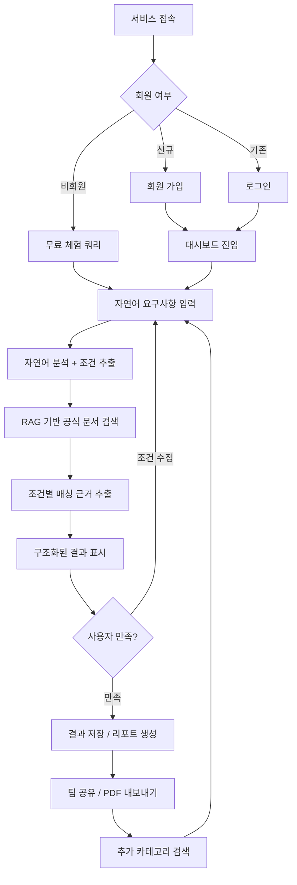
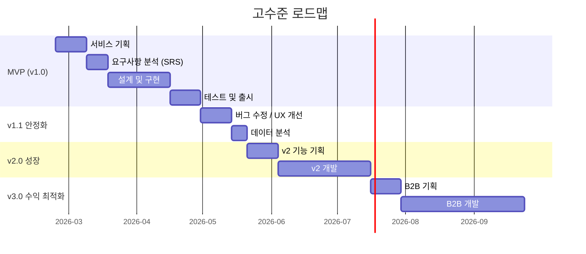
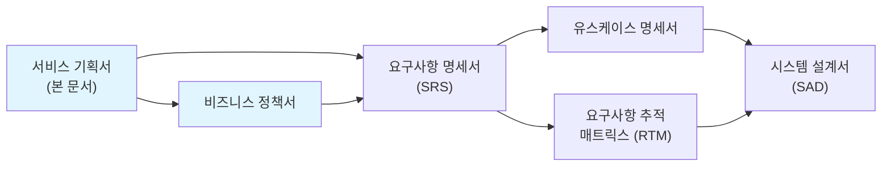

# 서비스 기획서 (Service Planning Document)

> 이 문서는 SRS(요구사항 명세서) 작성 이전에 "왜 이 서비스를 만드는가", "핵심 가치는 무엇인가", "MVP에 무엇을 포함/제외하는가"를 정의하는 선행 기획 문서이다.
> SRS가 "무엇을 만들 것인가(What)"에 집중한다면, 이 문서는 "왜 만드는가(Why)"와 "어디까지 만드는가(Scope)"에 집중한다.

| 항목 | 내용 |
|------|------|
| **프로젝트명** | API Intelligence Engine |
| **문서 버전** | v1.0 |
| **작성일** | 2026-02-23 |
| **작성자** | 조훈상 / 기획·개발 |
| **승인자** | 조훈상 / 프로젝트 오너 |
| **문서 상태** | 초안 |

---

> **용어 규칙:** 본 문서는 [`용어규칙.md`](./용어규칙.md)의 표기 원칙과 용어 사전을 준수한다. 새로운 용어 사용 시 반드시 해당 문서에 먼저 등록한다.

---

## 변경 이력

| 버전 | 날짜 | 작성자 | 변경 내용 |
|------|------|--------|-----------|
| v0.1 | 2026-02-23 | 조훈상 | 1페이지 사업 기획서 기반 초안 작성 |
| v1.0 | 2026-02-23 | 조훈상 | 서비스 기획서 템플릿 기반 상세화 |

---

## 목차

1. [서비스 개요](#1-서비스-개요)
2. [핵심 메커니즘](#2-핵심-메커니즘)
3. [콘텐츠/기능 전략](#3-콘텐츠기능-전략)
4. [수익화 전략](#4-수익화-전략)
5. [MVP 스코프 정의](#5-mvp-스코프-정의)
6. [KPI 가설 검증 프레임워크](#6-kpi-가설-검증-프레임워크)
7. [다음 단계](#7-다음-단계)
8. [관련 문서](#8-관련-문서)

---

## 1. 서비스 개요

### 1.1 서비스명 및 컨셉

| 항목 | 내용 |
|------|------|
| 서비스명 | API Intelligence Engine |
| 한 줄 설명 | 개발자가 자연어로 요구사항을 입력하면, 공식 문서 기반으로 최적의 API를 근거와 함께 추천하는 RAG 기반 의사결정 보조 플랫폼 |
| 서비스 유형 | SaaS (웹 서비스) |
| 대상 플랫폼 | Web (반응형) |

**서비스 컨셉 설명:**

개발자와 기술 의사결정자가 프로젝트에 적합한 API를 선택할 때 수십 개의 공식 문서를 수동으로 비교·검토해야 하는 비효율이 존재한다. 가격, 리전, 인증 방식, SDK 지원 여부 등 다양한 조건을 동시에 고려해야 하며, 기존 검색 도구나 LLM은 근거 없는 추천이나 환각(hallucination) 위험이 있다. API Intelligence Engine은 공식 문서를 RAG(Retrieval-Augmented Generation)로 인덱싱하여, 사용자의 자연어 요구조건에 맞는 API를 공식 문서 근거와 함께 구조화된 형태로 추천한다. "API 검색"이 아니라 "기술 의사결정에 대한 신뢰"를 제공하는 것이 핵심 가치이다.

**배경 및 동기:**

- AI SaaS 증가와 API 의존형 서비스 급증으로 개발자가 평가해야 할 API의 수가 폭발적으로 증가하고 있다
- 공공 API 확산과 LLM 스택 복잡성 증가로 API 선택의 난이도가 지속적으로 높아지고 있다
- 기존 대안(구글 검색, API 디렉토리, ChatGPT, 블로그 비교)은 모두 "근거 기반 구조화된 정보 제공"에서 결함이 있으며, 개발자는 여전히 수동 비교에 의존하고 있다

### 1.2 핵심 가치 제안 (Value Proposition)

| 항목 | 내용 |
|------|------|
| 핵심 가치 | 개발자가 API 선택에 "확신 있게 결정"할 수 있도록 공식 문서 근거 기반의 구조화된 추천을 제공한다 |
| 차별점 | 공식 문서 원문 인용 기반 추천 — 환각 없이 근거가 명확한 정보만 제공 |
| 대안 대비 우위 | 구글 검색(수동 비교 필요), API 디렉토리(자연어 불가), ChatGPT(근거 부족/환각), 블로그(편향/구식) 대비 공식 문서 기반 자동 정리 |

**가치 제안 캔버스:**

| 구분 | 내용 |
|------|------|
| 사용자의 할 일 (Jobs) | 프로젝트에 적합한 API를 선택하고, 팀에 선택 근거를 설명하며, 비용/기술 조건을 비교 검토한다 |
| 사용자의 고통 (Pains) | 수십 개 API 문서를 수동으로 탐색, 가격·리전·SDK 등 조건 비교의 높은 시간 비용, 근거 없는 추천에 대한 불신, 문서 품질 편차로 인한 정보 불균형 |
| 사용자의 이득 (Gains) | 의사결정 시간 단축, 팀 내 기술 선택 근거 공유 가능, 공식 문서 기반의 신뢰할 수 있는 정보 확보 |
| 고통 해결제 (Pain Relievers) | 자연어 입력으로 조건 기반 자동 필터링, 공식 문서 원문 인용으로 환각 제거, 가격/SDK/리전 등 주요 조건별 구조화된 정리 |
| 이득 생성제 (Gain Creators) | 비교 리포트 자동 생성, 공식 링크(문서/가격/SDK/상태 페이지) 일괄 정리, 팀 공유 가능한 구조화된 결과물 |

### 1.3 타겟 사용자 정의

#### 1.3.1 주요 사용자 페르소나

**페르소나 1: 기술 의사결정자 "민수"**

| 항목 | 내용 |
|------|------|
| 이름 | 김민수 |
| 연령/직업 | 35세 / AI SaaS 스타트업 CTO |
| 기술 수준 | 고급 (풀스택 개발 10년차) |
| 핵심 목표 | 새 프로젝트의 LLM/결제/메시징 API 스택을 빠르게 결정하고 팀에 근거를 공유하고 싶다 |
| 핵심 불편 | 3~5개 API 후보를 비교하려면 각각의 공식 문서를 열어 가격, SDK, 리전을 수동으로 정리해야 한다. 반나절 이상 소요 |
| 사용 시나리오 | 새 기능 설계 시 "한국 리전 지원, Node.js SDK, 무료 플랜 있는 SMS API" 같은 조건을 입력하고 비교 결과를 팀 슬랙에 공유 |
| 성공 기준 | 30분 내에 3개 이상 API의 조건별 비교 결과를 공식 문서 근거와 함께 확보 |

**페르소나 2: 빠르게 검증하는 개발자 "지은"**

| 항목 | 내용 |
|------|------|
| 이름 | 박지은 |
| 연령/직업 | 28세 / 1인 개발자 (인디해커) |
| 기술 수준 | 중급 (백엔드 3년차) |
| 핵심 목표 | 사이드 프로젝트에 쓸 API를 빠르게 찾고, 무료 플랜 조건과 연동 난이도를 한눈에 파악하고 싶다 |
| 핵심 불편 | 블로그 비교 글은 오래된 정보가 많고, ChatGPT는 없는 기능을 있다고 추천해서 시간을 낭비한 적이 있다 |
| 사용 시나리오 | "이메일 발송 API, 월 1만건 무료, REST API, 한국어 문서" 같은 조건으로 검색 후 공식 가격 페이지 링크를 직접 확인 |
| 성공 기준 | 5분 내에 조건에 맞는 API를 찾고, 공식 문서 링크로 바로 확인 가능 |

**페르소나 3: 리서치 담당 "현우"**

| 항목 | 내용 |
|------|------|
| 이름 | 이현우 |
| 연령/직업 | 32세 / 중견기업 백엔드 개발자 (5인 팀) |
| 기술 수준 | 중상급 |
| 핵심 목표 | 팀 리드에게 API 도입 제안서를 작성할 때 비교 분석 자료를 효율적으로 만들고 싶다 |
| 핵심 불편 | 매번 스프레드시트에 API별 조건을 수동 정리하는 작업에 2~3일이 소요된다 |
| 사용 시나리오 | 벡터 DB 3종 비교 리포트를 생성하여 PDF로 팀에 공유 |
| 성공 기준 | 구조화된 비교 리포트를 1시간 내에 생성하고 팀 리뷰에 활용 |

#### 1.3.2 사용자 세그먼트

| 세그먼트 | 설명 | 규모 추정 | 우선순위 | MVP 포함 |
|----------|------|-----------|----------|----------|
| AI SaaS 창업자/CTO | LLM 스택 관련 API 의사결정을 자주 하는 기술 의사결정자 | 전 세계 약 5만~10만 명 | P0 | Y |
| 1~5인 소규모 개발팀 | 리소스가 부족하여 API 리서치에 시간을 많이 쓸 수 없는 팀 | 전 세계 약 50만 팀 | P0 | Y |
| 중견기업 개발자 | 기술 도입 제안서 작성 시 비교 분석이 필요한 개발자 | 전 세계 약 100만 명 | P1 | Y |
| LLM 기반 서비스 설계자 | 복잡한 LLM 스택(벡터DB, 임베딩, 오케스트레이션) API를 평가하는 전문가 | 전 세계 약 10만 명 | P1 | Y |

#### 1.3.3 비사용자 (Anti-Persona)

| 비사용자 | 이유 | 대안 |
|----------|------|------|
| 프로그래밍 입문자 | API 개념 자체를 학습해야 하는 단계로, API 비교보다 튜토리얼이 필요 | Codecademy, freeCodeCamp 등 학습 플랫폼 |
| API를 직접 개발하는 벤더 | 자사 API를 만드는 사람에게는 타사 비교가 불필요 | API 문서화 도구(Swagger, Postman) |
| 비기술 직군 | 기술 조건(SDK, 리전, 인증)에 대한 이해가 없어 결과를 해석할 수 없음 | 기술 컨설팅 서비스 |
| 엔터프라이즈 구매 담당자 | RFP 기반 벤더 선정 프로세스를 따르며, 셀프서비스 도구보다 영업 미팅을 선호 | Gartner, G2 리뷰 플랫폼 |

---

## 2. 핵심 메커니즘

### 2.1 서비스 작동 원리

**핵심 루프 (Core Loop):**

사용자가 자연어로 API 요구사항을 입력하면, 시스템이 RAG 파이프라인을 통해 공식 문서에서 관련 정보를 검색·추출하고, 조건별로 구조화된 결과를 공식 링크와 근거 인용문 함께 제공한다.

1. **사용자 입력** — 자연어로 요구 조건을 기술한다 (예: "한국에서 쓸 수 있는 SMS 인증, Node SDK 지원, 무료 플랜 존재")
2. **자연어 분석** — 입력에서 기능 카테고리, 기술 조건(SDK, 리전, 가격), 우선순위를 추출한다
3. **RAG 검색** — 인덱싱된 공식 문서 벡터 DB에서 조건 관련 문서 청크를 검색한다
4. **근거 추출 및 구조화** — 검색된 문서에서 조건 매칭 문장을 추출하고, API별로 공식 링크(문서/가격/SDK/상태 페이지)를 정리한다
5. **결과 제공** — 사용자에게 API별 비교 결과, 공식 링크, 근거 인용문을 구조화된 형태로 제공한다
6. **반복/심화** — 사용자가 결과를 확인하고 조건을 조정하거나 다른 카테고리의 API를 추가 검색한다

**핵심 원칙:**

- 문서에 없는 정보는 절대 제공하지 않는다 (No hallucination)
- 모든 추천 결과에 공식 문서 원문 인용과 링크를 필수 포함한다
- 비교 결과는 가격, SDK, 리전, 인증 등 구조화된 축으로 정리한다

### 2.2 전체 서비스 플로우

### 2.3 핵심 사용자 여정 (Key User Journey)

#### 여정 1: 첫 사용 — API 추천 경험

| 단계 | 사용자 행동 | 시스템 반응 | 감정 목표 | 핵심 지표 |
|------|------------|------------|-----------|-----------|
| 1. 진입 | 서비스 랜딩페이지 접속 | 핵심 가치 제안 + 예시 쿼리 표시 | 호기심 | 방문율 |
| 2. 첫 쿼리 | 예시 쿼리 클릭 또는 직접 자연어 입력 | 로딩 후 API 추천 결과 + 공식 링크 + 근거 인용 표시 | 놀라움 ("이게 되네?") | 첫 쿼리 실행율 |
| 3. 결과 확인 | 추천된 API의 공식 링크 클릭하여 확인 | 링크가 실제 공식 문서와 일치함을 확인 | 신뢰 ("근거가 진짜네") | 링크 클릭율 |
| 4. 조건 수정 | 조건을 변경하여 재검색 | 새로운 조건에 맞는 결과 즉시 제공 | 효용감 | 세션당 쿼리 수 |
| 5. 회원가입 | 결과 저장을 위해 가입 | 이전 쿼리 결과 자동 저장 | 안심 | 가입 전환율 |

#### 여정 2: 반복 사용 — 비교 리포트 생성

| 단계 | 사용자 행동 | 시스템 반응 | 감정 목표 | 핵심 지표 |
|------|------------|------------|-----------|-----------|
| 1. 재방문 | 대시보드 접속, 이전 쿼리 이력 확인 | 최근 검색 이력 + 새 쿼리 입력창 표시 | 친숙함 | D7 Retention |
| 2. 심화 검색 | 특정 카테고리(예: 벡터DB) 3개 API 비교 요청 | 3개 API의 조건별 비교표 생성 | 생산성 | 비교 기능 사용율 |
| 3. 리포트 생성 | "비교 리포트 생성" 버튼 클릭 | PDF/마크다운 형태의 구조화된 비교 리포트 생성 | 만족 | 리포트 생성율 |
| 4. 공유 | 리포트 링크 복사 또는 PDF 다운로드 | 팀 공유 가능한 링크/파일 제공 | 자신감 | 공유 횟수 |

---

## 3. 콘텐츠/기능 전략

### 3.1 핵심 기능 방향

| 기능 영역 | 전략 방향 | 우선순위 | MVP 포함 | 비고 |
|-----------|-----------|----------|----------|------|
| 자연어 API 검색 | 사용자가 자연어로 요구사항을 입력하면 조건 추출 후 RAG 검색 수행 | P0 | Y | 핵심 기능 |
| 공식 문서 기반 근거 인용 | 모든 추천에 공식 문서 원문 인용과 소스 링크 필수 포함 | P0 | Y | 차별화 핵심 |
| 구조화된 링크 정리 | 가격/SDK/문서/상태 페이지 등 공식 링크를 유형별로 정리 | P0 | Y | 핵심 기능 |
| 조건 기반 비교표 | 2~5개 API를 조건별(가격, 리전, SDK, 인증)로 나란히 비교 | P1 | Y | 핵심 경험 |
| 쿼리 이력 관리 | 이전 검색 이력 저장 및 재검색 기능 | P1 | Y | 재방문 유도 |
| 비교 리포트 생성 | 비교 결과를 PDF/마크다운으로 내보내기 | P2 | N | v2에서 추가 |
| 팀 공유 기능 | 검색 결과를 팀원에게 공유하는 링크/워크스페이스 | P2 | N | v2에서 추가 |

**기능 방향 의사결정 기록:**

| 항목 | A안 | B안 | 선택 | 근거 |
|------|-----|-----|------|------|
| 데이터 소스 | 공식 문서만 | 공식 문서 + 블로그/커뮤니티 | A | 근거 신뢰도가 핵심 차별점이므로, 공식 문서 이외 소스는 환각 및 편향 위험 |
| 결과 형태 | 링크 중심 (구조화된 링크 목록) | 요약 텍스트 중심 (LLM이 정리) | A | 링크 중심이 검증 가능성·신뢰도 측면에서 우위. 사용자가 직접 확인 가능 |
| 카테고리 범위 | 5개 카테고리 집중 (LLM/결제/인증/메시징/벡터DB) | 전체 API 카테고리 커버 | A | MVP에서 범위 제한이 품질 유지에 필수. 문서 인덱싱 비용도 제어 가능 |

### 3.2 콘텐츠 전략

| 항목 | 내용 |
|------|------|
| 콘텐츠 유형 | 구조화된 데이터(API 메타정보, 조건별 비교표) + 공식 문서 인용 텍스트 |
| 콘텐츠 생산 방식 | 자동 크롤링 + RAG 인덱싱 (공식 문서 기반) |
| 콘텐츠 큐레이션 | 조건 기반 자동 매칭 (사용자 입력 조건 → 벡터 유사도 검색) |
| 콘텐츠 갱신 주기 | 주기적 재인덱싱 (주 1회 기본, 주요 API 변경 감지 시 즉시) |
| 품질 관리 | 문서 근거 강제 — 인덱스에 없는 정보는 "확인 불가"로 표시, 링크 유효성 자동 검증 |

### 3.3 브랜드/톤앤매너

| 항목 | 내용 |
|------|------|
| 브랜드 톤 | 전문적이고 간결한 — 개발자 친화적 |
| 커뮤니케이션 스타일 | 존댓말 (UI), 기술 용어 원문 유지 (번역하지 않음), 이모지 최소 사용 |
| 시각적 아이덴티티 | 다크 테마 기본, 모노스페이스 요소 활용, 깔끔한 테이블/카드 UI |
| 캐릭터/마스코트 | 없음 |

---

## 4. 수익화 전략

### 4.1 수익 모델 선택

| 항목 | 내용 |
|------|------|
| 주요 수익 모델 | 프리미엄(Freemium) — 기본 무료 + Pro 유료 구독 |
| 보조 수익 모델 | B2B 기업용 리포트 서비스 (장기) |
| 무료/유료 경계 | 무료: 기본 링크 추천 + 월 20회 쿼리 제한 / 유료: 고급 조건 필터, 비교 리포트, 무제한 쿼리 |
| 가격 전략 | Pro 월 $19~49, B2B 별도 협의 |

#### 수익 모델 비교

| 기준 | 모델 A: 완전 무료 + 광고 | 모델 B: Freemium | 모델 C: B2B only |
|------|----------------------|----------------------|----------------------|
| 사용자 경험 영향 | 광고가 전문성 이미지 훼손 | 무료로 핵심 가치 체험 가능 | 개인 사용자 접근 불가 |
| 예상 수익 | 낮음 (개발자 광고 CPM 낮음) | 중간 (전환율 5% 가정) | 높지만 초기 영업 비용 큼 |
| 구현 복잡도 | 낮음 | 중간 | 높음 |
| MVP 적합성 | Y | **Y** | N |
| **선택** | | **선택됨** | |

**선택 근거:** 개발자 타겟 서비스에서 광고는 신뢰도를 훼손하며, B2B only는 초기 유저 확보가 어렵다. Freemium으로 무료 사용자의 핵심 가치 체험을 보장하면서, 파워 유저의 유료 전환을 유도하는 것이 MVP 단계에 가장 적합하다.

### 4.2 단계별 수익화 계획

| 단계 | 시점 / 조건 | 수익화 방식 | 목표 |
|------|------------|------------|------|
| Phase 0: PMF 검증 | MAU 500 달성 전 | 없음 (완전 무료, 쿼리 제한 완화) | 핵심 가치 검증 + 사용자 피드백 수집 |
| Phase 1: 초기 수익화 | MAU 500+ & D7 Retention 30%+ | Freemium 도입 (무료 쿼리 제한 + Pro 구독) | 월 $1,000 MRR 달성 |
| Phase 2: 수익 최적화 | MRR $5,000+ | Pro 플랜 고도화 (비교 리포트, 팀 기능), 연간 할인 | 전환율 7% 달성 |
| Phase 3: 수익 다각화 | MRR $20,000+ | B2B 기업용 플랜 (CTO용 아키텍처 리포트, 전용 지식베이스) | B2B 매출 비중 30% |

### 4.3 과금 정책 요약

| 항목 | 정책 방향 |
|------|-----------|
| 무료 체험 | 회원가입 없이 3회 쿼리 체험 가능. 가입 후 월 20회 무료 쿼리 |
| 환불 정책 | 연간 결제 시 30일 이내 전액 환불. 월간 결제는 환불 없음 (언제든 해지 가능) |
| 구독 갱신 | 월간/연간 자동 갱신. 갱신 7일 전 이메일 알림. 언제든 해지 가능 |
| 결제 수단 | Stripe 기반 — 신용카드, 해외 결제 지원 |

---

## 5. MVP 스코프 정의

> **이 섹션은 본 문서의 핵심이다.**
> "만들 것"보다 **"안 만들 것 + 왜 안 만드는가"**를 명확히 정의하는 것이 범위 초과를 방지하는 핵심이다.

### 5.1 MVP 정의 기준

| 항목 | 내용 |
|------|------|
| MVP 목표 | "공식 문서 기반 근거 인용이 포함된 API 추천이 개발자의 API 선택 의사결정 시간을 절반 이하로 줄일 수 있는가"를 검증 |
| MVP 기간 | 8주 (설계 2주 + 개발 4주 + 테스트/출시 2주) |
| MVP 성공 기준 | 출시 4주 내 WAU 100+, 첫 쿼리 후 재방문율(D7) 30% 이상, NPS 40+ |
| MVP 실패 시 대응 | D7 Retention 15% 미만 시 사용자 인터뷰 실시 → 결과 형태(링크 vs 요약) 또는 카테고리 피벗 검토 |

### 5.2 포함 항목 (In-Scope)

| ID | 기능/항목 | 설명 | 우선순위 | 예상 공수 | 비고 |
|----|-----------|------|----------|-----------|------|
| MVP-001 | 자연어 쿼리 입력 | 사용자가 텍스트로 API 요구사항을 자유롭게 입력하는 인터페이스 | P0 | 3일 | 핵심 진입점 |
| MVP-002 | 자연어 조건 추출 | 입력 텍스트에서 카테고리, 기술 조건(SDK, 리전, 가격 등)을 자동 파싱 | P0 | 5일 | LLM 기반 |
| MVP-003 | RAG 검색 파이프라인 | 인덱싱된 공식 문서에서 조건 관련 청크를 벡터 유사도 기반으로 검색 | P0 | 7일 | 핵심 엔진 |
| MVP-004 | 공식 문서 인덱싱 (5개 카테고리) | LLM API, 결제 API, 인증 API, 메시징 API, 벡터 DB의 주요 API 공식 문서 크롤링 및 벡터 인덱싱 | P0 | 7일 | 데이터 기반 |
| MVP-005 | 근거 인용 결과 표시 | API별 공식 문서 원문 인용 + 소스 링크를 구조화된 카드/테이블 형태로 표시 | P0 | 5일 | 차별화 핵심 |
| MVP-006 | 공식 링크 자동 정리 | 각 API의 문서/가격/SDK/상태 페이지 링크를 유형별로 자동 정리하여 표시 | P0 | 3일 | |
| MVP-007 | 사용자 인증 (가입/로그인) | GitHub OAuth 기반 회원가입 및 로그인 | P1 | 3일 | |
| MVP-008 | 쿼리 이력 저장 | 로그인 사용자의 이전 검색 쿼리 및 결과 저장/조회 | P1 | 3일 | 재방문 유도 |
| MVP-009 | 조건 기반 비교표 | 2~3개 API를 조건별(가격, SDK, 리전, 인증)로 나란히 비교하는 테이블 | P1 | 5일 | |
| MVP-010 | 기본 분석 이벤트 수집 | 쿼리 실행, 링크 클릭, 세션 등 핵심 이벤트 트래킹 | P1 | 2일 | 가설 검증용 |
| MVP-011 | 랜딩 페이지 | 서비스 가치 제안, 예시 쿼리, 가입 CTA를 포함한 랜딩 페이지 | P2 | 3일 | 시간 허용 시 |
| MVP-012 | 쿼리 제한 및 무료/유료 경계 | 비회원 3회, 무료 회원 월 20회 쿼리 제한 로직 | P2 | 2일 | 시간 허용 시 |

### 5.3 제외 항목 (Out-of-Scope) + 제외 근거

| ID | 제외 항목 | 제외 근거 | 대안 (MVP에서는 대신 무엇을 하는가) | v2 진입 조건 |
|----|-----------|-----------|--------------------------------------|-------------|
| EX-001 | PDF 비교 리포트 생성 | PMF 미검증 상태에서 리포트 포맷팅은 과도한 투자. 핵심 가설 검증에 불필요 | 웹 결과를 브라우저에서 직접 확인. 복사/붙여넣기로 공유 | 사용자 요청 30건 이상 또는 D7 Retention 30% 달성 시 |
| EX-002 | 팀 워크스페이스/공유 기능 | 다인 협업 기능은 개인 사용자 PMF 달성 후 의미 있음. 초기에는 1인 사용 검증이 우선 | 결과 페이지 URL 공유로 대체 | MAU 1,000+ 및 사용자 피드백에서 팀 기능 요청 다수 시 |
| EX-003 | 5개 외 추가 API 카테고리 | 카테고리 확장은 인덱싱 비용·품질 관리 부담 증가. 범위 제한이 품질 유지의 핵심 | MVP 카테고리(LLM/결제/인증/메시징/벡터DB) 5개에 집중 | 기존 5개 카테고리의 인덱스 품질 안정화 + 사용자 요청 기반 우선순위 |
| EX-004 | 실시간 문서 변경 감지 | 실시간 크롤링은 인프라 복잡도 대비 초기 가치 불확실 | 주 1회 정기 재인덱싱으로 대체 | 문서 변경으로 인한 오정보 클레임 월 10건 이상 시 |
| EX-005 | B2B 기업용 기능 | 기업 전용 지식베이스, CTO용 아키텍처 리포트 등은 개인 PMF 이후 단계 | 없음 (개인 사용자 타겟에 집중) | MRR $5,000+ 달성 및 기업 문의 발생 시 |
| EX-006 | 다국어 지원 | 초기 타겟은 한국어 + 영어 공식 문서이며, 다국어 UI/UX는 과도한 범위 | 영어 UI 기본, 한국어 쿼리 지원 | 해외 사용자 비중 40% 이상 시 |
| EX-007 | API 벤더 파트너십/광고 | 수익화보다 사용자 신뢰 확보가 우선. 벤더 광고는 중립성 훼손 위험 | 없음 | PMF 달성 + 벤더 측 인바운드 제안 시 별도 검토 |
| EX-008 | 모바일 네이티브 앱 | 개발자 도구는 데스크톱 사용이 주 시나리오. 네이티브 앱 투자 대비 효과 미미 | 반응형 웹으로 모바일 접근 지원 | MAU 10,000+ 및 모바일 접속 비중 30% 이상 시 |

### 5.4 MVP 기능 범위 다이어그램

```mermaid
flowchart LR
    subgraph MVP["MVP (v1.0)"]
        direction TB
        F1["P0: 자연어 쿼리 입력"]
        F2["P0: 자연어 조건 추출"]
        F3["P0: RAG 검색 파이프라인"]
        F4["P0: 공식 문서 인덱싱 (5개 카테고리)"]
        F5["P0: 근거 인용 결과 표시"]
        F6["P0: 공식 링크 자동 정리"]
        F7["P1: 사용자 인증"]
        F8["P1: 쿼리 이력 저장"]
        F9["P1: 조건 기반 비교표"]
    end

    subgraph V2["v2.0 (조건 충족 시)"]
        direction TB
        F10["PDF 비교 리포트 생성"]
        F11["팀 워크스페이스"]
        F12["추가 API 카테고리 확장"]
        F13["실시간 문서 변경 감지"]
    end

    subgraph FUTURE["장기 로드맵"]
        direction TB
        F14["B2B 기업용 기능"]
        F15["API 벤더 파트너십"]
        F16["설계 리포트 자동화"]
        F17["API 의사결정 인프라화"]
    end

    MVP --> V2
    V2 --> FUTURE
```

### 5.5 기술적 MVP 결정사항

| 결정 항목 | MVP 선택 | 근거 | v2에서 전환 가능 |
|-----------|----------|------|------------------|
| 인프라 | Vercel (프론트) + Railway 또는 Fly.io (백엔드) | 서버리스 기반으로 초기 비용 최소화, 빠른 배포 | Y (AWS/GCP로 전환 가능) |
| 프론트엔드 | Next.js (App Router) + Tailwind CSS | SSR/SSG 지원, 빠른 개발, SEO 유리 | Y |
| 백엔드 | Node.js (Hono 또는 Express) | 프론트엔드와 동일 언어로 개발 효율, LLM SDK 생태계 풍부 | Y |
| LLM | OpenAI GPT-4o-mini 또는 Claude Haiku | 비용 대비 성능 우수, 조건 추출·요약에 적합 | Y (모델 교체 용이) |
| 벡터 DB | Pinecone 또는 Qdrant Cloud | 관리형 서비스로 운영 부담 최소, 무료 티어 존재 | Y |
| 데이터베이스 | PostgreSQL (Supabase 또는 Neon) | 사용자/쿼리 이력 저장, 관리형 서비스로 운영 편의 | Y |
| 인증 | NextAuth.js (Auth.js) | GitHub OAuth 전용 인증, Next.js 통합 용이 | Y |

---

## 6. KPI 가설 검증 프레임워크

### 6.1 검증할 가설 목록

| ID | 가설 | 검증 방법 | 성공 기준 | 실패 시 대응 | 우선순위 |
|----|------|-----------|-----------|-------------|----------|
| H-001 | "공식 문서 기반 근거 인용이 포함된 API 추천을 받은 사용자의 70% 이상이 추천 결과의 공식 링크를 클릭할 것이다" | 결과 페이지에서 공식 링크 클릭율 측정 | 링크 클릭율 70%+ | 결과 표시 형태 변경 (링크 강조, 미리보기 추가) | P0 |
| H-002 | "첫 쿼리에서 유용한 결과를 경험한 사용자의 30% 이상이 7일 내 재방문할 것이다" | D7 Retention 측정 (첫 쿼리 실행 사용자 기준) | D7 Retention 30%+ | 결과 품질 개선 (인덱스 확충, 프롬프트 튜닝) 또는 카테고리 피벗 | P0 |
| H-003 | "자연어 입력만으로 사용자 의도에 맞는 API 카테고리를 80% 이상 정확하게 추출할 수 있을 것이다" | 100개 테스트 쿼리에 대한 카테고리 추출 정확도 측정 | 정확도 80%+ | 프롬프트 엔지니어링 개선 또는 조건 입력 UI 보조 도구 추가 | P0 |
| H-004 | "유료 전환 제안 시 무료 사용자 중 5% 이상이 Pro 구독으로 전환할 것이다" | 쿼리 제한 도달 사용자의 Pro 전환율 측정 | 전환율 5%+ | 무료/유료 경계 조정, Pro 기능 가치 재설계 | P1 |

### 6.2 핵심 지표 (Key Metrics)

| 구분 | 지표명 | 정의 | 목표값 | 측정 방법 | 측정 주기 |
|------|--------|------|--------|-----------|-----------|
| **North Star** | 주간 유의미 쿼리 수 (Weekly Meaningful Queries) | 결과에서 최소 1개 이상의 공식 링크를 클릭한 쿼리 수 | 주 500회 (출시 8주 후) | 이벤트 트래킹 | 주간 |
| 획득 (Acquisition) | 신규 가입자 수 | 주간 신규 회원가입 수 | 주 50명 (출시 8주 후) | 가입 이벤트 | 주간 |
| 활성화 (Activation) | 첫 쿼리 실행율 | 가입 후 첫 쿼리를 실행한 사용자 비율 | 80%+ | 이벤트 트래킹 | 주간 |
| 유지 (Retention) | D1 / D7 / D30 Retention | 첫 쿼리 실행 후 1/7/30일 내 재방문 비율 | D1 50% / D7 30% / D30 15% | 코호트 분석 | 주간 |
| 수익 (Revenue) | MRR | 월간 반복 수익 | Phase 1 목표: $1,000 | 결제 시스템 | 월간 |
| 추천 (Referral) | 결과 공유율 | 쿼리 결과를 외부에 공유한 비율 | 10%+ | 공유 버튼 클릭 + URL 복사 이벤트 | 주간 |

### 6.3 가설 검증 매트릭스

| 가설 ID | 결과 시나리오 | 판단 | 다음 액션 |
|---------|--------------|------|-----------|
| H-001 | 링크 클릭율 70%+ | 가설 검증 완료 | 근거 인용 방식 유지, 비교표 기능 강화 진행 |
| H-001 | 링크 클릭율 40~70% | 추가 개선 필요 | 링크 미리보기 추가, 근거 인용 강조 UI 변경 후 2주 관찰 |
| H-001 | 링크 클릭율 40% 미만 | 가설 기각 | 사용자 인터뷰 실시 → 링크 대신 요약 텍스트 선호 여부 확인 → 결과 형태 피벗 |
| H-002 | D7 Retention 30%+ | 가설 검증 완료 | 수익화(Phase 1) 진입, Pro 기능 개발 시작 |
| H-002 | D7 Retention 15~30% | 추가 관찰 필요 | 결과 품질 개선 (인덱스 확충, 프롬프트 튜닝) 후 4주 추가 관찰 |
| H-002 | D7 Retention 15% 미만 | 가설 기각 | 사용자 인터뷰 → 타겟 카테고리 또는 결과 형태 피벗 검토 |
| H-003 | 정확도 80%+ | 가설 검증 완료 | 조건 추출 로직 유지, 추가 카테고리 확장 준비 |
| H-003 | 정확도 80% 미만 | 가설 기각 | 자연어 only 방식에 구조화된 조건 선택 UI 보조 도구 추가 |
| H-004 | 전환율 5%+ | 가설 검증 완료 | 가격 최적화 실험 (A/B 테스트) 진행 |
| H-004 | 전환율 5% 미만 | 가설 기각 | 무료/유료 경계 재설정 또는 Pro 기능 재구성 |

### 6.4 데이터 수집 계획

| 데이터 항목 | 수집 이벤트 | 수집 도구 | 용도 | MVP 필수 |
|------------|------------|-----------|------|----------|
| 페이지 방문 | 페이지 로드 시 | Mixpanel 또는 PostHog | 사용 패턴·퍼널 분석 | Y |
| 쿼리 실행 | 쿼리 제출 시 | 자체 DB + 분석 도구 | 가설 H-001, H-002 검증, North Star 측정 | Y |
| 공식 링크 클릭 | 결과 내 링크 클릭 시 | 이벤트 트래킹 | 가설 H-001 검증 | Y |
| 조건 추출 정확도 | 쿼리 처리 시 (내부 로그) | 자체 로그 | 가설 H-003 검증 | Y |
| 회원가입/로그인 | 인증 이벤트 시 | 자체 DB | 획득 지표 | Y |
| 결과 공유 | 공유 버튼/URL 복사 시 | 이벤트 트래킹 | 추천 지표 | Y |
| 유료 전환 | 결제 완료 시 | Stripe + 분석 도구 | 가설 H-004 검증 | N (Phase 1) |
| 이탈 지점 | 세션 종료 / 퍼널 이탈 시 | 분석 도구 | 이탈 원인 분석 | N (v2) |

---

## 7. 다음 단계

### 7.1 기획 완료 체크리스트

- [x] 서비스 컨셉이 한 문장으로 명확히 정의되었는가
- [x] 타겟 사용자가 구체적으로 정의되었는가 (비사용자 포함)
- [x] 핵심 가치 제안이 경쟁 대비 차별화되었는가
- [x] 핵심 메커니즘(Core Loop)이 명확한가
- [x] 수익 모델이 선택되고 근거가 있는가
- [x] MVP 포함/제외 항목이 모두 정의되었는가
- [x] **제외 항목에 "왜 제외하는가"와 "대안"이 모두 기록되었는가**
- [x] 검증할 가설이 정량적 성공 기준과 함께 정의되었는가
- [x] 가설 실패 시 대응 방안이 사전에 정의되었는가
- [ ] 비즈니스 동작 규칙이 비즈니스정책서에 독립적으로 정의되었는가
- [ ] 이해관계자 리뷰가 완료되었는가

### 7.2 v2+ 로드맵

| 버전 | 진입 조건 | 주요 기능 | 목표 |
|------|-----------|-----------|------|
| v1.0 (MVP) | - | 5.2절 참조 | 핵심 가설 검증 (근거 기반 추천의 가치) |
| v1.1 | MVP 출시 후 2주 내 버그/피드백 반영 | 버그 수정, 결과 품질 개선, UX 개선 | 안정화 |
| v2.0 | D7 Retention 30% 달성 + MAU 1,000 | PDF 비교 리포트, 팀 공유 기능, 추가 카테고리 (3개) | 성장 + 초기 수익화 |
| v3.0 | MRR $5,000 달성 | B2B 기업용 플랜, 실시간 문서 감지, 설계 리포트 자동화 | 수익 최적화 |
| v4.0 | MAU 10,000+ | API 의사결정 인프라화, 벤더 파트너십, 글로벌 다국어 지원 | 시장 확장 |

---

## 8. 관련 문서

### 8.1 문서 간 관계

### 8.2 SRS와의 역할 분담

| 항목 | 서비스 기획서 (본 문서) | SRS |
|------|----------------------|-----|
| 관점 | 비즈니스/사용자 관점 | 시스템/구현 관점 |
| 범위 정의 | "왜 이것을 만드는가" + "왜 이것을 안 만드는가" | "무엇을 만드는가" (기능/비기능 요구사항) |
| 비즈니스 목표 | 상세 기술 (배경, 동기, 가설) | SRS 1.2절에서 요약 참조 |
| 사용자 정의 | 페르소나 + 비사용자 + 감정 목표 | 사용자 특성 테이블 (기술 수준, 사용 빈도) |
| 우선순위 | P0/P1/P2 + 제외 근거 + v2 진입 조건 | P1~P4 (SRS 1.5절) |
| 수익화 | 전략 방향 + 단계별 계획 | 해당 없음 (SRS 범위 아님) |
| KPI/가설 | 검증 프레임워크 전체 | 해당 없음 (SRS 범위 아님) |
| 비즈니스 규칙 | "비즈니스정책서 참조" 안내 | FR별 비즈니스 규칙 요약 (BR-xxx) |

> **작성 순서:** 서비스 기획서 -> 비즈니스정책서 -> SRS
> SRS 작성 시 본 문서의 1.1절(서비스 컨셉)과 5.2절(MVP 포함 항목)을 기반으로 기능 요구사항을 도출한다.

### 8.3 참조 문서 목록

| 문서명 | 위치 | 관계 |
|--------|------|------|
| 비즈니스 정책서 | `docs/분석/비즈니스정책서.md` | 본 문서의 비즈니스 규칙을 상세 정의 |
| 요구사항 명세서 (SRS) | `docs/분석/요구사항명세서-SRS.md` | 본 문서의 MVP 스코프를 시스템 요구사항으로 구체화 |
| 유스케이스 명세서 | `docs/분석/유스케이스명세서.md` | 핵심 사용자 여정을 유스케이스로 상세화 |
| 요구사항 추적 매트릭스 | `docs/분석/요구사항추적매트릭스-RTM.md` | 요구사항 추적 |

---

## 부록

### A. 경쟁 분석

| 항목 | 구글 검색 | API 디렉토리 (RapidAPI, ProgrammableWeb) | ChatGPT / LLM | 블로그 비교 글 | **API Intelligence Engine** |
|------|----------|----------------------------------------|----------------|--------------|---------------------------|
| 주요 기능 | 키워드 기반 웹 검색 | API 카탈로그 + 카테고리 필터 | 자연어 대화형 추천 | 특정 API 비교 리뷰 | 자연어 조건 → 공식 문서 기반 구조화 추천 |
| 가격 | 무료 | Freemium | Freemium ($20/월) | 무료 | Freemium ($19~49/월) |
| 강점 | 범용성, 최신 정보 | API 수 풍부, 테스트 가능 | 자연어 이해, 빠른 응답 | 실무 경험 기반, 상세 비교 | **공식 문서 근거 인용, 조건 기반 자동 정리** |
| 약점 | 수동 비교 필요, 구조화 안 됨 | 자연어 검색 불가, 문서 품질 편차 | 환각 위험, 근거 불명확 | 편향, 오래된 정보, 비체계적 | 초기 카테고리 제한, 신규 서비스 인지도 |
| 타겟 사용자 | 모든 사용자 | 개발자 전반 | 모든 사용자 | 개발자 | 기술 의사결정자, 소규모 개발팀 |
| **차별화 포인트** | | | | | 환각 없는 공식 문서 근거 기반 + 구조화된 조건별 비교 + 링크 자동 정리 |

### B. 용어 정의

> 전체 용어 사전은 [`용어규칙.md`](./용어규칙.md)를 참조한다.

### C. 승인

| 역할 | 이름 | 서명 | 날짜 |
|------|------|------|------|
| 기획 책임자 | 조훈상 | | |
| 프로젝트 오너 | 조훈상 | | |
