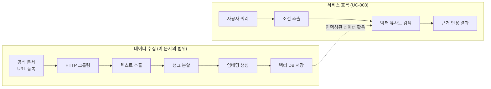
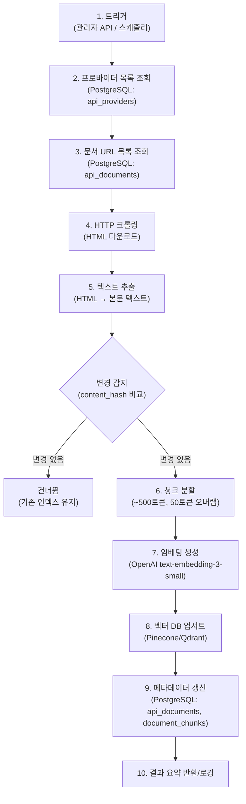
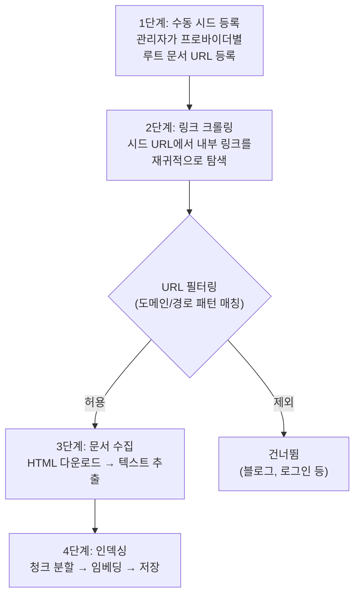
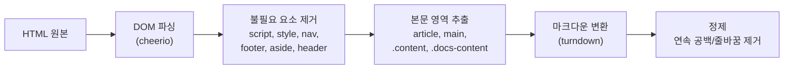

# API 수집 시스템 분석서

> API Collection & Indexing System Analysis

---

## 문서 정보

| 항목 | 내용 |
|------|------|
| 프로젝트명 | API Intelligence Engine |
| 문서 번호 | ANL-COLLECT-001 |
| 버전 | 1.0.0 |
| 작성일 | 2026-02-23 |
| 작성자 | 조훈상 |
| 관련 문서 | 서비스기획안 (MVP-004), 유스케이스명세서 (UC-007), RTM (FR-004) |

---

## 변경 이력

| 버전 | 날짜 | 변경 내용 | 작성자 | 승인자 |
|------|------|-----------|--------|--------|
| 1.0 | 2026-02-23 | 초안 작성 | 조훈상 | 조훈상 |

---

## 목차

1. [개요](#1-개요)
2. [문제 정의](#2-문제-정의)
3. [수집 대상 분석](#3-수집-대상-분석)
4. [데이터 흐름 분석](#4-데이터-흐름-분석)
5. [크롤링 전략 분석](#5-크롤링-전략-분석)
6. [청크 분할 전략 분석](#6-청크-분할-전략-분석)
7. [임베딩 전략 분석](#7-임베딩-전략-분석)
8. [저장소 전략 분석](#8-저장소-전략-분석)
9. [스케줄링 전략 분석](#9-스케줄링-전략-분석)
10. [오류 처리 전략](#10-오류-처리-전략)
11. [제약 조건 및 한계](#11-제약-조건-및-한계)
12. [리스크 분석](#12-리스크-분석)
13. [MVP 범위 정의](#13-mvp-범위-정의)

---

## 1. 개요

### 1.1 목적

본 문서는 API Intelligence Engine의 핵심 데이터 파이프라인인 **API 공식 문서 수집 및 인덱싱(Indexing) 시스템**의 요구사항을 분석한다. 이 시스템은 RAG(Retrieval-Augmented Generation) 검색 파이프라인(UC-003)의 **사전 조건**으로, 인덱싱된 문서가 없으면 서비스의 핵심 기능이 동작하지 않는다.

### 1.2 배경

API Intelligence Engine은 사용자의 자연어 쿼리에 대해 **공식 문서 근거 기반**으로 API를 추천하는 서비스다. 이 "공식 문서 근거"를 확보하려면:

1. API 프로바이더의 공식 문서를 **수집**(크롤링)하고
2. 벡터 검색에 적합한 크기로 **분할**(청킹)한 뒤
3. 벡터 **임베딩**을 생성하여
4. 벡터 DB에 **저장**(인덱싱)해야 한다.

이 전체 과정을 자동화하는 것이 API 수집 시스템의 역할이다.

### 1.3 시스템 위치



### 1.4 관련 요구사항 매핑

| 요구사항 ID | 설명 | 우선순위 | 관계 |
|------------|------|----------|------|
| MVP-004 | 공식 문서 인덱싱 (5개 카테고리) | P0 | 직접 구현 대상 |
| MVP-003 | RAG 검색 파이프라인 | P0 | 의존 (인덱싱 데이터 소비자) |
| MVP-005 | 근거 인용 결과 표시 | P0 | 의존 (인용 원문 소스) |
| MVP-006 | 공식 링크 자동 정리 | P0 | 의존 (링크 메타데이터 소스) |
| FR-004 | API 데이터 수집 및 관리 | - | SRS 기능 요구사항 |
| UC-007 | API 공식 문서 수집 및 인덱싱 | P0 | 유스케이스 명세 |

---

## 2. 문제 정의

### 2.1 핵심 과제

| # | 과제 | 설명 |
|---|------|------|
| 1 | 공식 문서만 수집 | 블로그, 커뮤니티 등 비공식 소스 제외 — 근거 신뢰도가 핵심 차별점 |
| 2 | 구조화된 데이터 추출 | HTML에서 네비게이션, 광고, 푸터 등을 제거하고 본문만 추출 |
| 3 | 검색 최적화된 분할 | 의미 단위로 청크를 분할하되, 벡터 검색 정확도를 유지하는 적정 크기 |
| 4 | 최신성 유지 | API 문서는 수시로 업데이트되므로 정기적 재인덱싱 필요 |
| 5 | 비용 통제 | 월 $100 예산 내에서 임베딩 API 비용 + 벡터 DB 스토리지 비용 제어 |

### 2.2 설계 결정 사항 (서비스기획안 기반)

| 결정 | 선택 | 근거 |
|------|------|------|
| 데이터 소스 | 공식 문서만 | 근거 신뢰도가 핵심 차별점 |
| 카테고리 범위 | 5개 카테고리 | MVP에서 범위 제한이 품질 유지에 필수 |
| 갱신 주기 | 주 1회 정기 | 실시간 크롤링은 인프라 복잡도 대비 가치 불확실 |
| 품질 관리 | 문서 근거 강제 | 인덱스에 없는 정보는 "확인 불가" 표시 |

---

## 3. 수집 대상 분석

### 3.1 MVP 대상 카테고리 및 프로바이더

| 카테고리 | 주요 프로바이더 (MVP) | 공식 문서 특성 | 예상 문서 수 |
|----------|----------------------|---------------|-------------|
| LLM API | OpenAI, Anthropic, Google Gemini | REST API 레퍼런스 + 가이드, 빈번한 업데이트 | 50~80페이지 |
| 결제 API | Stripe, 토스페이먼츠, PayPal | 상세한 API 레퍼런스 + 다국어, 복잡한 구조 | 60~100페이지 |
| 인증 API | Auth0, Firebase Auth, Clerk | 프레임워크별 가이드 분리, 튜토리얼 다수 | 40~70페이지 |
| 메시징 API | Twilio, SendGrid, AWS SES | API 레퍼런스 + 이메일/SMS 분리 문서 | 30~50페이지 |
| 벡터 DB | Pinecone, Qdrant, Weaviate | API 레퍼런스 + 개념 가이드, 상대적으로 적음 | 20~40페이지 |

**MVP 총 예상: 약 200~340페이지, 15~18개 프로바이더**

### 3.1.1 확장 계획

MVP 이후 수집 대상을 대폭 확대한다. 최종 목표는 개발자가 사용하는 주요 API를 포괄적으로 커버하는 것이다.

| 단계 | 카테고리 수 | 프로바이더 수 | 예상 문서 페이지 | 예상 벡터 수 |
|------|------------|-------------|----------------|-------------|
| MVP (Phase 1) | 5개 | 15~18개 | ~340 | ~1,500 |
| Phase 2 | 10개 | 40~50개 | ~1,500 | ~6,500 |
| Phase 3 | 20개+ | 100개+ | ~5,000+ | ~22,000+ |

**Phase 2 추가 카테고리 후보:** 스토리지/CDN API, 모니터링/로깅 API, CI/CD API, 검색 API, 지도/위치 API

**Phase 3 추가 카테고리 후보:** 이커머스 API, CRM API, 분석/BI API, IoT API, 미디어/영상 API, DevOps 도구 API, 노코드/로코드 API 등

> 대규모 확장을 전제로 설계하므로, 수집 파이프라인은 프로바이더 수 100개+에서도 안정적으로 동작해야 한다.

### 3.2 문서 유형 분류

| 유형 코드 | 설명 | 수집 우선순위 | 예시 |
|-----------|------|-------------|------|
| `general` | API 레퍼런스, 개요, 기능 설명 | P0 | OpenAI API Reference |
| `pricing` | 가격 정책, 요금제, 과금 체계 | P0 | Stripe Pricing |
| `sdk` | SDK/라이브러리 문서, 설치 가이드 | P0 | Twilio Node.js SDK |
| `changelog` | 변경 이력, 릴리스 노트 | P1 | Anthropic Changelog |
| `tutorial` | 시작 가이드, 튜토리얼 | P1 | Auth0 Quickstarts |

### 3.3 프로바이더별 공식 문서 URL 구조 분석

| 프로바이더 | 문서 URL 패턴 | 렌더링 방식 | 크롤링 난이도 |
|-----------|-------------|------------|-------------|
| OpenAI | `platform.openai.com/docs/*` | SSR (정적) | 낮음 |
| Anthropic | `docs.anthropic.com/*` | SSR (정적) | 낮음 |
| Stripe | `docs.stripe.com/*` | SSR (정적) | 낮음 |
| 토스페이먼츠 | `docs.tosspayments.com/*` | SPA (Next.js) | 중간 |
| Auth0 | `auth0.com/docs/*` | SSR | 낮음 |
| Twilio | `www.twilio.com/docs/*` | SSR | 낮음 |
| Pinecone | `docs.pinecone.io/*` | SSR (정적) | 낮음 |
| Firebase | `firebase.google.com/docs/*` | SSR | 낮음 |

> **SPA 렌더링 문서에 대한 대응:** 토스페이먼츠 등 SPA 기반 문서 사이트의 경우, MVP에서는 사전 렌더링된 HTML이 제공되는 경우만 대상으로 한다. JavaScript 렌더링이 필수인 페이지는 v2에서 헤드리스 브라우저(Playwright) 도입 시 대응한다.

### 3.4 수집 제외 대상

| 제외 항목 | 근거 |
|-----------|------|
| 블로그/커뮤니티 포스트 | 비공식 소스 — 환각(Hallucination) 및 편향 위험 |
| Stack Overflow 답변 | 정확도 보장 불가, 저작권 이슈 |
| GitHub README/Wiki | 비구조적, 버전 관리 어려움 |
| PDF/동영상 | MVP에서 파싱 복잡도 과다 |
| 인증이 필요한 문서 | 대시보드, 콘솔 등 로그인 필요 영역 |

---

## 4. 데이터 흐름 분석

### 4.1 전체 파이프라인



### 4.2 데이터 저장소 역할 분리

| 저장소 | 저장 대상 | 용도 |
|--------|-----------|------|
| PostgreSQL (`api_providers`) | 프로바이더 마스터 데이터 (이름, 카테고리, URL) | 크롤링 대상 관리 |
| PostgreSQL (`api_documents`) | 문서 메타데이터 (URL, 제목, 유형, 해시, 인덱싱 시각) | 인덱싱 상태 추적, 변경 감지 |
| PostgreSQL (`document_chunks`) | 청크 메타데이터 (순서, 토큰 수, 벡터 ID, 미리보기) | 벡터 DB 역조회, 디버깅 |
| 벡터 DB (Pinecone) | 벡터 임베딩 + 필터링용 메타데이터 | 유사도 검색 (RAG) |

### 4.3 입출력 데이터 명세

#### 입력 (크롤링 원본)

| 항목 | 형식 | 예시 |
|------|------|------|
| 문서 URL | VARCHAR(2048) | `https://platform.openai.com/docs/api-reference/chat` |
| HTML 콘텐츠 | text/html | 전체 HTML 페이지 |
| HTTP 응답 헤더 | - | `Content-Type`, `Last-Modified`, `ETag` |

#### 출력 (인덱싱 결과)

| 항목 | 형식 | 저장 위치 |
|------|------|-----------|
| 벡터 임베딩 | float32[1536] | 벡터 DB |
| 벡터 메타데이터 | JSON | 벡터 DB (필터링용) |
| 문서 메타 | 테이블 행 | PostgreSQL `api_documents` |
| 청크 메타 | 테이블 행 | PostgreSQL `document_chunks` |

#### 벡터 메타데이터 구조

```json
{
  "provider_name": "openai",
  "category": "llm",
  "doc_url": "https://platform.openai.com/docs/api-reference/chat",
  "doc_type": "general",
  "doc_title": "Chat Completions API",
  "chunk_index": 3,
  "token_count": 487,
  "language": "en"
}
```

---

## 5. 크롤링 전략 분석

### 5.1 크롤링 방식 비교

| 방식 | 장점 | 단점 | MVP 적합성 |
|------|------|------|-----------|
| **수동 URL 등록** | 정확, 품질 통제 가능 | 노동 집약적 | **MVP 필수 (시드 URL)** |
| **링크 크롤링 (자동 탐색)** | 자동화, 누락 최소화, 확장 용이 | 범위 제어 필요, 노이즈 가능 | **MVP 선택 (자동 확장)** |
| Sitemap 파싱 | 전체 URL 목록 확보 | 미제공 사이트 존재 | 보조 수단 |
| Headless Browser (Playwright) | SPA 지원 | 느림, 리소스 소비 | v2 |

### 5.1.1 선택 전략: 수동 등록 + 링크 크롤링 하이브리드

MVP에서는 **수동 시드 URL 등록**과 **자동 링크 크롤링**을 결합한 하이브리드 방식을 사용한다.



#### 수동 시드 등록

| 항목 | 설명 |
|------|------|
| 등록 단위 | 프로바이더별 루트 문서 URL (1~5개) |
| 등록 정보 | URL, 프로바이더명, 카테고리, 문서 유형, 허용 경로 패턴 |
| 등록 방식 | 관리자 API (`POST /admin/providers`) |
| 예시 | OpenAI → `platform.openai.com/docs` (루트), `platform.openai.com/docs/api-reference` (API 레퍼런스) |

#### 자동 링크 크롤링

| 항목 | 설명 |
|------|------|
| 탐색 시작점 | 시드 URL에서 출발 |
| 탐색 범위 | 동일 도메인 + 허용 경로 패턴 내부만 (`allowedPathPattern`) |
| 탐색 깊이 | 최대 3단계 (시드 → 링크1 → 링크2 → 링크3) |
| 중복 방지 | 방문 URL 집합(Set)으로 중복 방문 차단 |
| URL 정규화 | 쿼리 파라미터, 앵커(#), 트레일링 슬래시 제거 후 비교 |

#### 하이브리드 장점

1. **시드 URL 수동 등록으로 품질 기반선 확보** — 관리자가 신뢰할 수 있는 진입점을 지정
2. **링크 크롤링으로 자동 확장** — 수백 개 하위 페이지를 자동 발견, 수동 등록 부담 최소화
3. **대규모 확장에 적합** — 프로바이더 100개+에서도 시드 URL만 등록하면 나머지는 자동
4. **경로 패턴 필터로 노이즈 제어** — 블로그, 마케팅 페이지, 로그인 영역 자동 제외

### 5.2 크롤링 규칙

| 규칙 | 값 | 근거 |
|------|-----|------|
| HTTP 타임아웃 | 30초 | BR-007-05: 대용량 문서 페이지 고려 |
| 요청 간 딜레이 | 1~2초 | robots.txt 준수, 서버 부하 방지 |
| User-Agent | `APIIntelBot/1.0 (+https://apiintel.dev/bot)` | 식별 가능한 봇 명시 |
| robots.txt 준수 | 필수 | BR-007-10 |
| 최대 재시도 | 2회 (지수 백오프) | 일시적 장애 대응 |
| 최대 페이지 크기 | 5MB | 비정상 페이지 방어 |
| 동시 요청 수 | 3 | 서버 부하 최소화 (1인 개발 환경 리소스 고려) |
| 최대 탐색 깊이 | 3단계 | 시드 URL 기준 3-depth 이내로 범위 제한 |
| 최대 페이지 수/프로바이더 | 200페이지 | 과도한 크롤링 방지 |
| URL 필터 패턴 | 프로바이더별 allowedPathPattern | 문서 영역만 크롤링 (블로그, 로그인 등 제외) |

### 5.3 텍스트 추출 전략



| 단계 | 도구 | 설명 |
|------|------|------|
| DOM 파싱 | `cheerio` | 서버 사이드 HTML 파싱 (경량, Node.js 네이티브) |
| 불필요 요소 제거 | CSS 셀렉터 | `script`, `style`, `nav`, `footer`, `aside`, `[role="navigation"]` 등 |
| 본문 영역 추출 | CSS 셀렉터 | `article`, `main`, `.content`, `.docs-content`, `#content` 등 |
| 마크다운 변환 | `turndown` | HTML → Markdown 변환 (구조 보존) |
| 최종 정제 | 정규식 | 연속 공백/줄바꿈 축소, 불필요 특수문자 제거 |

### 5.4 변경 감지 메커니즘

| 방법 | 구현 | 용도 |
|------|------|------|
| Content Hash (SHA-256) | 추출된 본문 텍스트의 해시 | DB의 `content_hash` 컬럼과 비교 → 변경 없으면 재인덱싱 건너뜀 |
| HTTP ETag/Last-Modified | 응답 헤더 확인 | 가능한 경우 HEAD 요청으로 변경 여부 사전 확인 (트래픽 절감) |

---

## 6. 청크 분할 전략 분석

### 6.1 분할 방식 비교

| 방식 | 설명 | 장점 | 단점 | MVP 적합성 |
|------|------|------|------|-----------|
| **고정 토큰 + 오버랩** | ~500토큰 단위, 50토큰 중복 | 구현 간단, 예측 가능 | 의미 단위 무시 가능 | **MVP 선택** |
| 마크다운 헤딩 기반 | `##`, `###` 단위로 분할 | 의미 보존 우수 | 크기 불균일, 빈 섹션 문제 | 보조 전략 |
| Semantic Chunking | 의미 유사도 기반 동적 분할 | 최적 의미 단위 | 구현 복잡, 비용 높음 | v2 |
| 문장 단위 | 문장 경계로 분할 | 자연스러운 경계 | 문장 길이 편차 큼 | 부적합 |

### 6.2 선택 전략: 마크다운 인식 고정 토큰 분할

MVP에서는 **고정 토큰 기반**을 기본으로 하되, **마크다운 헤딩을 우선 분할점으로 활용**하는 하이브리드 접근을 사용한다.

```
분할 알고리즘:
1. 마크다운 텍스트를 헤딩(##, ###) 단위로 1차 분할
2. 각 섹션이 500토큰 이하이면 그대로 1개 청크
3. 500토큰 초과 시 → 토큰 기반 2차 분할 (500토큰, 50토큰 오버랩)
4. 50토큰 미만 섹션은 다음 섹션과 병합
```

### 6.3 청크 파라미터

| 파라미터 | 값 | 근거 |
|---------|-----|------|
| 목표 청크 크기 | ~500토큰 | BR-007-03: 검색 정확도와 컨텍스트 길이의 균형점 |
| 오버랩 크기 | 50토큰 | BR-007-03: 청크 경계에서의 정보 손실 방지 |
| 최소 청크 크기 | 50토큰 | 지나치게 짧은 청크는 검색 노이즈 유발 |
| 최대 청크 크기 | 600토큰 | 마크다운 헤딩 기반 분할 시 약간의 초과 허용 |

### 6.4 예상 청크 규모 산정

| 항목 | 수치 | 산출 근거 |
|------|------|-----------|
| MVP 총 문서 페이지 | ~270페이지 (중앙값) | 3.1절 예상치 |
| 페이지당 평균 토큰 | ~2,000토큰 | API 문서 평균 길이 |
| 총 토큰 수 | ~540,000토큰 | 270 × 2,000 |
| 청크 수 (500토큰 기준) | ~1,200개 | 540K ÷ 500 (오버랩 고려) |
| 벡터 DB 사용량 | ~1,200벡터 | Pinecone 무료 100K 대비 1.2% |

---

## 7. 임베딩 전략 분석

### 7.1 임베딩 모델 비교

| 모델 | 차원 | 비용 (1M 토큰) | 성능 (MTEB) | MVP 적합성 |
|------|------|---------------|------------|-----------|
| **text-embedding-3-small** | 1536 | $0.02 | 62.3% | **MVP 선택** |
| text-embedding-3-large | 3072 | $0.13 | 64.6% | 비용 대비 개선 미미 |
| text-embedding-ada-002 | 1536 | $0.10 | 61.0% | 레거시 |
| Cohere embed-english-v3.0 | 1024 | $0.10 | 64.5% | 벤더 다변화 시 고려 |

### 7.2 비용 산정

| 항목 | 수치 |
|------|------|
| 초기 인덱싱 총 토큰 | ~540,000토큰 |
| 초기 인덱싱 비용 | ~$0.01 (540K × $0.02/1M) |
| 주간 재인덱싱 (변경분 30% 가정) | ~$0.003 |
| 월간 임베딩 비용 | ~$0.02 |
| 연간 임베딩 비용 | ~$0.25 |

> 임베딩 비용은 월 $100 예산 대비 무시할 수 있는 수준이다. 비용 제약 요인은 임베딩이 아니라 벡터 DB 스토리지와 LLM API (쿼리 응답 생성) 비용이다.

### 7.3 임베딩 처리 방식

| 항목 | 값 |
|------|-----|
| 배치 크기 | 100개 청크/요청 (OpenAI 배치 API) |
| 재시도 | 1회 (지수 백오프) |
| Rate Limit 대응 | 429 응답 시 `Retry-After` 헤더 준수 |
| 처리 순서 | 프로바이더 단위 순차, 청크 단위 배치 병렬 |

---

## 8. 저장소 전략 분석

### 8.1 벡터 DB: Pinecone (MVP 선정)

| 항목 | 값 | 근거 |
|------|-----|------|
| 플랜 | Starter (무료) | 1인 개발, $100/월 예산 |
| 인덱스 수 | 1개 | 무료 티어 제한 |
| 벡터 한도 | 100,000 | BR-007-09 |
| MVP 예상 사용 | ~1,200벡터 (1.2%) | 6.4절 산정 |
| 차원 | 1536 | text-embedding-3-small |
| 메트릭 | cosine | 텍스트 유사도 검색 표준 |
| 네임스페이스 | 카테고리별 분리 불필요 (메타데이터 필터로 대체) | 단일 인덱스 효율 |

### 8.2 메타데이터 필터링 전략

벡터 DB에 저장하는 메타데이터로 검색 범위를 좁힌다:

| 필터 키 | 타입 | 필터 용도 | 예시 |
|---------|------|-----------|------|
| `category` | string | 카테고리별 검색 | `category == "llm"` |
| `provider_name` | string | 특정 프로바이더 검색 | `provider_name == "openai"` |
| `doc_type` | string | 문서 유형별 검색 | `doc_type == "pricing"` |
| `language` | string | 언어별 필터 | `language == "en"` |

### 8.3 PostgreSQL 메타데이터 테이블

| 테이블 | 역할 | 주요 컬럼 |
|--------|------|-----------|
| `api_providers` | 프로바이더 마스터 | name, category, official_doc_url, status |
| `api_documents` | 문서 메타 | url, title, doc_type, chunk_count, last_indexed_at, content_hash |
| `document_chunks` | 청크 메타 | chunk_index, vector_id, token_count, content_preview |

---

## 9. 스케줄링 전략 분석

### 9.1 트리거 유형

| 트리거 | 실행 주체 | 빈도 | 범위 |
|--------|-----------|------|------|
| 수동 트리거 | 관리자 (Admin) | 필요 시 | 지정 카테고리 또는 프로바이더 |
| 정기 스케줄 | Cron Job | 주 1회 (매주 일요일 03:00 UTC) | 전체 카테고리 순차 |
| 신규 등록 | 관리자 (Admin) | 프로바이더 등록 시 | 해당 프로바이더만 |

### 9.2 스케줄링 구현 방식 비교

| 방식 | 장점 | 단점 | MVP 적합성 |
|------|------|------|-----------|
| **Node.js cron (node-cron)** | 구현 간단, 추가 인프라 불필요 | 서버 재시작 시 스케줄 초기화 | **MVP 선택** |
| 외부 Cron (Vercel Cron) | 서버 독립, 안정적 | Vercel 무료 티어 cron 제한 | 대안 |
| BullMQ (Redis) | 재시도, 스케줄링, 큐 관리 | Redis 추가 인프라 필요 | v2 |
| Inngest | 이벤트 기반, 재시도 강력 | 외부 서비스 의존 | v2 |

### 9.3 동시성 제어

| 항목 | 정책 |
|------|------|
| 인덱싱 작업 동시 실행 | **불가** — 한 번에 하나의 인덱싱 작업만 실행 |
| 동시 실행 방지 | 메모리 플래그 (`isIndexingRunning`) 또는 DB 락 |
| 진행 중 재요청 시 | 409 Conflict 응답 + 현재 진행 상태 반환 |

---

## 10. 오류 처리 전략

### 10.1 오류 유형 및 대응

| 오류 유형 | 발생 시점 | 대응 전략 | 복구 방식 |
|-----------|-----------|-----------|-----------|
| 크롤링 실패 (HTTP 4xx/5xx) | 단계 3 | 해당 문서 건너뜀, 오류 로그 | 나머지 계속 진행 |
| 크롤링 타임아웃 (30초) | 단계 3 | 해당 문서 건너뜀, 오류 로그 | 나머지 계속 진행 |
| 텍스트 추출 실패 (빈 본문) | 단계 4~5 | 해당 문서 건너뜀, 경고 로그 | 나머지 계속 진행 |
| 임베딩 API 실패 | 단계 6 | 1회 재시도, 실패 시 건너뜀 | 나머지 청크 계속 |
| 임베딩 API Rate Limit | 단계 6 | `Retry-After` 준수 후 재시도 | 대기 후 계속 |
| 벡터 DB 저장 실패 | 단계 7 | 1회 재시도, 실패 시 건너뜀 | 기존 데이터 유지 |
| 전체 작업 실패 | 전 단계 | 기존 인덱스 데이터 롤백 유지 | 오류 원인 로깅 |

### 10.2 핵심 원칙

1. **부분 실패 허용**: 일부 문서/청크 실패 시 전체 작업을 중단하지 않고 나머지를 계속 진행한다.
2. **기존 데이터 보존**: 인덱싱 실패 시 기존 인덱스 데이터를 삭제하지 않는다 (BR-007-08).
3. **결과 투명성**: 처리 문서 수, 성공/실패 건수, 오류 상세를 결과 요약에 포함한다.

### 10.3 로깅 전략

| 로그 레벨 | 대상 | 예시 |
|-----------|------|------|
| INFO | 인덱싱 시작/완료, 문서별 처리 결과 | `[INDEXING] Started: category=llm, providers=3` |
| WARN | 텍스트 추출 실패, 빈 청크 | `[INDEXING] Empty content: url=...` |
| ERROR | 크롤링 실패, 임베딩 실패, 벡터 DB 실패 | `[INDEXING] Crawl failed: url=..., status=503` |

---

## 11. 제약 조건 및 한계

### 11.1 기술적 제약

| 제약 | 영향 | 대응 |
|------|------|------|
| Pinecone 무료 티어 100K 벡터 | MVP 기준 충분 (~1.2K), 카테고리 확장 시 한계 | 어댑터 패턴으로 Qdrant 교체 가능 |
| OpenAI 임베딩 API Rate Limit | 대량 인덱싱 시 지연 가능 | 배치 처리 + Rate Limit 준수 |
| SPA 기반 문서 사이트 | 정적 크롤링으로 콘텐츠 미수집 | v2에서 Playwright 도입 |
| 1인 개발 서버 리소스 | 인덱싱 중 서비스 응답 지연 가능 | 야간 시간대 스케줄링 (03:00 UTC) |

### 11.2 비즈니스 제약

| 제약 | 영향 | 대응 |
|------|------|------|
| 월 $100 예산 | 임베딩/벡터 DB 비용 제한 | 무료 티어 + 최소 비용 모델 선택 |
| robots.txt 준수 | 일부 페이지 수집 불가 | 크롤링 허용 페이지만 대상 |
| API 문서 저작권 | 원문 전체 저장 불가 | 청크 미리보기(500자)만 PostgreSQL 저장, 벡터만 벡터 DB |
| 문서 구조 변경 | 프로바이더가 문서 구조를 변경하면 파싱 실패 가능 | content_hash 변경 감지 + 오류 알림 |

---

## 12. 리스크 분석

| ID | 리스크 | 영향도 | 발생 확률 | 대응 전략 |
|-----|--------|--------|-----------|-----------|
| R-01 | 프로바이더가 크롤링 차단 (IP 차단, CAPTCHA) | 높음 | 중간 | User-Agent 명시, 요청 간 딜레이, robots.txt 준수 |
| R-02 | 문서 구조 변경으로 파싱 실패 | 중간 | 높음 | content_hash 기반 변경 감지, 프로바이더별 파서 분리 |
| R-03 | OpenAI 임베딩 API 장기 장애 | 높음 | 낮음 | 기존 인덱스 유지, 장애 복구 후 재인덱싱 |
| R-04 | Pinecone 무료 티어 폐지/변경 | 높음 | 낮음 | 어댑터 패턴으로 Qdrant 교체 대비 |
| R-05 | 인덱싱 품질 저하 (노이즈 청크) | 중간 | 중간 | 최소 토큰 임계값, 수동 품질 검수 프로세스 |
| R-06 | 인덱싱 중 서비스 성능 저하 | 중간 | 중간 | 야간 스케줄링, 요청 간 딜레이로 리소스 분산 |

---

## 13. MVP 범위 정의

### 13.1 MVP 포함 (In-Scope)

| # | 항목 | 설명 |
|---|------|------|
| 1 | 5개 카테고리 15~18개 프로바이더 | LLM, 결제, 인증, 메시징, 벡터 DB |
| 2 | 수동 시드 등록 + 링크 크롤링 | 루트 URL 수동 등록, 하위 페이지 자동 탐색 (SSR 기반) |
| 3 | cheerio + turndown 텍스트 추출 | HTML → Markdown → 본문 추출 |
| 4 | 마크다운 인식 고정 토큰 청크 분할 | ~500토큰, 50토큰 오버랩 |
| 5 | OpenAI text-embedding-3-small 임베딩 | 1536차원, 배치 처리 |
| 6 | Pinecone Starter 벡터 저장 | 메타데이터 필터링 포함 |
| 7 | 관리자 API (수동 트리거 + 상태 조회) | `POST /admin/indexing/trigger`, `GET /admin/indexing/status` |
| 8 | node-cron 기반 주간 자동 인덱싱 | 매주 일요일 03:00 UTC |
| 9 | content_hash 기반 변경 감지 | 변경 없는 문서 재인덱싱 건너뜀 |
| 10 | 부분 실패 허용 오류 처리 | 개별 문서 실패 시 나머지 계속 진행 |

### 13.2 MVP 제외 (Out-of-Scope → v2)

| # | 항목 | v2 진입 조건 |
|---|------|-------------|
| 1 | Headless Browser (Playwright) | SPA 문서 사이트 수집 필요 시 |
| 2 | Semantic Chunking | 검색 품질 개선 필요 시 |
| 3 | 실시간 문서 변경 감지 (Webhook/RSS) | 오정보 클레임 월 10건 이상 시 |
| 4 | BullMQ/Inngest 기반 작업 큐 | 인덱싱 규모 증가 시 |
| 5 | 관리 UI (대시보드) | v2에서 관리자 웹 UI 제공 |
| 6 | 5개 외 추가 카테고리 | 기존 카테고리 품질 안정화 후 |
| 7 | 다국어 문서 처리 | 해외 사용자 비중 40% 이상 시 |
| 8 | PDF/동영상 콘텐츠 파싱 | 사용자 요청 다수 시 |

### 13.3 성공 기준

| 지표 | 목표 | 측정 방법 |
|------|------|-----------|
| 인덱싱 완료율 | 90% 이상 (등록 문서 대비) | 인덱싱 결과 로그 |
| 인덱싱 소요 시간 | 전체 카테고리 30분 이내 | 인덱싱 결과 타이머 |
| 벡터 검색 적합성 | Top-5 결과 중 관련 청크 3개 이상 | 수동 품질 검수 (초기 20개 쿼리) |
| 주간 재인덱싱 성공률 | 95% 이상 | 스케줄러 실행 로그 |
| 임베딩 비용 | 월 $1 미만 | OpenAI 대시보드 |

---

## 부록 A: MVP 대상 프로바이더 초기 목록 (안)

| # | 카테고리 | 프로바이더 | 공식 문서 URL | 비고 |
|---|----------|-----------|-------------|------|
| 1 | LLM API | OpenAI | platform.openai.com/docs | GPT-4, Embeddings |
| 2 | LLM API | Anthropic | docs.anthropic.com | Claude API |
| 3 | LLM API | Google (Gemini) | ai.google.dev/docs | Gemini API |
| 4 | 결제 API | Stripe | docs.stripe.com | 글로벌 표준 |
| 5 | 결제 API | 토스페이먼츠 | docs.tosspayments.com | 국내 결제 |
| 6 | 결제 API | PayPal | developer.paypal.com/docs | 글로벌 |
| 7 | 인증 API | Auth0 | auth0.com/docs | IDaaS |
| 8 | 인증 API | Firebase Auth | firebase.google.com/docs/auth | Google |
| 9 | 인증 API | Clerk | clerk.com/docs | 최신 인증 SaaS |
| 10 | 메시징 API | Twilio | www.twilio.com/docs | SMS/Voice |
| 11 | 메시징 API | SendGrid | docs.sendgrid.com | 이메일 |
| 12 | 메시징 API | AWS SES | docs.aws.amazon.com/ses | 이메일 |
| 13 | 벡터 DB | Pinecone | docs.pinecone.io | 관리형 |
| 14 | 벡터 DB | Qdrant | qdrant.tech/documentation | 오픈소스 |
| 15 | 벡터 DB | Weaviate | weaviate.io/developers/weaviate | 오픈소스 |

---

## 부록 B: 용어 참조

본 문서에서 사용하는 용어는 `01-요구사항분석/용어규칙.md`를 따른다. 주요 용어:

| 용어 | 정의 |
|------|------|
| 인덱싱(Indexing) | 공식 문서를 크롤링하여 벡터 임베딩으로 변환·저장하는 과정 (T-003) |
| 청크(Chunk) | 문서를 벡터 검색에 적합한 크기로 분할한 단위 텍스트 (T-004) |
| RAG | Retrieval-Augmented Generation. 외부 문서 검색 결과를 LLM 생성에 결합하는 기법 (T-101) |
| 벡터 DB | Vector Database. 고차원 벡터 임베딩을 저장·검색하는 데이터베이스 (T-104) |
| 쿼리(Query) | 사용자가 시스템에 입력하는 자연어 요구사항 텍스트 (T-002) |
