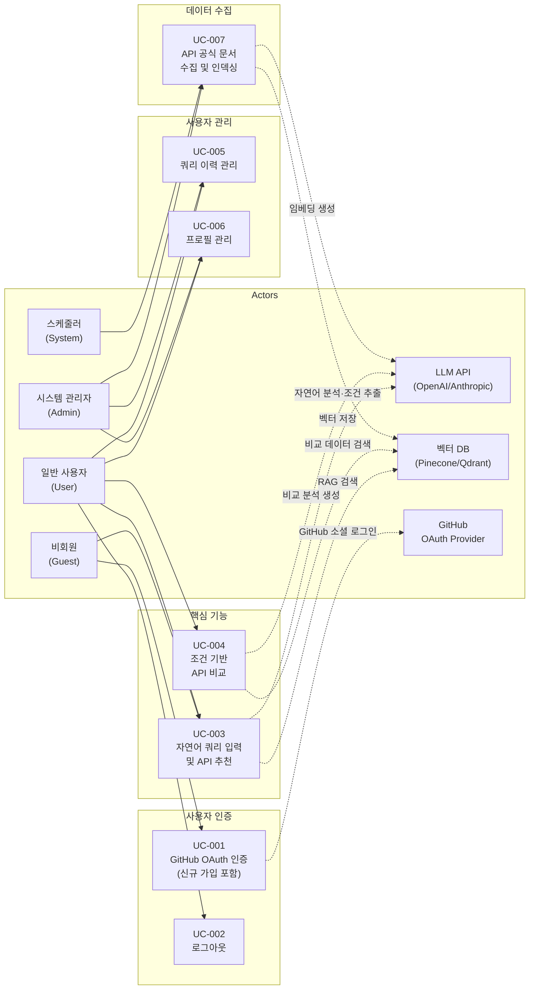
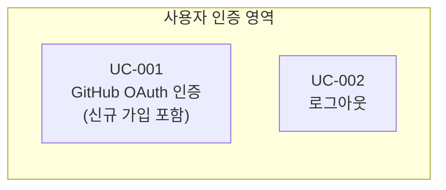
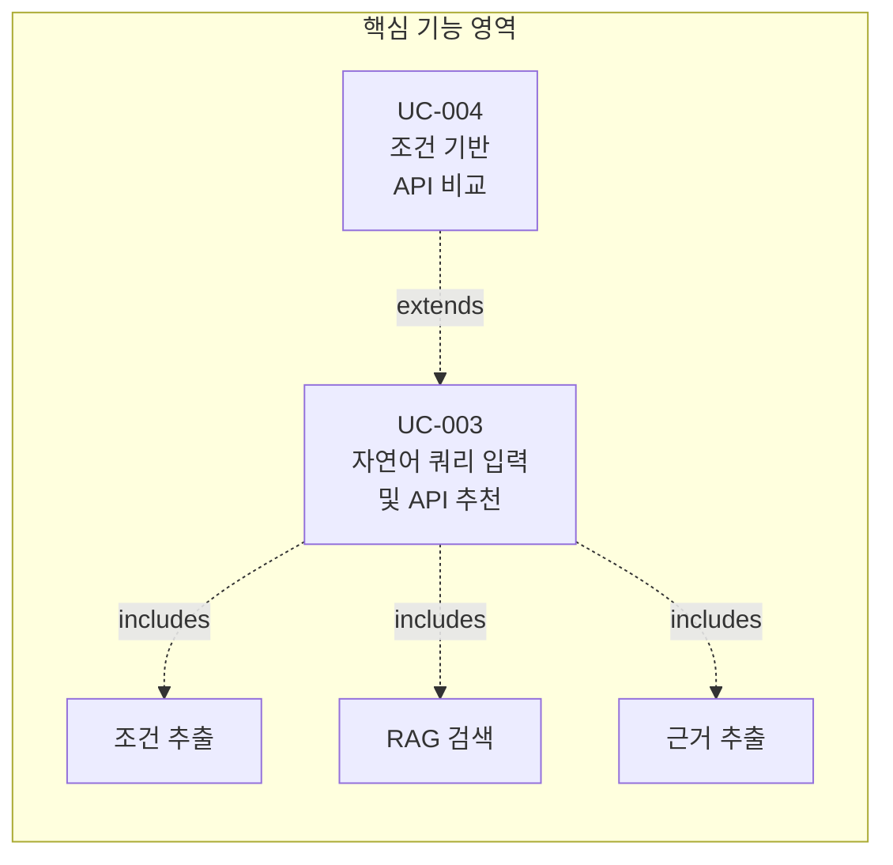
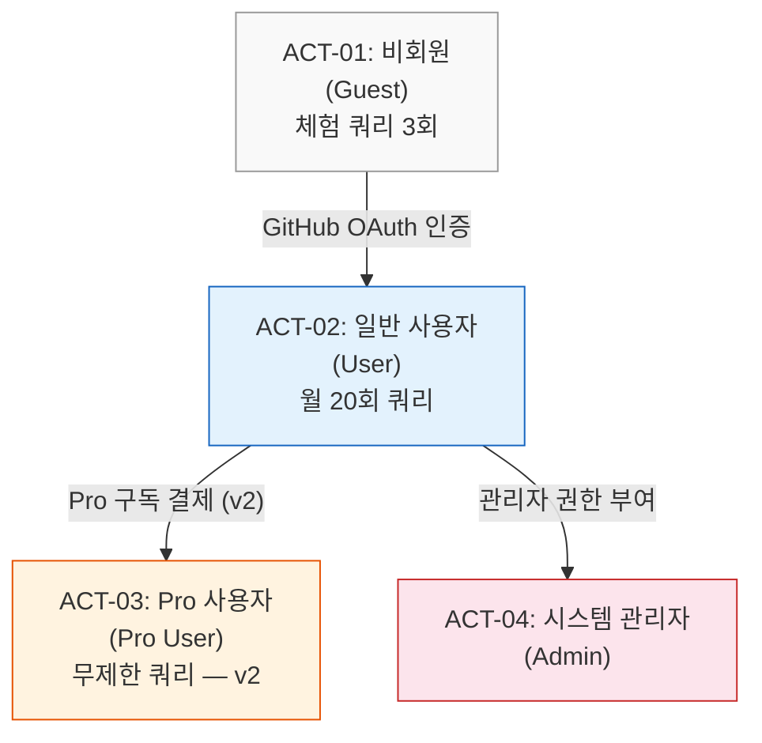

# 유스케이스 명세서

> Use Case Specification

---
## 문서 정보

| 항목 | 내용 |
|------|------|
| 프로젝트명 | API Intelligence Engine |
| 문서 번호 | UCS-001 |
| 버전 | 1.2.0 |
| 작성일 | 2026-02-23 |
| 작성자 | 조훈상 / 기획·개발 |

---

> **용어 규칙:** 본 문서는 [`용어규칙.md`](./용어규칙.md)의 표기 원칙과 용어 사전을 준수한다. 새로운 용어 사용 시 반드시 해당 문서에 먼저 등록한다.

---

## 변경 이력

| 버전 | 날짜 | 변경 내용 | 작성자 | 승인자 |
|------|------|-----------|--------|--------|
| 0.1 | 2026-02-23 | 초안 작성 — 서비스기획안 기반 6개 유스케이스 도출 | 조훈상 | - |
| 1.0 | 2026-02-23 | 전체 유스케이스 상세 명세 완료 | 조훈상 | 조훈상 |
| 1.1 | 2026-02-23 | 인증 방식 변경 — GitHub OAuth 전용 인증으로 전환. 이메일/비밀번호 기반 인증 제거, 이메일 서비스(EMAIL_SVC) 액터 제거. UC-001을 GitHub OAuth 인증(신규 가입 포함)으로 재편, UC-002를 로그아웃으로 재편, UC-006에서 비밀번호 변경/GitHub 연동 해제 제거 | 조훈상 | 조훈상 |
| 1.2 | 2026-02-23 | API 컬렉터 시스템 추가 — UC-007 API 공식 문서 수집 및 인덱싱 유스케이스 추가, 스케줄러(System) 보조 액터 추가 | 조훈상 | 조훈상 |

---

## 목차

1. [유스케이스 다이어그램](#1-유스케이스-다이어그램)
2. [액터 정의](#2-액터-정의)
3. [유스케이스 목록](#3-유스케이스-목록)
4. [유스케이스 상세 명세](#4-유스케이스-상세-명세)

---

## 1. 유스케이스 다이어그램

### 1.1 전체 시스템 유스케이스 다이어그램

### 1.2 기능 영역별 유스케이스 다이어그램

#### 사용자 인증 영역

#### 핵심 기능 영역

---

## 2. 액터 정의

### 2.1 주요 액터 (Primary Actors)

| Actor ID | 이름 | 설명 | 권한 수준 | 인증 여부 |
|----------|------|------|-----------|-----------|
| ACT-01 | 비회원 (Guest) | 시스템에 가입하지 않았거나 로그인하지 않은 사용자. 무료 체험 쿼리(Query) 3회 실행 및 GitHub OAuth 인증만 가능 | Level 0 (최소) | 미인증 |
| ACT-02 | 일반 사용자 (User) | GitHub OAuth를 통해 인증을 완료한 사용자. 월 20회 쿼리 실행, 쿼리 이력 관리, 조건 기반 비교 기능 사용 가능 | Level 1 (기본) | 인증됨 |
| ACT-03 | Pro 사용자 (Pro User) | 유료 구독 사용자. 무제한 쿼리, 고급 필터, 비교 리포트 기능 사용 가능. v2에서 도입 예정 | Level 2 (프리미엄) | 인증됨 |
| ACT-04 | 시스템 관리자 (Admin) | 시스템 전반의 관리 권한을 가진 사용자. 사용자 관리, 인덱싱 관리, 시스템 설정 변경 가능 | Level 3 (최고) | 인증됨 |

### 2.2 보조 액터 (Secondary Actors)

| Actor ID | 이름 | 설명 | 연동 방식 |
|----------|------|------|-----------|
| ACT-S01 | LLM API (OpenAI/Anthropic) | 사용자의 자연어 입력에서 기능 카테고리, 기술 조건(SDK, 리전(Region), 가격 등)을 추출하고, 검색 결과를 구조화하는 외부 AI 서비스 | REST API |
| ACT-S02 | 벡터 DB (Pinecone/Qdrant) | 인덱싱된 공식 문서 청크(Chunk)에서 조건 관련 문서를 벡터 유사도 기반으로 검색하는 외부 서비스 | REST API / SDK |
| ACT-S03 | GitHub OAuth Provider | GitHub 계정 기반 소셜 로그인 인증을 제공하는 외부 서비스. 본 시스템의 유일한 인증 수단 | OAuth 2.0 |
| ACT-S05 | 스케줄러 (System) | 주기적으로 인덱싱 작업을 자동 트리거하는 시스템 내부 스케줄러 (Cron Job) | 내부 |

### 2.3 액터 계층 구조

> 상위 액터는 하위 액터의 모든 권한을 포함한다. Pro 사용자는 v2에서 도입 예정이므로 MVP에서는 비회원과 일반 사용자만 활성 액터이다.

---

## 3. 유스케이스 목록

| UC-ID | 유스케이스명 | 주요 액터 | 우선순위 | 상태 | 관련 MVP 항목 |
|-------|-------------|-----------|----------|------|---------------|
| UC-001 | GitHub OAuth 인증 (신규 가입 포함) | 비회원 (Guest) | P1 | 완료 | MVP-007 |
| UC-002 | 로그아웃 | 일반 사용자 (User) | P1 | 완료 | MVP-007 |
| UC-003 | 자연어 쿼리 입력 및 API 추천 | 비회원/일반 사용자 | P0 | 완료 | MVP-001, MVP-002, MVP-003, MVP-005, MVP-006 |
| UC-004 | 조건 기반 API 비교 | 일반 사용자 (User) | P1 | 완료 | MVP-009 |
| UC-005 | 쿼리 이력 관리 | 일반 사용자 (User) | P1 | 완료 | MVP-008 |
| UC-006 | 프로필 관리 | 일반 사용자 (User) | P2 | 완료 | MVP-007 |
| UC-007 | API 공식 문서 수집 및 인덱싱 | 시스템 관리자 (Admin) | P0 | 완료 | MVP-004 |

**상태 정의:**

| 상태 | 설명 |
|------|------|
| 초안 | 최초 작성, 검토 필요 |
| 검토중 | 이해관계자 검토 진행 중 |
| 완료 | 검토 완료 및 승인됨 |
| 변경중 | 승인 후 변경 사항 발생 |

---

## 4. 유스케이스 상세 명세

---

### 4.1 UC-001: GitHub OAuth 인증 (신규 가입 포함)

| 항목 | 내용 |
|------|------|
| **UC-ID** | UC-001 |
| **유스케이스명** | GitHub OAuth 인증 (신규 가입 포함) |
| **액터** | 비회원 (Guest), GitHub OAuth Provider (Secondary) |
| **설명** | 비회원 사용자가 GitHub OAuth를 통해 API Intelligence Engine에 인증한다. 최초 인증 시 GitHub 프로필 정보(이메일, 이름, GitHub 사용자명)를 기반으로 자동 회원가입이 이루어진다. 이후 인증 시에는 기존 계정으로 로그인된다. 인증 완료 후 월 20회 무료 쿼리 및 이력 저장 등 회원 전용 기능을 이용할 수 있다. |
| **우선순위** | P1 |
| **트리거** | 사용자가 로그인/회원가입 화면에서 [GitHub으로 계속하기] 버튼을 클릭하거나, 비회원 체험 쿼리 결과 화면에서 [로그인] 버튼을 클릭한다 |
| **관련 요구사항** | MVP-007 |

#### 사전 조건 (Pre-conditions)

1. 사용자는 시스템에 로그인하지 않은 상태이다.
2. 사용자는 GitHub 계정을 보유하고 있다.
3. GitHub OAuth Provider 서비스가 정상 동작 중이다.

#### 기본 흐름 (Main Flow)

| 단계 | 액터 | 시스템 |
|------|------|--------|
| 1 | 사용자가 로그인/회원가입 페이지에 접근한다. | [GitHub으로 계속하기] 버튼과 서비스 소개를 표시한다. |
| 2 | 사용자가 [GitHub으로 계속하기] 버튼을 클릭한다. | - |
| 3 | - | GitHub OAuth Provider의 인증 페이지로 리다이렉트한다. |
| 4 | 사용자가 GitHub에서 인증 및 권한을 승인한다. | - |
| 5 | - | GitHub으로부터 Authorization Code를 수신한다. |
| 6 | - | Authorization Code를 사용하여 Access Token을 요청한다. |
| 7 | - | Token으로 사용자 프로필 정보(이메일, 이름, GitHub 사용자명)를 조회한다. |
| 8 | - | GitHub 이메일로 기존 사용자 매칭을 시도한다. |
| 9-a | (기존 사용자인 경우) | 기존 계정으로 로그인 처리한다. 단계 11로 이동한다. |
| 9-b | (신규 사용자인 경우) | GitHub 프로필 정보로 자동 회원가입을 수행한다 (상태: ACTIVE, 월간 쿼리 20회 초기화, 기본 역할: USER). |
| 10 | - | (신규 사용자) 서비스 이용약관과 개인정보 처리방침 동의 화면을 표시한다. 사용자가 동의한다. |
| 11 | - | Access Token (JWT)을 발급한다. |
| 12 | - | Refresh Token을 발급하고 저장한다. |
| 13 | - | 로그인 이력을 기록한다 (IP, User-Agent, 시간). |
| 14 | - | 대시보드 페이지로 리다이렉트한다 (쿼리 입력창 + 최근 쿼리 이력 표시). 비회원 상태에서 실행한 체험 쿼리 결과가 있으면 해당 이력을 계정에 자동 연결한다. |

#### 대안 흐름 (Alternative Flow)

**AF-001-01: 체험 쿼리 후 인증 유도**

- 분기 시점: 비회원이 체험 쿼리 결과 화면에서 [결과 저장하기] 또는 [로그인] 버튼을 클릭한 경우
- 시스템은 로그인 페이지로 이동하면서 "로그인하시면 이 결과가 자동 저장됩니다" 안내를 표시한다.
- 기본 흐름 단계 1로 이동한다.

#### 예외 흐름 (Exception Flow)

**EF-001-01: GitHub OAuth Provider 오류**

- 분기 시점: 단계 5~7
- 조건: GitHub OAuth Provider 서비스 장애 또는 사용자 권한 거부.
- 시스템은 "GitHub 로그인 처리 중 오류가 발생했습니다. 잠시 후 다시 시도해주세요" 메시지를 표시한다.
- 로그인 페이지로 복귀한다.
- 유스케이스 종료 (재시도 가능).

**EF-001-02: GitHub 이메일 미공개**

- 분기 시점: 단계 7
- 조건: GitHub 프로필에서 이메일이 비공개(private)로 설정되어 있어 이메일을 조회할 수 없다.
- 시스템은 GitHub API를 통해 사용자의 primary email을 별도 요청한다.
- primary email도 조회할 수 없는 경우, "GitHub 계정에 공개 이메일이 설정되어 있지 않습니다. GitHub 설정에서 이메일을 공개로 변경해주세요" 메시지를 표시한다.
- 유스케이스 종료 (재시도 가능).

**EF-001-03: 약관 동의 거부**

- 분기 시점: 단계 10
- 조건: 신규 사용자가 서비스 이용약관 또는 개인정보 처리방침 동의를 거부한다.
- 시스템은 "서비스 이용을 위해 약관 동의가 필요합니다" 메시지를 표시한다.
- 생성된 사용자 레코드를 삭제한다.
- 유스케이스 종료.

#### 사후 조건 (Post-conditions)

**성공 시 (신규 사용자):**

1. 새로운 사용자 레코드가 생성되어 있다 (상태: ACTIVE).
2. GitHub 계정이 사용자 레코드에 연동되어 있다.
3. 사용자에게 기본 역할(USER)이 부여되어 있다.
4. 월간 쿼리 잔여 횟수가 20회로 초기화되어 있다.
5. 비회원 상태에서 실행한 체험 쿼리 이력이 있으면 계정에 연결되어 있다.
6. 회원가입 완료 감사 로그가 기록되어 있다.

**성공 시 (기존 사용자):**

1. 사용자에게 유효한 Access Token과 Refresh Token이 발급되어 있다.
2. 로그인 이력이 기록되어 있다 (IP, User-Agent, 시간).
3. 사용자가 인증된 상태로 대시보드에 접근한 상태이다.

**실패 시:**

1. Token이 발급되지 않았다.
2. 오류 원인에 따른 안내 메시지가 사용자에게 표시되었다.

#### 비즈니스 규칙

| 규칙 ID | 내용 |
|---------|------|
| BR-001-01 | GitHub 이메일 주소를 사용자 식별자로 사용하며, 시스템 내에서 고유해야 한다 |
| BR-001-02 | 서비스 이용약관과 개인정보 처리방침 동의는 신규 가입 시 필수이다 |
| BR-001-03 | 회원가입 시 월간 무료 쿼리 20회가 자동 부여된다 |
| BR-001-04 | 탈퇴 후 재가입 시 이전 데이터는 복구되지 않는다 |
| BR-001-05 | GitHub OAuth 최초 인증 시 자동 회원가입 처리한다 |
| BR-001-06 | Access Token 유효기간: 1시간 |
| BR-001-07 | Refresh Token 유효기간: 14일 |
| BR-001-08 | Refresh Token rotation 정책을 적용한다 |
| BR-001-09 | 동시 로그인 정책: 기기별 허용 (복수 기기에서 동시 로그인 가능) |

#### UI 참조

| 화면 ID | 화면명 | 설명 |
|---------|--------|------|
| SCR-AUTH-01 | 로그인/회원가입 | [GitHub으로 계속하기] 버튼, 서비스 소개 |
| SCR-AUTH-02 | 약관 동의 (신규) | 서비스 이용약관, 개인정보 처리방침 동의 화면 |

#### 관련 요구사항 ID (RTM)

| 요구사항 ID | 설계 문서 | 테스트케이스 |
|------------|----------|-------------|
| MVP-007 | 인증 설계서 (NextAuth.js 기반) | TC-001-01 ~ TC-001-06 |

---

### 4.2 UC-002: 로그아웃

| 항목 | 내용 |
|------|------|
| **UC-ID** | UC-002 |
| **유스케이스명** | 로그아웃 |
| **액터** | 일반 사용자 (User) |
| **설명** | 로그인한 사용자가 현재 세션을 종료하여 시스템에서 로그아웃한다. |
| **우선순위** | P1 |
| **트리거** | 사용자가 [로그아웃] 버튼을 클릭한다 |
| **관련 요구사항** | MVP-007 |

#### 사전 조건 (Pre-conditions)

1. 사용자는 로그인한 상태이다.

#### 기본 흐름 (Main Flow)

| 단계 | 액터 | 시스템 |
|------|------|--------|
| 1 | 사용자가 [로그아웃] 버튼을 클릭한다. | - |
| 2 | - | 현재 세션의 Access Token과 Refresh Token을 무효화한다. |
| 3 | - | 로그아웃 이력을 기록한다. |
| 4 | - | 랜딩 페이지 또는 로그인 페이지로 리다이렉트한다. |

#### 예외 흐름 (Exception Flow)

**EF-002-01: 세션 만료 상태에서의 로그아웃**

- 분기 시점: 단계 2
- 조건: 이미 세션이 만료된 상태이다.
- 시스템은 추가 처리 없이 로그인 페이지로 리다이렉트한다.

#### 사후 조건 (Post-conditions)

**성공 시:**

1. 현재 세션의 Token이 무효화되어 있다.
2. 로그아웃 이력이 기록되어 있다.
3. 사용자가 비인증 상태로 전환되어 있다.

#### 비즈니스 규칙

| 규칙 ID | 내용 |
|---------|------|
| BR-002-01 | 로그아웃 시 현재 기기의 세션만 종료한다 (다른 기기의 세션은 유지) |
| BR-002-02 | 로그아웃 후 인증이 필요한 페이지 접근 시 로그인 페이지로 리다이렉트한다 |

#### UI 참조

| 화면 ID | 화면명 | 설명 |
|---------|--------|------|
| SCR-LOGOUT-01 | 로그아웃 완료 | 로그아웃 완료 안내, 로그인 페이지 링크 |

#### 관련 요구사항 ID (RTM)

| 요구사항 ID | 설계 문서 | 테스트케이스 |
|------------|----------|-------------|
| MVP-007 | 인증 설계서 (NextAuth.js 기반) | TC-002-01 ~ TC-002-03 |

---

### 4.3 UC-003: 자연어 쿼리 입력 및 API 추천

| 항목 | 내용 |
|------|------|
| **UC-ID** | UC-003 |
| **유스케이스명** | 자연어 쿼리 입력 및 API 추천 |
| **액터** | 비회원 (Guest) / 일반 사용자 (User), LLM API (Secondary), 벡터 DB (Secondary) |
| **설명** | 사용자가 자연어로 API 요구사항을 입력하면, 시스템이 LLM을 통해 기능 카테고리와 기술 조건(SDK, 리전, 가격 등)을 추출하고, RAG(Retrieval-Augmented Generation) 파이프라인으로 인덱싱된 공식 문서에서 관련 정보를 검색하여, 공식 문서 원문 인용과 구조화된 링크(문서/가격/SDK/상태 페이지)를 포함한 API 추천 결과를 제공한다. 본 서비스의 핵심 유스케이스이며, Core Loop의 중심이다. |
| **우선순위** | P0 |
| **트리거** | 사용자가 대시보드 또는 랜딩 페이지의 쿼리 입력창에 자연어 요구사항을 입력하고 [검색] 버튼을 클릭하거나, 예시 쿼리를 클릭한다 |
| **관련 요구사항** | MVP-001, MVP-002, MVP-003, MVP-004, MVP-005, MVP-006 |

#### 사전 조건 (Pre-conditions)

1. 대상 API 카테고리(LLM API, 결제 API, 인증 API, 메시징 API, 벡터 DB)의 공식 문서가 벡터 DB에 인덱싱되어 있다.
2. LLM API (OpenAI/Anthropic)가 정상 동작 중이다.
3. 벡터 DB (Pinecone/Qdrant)가 정상 동작 중이다.
4. (비회원의 경우) 체험 쿼리 잔여 횟수가 1회 이상이다.
5. (일반 사용자의 경우) 월간 쿼리 잔여 횟수가 1회 이상이다.

#### 기본 흐름 (Main Flow)

| 단계 | 액터 | 시스템 |
|------|------|--------|
| 1 | 사용자가 쿼리 입력창에 자연어 요구사항을 입력한다. (예: "한국 리전 지원, Node.js SDK 있고, 무료 플랜이 있는 SMS API 추천해줘") | 입력창과 예시 쿼리 목록을 표시한다. |
| 2 | 사용자가 [검색] 버튼을 클릭하거나 Enter 키를 누른다. | - |
| 3 | - | 사용자의 쿼리 잔여 횟수를 확인한다 (비회원: 3회, 일반 사용자: 월 20회). |
| 4 | - | 쿼리 잔여 횟수를 1 차감한다. |
| 5 | - | 로딩 상태를 표시한다 (스켈레톤 UI + "공식 문서에서 검색 중..." 안내). |
| 6 | - | LLM API에 자연어 입력을 전송하여 조건을 추출한다. 추출 항목: 기능 카테고리 (예: 메시징/SMS), 기술 조건 (SDK 언어, 리전, 인증 방식 등), 가격 조건 (무료 플랜, 가격 범위 등), 우선순위 힌트 (사용자가 강조한 조건). |
| 7 | - | 추출된 조건을 기반으로 검색 쿼리를 생성하고, 벡터 DB에서 관련 공식 문서 청크를 검색한다 (상위 20개 청크). |
| 8 | - | 검색된 청크에서 조건 매칭 근거 문장을 추출한다. 각 API별로 조건 충족 여부와 공식 문서 원문 인용을 정리한다. |
| 9 | - | 각 API별 공식 링크(문서 페이지, 가격 페이지, SDK 저장소, 상태 페이지)를 자동으로 매칭하여 정리한다. |
| 10 | - | 추천 결과를 구조화된 카드 형태로 표시한다. 각 카드에는 API명, 제공 업체, 조건 매칭 상태(충족/미충족/확인 불가), 공식 문서 원문 인용(근거), 공식 링크 목록(유형별 분류), 매칭 점수(관련도)가 포함된다. |
| 11 | 사용자가 추천 결과를 확인한다. | 결과 카드 하단에 [조건 수정 재검색], [비교하기], [결과 복사] 버튼을 표시한다. |
| 12 | - | (로그인 사용자의 경우) 쿼리와 결과를 자동으로 이력에 저장한다. |

#### 대안 흐름 (Alternative Flow)

**AF-003-01: 예시 쿼리 클릭**

- 분기 시점: 단계 1 대신
- 사용자가 랜딩 페이지 또는 대시보드에 표시된 예시 쿼리를 클릭한다. (예: "Node.js SDK가 있는 이메일 발송 API", "무료 플랜이 있는 벡터 DB 비교")
- 시스템은 해당 예시 쿼리를 입력창에 자동 입력한다.
- 기본 흐름 단계 2로 이동한다.

**AF-003-02: 조건 수정 재검색**

- 분기 시점: 단계 11 이후
- 단계:

| 단계 | 액터 | 시스템 |
|------|------|--------|
| A1 | 사용자가 [조건 수정 재검색] 버튼을 클릭한다. | 추출된 조건 목록을 편집 가능한 태그/필터 형태로 표시한다. |
| A2 | 사용자가 조건을 수정한다 (추가/삭제/변경). (예: 리전 조건을 "한국"에서 "아시아"로 변경, SDK 조건에 "Python" 추가) | - |
| A3 | 사용자가 [재검색] 버튼을 클릭한다. | - |
| A4 | - | 수정된 조건 기반으로 벡터 DB에서 재검색을 수행한다. (조건 수정 재검색은 쿼리 횟수를 차감하지 않는다.) |
| A5 | - | 기본 흐름 단계 8~12를 반복한다. |

**AF-003-03: 비회원 체험 쿼리**

- 분기 시점: 단계 3
- 조건: 사용자가 비회원(Guest)이다.
- 단계:

| 단계 | 액터 | 시스템 |
|------|------|--------|
| A1 | - | 비회원 체험 쿼리 잔여 횟수를 확인한다 (브라우저 쿠키/세션 기반, 최대 3회). |
| A2 | - | 잔여 횟수가 1회 이상이면 기본 흐름 단계 4~12를 실행한다. 결과 카드 상단에 "체험 쿼리 N/3회 사용" 안내를 표시한다. |
| A3 | - | 결과 하단에 "GitHub으로 로그인하시면 월 20회 무료 쿼리와 이력 저장 기능을 이용할 수 있습니다" 가입 유도 배너를 표시한다. |

**AF-003-04: 결과 내 공식 링크 클릭**

- 분기 시점: 단계 11 이후
- 사용자가 결과 카드 내의 공식 문서 링크, 가격 페이지 링크, SDK 저장소 링크 등을 클릭한다.
- 시스템은 해당 링크를 새 탭에서 열고, 링크 클릭 이벤트를 기록한다 (KPI 측정용).

#### 예외 흐름 (Exception Flow)

**EF-003-01: 쿼리 횟수 초과**

- 분기 시점: 단계 3
- 조건: 비회원의 체험 쿼리 3회가 모두 소진되었거나, 일반 사용자의 월간 쿼리 20회가 모두 소진되었다.
- (비회원의 경우) "체험 쿼리를 모두 사용하셨습니다. GitHub으로 로그인하시면 월 20회 무료 쿼리를 이용할 수 있습니다" 메시지와 [GitHub으로 로그인] 버튼을 표시한다.
- (일반 사용자의 경우) "이번 달 무료 쿼리를 모두 사용하셨습니다. 다음 달 1일에 초기화됩니다" 메시지를 표시한다. v2에서 Pro 업그레이드 안내를 추가할 예정이다.
- 유스케이스 종료.

**EF-003-02: LLM API 장애**

- 분기 시점: 단계 6
- 조건: LLM API (OpenAI/Anthropic) 호출이 실패하거나 타임아웃(30초)이 발생한다.
- 시스템은 백업 LLM 제공자로 자동 전환을 시도한다 (OpenAI 장애 시 Anthropic, 또는 그 반대).
- 백업 전환도 실패한 경우, "AI 분석 서비스에 일시적인 장애가 발생했습니다. 잠시 후 다시 시도해주세요" 메시지를 표시한다.
- 차감된 쿼리 횟수를 복원한다.
- 장애 로그를 기록하고, 관리자에게 알림을 발송한다.
- 유스케이스 종료 (재시도 가능).

**EF-003-03: 벡터 DB 장애**

- 분기 시점: 단계 7
- 조건: 벡터 DB (Pinecone/Qdrant) 호출이 실패하거나 타임아웃(15초)이 발생한다.
- 시스템은 "문서 검색 서비스에 일시적인 장애가 발생했습니다. 잠시 후 다시 시도해주세요" 메시지를 표시한다.
- 차감된 쿼리 횟수를 복원한다.
- 장애 로그를 기록하고, 관리자에게 알림을 발송한다.
- 유스케이스 종료 (재시도 가능).

**EF-003-04: 매칭 결과 없음**

- 분기 시점: 단계 8
- 조건: 벡터 DB 검색 결과 중 최소 매칭 점수(유사도 0.7) 이상인 청크가 없다.
- 시스템은 "입력하신 조건에 정확히 매칭되는 공식 문서를 찾지 못했습니다" 메시지를 표시한다.
- 다음 안내를 제공한다: (1) 조건을 완화하여 재검색 제안 (예: 리전 조건 제거), (2) 현재 지원하는 5개 API 카테고리(LLM, 결제, 인증, 메시징, 벡터 DB) 안내, (3) 유사한 예시 쿼리 추천.
- 쿼리 횟수는 차감된 상태로 유지한다 (검색은 정상 수행되었으므로).
- 유스케이스 종료 (재검색 가능).

**EF-003-05: 조건 추출 실패**

- 분기 시점: 단계 6
- 조건: 사용자 입력이 API 검색과 무관한 내용이거나, LLM이 유의미한 조건을 추출하지 못했다.
- 시스템은 "API 검색에 필요한 조건을 파악하지 못했습니다. 다음과 같은 형태로 입력해보세요" 메시지와 함께 예시 쿼리 3개를 표시한다.
- 차감된 쿼리 횟수를 복원한다.
- 유스케이스 종료 (재시도 가능).

**EF-003-06: 입력 길이 초과**

- 분기 시점: 단계 2
- 조건: 사용자 입력이 최대 허용 길이(500자)를 초과한다.
- 시스템은 "입력은 500자 이내로 작성해주세요" 메시지를 표시한다.
- 유스케이스 종료 (재입력 가능).

#### 사후 조건 (Post-conditions)

**성공 시:**

1. 사용자에게 1개 이상의 API 추천 결과가 구조화된 카드 형태로 표시되어 있다.
2. 각 결과 카드에 공식 문서 원문 인용(근거)과 공식 링크가 포함되어 있다.
3. 사용자의 쿼리 잔여 횟수가 1 차감되어 있다.
4. (로그인 사용자의 경우) 쿼리와 결과가 이력에 저장되어 있다.
5. 쿼리 실행 이벤트가 분석 시스템에 기록되어 있다.

**실패 시:**

1. 오류 원인에 따른 안내 메시지가 사용자에게 표시되었다.
2. (서비스 장애로 인한 실패 시) 차감된 쿼리 횟수가 복원되어 있다.
3. 장애 로그가 기록되어 있다.

#### 비즈니스 규칙

| 규칙 ID | 내용 |
|---------|------|
| BR-003-01 | 비회원은 브라우저 세션 기준 최대 3회까지 체험 쿼리를 실행할 수 있다 |
| BR-003-02 | 일반 사용자는 월 20회까지 쿼리를 실행할 수 있으며, 매월 1일 자정(KST)에 횟수가 초기화된다 |
| BR-003-03 | 모든 추천 결과에는 공식 문서 원문 인용과 소스 링크를 반드시 포함한다. 문서에 없는 정보는 제공하지 않는다 (환각 방지) |
| BR-003-04 | 벡터 유사도 검색의 최소 매칭 점수는 0.7이며, 이 미만의 결과는 사용자에게 노출하지 않는다 |
| BR-003-05 | LLM API 호출 타임아웃은 30초이며, 타임아웃 시 백업 LLM 제공자로 자동 전환한다 |
| BR-003-06 | 벡터 DB 호출 타임아웃은 15초이다 |
| BR-003-07 | 조건 수정 재검색은 쿼리 횟수를 차감하지 않는다 (동일 쿼리의 조건 조정으로 간주) |
| BR-003-08 | 서비스 장애(LLM/벡터 DB)로 인한 검색 실패 시 차감된 쿼리 횟수를 복원한다 |
| BR-003-09 | 쿼리 입력의 최대 길이는 500자이다 |
| BR-003-10 | MVP에서 지원하는 API 카테고리는 LLM API, 결제 API, 인증 API, 메시징 API, 벡터 DB의 5개이다 |
| BR-003-11 | 추천 결과는 매칭 점수(관련도) 내림차순으로 정렬한다 |
| BR-003-12 | 각 결과 카드에는 공식 링크를 유형별(문서, 가격, SDK, 상태 페이지)로 분류하여 표시한다 |

#### UI 참조

| 화면 ID | 화면명 | 설명 |
|---------|--------|------|
| SCR-QUERY-01 | 쿼리 입력 | 자연어 입력창, 예시 쿼리 목록, 쿼리 잔여 횟수 표시 |
| SCR-QUERY-02 | 검색 진행 중 | 스켈레톤 UI, "공식 문서에서 검색 중..." 로딩 상태 |
| SCR-QUERY-03 | 추천 결과 | API별 구조화된 카드 목록 (API명, 근거 인용, 조건 매칭 상태, 공식 링크) |
| SCR-QUERY-04 | 조건 수정 | 추출된 조건을 태그/필터 형태로 편집하는 패널 |
| SCR-QUERY-05 | 결과 없음 | 매칭 결과 없음 안내, 조건 완화 제안, 예시 쿼리 추천 |
| SCR-QUERY-06 | 쿼리 횟수 초과 | 횟수 초과 안내, 로그인/업그레이드 유도 |

#### 관련 요구사항 ID (RTM)

| 요구사항 ID | 설계 문서 | 테스트케이스 |
|------------|----------|-------------|
| MVP-001 | 쿼리 입력 UI 설계서 | TC-003-01 ~ TC-003-05 |
| MVP-002 | LLM 조건 추출 설계서 | TC-003-06 ~ TC-003-10 |
| MVP-003 | RAG 파이프라인 설계서 | TC-003-11 ~ TC-003-15 |
| MVP-004 | 문서 인덱싱 설계서 | TC-003-16 ~ TC-003-18 |
| MVP-005 | 결과 표시 UI 설계서 | TC-003-19 ~ TC-003-22 |
| MVP-006 | 공식 링크 정리 설계서 | TC-003-23 ~ TC-003-25 |

---

### 4.4 UC-004: 조건 기반 API 비교

| 항목 | 내용 |
|------|------|
| **UC-ID** | UC-004 |
| **유스케이스명** | 조건 기반 API 비교 |
| **액터** | 일반 사용자 (User), LLM API (Secondary), 벡터 DB (Secondary) |
| **설명** | 로그인한 사용자가 UC-003의 추천 결과에서 2~3개의 API를 선택하여 조건별(가격, 리전, SDK, 인증 방식 등) 나란히 비교하는 구조화된 비교표를 생성한다. |
| **우선순위** | P1 |
| **트리거** | 사용자가 UC-003의 추천 결과에서 2개 이상의 API를 선택하고 [비교하기] 버튼을 클릭한다 |
| **관련 요구사항** | MVP-009 |

#### 사전 조건 (Pre-conditions)

1. 사용자는 로그인한 상태이다.
2. UC-003의 추천 결과가 화면에 표시되어 있다.
3. 비교 대상 API가 2개 이상 선택되어 있다.

#### 기본 흐름 (Main Flow)

| 단계 | 액터 | 시스템 |
|------|------|--------|
| 1 | 사용자가 추천 결과 카드에서 비교할 API를 2~3개 선택한다 (체크박스). | 선택된 API 수를 표시하고, 2개 이상 선택 시 [비교하기] 버튼을 활성화한다. |
| 2 | 사용자가 [비교하기] 버튼을 클릭한다. | - |
| 3 | - | 선택된 API들에 대해 벡터 DB에서 비교 기준 항목별(가격, SDK 지원 언어, 리전, 인증 방식, 무료 플랜 조건, API 호출 제한) 공식 문서 정보를 검색한다. |
| 4 | - | LLM API를 호출하여 검색된 정보를 비교 기준별로 구조화한다. |
| 5 | - | 비교표를 생성하여 표시한다. 행: 비교 기준 항목, 열: 선택된 API. 각 셀에 공식 문서 원문 근거와 소스 링크를 포함한다. 확인 불가한 항목은 "공식 문서에서 확인 불가"로 표시한다. |
| 6 | 사용자가 비교표를 확인한다. | [결과 복사] 버튼을 표시한다. |

#### 대안 흐름 (Alternative Flow)

**AF-004-01: 비교 항목 직접 검색**

- 분기 시점: 단계 1 대신
- 사용자가 대시보드에서 직접 비교할 API 이름을 입력하여 비교를 요청한다.
- 시스템은 입력된 API 이름으로 인덱스에서 해당 API를 검색한다.
- 매칭되는 API가 2개 이상이면 기본 흐름 단계 3으로 이동한다.
- 매칭되는 API가 없으면 "해당 API의 공식 문서가 인덱싱되어 있지 않습니다" 메시지를 표시한다.

**AF-004-02: 결과 복사**

- 분기 시점: 단계 6 이후
- 사용자가 [결과 복사] 버튼을 클릭한다.
- 시스템은 비교표를 마크다운 형식으로 클립보드에 복사한다.
- "비교 결과가 클립보드에 복사되었습니다" 안내를 표시한다.

#### 예외 흐름 (Exception Flow)

**EF-004-01: 비교 대상 부족**

- 분기 시점: 단계 2
- 조건: 선택된 API가 1개 이하이다.
- "비교하려면 2개 이상의 API를 선택해주세요" 메시지를 표시한다.
- 유스케이스 종료 (추가 선택 가능).

**EF-004-02: 비교 대상 초과**

- 분기 시점: 단계 1
- 조건: 사용자가 4개 이상의 API를 선택하려고 한다.
- "비교는 최대 3개까지 가능합니다" 메시지를 표시한다.
- 추가 선택을 차단한다.

**EF-004-03: 비교 데이터 검색 실패**

- 분기 시점: 단계 3 또는 4
- 조건: 벡터 DB 또는 LLM API 호출이 실패한다.
- "비교 데이터를 생성하는 중 오류가 발생했습니다. 잠시 후 다시 시도해주세요" 메시지를 표시한다.
- 유스케이스 종료 (재시도 가능).

#### 사후 조건 (Post-conditions)

**성공 시:**

1. 선택된 API들의 조건별 비교표가 화면에 표시되어 있다.
2. 모든 비교 항목에 공식 문서 근거가 포함되어 있다.
3. (로그인 사용자) 비교 결과가 해당 쿼리 이력에 연결되어 저장되어 있다.

**실패 시:**

1. 오류 원인에 따른 안내 메시지가 표시되었다.
2. 사용자는 추천 결과 화면으로 복귀할 수 있다.

#### 비즈니스 규칙

| 규칙 ID | 내용 |
|---------|------|
| BR-004-01 | 비교는 로그인 사용자만 이용 가능하다 |
| BR-004-02 | 비교 대상 API는 최소 2개, 최대 3개로 제한한다 |
| BR-004-03 | 비교 기준 항목: 가격(무료/유료 플랜), SDK 지원 언어, 리전, 인증 방식, API 호출 제한, 공식 문서 링크 |
| BR-004-04 | 비교 결과의 모든 정보는 공식 문서 근거를 포함한다. 확인 불가한 항목은 "공식 문서에서 확인 불가"로 명시한다 |
| BR-004-05 | 비교 기능 사용은 별도의 쿼리 횟수를 차감하지 않는다 (UC-003의 검색 결과를 기반으로 생성) |

#### UI 참조

| 화면 ID | 화면명 | 설명 |
|---------|--------|------|
| SCR-COMPARE-01 | API 선택 | 추천 결과에서 비교 대상 API를 체크박스로 선택 |
| SCR-COMPARE-02 | 비교표 | 행: 비교 기준, 열: API별 정보, 각 셀에 근거 인용 포함 |

#### 관련 요구사항 ID (RTM)

| 요구사항 ID | 설계 문서 | 테스트케이스 |
|------------|----------|-------------|
| MVP-009 | 비교표 UI 설계서 | TC-004-01 ~ TC-004-08 |

---

### 4.5 UC-005: 쿼리 이력 관리

| 항목 | 내용 |
|------|------|
| **UC-ID** | UC-005 |
| **유스케이스명** | 쿼리 이력 관리 |
| **액터** | 일반 사용자 (User) |
| **설명** | 로그인한 사용자가 이전에 실행한 쿼리 이력을 조회하고, 과거 쿼리를 재실행하거나 결과를 다시 확인할 수 있다. 재방문 시 이전 검색 맥락을 이어갈 수 있도록 지원한다. |
| **우선순위** | P1 |
| **트리거** | 사용자가 대시보드에 접속하여 쿼리 이력 목록을 확인하거나, [이력] 메뉴를 클릭한다 |
| **관련 요구사항** | MVP-008 |

#### 사전 조건 (Pre-conditions)

1. 사용자는 로그인한 상태이다.
2. 사용자의 이전 쿼리 실행 이력이 1건 이상 존재한다.

#### 기본 흐름 (Main Flow)

| 단계 | 액터 | 시스템 |
|------|------|--------|
| 1 | 사용자가 대시보드에 접속하거나 [이력] 메뉴를 클릭한다. | 사용자의 쿼리 이력을 최신순으로 표시한다 (목록 형태). 각 항목에 쿼리 텍스트, 실행 일시, 추천 결과 수를 표시한다. |
| 2 | 사용자가 이력 목록에서 특정 쿼리를 클릭한다. | - |
| 3 | - | 해당 쿼리의 상세 정보를 표시한다. 원본 쿼리 텍스트, 추출된 조건, 추천 결과(API 카드 목록), 비교표(생성한 경우)를 포함한다. |
| 4 | 사용자가 결과를 확인한다. | [이 조건으로 재검색], [결과 복사] 버튼을 표시한다. |

#### 대안 흐름 (Alternative Flow)

**AF-005-01: 이력 기반 재검색**

- 분기 시점: 단계 4 이후
- 사용자가 [이 조건으로 재검색] 버튼을 클릭한다.
- 시스템은 해당 쿼리의 원본 텍스트를 쿼리 입력창에 자동 입력한다.
- UC-003 기본 흐름 단계 2로 이동한다 (새 쿼리로 취급, 횟수 차감).

**AF-005-02: 이력 삭제**

- 분기 시점: 단계 1 또는 3
- 사용자가 특정 이력 항목의 [삭제] 버튼을 클릭한다.
- 시스템은 "이 쿼리 이력을 삭제하시겠습니까?" 확인 대화 상자를 표시한다.
- 사용자가 [확인]을 클릭하면 해당 이력을 삭제한다 (소프트 삭제).

**AF-005-03: 이력 검색**

- 분기 시점: 단계 1
- 사용자가 이력 목록 상단의 검색 필드에 키워드를 입력한다.
- 시스템은 쿼리 텍스트에 해당 키워드가 포함된 이력만 필터링하여 표시한다.

#### 예외 흐름 (Exception Flow)

**EF-005-01: 이력 없음**

- 분기 시점: 단계 1
- 조건: 사용자의 쿼리 이력이 0건이다.
- "아직 실행한 쿼리가 없습니다. 첫 쿼리를 입력해보세요!" 안내와 함께 쿼리 입력창으로의 바로가기를 표시한다.
- 유스케이스 종료.

**EF-005-02: 이력 데이터 로드 실패**

- 분기 시점: 단계 1 또는 3
- 조건: 데이터베이스 조회에 실패한다.
- "이력을 불러오는 중 오류가 발생했습니다. 잠시 후 다시 시도해주세요" 메시지를 표시한다.
- 유스케이스 종료 (재시도 가능).

#### 사후 조건 (Post-conditions)

**성공 시:**

1. 사용자의 쿼리 이력 목록이 최신순으로 표시되어 있다.
2. 특정 이력 선택 시 해당 쿼리의 상세 결과가 표시되어 있다.

**실패 시:**

1. 오류 원인에 따른 안내 메시지가 표시되었다.

#### 비즈니스 규칙

| 규칙 ID | 내용 |
|---------|------|
| BR-005-01 | 쿼리 이력 관리는 로그인 사용자만 이용 가능하다 |
| BR-005-02 | 쿼리 이력은 최신순으로 정렬한다 |
| BR-005-03 | 이력은 최대 100건까지 저장하며, 초과 시 가장 오래된 이력부터 자동 삭제한다 |
| BR-005-04 | 삭제된 이력은 소프트 삭제로 처리하며, 30일 후 물리 삭제한다 |
| BR-005-05 | 이력 기반 재검색은 새 쿼리로 취급하여 쿼리 횟수를 차감한다 |

#### UI 참조

| 화면 ID | 화면명 | 설명 |
|---------|--------|------|
| SCR-HISTORY-01 | 쿼리 이력 목록 | 쿼리 이력을 최신순으로 표시, 검색 필드, 삭제 버튼 |
| SCR-HISTORY-02 | 이력 상세 | 선택한 쿼리의 원본 텍스트, 추출 조건, 추천 결과, 비교표 표시 |

#### 관련 요구사항 ID (RTM)

| 요구사항 ID | 설계 문서 | 테스트케이스 |
|------------|----------|-------------|
| MVP-008 | 이력 관리 설계서 | TC-005-01 ~ TC-005-06 |

---

### 4.6 UC-006: 프로필 관리

| 항목 | 내용 |
|------|------|
| **UC-ID** | UC-006 |
| **유스케이스명** | 프로필 관리 |
| **액터** | 일반 사용자 (User) |
| **설명** | 로그인한 사용자가 자신의 프로필 정보(이름)를 확인하고 수정할 수 있다. 또한 쿼리 사용량 현황을 확인하고, 회원 탈퇴를 요청할 수 있다. |
| **우선순위** | P2 |
| **트리거** | 사용자가 프로필/설정 메뉴를 클릭한다 |
| **관련 요구사항** | MVP-007 |

#### 사전 조건 (Pre-conditions)

1. 사용자는 로그인한 상태이다.

#### 기본 흐름 (Main Flow)

| 단계 | 액터 | 시스템 |
|------|------|--------|
| 1 | 사용자가 프로필 페이지에 접근한다. | 사용자의 프로필 정보를 표시한다: 이메일(GitHub에서 가져옴, 읽기 전용), 이름(닉네임), GitHub 사용자명(읽기 전용), 가입일, 현재 플랜(무료/Pro), 월간 쿼리 사용량 (사용/잔여/전체). |
| 2 | 사용자가 이름(닉네임) 수정을 요청한다. | 이름 필드를 편집 가능 상태로 전환한다. |
| 3 | 사용자가 새 이름을 입력하고 [저장] 버튼을 클릭한다. | - |
| 4 | - | 입력 데이터의 유효성을 검증한다 (이름: 2~30자). |
| 5 | - | 프로필 정보를 업데이트하고 "변경 사항이 저장되었습니다" 메시지를 표시한다. |

#### 대안 흐름 (Alternative Flow)

**AF-006-01: 회원 탈퇴**

- 분기 시점: 단계 1 이후 ([회원 탈퇴] 링크 클릭)
- 단계:

| 단계 | 액터 | 시스템 |
|------|------|--------|
| A1 | 사용자가 [회원 탈퇴] 링크를 클릭한다. | 탈퇴 안내 페이지를 표시한다 (탈퇴 시 삭제되는 데이터 목록, 복구 불가 안내). |
| A2 | 사용자가 탈퇴 사유를 선택한다 (선택). | - |
| A3 | - | "정말로 탈퇴하시겠습니까? 이 작업은 되돌릴 수 없습니다." 확인 대화 상자를 표시한다. |
| A4 | 사용자가 [탈퇴하기] 버튼을 클릭한다. | - |
| A5 | - | 사용자 계정 상태를 DEACTIVATED로 변경한다. 모든 세션을 무효화한다. |
| A6 | - | 30일 후 데이터 물리 삭제를 예약한다 (쿼리 이력, 프로필 정보). |
| A7 | - | "회원 탈퇴가 완료되었습니다" 메시지를 표시하고 랜딩 페이지로 리다이렉트한다. |

#### 예외 흐름 (Exception Flow)

**EF-006-01: 유효성 검증 실패**

- 분기 시점: 단계 4
- 조건: 입력 데이터가 유효성 검증을 통과하지 못한다.
- 필드별 오류 메시지를 표시한다.
- 사용자는 오류를 수정하고 다시 제출한다.

#### 사후 조건 (Post-conditions)

**프로필 수정 성공 시:**

1. 사용자 프로필 정보가 업데이트되어 있다.
2. 프로필 변경 감사 로그가 기록되어 있다.

**회원 탈퇴 성공 시:**

1. 사용자 계정 상태가 DEACTIVATED로 변경되어 있다.
2. 모든 세션이 무효화되어 있다.
3. 30일 후 물리 삭제가 예약되어 있다.

#### 비즈니스 규칙

| 규칙 ID | 내용 |
|---------|------|
| BR-006-01 | 이메일 주소는 GitHub 프로필에서 가져오며 변경할 수 없다 (식별자로 사용) |
| BR-006-02 | 이름(닉네임)은 2~30자로 제한한다 |
| BR-006-03 | GitHub OAuth가 유일한 인증 수단이므로 연동 해제는 불가하다 |
| BR-006-04 | 회원 탈퇴 후 30일간 데이터를 보관하며, 이후 물리 삭제한다. 탈퇴 후 재가입 시 이전 데이터는 복구되지 않는다 |

#### UI 참조

| 화면 ID | 화면명 | 설명 |
|---------|--------|------|
| SCR-PROFILE-01 | 프로필 정보 | 이메일, 이름, GitHub 사용자명, 가입일, 플랜, 쿼리 사용량 |
| SCR-PROFILE-02 | 회원 탈퇴 | 탈퇴 안내, 확인 대화 상자, 탈퇴 사유 선택 |

#### 관련 요구사항 ID (RTM)

| 요구사항 ID | 설계 문서 | 테스트케이스 |
|------------|----------|-------------|
| MVP-007 | 인증 설계서 (NextAuth.js 기반) | TC-006-01 ~ TC-006-08 |

---

### 4.7 UC-007: API 공식 문서 수집 및 인덱싱

| 항목 | 내용 |
|------|------|
| **UC-ID** | UC-007 |
| **유스케이스명** | API 공식 문서 수집 및 인덱싱 |
| **액터** | 시스템 관리자 (Admin), 스케줄러 (System) |
| **보조 액터** | LLM API (임베딩 생성), 벡터 DB (벡터 저장) |
| **설명** | 시스템 관리자가 API 공식 문서 소스를 등록하고 크롤링·인덱싱을 관리한다. 또한 스케줄러를 통해 주기적으로 자동 재인덱싱을 수행하여 최신 문서를 유지한다. |
| **우선순위** | P0 (UC-003의 사전 조건) |
| **트리거** | 1) 관리자가 인덱싱 트리거 API 호출, 2) 스케줄러 주 1회 자동 실행 |
| **관련 요구사항** | MVP-004 |

#### 사전 조건 (Pre-conditions)

1. 관리자 계정으로 로그인한 상태이다.
2. 대상 API 프로바이더 정보(이름, 카테고리, 공식 문서 URL)가 등록되어 있다.
3. LLM API (임베딩) 및 벡터 DB 연결이 정상 동작 중이다.

#### 기본 흐름 (Main Flow) — 수동 인덱싱

| 단계 | 액터 | 시스템 |
|------|------|--------|
| 1 | 관리자가 인덱싱 관리 API(`POST /admin/indexing/trigger`)를 호출하며 대상 카테고리를 지정한다. | - |
| 2 | - | 해당 카테고리의 등록된 API 프로바이더 목록을 조회한다. |
| 3 | - | 각 프로바이더의 공식 문서 URL에 대해 HTTP 크롤링을 수행한다 (HTML 다운로드). |
| 4 | - | HTML을 파싱하여 본문 텍스트를 추출한다 (네비게이션, 광고, 푸터 등 제거). |
| 5 | - | 추출된 텍스트를 의미 단위로 청크 분할한다 (목표: ~500토큰/청크, 중복 오버랩 50토큰). |
| 6 | - | 각 청크에 대해 LLM API를 호출하여 벡터 임베딩을 생성한다. |
| 7 | - | 임베딩과 메타데이터(프로바이더명, 카테고리, 문서 URL, 문서 유형, 청크 순서)를 벡터 DB에 업서트한다. |
| 8 | - | PostgreSQL의 api_documents 테이블에 인덱싱 완료 시각(last_indexed_at)을 업데이트한다. |
| 9 | - | 인덱싱 결과 요약(처리 문서 수, 생성 청크 수, 소요 시간, 오류 건수)을 반환한다. |

#### 대안 흐름 (Alternative Flow)

**AF-007-01: 스케줄러 기반 자동 인덱싱**

- 분기 시점: 기본 흐름 대신 (스케줄러 트리거)
- 스케줄러가 주 1회 자동으로 인덱싱을 트리거한다.
- 전체 카테고리(5개)를 순차적으로 처리한다.
- 기본 흐름 단계 2~9를 각 카테고리에 대해 반복한다.
- 완료 후 인덱싱 결과 로그를 기록한다.

**AF-007-02: 특정 프로바이더만 선택적 재인덱싱**

- 분기 시점: 단계 1 대신
- 관리자가 특정 프로바이더 ID를 지정하여 인덱싱 API를 호출한다.
- 시스템은 해당 프로바이더의 문서만 대상으로 기본 흐름 단계 3~9를 수행한다.

**AF-007-03: 신규 API 프로바이더 등록 후 즉시 인덱싱**

- 분기 시점: 신규 프로바이더 등록 직후
- 관리자가 신규 API 프로바이더를 등록한 후 즉시 인덱싱을 요청한다.
- 시스템은 해당 프로바이더에 대해 기본 흐름 단계 3~9를 수행한다.

#### 예외 흐름 (Exception Flow)

**EF-007-01: 크롤링 실패**

- 분기 시점: 단계 3
- 조건: 대상 URL에 대한 HTTP 요청이 실패하거나 타임아웃(30초)이 발생한다.
- 시스템은 해당 문서를 건너뛰고 오류 로그를 기록한다.
- 나머지 문서에 대해 인덱싱을 계속 진행한다.
- 최종 결과 요약에 오류 건수를 포함한다.

**EF-007-02: 임베딩 API 호출 실패**

- 분기 시점: 단계 6
- 조건: LLM API (임베딩) 호출이 실패하거나 타임아웃이 발생한다.
- 시스템은 재시도를 1회 수행한다.
- 재시도 실패 시 해당 청크를 건너뛰고 오류 로그를 기록한다.
- 나머지 청크에 대해 인덱싱을 계속 진행한다.

**EF-007-03: 벡터 DB 저장 실패**

- 분기 시점: 단계 7
- 조건: 벡터 DB 업서트 요청이 실패한다.
- 시스템은 재시도를 1회 수행한다.
- 재시도 실패 시 해당 청크를 건너뛰고 오류 로그를 기록한다.
- 기존 인덱스 데이터는 유지한다 (롤백).

**EF-007-04: 청크 없음**

- 분기 시점: 단계 4~5
- 조건: 문서 파싱 결과 본문 텍스트가 빈 문자열이거나 유효한 청크가 생성되지 않는다.
- 시스템은 해당 문서를 건너뛰고 경고 로그를 기록한다.
- 나머지 문서에 대해 인덱싱을 계속 진행한다.

#### 사후 조건 (Post-conditions)

**성공 시:**

1. 대상 카테고리의 API 공식 문서가 벡터 DB에 인덱싱되어 있다.
2. 각 청크에 프로바이더명, 카테고리, 문서 URL, 문서 유형, 청크 순서 메타데이터가 포함되어 있다.
3. PostgreSQL의 api_documents 테이블에 인덱싱 완료 시각(last_indexed_at)이 갱신되어 있다.
4. 인덱싱 결과 요약(처리 문서 수, 생성 청크 수, 소요 시간, 오류 건수)이 반환되어 있다.

**부분 성공 시:**

1. 일부 문서의 크롤링 또는 인덱싱이 실패했으나, 나머지 문서는 정상 인덱싱되어 있다.
2. 실패한 문서의 기존 인덱스 데이터는 유지되어 있다.
3. 오류 로그가 기록되어 있다.

**실패 시:**

1. 기존 인덱스 데이터가 유지되어 있다 (롤백).
2. 오류 원인이 로그에 기록되어 있다.

#### 비즈니스 규칙

| 규칙 ID | 내용 |
|---------|------|
| BR-007-01 | MVP 지원 카테고리: LLM API, 결제 API, 인증 API, 메시징 API, 벡터 DB (5개) |
| BR-007-02 | 정기 재인덱싱 주기: 주 1회 (Cron Job) |
| BR-007-03 | 청크 분할 목표 크기: ~500토큰, 오버랩: 50토큰 |
| BR-007-04 | 임베딩 모델: OpenAI text-embedding-3-small (1536차원) |
| BR-007-05 | 크롤링 HTTP 타임아웃: 30초 |
| BR-007-06 | 크롤링 대상 문서 유형: general(일반), pricing(가격), sdk(SDK), changelog(변경이력), tutorial(튜토리얼) |
| BR-007-07 | 동일 URL 문서 중복 인덱싱 방지 (url 기준 UPSERT) |
| BR-007-08 | 인덱싱 실패 시 기존 인덱스 데이터 유지 (롤백) |
| BR-007-09 | 벡터 DB 저장 한도: MVP 기준 100K 벡터 이내 |
| BR-007-10 | 크롤링 시 robots.txt 준수 |

#### UI 참조

없음 (MVP에서는 관리자 API 전용, 관리 UI는 v2)

#### 관련 요구사항 ID (RTM)

| 요구사항 ID | 설계 문서 | 테스트케이스 |
|------------|----------|-------------|
| MVP-004 | 문서 인덱싱 설계서 | TC-007-01 ~ TC-007-10 |

---

## 부록

### 부록 A: 유스케이스 간 관계 요약

| 유스케이스 | 관계 유형 | 대상 유스케이스 | 설명 |
|-----------|-----------|---------------|------|
| UC-001 GitHub OAuth 인증 | extends | 자동 회원가입 | 최초 인증 시 자동 회원가입 포함 |
| UC-003 자연어 쿼리 입력 및 API 추천 | includes | 조건 추출 (LLM) | 쿼리 시 LLM 기반 조건 추출 필수 |
| UC-003 자연어 쿼리 입력 및 API 추천 | includes | RAG 검색 (벡터 DB) | 쿼리 시 벡터 DB 기반 문서 검색 필수 |
| UC-003 자연어 쿼리 입력 및 API 추천 | includes | 근거 추출 | 추천 결과에 공식 문서 근거 포함 필수 |
| UC-004 조건 기반 API 비교 | extends | UC-003 | 추천 결과에서 비교 기능으로 확장 |
| UC-005 쿼리 이력 관리 | extends | UC-003 | 이력에서 재검색 기능으로 UC-003 진입 |
| UC-006 프로필 관리 | extends | 회원 탈퇴 | 프로필에서 탈퇴 요청 가능 |
| UC-007 API 문서 수집 및 인덱싱 | prerequisite | UC-003 | UC-003의 사전 조건 (인덱싱된 문서 필요) |

### 부록 B: 비즈니스 규칙 종합 목록

| 규칙 ID | 관련 UC | 내용 |
|---------|---------|------|
| BR-001-01 | UC-001 | GitHub 이메일 주소를 사용자 식별자로 사용하며, 시스템 내에서 고유해야 한다 |
| BR-001-02 | UC-001 | 서비스 이용약관 및 개인정보 처리방침 동의는 신규 가입 시 필수 |
| BR-001-03 | UC-001 | 회원가입 시 월간 무료 쿼리 20회 자동 부여 |
| BR-001-04 | UC-001 | 탈퇴 후 재가입 시 이전 데이터 복구 불가 |
| BR-001-05 | UC-001 | GitHub OAuth 최초 인증 시 자동 회원가입 처리 |
| BR-001-06 | UC-001 | Access Token 유효기간: 1시간 |
| BR-001-07 | UC-001 | Refresh Token 유효기간: 14일 |
| BR-001-08 | UC-001 | Refresh Token rotation 정책 적용 |
| BR-001-09 | UC-001 | 동시 로그인: 기기별 허용 |
| BR-002-01 | UC-002 | 로그아웃 시 현재 기기의 세션만 종료 |
| BR-002-02 | UC-002 | 로그아웃 후 인증 필요 페이지 접근 시 로그인 페이지로 리다이렉트 |
| BR-003-01 | UC-003 | 비회원 체험 쿼리: 브라우저 세션 기준 최대 3회 |
| BR-003-02 | UC-003 | 일반 사용자 월 20회 쿼리, 매월 1일 자정(KST) 초기화 |
| BR-003-03 | UC-003 | 모든 추천 결과에 공식 문서 원문 인용 + 소스 링크 필수 (환각 방지) |
| BR-003-04 | UC-003 | 벡터 유사도 최소 매칭 점수: 0.7 |
| BR-003-05 | UC-003 | LLM API 타임아웃: 30초, 백업 자동 전환 |
| BR-003-06 | UC-003 | 벡터 DB 타임아웃: 15초 |
| BR-003-07 | UC-003 | 조건 수정 재검색은 쿼리 횟수 미차감 |
| BR-003-08 | UC-003 | 서비스 장애 시 차감 쿼리 횟수 복원 |
| BR-003-09 | UC-003 | 쿼리 입력 최대 길이: 500자 |
| BR-003-10 | UC-003 | MVP 지원 카테고리: LLM, 결제, 인증, 메시징, 벡터 DB (5개) |
| BR-003-11 | UC-003 | 추천 결과 정렬: 매칭 점수 내림차순 |
| BR-003-12 | UC-003 | 공식 링크 유형별 분류: 문서, 가격, SDK, 상태 페이지 |
| BR-004-01 | UC-004 | 비교 기능은 로그인 사용자만 이용 가능 |
| BR-004-02 | UC-004 | 비교 대상: 최소 2개, 최대 3개 |
| BR-004-03 | UC-004 | 비교 기준: 가격, SDK, 리전, 인증, API 호출 제한, 공식 링크 |
| BR-004-04 | UC-004 | 비교 결과에 공식 문서 근거 필수, 확인 불가 시 명시 |
| BR-004-05 | UC-004 | 비교 기능은 별도 쿼리 횟수 미차감 |
| BR-005-01 | UC-005 | 이력 관리는 로그인 사용자만 이용 가능 |
| BR-005-02 | UC-005 | 이력 정렬: 최신순 |
| BR-005-03 | UC-005 | 이력 최대 저장 건수: 100건, 초과 시 오래된 이력 자동 삭제 |
| BR-005-04 | UC-005 | 이력 삭제: 소프트 삭제 후 30일 경과 시 물리 삭제 |
| BR-005-05 | UC-005 | 이력 기반 재검색은 쿼리 횟수 차감 |
| BR-006-01 | UC-006 | 이메일 주소는 GitHub 프로필에서 가져오며 변경 불가 (식별자) |
| BR-006-02 | UC-006 | 이름(닉네임) 길이: 2~30자 |
| BR-006-03 | UC-006 | GitHub OAuth가 유일한 인증 수단이므로 연동 해제 불가 |
| BR-006-04 | UC-006 | 회원 탈퇴 후 30일 데이터 보관 후 물리 삭제 |
| BR-007-01 | UC-007 | MVP 지원 카테고리: LLM API, 결제 API, 인증 API, 메시징 API, 벡터 DB (5개) |
| BR-007-02 | UC-007 | 정기 재인덱싱 주기: 주 1회 (Cron Job) |
| BR-007-03 | UC-007 | 청크 분할 목표 크기: ~500토큰, 오버랩: 50토큰 |
| BR-007-04 | UC-007 | 임베딩 모델: OpenAI text-embedding-3-small (1536차원) |
| BR-007-05 | UC-007 | 크롤링 HTTP 타임아웃: 30초 |
| BR-007-06 | UC-007 | 크롤링 대상 문서 유형: general(일반), pricing(가격), sdk(SDK), changelog(변경이력), tutorial(튜토리얼) |
| BR-007-07 | UC-007 | 동일 URL 문서 중복 인덱싱 방지 (url 기준 UPSERT) |
| BR-007-08 | UC-007 | 인덱싱 실패 시 기존 인덱스 데이터 유지 (롤백) |
| BR-007-09 | UC-007 | 벡터 DB 저장 한도: MVP 기준 100K 벡터 이내 |
| BR-007-10 | UC-007 | 크롤링 시 robots.txt 준수 |

---

> **본 문서는 서비스기획안 및 요구사항 명세서(SRS)와 함께 관리되며, 요구사항 변경 시 동시에 갱신한다.**
