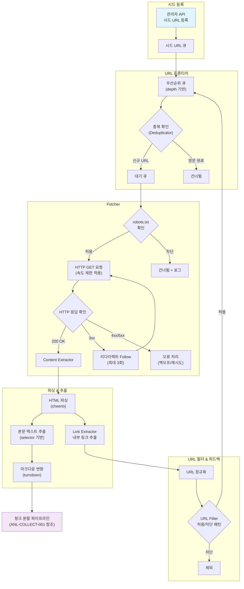
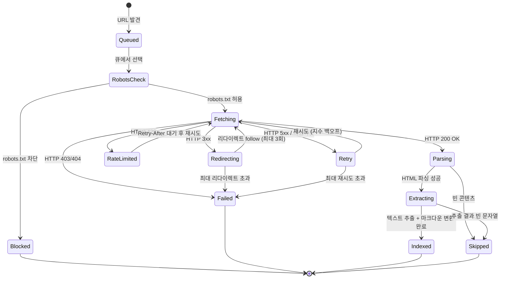

# 크롤링 정책 분석서

> Crawling Policy Analysis

---

## 문서 정보

| 항목 | 내용 |
|------|------|
| 프로젝트명 | API Intelligence Engine |
| 문서 번호 | CPA-001 |
| 버전 | 1.1.0 |
| 작성일 | 2026-02-23 |
| 작성자 | 조훈상 |
| 관련 문서 | API수집시스템분석서 (ANL-COLLECT-001), 유스케이스명세서 (UC-007) |

---

## 변경 이력

| 버전 | 날짜 | 변경 내용 | 작성자 | 승인자 |
|------|------|-----------|--------|--------|
| 1.0.0 | 2026-02-23 | 초안 작성 | 조훈상 | 조훈상 |
| 1.1 | 2026-02-23 | 크롤링을 보조 수집 채널로 재위치 — Context7 API 주력 전환에 따른 범위 조정 | 조훈상 | 조훈상 |

---

## 목차

1. [개요](#1-개요)
2. [크롤링 아키텍처](#2-크롤링-아키텍처)
3. [URL 발견 정책](#3-url-발견-정책)
4. [범위 제한 정책](#4-범위-제한-정책)
5. [크롤링 예의 정책 (Politeness)](#5-크롤링-예의-정책-politeness)
6. [프로바이더별 맞춤 정책](#6-프로바이더별-맞춤-정책)
7. [콘텐츠 추출 정책](#7-콘텐츠-추출-정책)
8. [법적/윤리적 고려사항](#8-법적윤리적-고려사항)
9. [모니터링 및 품질 관리](#9-모니터링-및-품질-관리)
10. [부록 A: URL 정규화 알고리즘 의사코드](#부록-a-url-정규화-알고리즘-의사코드)
11. [부록 B: 크롤링 상태 다이어그램](#부록-b-크롤링-상태-다이어그램)

---

## 1. 개요

### 1.1 목적

> **중요:** API Intelligence Engine의 주력 문서 수집 채널은 **Context7 API**이다. 본 문서는 Context7에 등록되지 않은 프로바이더(국내 API, 신규/마이너 API 등)에 대한 **보조 크롤링 정책**을 정의한다. 전체 수집 전략은 API수집시스템분석서(ANL-COLLECT-001)를 참조한다.

본 문서는 API Intelligence Engine의 데이터 수집 파이프라인에서 **크롤링 정책의 구체적 규칙, 범위 제한, 법적 고려사항, 프로바이더별 맞춤 설정**을 정의한다. API수집시스템분석서(ANL-COLLECT-001)에서 정의한 크롤링 전략의 상세 실행 규칙을 명시하며, 유스케이스 UC-007(관리자 문서 인덱싱(Indexing) 실행)의 구현 지침을 제공한다.

### 1.2 범위

- **포함**: 시드 URL 등록 정책, 링크 탐색 규칙, URL 정규화, 범위 제한(경로/콘텐츠 유형/깊이/페이지 수), 예의 정책(Politeness), 프로바이더별 맞춤 설정, 콘텐츠 추출 규칙, 법적/윤리적 고려사항, 모니터링 기준
- **제외**: 청크(Chunk) 분할 전략, 임베딩 생성 전략, 벡터 DB 저장 전략 (ANL-COLLECT-001 참조)

### 1.3 수집 방식

**수동 시드 URL 등록 + 링크 크롤링(자동 탐색) 하이브리드** 방식을 채택한다.

- 관리자가 프로바이더별 루트 문서 URL을 수동 등록한다.
- 등록된 시드 URL로부터 BFS(너비 우선 탐색) 기반으로 내부 링크를 자동 탐색한다.
- 허용/차단 경로 패턴으로 탐색 범위를 제어한다.

### 1.4 규모 전제

| 단계 | 프로바이더 수 | 카테고리 | 예상 페이지 수 |
|------|-------------|---------|--------------|
| MVP | 15개 | 5개 | ~3,000 |
| 확장 (v2) | 100개+ | 10개+ | ~20,000+ |

### 1.5 적용 범위

| 수집 채널 | 역할 | 본 문서 적용 |
|-----------|------|-------------|
| Context7 API | 주력 (글로벌 API ~70%) | 폴백 정책만 적용 |
| 직접 크롤링 | 보조 (국내/마이너 API ~30%) | **전체 정책 적용** |

#### 직접 크롤링 대상 프로바이더 (MVP)

| # | 프로바이더 | 카테고리 | 크롤링 사유 |
|---|-----------|----------|------------|
| 1 | 토스페이먼츠 | 결제 API | Context7 미등록 (국내 서비스) |
| 2 | AWS SES | 메시징 API | Context7 등록 여부 확인 필요 |
| 3 | (추가 예정) | - | Context7 미지원 확인 시 추가 |

> MVP 시작 시 각 프로바이더에 대해 Context7 `resolve-library-id`를 호출하여 지원 여부를 확인하고, 미지원 프로바이더만 본 문서의 크롤링 정책을 적용한다.

---

## 2. 크롤링 아키텍처

### 2.1 전체 크롤링 파이프라인



### 2.2 핵심 컴포넌트

| 컴포넌트 | 역할 | MVP 구현 | 확장 (v2) |
|----------|------|---------|----------|
| **URL 프론티어** | 크롤링 대상 URL 관리, depth 기반 우선순위 큐 | `Map`/`Set` 기반 in-memory | Redis Sorted Set |
| **Fetcher** | HTTP GET 요청 수행, 응답 검증 | `fetch` API + cheerio | Playwright (SPA 대응) |
| **Content Extractor** | HTML에서 본문 텍스트 추출 | cheerio selector 기반 | + Readability.js |
| **Markdown Converter** | 추출된 HTML을 마크다운으로 변환 | turndown 라이브러리 | turndown + 커스텀 플러그인 |
| **Link Extractor** | 페이지 내 `<a>` 태그에서 링크 추출 및 정규화 | cheerio 기반 href 파싱 | + sitemap.xml 파싱 |
| **URL Filter** | 허용/차단 규칙 적용 (glob 패턴 매칭) | minimatch 라이브러리 | + 정규식 지원 |
| **Deduplicator** | 방문 URL 중복 방지 | `Set` 기반 in-memory | Redis Set + Bloom Filter |
| **Rate Limiter** | 도메인별 요청 속도 제한 | `setTimeout` + 카운터 | Bottleneck 라이브러리 |

---

## 3. URL 발견 정책

### 3.1 시드 URL 등록

관리자 API를 통해 프로바이더별 루트 문서 URL을 수동 등록한다.

#### 등록 데이터 구조

```typescript
interface SeedConfig {
  provider_id: string;          // 프로바이더 UUID
  seed_url: string;             // 루트 문서 URL
  allowed_path_patterns: string[]; // 허용 경로 glob 패턴
  blocked_path_patterns: string[]; // 차단 경로 glob 패턴
  max_depth: number;            // 최대 탐색 깊이 (1~5, 기본 3)
  max_pages: number;            // 최대 수집 페이지 수 (기본 200)
  request_delay_ms: number;     // 요청 간 딜레이 (ms)
  custom_selectors?: {
    content: string;            // 본문 CSS 셀렉터
    remove: string[];           // 제거 대상 CSS 셀렉터
  };
  sitemap_url?: string;         // sitemap.xml URL (선택)
  spa_rendering: boolean;       // SPA 렌더링 필요 여부
}
```

#### 등록 예시

```json
{
  "provider_id": "openai-uuid",
  "seed_url": "https://platform.openai.com/docs",
  "allowed_path_patterns": ["/docs/**"],
  "blocked_path_patterns": ["/docs/changelog/**", "/docs/deprecations/**"],
  "max_depth": 3,
  "max_pages": 200,
  "request_delay_ms": 1500,
  "custom_selectors": {
    "content": "article.docs-content",
    "remove": [".sidebar", ".nav-header", ".feedback-widget"]
  },
  "sitemap_url": null,
  "spa_rendering": false
}
```

### 3.2 링크 탐색 규칙

| # | 규칙 | 설명 |
|---|------|------|
| 1 | **BFS 기반 탐색** | 너비 우선 탐색으로 시드 URL에서 가까운 페이지부터 수집한다 |
| 2 | **동일 도메인 제한** | 시드 URL과 동일한 도메인(hostname)의 내부 링크만 follow한다 |
| 3 | **깊이 제한** | 기본 3단계, 프로바이더별 커스텀 가능 (1~5) |
| 4 | **앵커 제거** | `#fragment` 부분을 제거한 후 URL 정규화한다 |
| 5 | **쿼리 파라미터 제거** | UTM, ref 등 트래킹 파라미터를 제거한다 |
| 6 | **제외 링크 유형** | `javascript:`, `mailto:`, `tel:`, `data:` 스킴 링크를 제외한다 |
| 7 | **fragment-only 제외** | `#section` 형태의 same-page 앵커 링크를 제외한다 |
| 8 | **리다이렉트 추적** | 3xx 리다이렉트를 최대 3회까지 follow한다 |

### 3.3 URL 정규화 규칙

| # | 규칙 | Before | After |
|---|------|--------|-------|
| 1 | 프로토콜 통일 | `http://docs.stripe.com/api` | `https://docs.stripe.com/api` |
| 2 | 트레일링 슬래시 제거 | `https://docs.stripe.com/api/` | `https://docs.stripe.com/api` |
| 3 | 쿼리 파라미터 제거 | `https://docs.stripe.com/api?utm_source=nav` | `https://docs.stripe.com/api` |
| 4 | 앵커(#fragment) 제거 | `https://docs.stripe.com/api#overview` | `https://docs.stripe.com/api` |
| 5 | `www.` 서브도메인 제거 | `https://www.docs.stripe.com/api` | `https://docs.stripe.com/api` |
| 6 | 중복 슬래시 제거 | `https://docs.stripe.com//api///charges` | `https://docs.stripe.com/api/charges` |
| 7 | URL 디코딩 | `https://docs.stripe.com/api/%E4%B8%AD` | `https://docs.stripe.com/api/中` |
| 8 | 호스트명 소문자 변환 | `https://Docs.Stripe.COM/api` | `https://docs.stripe.com/api` |
| 9 | 기본 포트 제거 | `https://docs.stripe.com:443/api` | `https://docs.stripe.com/api` |

---

## 4. 범위 제한 정책

### 4.1 경로 패턴 필터

허용/차단 경로 패턴은 glob 문법(`minimatch` 라이브러리)을 사용하며, 차단 패턴이 허용 패턴보다 우선한다.

#### 패턴 적용 순서

1. URL이 `blocked_path_patterns` 중 하나에 매칭되면 **제외**
2. URL이 `allowed_path_patterns` 중 하나에 매칭되면 **허용**
3. 어느 패턴에도 매칭되지 않으면 **제외**

#### 프로바이더별 경로 패턴 예시

| 프로바이더 | 허용 패턴 | 차단 패턴 | 근거 |
|-----------|----------|----------|------|
| OpenAI | `/docs/**` | `/docs/changelog/**`, `/docs/deprecations/**` | 문서 영역만 허용, 변경 이력 제외 |
| Stripe | `/docs/api/**`, `/docs/payments/**` | `/docs/changelog/**`, `/docs/upgrades/**` | API 레퍼런스 + 가이드, 변경 로그 제외 |
| Anthropic | `/en/docs/**` | `/en/docs/about-claude/models-overview/**` | 기술 문서 영역만, 모델 비교 목록 제외 |
| Firebase | `/docs/auth/**` | `/docs/auth/release-notes/**` | Auth 문서만, 릴리스 노트 제외 |

### 4.2 콘텐츠 유형 필터

| Content-Type | 처리 | 근거 |
|-------------|------|------|
| `text/html` | **수집** | 주 수집 대상 |
| `text/plain` | **수집** | 일부 API 문서가 텍스트로 제공됨 |
| `application/json` | **조건부 수집** | OpenAPI/Swagger 스펙이면 수집, 아니면 제외 |
| `application/pdf` | **MVP 제외** (P2) | v2에서 PDF 파서 추가 시 수집 |
| `image/*` | **제외** | 이미지 파일은 수집하지 않음 |
| `video/*` | **제외** | 동영상 파일은 수집하지 않음 |
| `application/zip` | **제외** | 아카이브 파일은 수집하지 않음 |
| `application/octet-stream` | **제외** | 바이너리 파일은 수집하지 않음 |

### 4.3 페이지 수 제한

| 제한 항목 | 기본값 | 오버라이드 | 초과 시 동작 |
|----------|-------|----------|------------|
| 프로바이더당 최대 페이지 | 200 | `max_pages` 필드로 조정 (1~500) | 경고 로그 출력 + 해당 프로바이더 크롤링 중단 |
| 전체 크롤링 세션 최대 페이지 | 5,000 | 환경변수로 조정 | 경고 로그 출력 + 전체 크롤링 세션 중단 |
| 단일 페이지 최대 크기 | 5MB | 변경 불가 | 해당 페이지 건너뜀 + 경고 로그 |

### 4.4 깊이 제한

| 깊이 (Depth) | 의미 | 우선순위 | 예시 |
|-------------|------|---------|------|
| 0 | 시드 URL 자체 | 최고 | `https://platform.openai.com/docs` |
| 1 | 시드에서 직접 링크된 페이지 | 높음 | `https://platform.openai.com/docs/guides` |
| 2 | depth 1에서 링크된 페이지 | 보통 | `https://platform.openai.com/docs/guides/text-generation` |
| 3 | depth 2에서 링크된 페이지 (기본 최대) | 낮음 | `https://platform.openai.com/docs/guides/text-generation/chat-completions` |
| 4~5 | 확장 깊이 (프로바이더별 설정) | 최저 | 깊은 계층 구조의 문서에 한정 |

- 기본 최대 깊이: **3**
- 프로바이더별 오버라이드 범위: **1~5**
- 같은 depth 내에서는 발견 순서(FIFO)로 처리한다.

---

## 5. 크롤링 예의 정책 (Politeness)

### 5.1 robots.txt 준수

| 항목 | 정책 |
|------|------|
| **파싱 시점** | 각 도메인 첫 크롤링 시 `robots.txt`를 요청하여 파싱한다 |
| **캐싱** | 파싱 결과를 24시간 동안 in-memory 캐싱한다 |
| **Disallow 경로** | `Disallow`로 지정된 경로는 자동으로 제외한다 |
| **Crawl-delay** | `Crawl-delay` 디렉티브가 있으면 해당 값을 최소 딜레이로 사용한다 |
| **User-Agent** | `APIIntelBot/1.0`을 User-Agent로 사용한다 |
| **robots.txt 부재** | `robots.txt`가 없으면(404) 제한 없이 크롤링한다 (기본 딜레이는 적용) |
| **robots.txt 오류** | 5xx 응답 시 보수적으로 동작하여 기본 2초 딜레이를 적용한다 |

### 5.2 요청 속도 제한

| 정책 | 값 | 근거 |
|------|---|------|
| 동일 도메인 요청 간 딜레이 | 1,000~2,000ms (랜덤) | 서버 부하 방지, 봇 탐지 회피 |
| 동시 도메인 수 | 3 | $100/월 예산 내 리소스 사용 최적화 |
| 프로바이더당 동시 요청 | 1 | 단일 도메인에 대한 부하 최소화 |
| 전체 동시 요청 | 3 | Railway 무료 티어 리소스 제한 고려 |
| 시간당 최대 요청 | 1,000 | 전체 시스템 보호를 위한 상한선 |
| 일일 최대 요청 | 10,000 | MVP 규모에서 충분한 상한선 |

> **계산 근거**: 15개 프로바이더 x 200페이지 = 3,000페이지. 1.5초 평균 딜레이 기준으로 약 75분 소요. 주간 1회 전체 인덱싱(Indexing)에 충분하다.

### 5.3 HTTP 헤더 정책

```http
User-Agent: APIIntelBot/1.0 (+https://api-intel.vercel.app/bot)
Accept: text/html, application/xhtml+xml, application/xml;q=0.9, */*;q=0.8
Accept-Language: en-US,en;q=0.9,ko;q=0.8
Accept-Encoding: gzip, deflate, br
If-Modified-Since: {last_crawled_date}
If-None-Match: {stored_etag}
Connection: keep-alive
```

| 헤더 | 목적 |
|------|------|
| `User-Agent` | 봇 식별 및 연락처 제공 |
| `Accept` | HTML 문서 우선 요청 |
| `Accept-Language` | 영문 우선, 한국어 문서도 허용 |
| `Accept-Encoding` | 압축 전송으로 대역폭 절약 |
| `If-Modified-Since` | 변경되지 않은 문서는 304 응답으로 건너뜀 |
| `If-None-Match` | ETag 기반 캐싱으로 불필요한 재수집 방지 |

### 5.4 오류 시 백오프 정책

| HTTP 상태 | 대응 | 재시도 | 비고 |
|----------|------|-------|------|
| **200 OK** | 정상 처리 | - | - |
| **301/302** | 리다이렉트 follow | 최대 3회 | 최종 URL을 정규화하여 저장 |
| **304 Not Modified** | 건너뜀 (캐시 유효) | - | 기존 데이터 유지 |
| **403 Forbidden** | 해당 URL 영구 제외 | 재시도 없음 | 경고 로그 출력, `blocked_urls` 테이블에 기록 |
| **404 Not Found** | 해당 URL 제외 | 재시도 없음 | 기존 데이터가 있으면 삭제 표시 |
| **429 Too Many Requests** | `Retry-After` 헤더 준수 | 1회 | `Retry-After` 없으면 60초 대기 후 재시도 |
| **500 Internal Server Error** | 지수 백오프 | 2회 | 30초 → 60초 후 재시도 |
| **502/504 Gateway Error** | 지수 백오프 | 2회 | 30초 → 60초 후 재시도 |
| **503 Service Unavailable** | 지수 백오프 | 3회 | 30초 → 60초 → 120초 후 재시도 |
| **DNS/Connection 실패** | 대기 후 재시도 | 1회 | 30초 대기 후 재시도, 실패 시 건너뜀 |
| **타임아웃 (30초)** | 대기 후 재시도 | 1회 | 30초 대기 후 재시도, 실패 시 건너뜀 |

---

## 6. 프로바이더별 맞춤 정책

### 6.1 정책 설정 데이터 구조

```json
{
  "provider_id": "uuid",
  "seed_urls": ["https://platform.openai.com/docs"],
  "allowed_path_patterns": ["/docs/**"],
  "blocked_path_patterns": ["/docs/changelog/**", "/blog/**"],
  "max_depth": 3,
  "max_pages": 200,
  "request_delay_ms": 1500,
  "custom_selectors": {
    "content": "article.docs-content",
    "remove": [".sidebar", ".nav-header"]
  },
  "sitemap_url": null,
  "spa_rendering": false
}
```

#### 필드 설명

| 필드 | 타입 | 필수 | 설명 |
|------|------|------|------|
| `provider_id` | UUID | O | 프로바이더 고유 식별자 |
| `seed_urls` | string[] | O | 시드 URL 목록 (1개 이상) |
| `allowed_path_patterns` | string[] | O | 허용 경로 glob 패턴 |
| `blocked_path_patterns` | string[] | X | 차단 경로 glob 패턴 (기본: 빈 배열) |
| `max_depth` | number | X | 최대 탐색 깊이 (기본: 3, 범위: 1~5) |
| `max_pages` | number | X | 최대 수집 페이지 수 (기본: 200, 범위: 1~500) |
| `request_delay_ms` | number | X | 요청 간 딜레이 ms (기본: 1500, 범위: 1000~5000) |
| `custom_selectors.content` | string | X | 본문 영역 CSS 셀렉터 |
| `custom_selectors.remove` | string[] | X | 제거 대상 CSS 셀렉터 목록 |
| `sitemap_url` | string | X | sitemap.xml URL (v2 예정) |
| `spa_rendering` | boolean | X | SPA 렌더링 필요 여부 (기본: false, v2 예정) |

### 6.2 MVP 프로바이더별 정책 테이블

#### 카테고리 1: AI/LLM API

| 항목 | OpenAI | Anthropic | Google Gemini |
|------|--------|-----------|---------------|
| **시드 URL** | `https://platform.openai.com/docs` | `https://docs.anthropic.com/en/docs` | `https://ai.google.dev/gemini-api/docs` |
| **허용 경로** | `/docs/**` | `/en/docs/**` | `/gemini-api/docs/**` |
| **차단 경로** | `/docs/changelog/**`, `/docs/deprecations/**` | `/en/docs/about-claude/models-overview/**` | `/gemini-api/docs/changelog/**` |
| **본문 셀렉터** | `article.docs-content` | `article.prose` | `article.devsite-article-body` |
| **제거 셀렉터** | `.sidebar`, `.nav-header`, `.feedback-widget` | `.sidebar`, `.header-nav`, `.toc` | `.devsite-nav`, `.devsite-toc`, `.devsite-banner` |
| **max_depth** | 3 | 3 | 3 |
| **max_pages** | 200 | 150 | 200 |
| **딜레이 (ms)** | 1500 | 1500 | 2000 |
| **SPA 렌더링** | false | false | false |
| **비고** | Context7 주력, 폴백용 설정 | Context7 주력, 폴백용 설정 | Context7 주력, 폴백용 설정 |

#### 카테고리 2: 결제 API

| 항목 | Stripe | 토스페이먼츠 | PayPal |
|------|--------|------------|--------|
| **시드 URL** | `https://docs.stripe.com/api` | `https://docs.tosspayments.com/reference` | `https://developer.paypal.com/docs/api/overview` |
| **허용 경로** | `/api/**`, `/payments/**`, `/connect/**` | `/reference/**`, `/guides/**` | `/docs/api/**`, `/docs/checkout/**` |
| **차단 경로** | `/changelog/**`, `/upgrades/**`, `/cli/**` | `/reference/release-notes/**` | `/docs/api/release-notes/**`, `/docs/archive/**` |
| **본문 셀렉터** | `article.content` | `.docs-content` | `.contentColumn` |
| **제거 셀렉터** | `.sidebar`, `.feedback`, `.method-list-group` | `.sidebar`, `.toc`, `.gnb` | `.leftNav`, `.feedback-section`, `.breadcrumb` |
| **max_depth** | 4 | 3 | 3 |
| **max_pages** | 300 | 150 | 200 |
| **딜레이 (ms)** | 1500 | 1500 | 2000 |
| **SPA 렌더링** | false | false | false |
| **비고** | Context7 주력, 폴백용 설정 | 직접 크롤링 대상 (Context7 미등록, 국내 서비스) | Context7 주력, 폴백용 설정 |

#### 카테고리 3: 인증 API

| 항목 | Auth0 | Firebase Auth | Clerk |
|------|-------|--------------|-------|
| **시드 URL** | `https://auth0.com/docs` | `https://firebase.google.com/docs/auth` | `https://clerk.com/docs` |
| **허용 경로** | `/docs/**` | `/docs/auth/**` | `/docs/**` |
| **차단 경로** | `/docs/videos/**`, `/docs/quickstarts/**` | `/docs/auth/release-notes/**` | `/docs/changelog/**`, `/docs/upgrade-guides/**` |
| **본문 셀렉터** | `article.content-area` | `article.devsite-article-body` | `main article` |
| **제거 셀렉터** | `.sidebar`, `.breadcrumbs`, `.edit-page` | `.devsite-nav`, `.devsite-toc`, `.devsite-banner` | `.sidebar`, `.toc`, `.breadcrumb` |
| **max_depth** | 3 | 3 | 3 |
| **max_pages** | 200 | 150 | 150 |
| **딜레이 (ms)** | 1500 | 2000 | 1500 |
| **SPA 렌더링** | false | false | false |
| **비고** | Context7 주력, 폴백용 설정 | Context7 주력, 폴백용 설정 | Context7 주력, 폴백용 설정 |

#### 카테고리 4: 메시징/이메일 API

| 항목 | Twilio | SendGrid | AWS SES |
|------|--------|----------|---------|
| **시드 URL** | `https://www.twilio.com/docs/messaging` | `https://docs.sendgrid.com/for-developers` | `https://docs.aws.amazon.com/ses/latest/dg` |
| **허용 경로** | `/docs/messaging/**`, `/docs/sms/**`, `/docs/voice/**` | `/for-developers/**` | `/ses/latest/dg/**`, `/ses/latest/APIReference/**` |
| **차단 경로** | `/docs/messaging/changelog/**`, `/docs/tutorials/**` | `/for-developers/release-notes/**` | `/ses/latest/dg/release-notes/**` |
| **본문 셀렉터** | `article.css-0` | `main.content` | `#main-content` |
| **제거 셀렉터** | `.sidebar`, `.breadcrumb`, `.feedback` | `.sidebar`, `.toc`, `.breadcrumb` | `#left-nav`, `.breadcrumb`, `#feedback` |
| **max_depth** | 3 | 3 | 3 |
| **max_pages** | 200 | 150 | 200 |
| **딜레이 (ms)** | 1500 | 1500 | 2000 |
| **SPA 렌더링** | false | false | false |
| **비고** | Context7 주력, 폴백용 설정 | Context7 주력, 폴백용 설정 | 직접 크롤링 대상 (Context7 등록 여부 확인 필요) |

#### 카테고리 5: 벡터 DB

| 항목 | Pinecone | Qdrant | Weaviate |
|------|----------|--------|----------|
| **시드 URL** | `https://docs.pinecone.io/guides` | `https://qdrant.tech/documentation` | `https://weaviate.io/developers/weaviate` |
| **허용 경로** | `/guides/**`, `/reference/**` | `/documentation/**` | `/developers/weaviate/**` |
| **차단 경로** | `/guides/release-notes/**` | `/documentation/changelog/**` | `/developers/weaviate/release-notes/**` |
| **본문 셀렉터** | `article.rm-Article` | `.docs-content` | `article.docs-content` |
| **제거 셀렉터** | `.sidebar`, `.rm-TableOfContents`, `.rm-Feedback` | `.sidebar`, `.toc`, `.breadcrumb` | `.sidebar`, `.toc`, `.breadcrumb`, `.pagination` |
| **max_depth** | 3 | 3 | 3 |
| **max_pages** | 150 | 150 | 150 |
| **딜레이 (ms)** | 1500 | 1500 | 1500 |
| **SPA 렌더링** | false | false | false |
| **비고** | Context7 주력, 폴백용 설정 | Context7 주력, 폴백용 설정 | Context7 주력, 폴백용 설정 |

---

## 7. 콘텐츠 추출 정책

### 7.1 HTML 파싱 전략

본문 텍스트 추출 시 다음 우선순위를 따른다.

| 우선순위 | 전략 | 설명 | 예시 |
|---------|------|------|------|
| **1순위** | 프로바이더별 `custom_selectors` | 사전 정의된 CSS 셀렉터로 정확한 본문 영역을 추출한다 | `article.docs-content` |
| **2순위** | 시맨틱 HTML 태그 | `<article>`, `<main>` 태그를 탐색한다 | `article`, `main` |
| **3순위** | 일반 패턴 | 주요 문서 프레임워크에서 공통적으로 사용하는 클래스/ID를 탐색한다 | `.content`, `.docs-body`, `#content`, `.markdown-body` |
| **4순위 (Fallback)** | `<body>` 태그 전체 | nav, header, footer, aside를 제거한 나머지를 추출한다 | `body` (정제 후) |

#### 추출 프로세스 의사코드

```
function extractContent(html, providerConfig):
  doc = cheerio.load(html)

  // 1순위: custom_selectors
  if providerConfig.custom_selectors?.content:
    content = doc(providerConfig.custom_selectors.content)
    if content.length > 0:
      removeUnwantedElements(content, providerConfig)
      return content.html()

  // 2순위: 시맨틱 태그
  for tag in ['article', 'main', '[role="main"]']:
    content = doc(tag)
    if content.length > 0:
      removeUnwantedElements(content, providerConfig)
      return content.html()

  // 3순위: 일반 패턴
  for selector in ['.content', '.docs-body', '#content', '.markdown-body']:
    content = doc(selector)
    if content.length > 0:
      removeUnwantedElements(content, providerConfig)
      return content.html()

  // 4순위: Fallback
  content = doc('body')
  removeUnwantedElements(content, providerConfig)
  return content.html()
```

### 7.2 제거 대상 요소

#### 항상 제거하는 요소 (전역)

| 카테고리 | 대상 요소 |
|---------|----------|
| **스크립트/스타일** | `script`, `style`, `noscript`, `iframe`, `object`, `embed` |
| **레이아웃** | `nav`, `header`, `footer`, `aside` |
| **광고** | `.ad`, `.ads`, `.advertisement`, `[data-ad]`, `[data-adunit]` |
| **네비게이션** | `.sidebar`, `.toc`, `.table-of-contents`, `.breadcrumb`, `.breadcrumbs`, `.pagination`, `.pager` |
| **CTA/배너** | `.cta`, `.banner`, `.announcement`, `.alert-banner`, `.promo` |
| **피드백 위젯** | `.feedback`, `.feedback-widget`, `.thumbs-up-down`, `.was-helpful` |
| **쿠키 동의** | `.cookie-banner`, `.cookie-consent`, `.gdpr-banner` |

#### 프로바이더별 추가 제거 요소

`custom_selectors.remove` 배열에 정의된 셀렉터를 추가로 제거한다. (6.2절 각 프로바이더의 "제거 셀렉터" 참조)

### 7.3 마크다운 변환 규칙

turndown 라이브러리를 사용하여 HTML을 마크다운으로 변환하며, 다음 규칙을 적용한다.

| # | 규칙 | 처리 방법 |
|---|------|----------|
| 1 | **코드 블록 보존** | `<pre><code>` 태그를 마크다운 펜스(` ``` `)로 변환한다. 언어 힌트(`class="language-*"`)가 있으면 보존한다 |
| 2 | **인라인 코드 보존** | `<code>` 태그를 백틱(`` ` ``)으로 변환한다 |
| 3 | **테이블 구조 보존** | `<table>` 태그를 마크다운 테이블로 변환한다. 복잡한 테이블(colspan, rowspan)은 텍스트로 평탄화한다 |
| 4 | **헤딩 보존** | `<h1>`~`<h6>`를 마크다운 `#`~`######`으로 변환한다 |
| 5 | **리스트 보존** | `<ul>`, `<ol>` 태그를 마크다운 리스트로 변환한다. 중첩 리스트도 보존한다 |
| 6 | **이미지 처리** | `` 태그의 `alt` 텍스트만 유지하고 이미지 자체는 제거한다. 형식: `[이미지: alt 텍스트]` |
| 7 | **외부 링크 처리** | 링크 텍스트만 유지하고 URL은 제거한다. 형식: `링크텍스트` |
| 8 | **내부 링크 처리** | 같은 문서 내 앵커 링크는 텍스트만 유지한다 |
| 9 | **강조 보존** | `<strong>`, `<em>` 태그를 마크다운 `**`, `*`로 변환한다 |
| 10 | **빈 요소 제거** | 내용 없는 `<div>`, `<span>`, `<p>` 태그를 제거한다 |
| 11 | **연속 빈 줄 정리** | 3줄 이상 연속된 빈 줄을 2줄로 축소한다 |

---

## 8. 법적/윤리적 고려사항

### 8.1 저작권

| 원칙 | 세부 사항 |
|------|----------|
| **원문 재배포 금지** | 공식 문서 원문을 그대로 저장하거나 재배포하지 않는다 |
| **청크(Chunk) 저장** | 문서를 최대 500토큰 단위의 청크(Chunk)로 분할하여 벡터 임베딩과 함께 저장한다 |
| **미리보기 제한** | PostgreSQL에는 각 청크(Chunk)의 미리보기(최대 500자)만 저장한다 |
| **원문 링크 제공** | 사용자에게는 검색 결과로 원문 링크와 짧은 인용문(200자 이내)만 표시한다 |
| **벡터 임베딩 저장** | 벡터 DB에는 임베딩 벡터만 저장하며, 원문 텍스트를 메타데이터로 포함하지 않는다 |
| **캐시 갱신** | 크롤링 데이터는 주간 단위로 갱신하며, 이전 버전은 덮어쓴다 |

### 8.2 이용약관 준수

| # | 정책 | 세부 사항 |
|---|------|----------|
| 1 | **ToS 사전 확인** | 신규 프로바이더 추가 시 이용약관(Terms of Service)에서 크롤링/스크래핑 관련 조항을 확인한다 |
| 2 | **크롤링 금지 사이트 제외** | 이용약관에 자동 수집을 명시적으로 금지한 사이트는 수집 대상에서 제외한다 |
| 3 | **API 우선 사용** | 공식 API를 통해 문서를 제공하는 프로바이더는 API를 우선 사용한다 (예: GitHub REST API) |
| 4 | **robots.txt 준수** | robots.txt 디렉티브를 항상 준수한다 (5.1절 참조) |
| 5 | **연락처 제공** | User-Agent 헤더에 봇 정보 페이지 URL을 포함하여 사이트 운영자가 연락할 수 있게 한다 |
| 6 | **삭제 요청 대응** | 프로바이더로부터 삭제 요청이 있으면 48시간 내 해당 데이터를 삭제한다 |

### 8.3 개인정보

| # | 정책 | 세부 사항 |
|---|------|----------|
| 1 | **공개 문서만 수집** | 인증이 필요한 페이지, 로그인 뒤 콘텐츠는 수집하지 않는다 |
| 2 | **개인정보 미수집** | 사용자 프로필, 포럼 게시물, 커뮤니티 댓글 등 개인정보 포함 가능 영역을 수집하지 않는다 |
| 3 | **블로그/커뮤니티 제외** | 공식 문서만 수집하며, 블로그, 포럼, Stack Overflow 등은 대상에서 제외한다 |
| 4 | **이메일 주소 미저장** | 크롤링 과정에서 발견되는 이메일 주소는 저장하지 않는다 |
| 5 | **쿠키 미사용** | 크롤링 시 쿠키를 저장하거나 전송하지 않는다 |

---

## 9. 모니터링 및 품질 관리

### 9.1 크롤링 메트릭

| 메트릭 | 설명 | 알림 조건 | 알림 수단 |
|--------|------|----------|----------|
| **크롤링 성공률** (%) | 전체 요청 중 200 OK 응답 비율 | 90% 미만 | 로그 경고 + Slack (v2) |
| **프로바이더별 페이지 수** | 인덱싱(Indexing) 완료된 프로바이더별 페이지 수 | 이전 대비 50% 이상 증감 | 로그 경고 |
| **평균 응답 시간** (ms) | 도메인별 HTTP 응답 시간 평균 | 5,000ms 초과 | 로그 경고 |
| **오류율** (%) | 4xx + 5xx 응답 비율 | 20% 초과 | 로그 경고 + Slack (v2) |
| **빈 콘텐츠 비율** (%) | 본문 추출 결과가 빈 문자열인 비율 | 10% 초과 | 로그 경고 |
| **크롤링 소요 시간** | 전체 인덱싱(Indexing) 세션 소요 시간 | 3시간 초과 | 로그 경고 |
| **재시도 비율** (%) | 재시도가 필요했던 요청의 비율 | 15% 초과 | 로그 경고 |

### 9.2 콘텐츠 품질 지표

| 지표 | 정상 기준 | 이상 시 대응 |
|------|----------|------------|
| **평균 청크(Chunk) 토큰 수** | 200~600 범위 | 범위 밖이면 파서 셀렉터 점검 및 청크(Chunk) 분할 로직 검토 |
| **빈 청크(Chunk) 비율** | 5% 이하 | 초과 시 콘텐츠 추출 로직 점검 (셀렉터 변경 가능성) |
| **중복 청크(Chunk) 비율** | 10% 이하 | 초과 시 중복 제거 로직 강화 (URL 정규화, 콘텐츠 해시 비교) |
| **최소 청크(Chunk) 토큰 수** | 50 이상 | 50 미만 청크(Chunk)는 인접 청크(Chunk)와 병합 |
| **페이지당 청크(Chunk) 수** | 1~20 | 범위 밖이면 파서 또는 분할 전략 점검 |

### 9.3 변경 감지 리포트

주간 인덱싱(Indexing) 실행 후 프로바이더별 변경 사항을 요약하여 로그로 기록한다.

| 리포트 항목 | 설명 |
|------------|------|
| **신규 페이지 수** | 이전 인덱싱(Indexing)에 없었던 새 URL 수 |
| **변경 페이지 수** | 콘텐츠 해시가 변경된 기존 URL 수 |
| **삭제 감지 수** | 이전에 존재했으나 404 또는 접근 불가가 된 URL 수 |
| **총 페이지 수** | 프로바이더별 현재 인덱싱(Indexing)된 전체 페이지 수 |
| **변경 비율** | (신규 + 변경 + 삭제) / 전체 x 100 |

#### 리포트 형식 (로그 출력)

```
[2026-02-23 03:00:00] [CRAWL_REPORT] Provider: OpenAI
  - Total Pages: 187
  - New: 5, Updated: 12, Deleted: 2
  - Change Rate: 10.2%
  - Success Rate: 98.4%
  - Avg Response Time: 340ms
  - Duration: 4m 32s
```

---

## 부록 A: URL 정규화 알고리즘 의사코드

```
function normalizeUrl(rawUrl: string, baseUrl: string): string | null {
  // 0. 빈 URL, javascript:, mailto:, tel:, data: 스킴 제외
  if (!rawUrl || rawUrl.startsWith('javascript:')
      || rawUrl.startsWith('mailto:') || rawUrl.startsWith('tel:')
      || rawUrl.startsWith('data:')) {
    return null
  }

  // 1. 상대 URL을 baseUrl 기준으로 절대 URL로 변환
  let url = new URL(rawUrl, baseUrl)

  // 2. HTTPS 프로토콜로 통일
  url.protocol = 'https:'

  // 3. www. 접두사 제거 (선택적)
  url.hostname = url.hostname.replace(/^www\./, '')

  // 4. 호스트명 소문자 변환
  url.hostname = url.hostname.toLowerCase()

  // 5. 기본 포트 제거 (443)
  if (url.port === '443') {
    url.port = ''
  }

  // 6. 트레일링 슬래시 제거
  url.pathname = url.pathname.replace(/\/+$/, '') || '/'

  // 7. 중복 슬래시 제거
  url.pathname = url.pathname.replace(/\/+/g, '/')

  // 8. 쿼리 파라미터 제거
  url.search = ''

  // 9. 해시/프래그먼트 제거
  url.hash = ''

  // 10. URL 디코딩 후 재인코딩 (정규화)
  url.pathname = decodeURIComponent(url.pathname)

  return url.toString()
}
```

---

## 부록 B: 크롤링 상태 다이어그램



---

> **문서 끝** | CPA-001 v1.1.0 | 2026-02-23 | 조훈상
