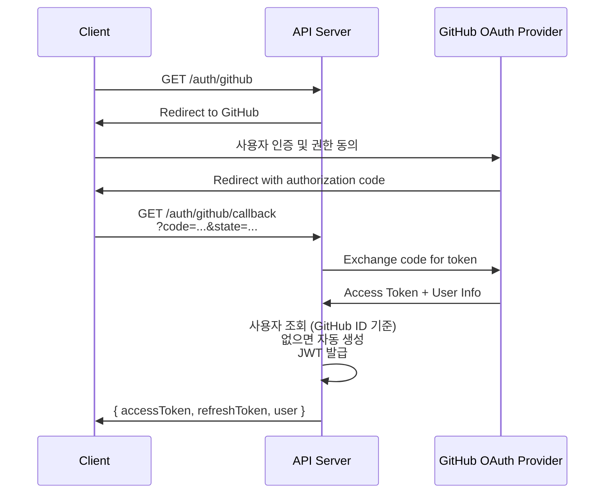

# API 설계서

| 항목 | 내용 |
|------|------|
| **프로젝트명** | API Intelligence Engine |
| **문서 버전** | v1.0 |
| **작성일** | 2026-02-23 |
| **작성자** | 조훈상 / 기획·개발 |
| **승인자** | 조훈상 / 프로젝트 오너 |
| **문서 상태** | 초안 |

---

> **용어 규칙:** 본 문서는 [`용어규칙.md`](../01-요구사항분석/용어규칙.md)의 표기 원칙과 용어 사전을 준수한다. 새로운 용어 사용 시 반드시 해당 문서에 먼저 등록한다.

---

## 1. API 설계 원칙

### 1.1 RESTful 설계 규칙

| 규칙 | 설명 | 예시 |
|------|------|------|
| 자원 중심 URL | URL은 자원(명사)을 표현, 행위(동사)는 HTTP Method로 표현 | `GET /queries` (O), `GET /getQueries` (X) |
| 복수형 사용 | 컬렉션 자원은 복수형 | `/queries`, `/comparisons`, `/users` |
| 소문자 + 하이픈 | URL 경로는 소문자, 단어 구분은 하이픈(-) | `/query-usage` (O), `/queryUsage` (X) |
| 계층 관계 표현 | 부모-자식 관계는 경로로 표현 | `/queries/{queryId}/result` |
| 필터/정렬/페이징 | Query Parameter 사용 | `?status=active&sort=createdAt&order=desc` |
| 행위 자원 | 동사가 필요한 경우 명시적으로 사용 | `POST /auth/logout`, `POST /auth/refresh` |
| 슬래시 규칙 | 후행 슬래시 미사용 | `/queries` (O), `/queries/` (X) |

### 1.2 버저닝 전략

| 항목 | 내용 |
|------|------|
| 방식 | URL Path 버저닝 |
| 현재 버전 | `v1` |
| URL 패턴 | `/api/v1/[resource]` |
| 하위 호환성 | Minor 변경은 동일 버전 유지, Breaking Change 시 버전 업 |
| 지원 정책 | 이전 버전은 6개월간 유지 후 Deprecated |

### 1.3 네이밍 규칙

| 대상 | 규칙 | 예시 |
|------|------|------|
| URL 경로 | kebab-case, 복수형 명사 | `/queries`, `/comparisons`, `/query-usage` |
| Query Parameter | camelCase | `?pageSize=20&sortBy=createdAt` |
| Request/Response Body | camelCase | `{ "queryText": "...", "createdAt": "..." }` |
| Header | 표준 헤더 규칙 | `Authorization`, `Content-Type`, `X-Request-Id` |
| 에러 코드 | UPPER_SNAKE_CASE | `QUERY_LIMIT_EXCEEDED`, `INVALID_TOKEN` |

### 1.4 변경 이력

| 버전 | 날짜 | 작성자 | 변경 내용 |
|------|------|--------|-----------|
| v0.1 | 2026-02-23 | 조훈상 | 초안 작성 |
| v1.0 | 2026-02-23 | 조훈상 | 전체 API 엔드포인트 및 상세 명세 완료 |

---

## 2. 인증/인가

### 2.1 인증 방식

| 방식 | 용도 | 헤더 |
|------|------|------|
| Bearer Token (JWT) | 사용자 인증 (웹) | `Authorization: Bearer {access_token}` |
| OAuth 2.0 | GitHub 소셜 로그인 | 표준 OAuth 2.0 Authorization Code 플로우 |
| Session Cookie | 비회원 체험 쿼리 추적 | 브라우저 쿠키 기반 세션 |

### 2.2 JWT 토큰 구조

#### Access Token

| 항목 | 내용 |
|------|------|
| 알고리즘 | RS256 |
| 만료 시간 | 1시간 |
| Payload 필드 | `sub` (userId), `email`, `role` (GUEST/FREE/PRO/ADMIN), `tier` (사용자 등급), `iat`, `exp` |

#### Refresh Token

| 항목 | 내용 |
|------|------|
| 저장 방식 | HttpOnly Secure Cookie |
| 만료 시간 | 14일 |
| 로테이션 | 사용 시 새 Refresh Token 발급 (Rotation 정책 적용) |
| 무효화 | 로그아웃 시 서버측 블랙리스트 등록 |

### 2.3 GitHub OAuth 로그인 플로우



### 2.4 인가 (Authorization)

| 역할 | 코드 | 접근 가능 자원 | 설명 |
|------|------|---------------|------|
| 비회원 | `GUEST` | 체험 쿼리(3회) + 공개 API | 인증 불필요. 브라우저 세션 기반 |
| 무료 회원 | `FREE` | 월 20회 쿼리 + 이력 관리 + 비교 기능 | GitHub 인증 완료 사용자 |
| Pro 사용자 | `PRO` | 무제한 쿼리 + 고급 필터 + 비교 리포트 | 유료 구독 사용자 (v2 예정) |
| 관리자 | `ADMIN` | 모든 자원 + 사용자 관리 + 인덱싱 관리 | 시스템 관리자 |

---

## 3. 공통 규격

### 3.1 요청 포맷

#### 공통 요청 헤더

| 헤더 | 필수 | 설명 | 예시 |
|------|------|------|------|
| `Content-Type` | 필수 (Body 있을 때) | 요청 본문 형식 | `application/json` |
| `Authorization` | 조건부 | 인증 토큰 | `Bearer eyJhbGci...` |
| `Accept` | 선택 | 응답 형식 | `application/json`, `text/event-stream` |
| `Accept-Language` | 선택 | 응답 언어 | `ko-KR`, `en-US` |
| `X-Request-Id` | 선택 | 요청 추적 ID | `550e8400-e29b-41d4-...` |
| `X-Guest-Session` | 조건부 | 비회원 세션 ID (비회원 쿼리 시) | `sess_abc123...` |

### 3.2 응답 포맷

#### 단일 자원 응답

```json
{
  "data": {
    "id": "550e8400-e29b-41d4-a716-446655440000",
    "email": "user@example.com",
    "name": "사용자명",
    "role": "FREE",
    "createdAt": "2026-02-23T09:30:00Z",
    "updatedAt": "2026-02-23T09:30:00Z"
  }
}
```

#### 목록 응답 (페이지네이션)

```json
{
  "data": [
    { "id": "...", "queryText": "...", "createdAt": "..." },
    { "id": "...", "queryText": "...", "createdAt": "..." }
  ],
  "pagination": {
    "page": 1,
    "pageSize": 20,
    "totalItems": 150,
    "totalPages": 8,
    "hasNext": true,
    "hasPrevious": false
  }
}
```

#### 스트리밍 응답 (SSE)

쿼리 실행 API는 Server-Sent Events(SSE) 기반 스트리밍 응답을 지원한다.

```
Content-Type: text/event-stream

event: status
data: {"phase": "extracting", "message": "조건을 추출하고 있습니다..."}

event: status
data: {"phase": "searching", "message": "공식 문서에서 검색 중입니다..."}

event: partial
data: {"type": "recommendation", "apiName": "Twilio", "matchScore": 0.92}

event: result
data: {"queryId": "...", "recommendations": [...], "citations": [...]}

event: done
data: {}
```

#### 페이지네이션 요청 파라미터

| 파라미터 | 타입 | 기본값 | 설명 |
|----------|------|--------|------|
| `page` | integer | 1 | 현재 페이지 (1부터 시작) |
| `pageSize` | integer | 20 | 페이지당 항목 수 (최대 100) |
| `sort` | string | `createdAt` | 정렬 기준 필드 |
| `order` | string | `desc` | 정렬 방향 (`asc` / `desc`) |

#### 필터링

| 파라미터 | 설명 | 예시 |
|----------|------|------|
| 일치 | 값 일치 | `?category=llm` |
| 다중 값 | 쉼표 구분 (OR 조건) | `?category=llm,payment` |
| 검색 | 키워드 검색 | `?q=SMS API` |
| 범위 | 시작/종료 | `?createdFrom=2026-01-01&createdTo=2026-12-31` |

### 3.3 에러 응답 포맷

```json
{
  "error": {
    "code": "VALIDATION_ERROR",
    "message": "입력값이 올바르지 않습니다",
    "details": [
      {
        "field": "queryText",
        "message": "쿼리 텍스트는 필수입니다",
        "value": ""
      }
    ],
    "timestamp": "2026-02-23T09:30:00Z",
    "path": "/api/v1/queries",
    "requestId": "550e8400-e29b-41d4-a716-446655440000"
  }
}
```

### 3.4 HTTP 상태 코드 사용 규칙

| 상태 코드 | 의미 | 사용 상황 |
|-----------|------|-----------|
| `200 OK` | 성공 | GET 조회 성공, PUT/PATCH 수정 성공 |
| `201 Created` | 생성 성공 | POST로 자원 생성 성공 |
| `204 No Content` | 성공 (응답 본문 없음) | DELETE 삭제 성공, 로그아웃 성공 |
| `400 Bad Request` | 잘못된 요청 | 유효성 검증 실패, 잘못된 파라미터 |
| `401 Unauthorized` | 인증 필요 | 토큰 없음, 토큰 만료 |
| `403 Forbidden` | 권한 없음 | 인증은 되었으나 접근 권한 부족 |
| `404 Not Found` | 자원 없음 | 요청한 자원이 존재하지 않음 |
| `409 Conflict` | 충돌 | 중복 데이터 (GitHub 계정 중복 등) |
| `422 Unprocessable Entity` | 처리 불가 | 비즈니스 규칙 위반 (쿼리 횟수 초과 등) |
| `429 Too Many Requests` | 요청 초과 | Rate Limit 초과 |
| `500 Internal Server Error` | 서버 오류 | 예상치 못한 서버 오류 |
| `502 Bad Gateway` | 게이트웨이 오류 | LLM API / 벡터 DB 외부 서비스 응답 불가 |
| `503 Service Unavailable` | 서비스 불가 | 서버 점검, 과부하 |

---

## 4. API 엔드포인트 목록

### 4.1 인증 API (Auth)

| Method | URL | 설명 | 인증 | 요청 Body | 성공 코드 |
|--------|-----|------|------|-----------|-----------|
| GET | `/api/v1/auth/github` | GitHub OAuth 로그인 시작 | 불필요 | - | 302 |
| GET | `/api/v1/auth/github/callback` | GitHub OAuth 콜백 처리 | 불필요 | ?code=... | 200 |
| POST | `/api/v1/auth/logout` | 로그아웃 | Bearer | - | 204 |
| POST | `/api/v1/auth/refresh` | 토큰 갱신 | Refresh Token (Cookie) | - | 200 |

### 4.2 쿼리 API (Queries)

| Method | URL | 설명 | 인증 | 요청 Body | 성공 코드 |
|--------|-----|------|------|-----------|-----------|
| POST | `/api/v1/queries` | 자연어 쿼리 실행 (SSE 스트리밍) | 선택 (비회원 세션 또는 Bearer) | queryText | 200 |
| GET | `/api/v1/queries` | 쿼리 이력 목록 조회 | Bearer | - | 200 |
| GET | `/api/v1/queries/{queryId}` | 쿼리 결과 상세 조회 | Bearer | - | 200 |

### 4.3 비교 API (Comparisons)

| Method | URL | 설명 | 인증 | 요청 Body | 성공 코드 |
|--------|-----|------|------|-----------|-----------|
| POST | `/api/v1/comparisons` | 조건 기반 비교표 생성 | Bearer | apiIds, criteria | 201 |
| GET | `/api/v1/comparisons/{comparisonId}` | 비교 결과 상세 조회 | Bearer | - | 200 |

### 4.4 사용자 API (Users)

| Method | URL | 설명 | 인증 | 요청 Body | 성공 코드 |
|--------|-----|------|------|-----------|-----------|
| GET | `/api/v1/users/me` | 내 정보 조회 | Bearer | - | 200 |
| PUT | `/api/v1/users/me` | 내 정보 수정 | Bearer | name | 200 |
| GET | `/api/v1/users/me/query-usage` | 쿼리 사용량 조회 | Bearer | - | 200 |
| DELETE | `/api/v1/users/me` | 회원 탈퇴 | Bearer | - | 204 |

### 4.5 관리자 API (Admin)

| Method | URL | 설명 | 인증 | 요청 Body | 성공 코드 |
|--------|-----|------|------|-----------|-----------|
| GET | `/api/v1/admin/users` | 사용자 목록 조회 | Bearer (ADMIN) | - | 200 |
| PATCH | `/api/v1/admin/users/{userId}/status` | 사용자 상태 변경 | Bearer (ADMIN) | status | 200 |
| PATCH | `/api/v1/admin/users/{userId}/role` | 사용자 역할 변경 | Bearer (ADMIN) | role | 200 |
| GET | `/api/v1/admin/indexing/status` | 인덱싱 상태 조회 (수집 채널별 현황 포함) | Bearer (ADMIN) | - | 200 |
| POST | `/api/v1/admin/indexing/trigger` | 수동 인덱싱 트리거 (Context7 우선, 폴백 크롤링) | Bearer (ADMIN) | category, collectionMethod | 200 |

---

## 5. API 상세 명세

### 5.1 GET /api/v1/auth/github - GitHub OAuth 로그인

| 항목 | 내용 |
|------|------|
| **URL** | `/api/v1/auth/github` |
| **Method** | GET |
| **인증** | 불필요 |
| **설명** | GitHub OAuth 2.0 Authorization Code 플로우를 시작한다. 사용자를 GitHub 인증 페이지로 리다이렉트하며, 인증 완료 후 콜백 URL로 authorization code가 전달된다. GitHub 계정으로 최초 로그인 시 자동으로 사용자 계정이 생성된다 (회원가입 = 최초 로그인). |
| **관련 유스케이스** | UC-001, UC-002 |
| **관련 요구사항** | FR-007, MVP-007 |

#### Response - 성공 (302 Found)

GitHub OAuth 인증 페이지로 리다이렉트한다.

| 헤더 | 값 |
|------|-----|
| `Location` | `https://github.com/login/oauth/authorize?client_id={GITHUB_CLIENT_ID}&redirect_uri={CALLBACK_URL}&scope=read:user,user:email&state={CSRF_STATE}` |

#### 요청 파라미터 (GitHub으로 전달)

| 파라미터 | 설명 |
|----------|------|
| `client_id` | GitHub OAuth App Client ID |
| `redirect_uri` | 콜백 URL (`/api/v1/auth/github/callback`) |
| `scope` | `read:user,user:email` (프로필 및 이메일 읽기 권한) |
| `state` | CSRF 방지용 랜덤 토큰 (서버 세션에 저장 후 콜백에서 검증) |

---

### 5.2 GET /api/v1/auth/github/callback - GitHub OAuth 콜백

| 항목 | 내용 |
|------|------|
| **URL** | `/api/v1/auth/github/callback` |
| **Method** | GET |
| **인증** | 불필요 |
| **설명** | GitHub OAuth 인증 완료 후 콜백을 처리한다. authorization code를 access token으로 교환하고, GitHub 사용자 정보(이메일, 이름, GitHub ID)를 가져와 사용자를 조회하거나 신규 생성한다. JWT Access Token과 Refresh Token을 발급한다. |
| **관련 유스케이스** | UC-001, UC-002 |
| **관련 요구사항** | FR-007, MVP-007 |

#### Query Parameters

| 파라미터 | 타입 | 필수 | 설명 |
|----------|------|------|------|
| `code` | string | 필수 | GitHub에서 발급한 authorization code |
| `state` | string | 필수 | CSRF 검증용 state 토큰 |

#### Response Body - 성공 (200 OK, 기존 사용자 로그인)

```json
{
  "data": {
    "accessToken": "eyJhbGciOiJSUzI1NiIs...",
    "tokenType": "Bearer",
    "expiresIn": 3600,
    "isNewUser": false,
    "user": {
      "id": "550e8400-e29b-41d4-a716-446655440000",
      "email": "user@example.com",
      "name": "사용자명",
      "role": "FREE",
      "queryQuota": {
        "monthly": 20,
        "used": 5,
        "remaining": 15
      }
    }
  }
}
```

#### Response Body - 성공 (201 Created, 최초 로그인 = 자동 회원가입)

```json
{
  "data": {
    "accessToken": "eyJhbGciOiJSUzI1NiIs...",
    "tokenType": "Bearer",
    "expiresIn": 3600,
    "isNewUser": true,
    "user": {
      "id": "550e8400-e29b-41d4-a716-446655440000",
      "email": "user@example.com",
      "name": "GitHub 사용자명",
      "role": "FREE",
      "queryQuota": {
        "monthly": 20,
        "used": 0,
        "remaining": 20
      }
    }
  }
}
```

> **참고:** Refresh Token은 응답 Body에 포함하지 않고, `Set-Cookie` 헤더를 통해 HttpOnly Secure Cookie로 설정한다.

#### Response Headers (성공 시)

| 헤더 | 값 |
|------|-----|
| `Set-Cookie` | `refreshToken=eyJ...; HttpOnly; Secure; SameSite=Strict; Path=/api/v1/auth; Max-Age=1209600` |

#### Response Body - 실패 (502 Bad Gateway - GitHub OAuth 장애)

```json
{
  "error": {
    "code": "OAUTH_PROVIDER_ERROR",
    "message": "GitHub 로그인 처리 중 오류가 발생했습니다. 잠시 후 다시 시도해주세요",
    "timestamp": "2026-02-23T09:30:00Z",
    "path": "/api/v1/auth/github/callback",
    "requestId": "req-uuid-here"
  }
}
```

#### Response Body - 실패 (400 Bad Request - 유효하지 않은 state)

```json
{
  "error": {
    "code": "INVALID_OAUTH_STATE",
    "message": "인증 요청이 유효하지 않습니다. 다시 로그인해주세요",
    "timestamp": "2026-02-23T09:30:00Z",
    "path": "/api/v1/auth/github/callback",
    "requestId": "req-uuid-here"
  }
}
```

#### 비즈니스 규칙

| 규칙 ID | 내용 |
|---------|------|
| BR-001-01 | GitHub OAuth 최초 로그인 시 사용자 계정이 자동 생성된다 (별도 회원가입 절차 없음) |
| BR-001-02 | 이메일은 GitHub 프로필에서 자동으로 가져온다 (사용자 직접 입력 불필요) |
| BR-001-03 | GitHub ID는 시스템 내에서 고유해야 한다 |
| BR-001-04 | 신규 사용자 생성 시 월간 무료 쿼리 20회가 자동 부여된다 |
| BR-001-05 | Access Token 유효기간: 1시간 |
| BR-001-06 | Refresh Token 유효기간: 14일, HttpOnly Secure Cookie로 전달 |
| BR-001-07 | Refresh Token rotation 정책을 적용한다 |
| BR-001-08 | CSRF 방지를 위해 state 파라미터를 검증한다 |

---

### 5.3 POST /api/v1/queries - 자연어 쿼리 실행

| 항목 | 내용 |
|------|------|
| **URL** | `/api/v1/queries` |
| **Method** | POST |
| **인증** | 선택 (비회원: `X-Guest-Session` 헤더, 회원: Bearer Token) |
| **설명** | 사용자가 자연어로 API 요구사항을 입력하면, LLM을 통해 조건을 추출하고 RAG 파이프라인으로 공식 문서를 검색하여 구조화된 API 추천 결과를 반환한다. 본 서비스의 핵심 API이며, SSE(Server-Sent Events) 스트리밍 응답을 지원한다. |
| **관련 유스케이스** | UC-003 |
| **관련 요구사항** | FR-001, FR-002, FR-003, FR-005, FR-006, MVP-001 ~ MVP-006 |

#### Request Headers

| 헤더 | 필수 | 값 |
|------|------|-----|
| `Content-Type` | 필수 | `application/json` |
| `Authorization` | 조건부 | `Bearer {accessToken}` (회원인 경우) |
| `Accept` | 선택 | `text/event-stream` (스트리밍) 또는 `application/json` (일괄) |
| `X-Guest-Session` | 조건부 | `sess_{uuid}` (비회원인 경우) |

#### Request Body

```json
{
  "queryText": "한국 리전 지원, Node.js SDK 있고, 무료 플랜이 있는 SMS API 추천해줘",
  "stream": true
}
```

| 필드 | 타입 | 필수 | 검증 규칙 | 설명 |
|------|------|------|-----------|------|
| `queryText` | string | 필수 | 1~500자 | 자연어 요구사항 텍스트 |
| `stream` | boolean | 선택 | - | SSE 스트리밍 응답 여부 (기본: `true`) |

#### Response Body - 성공 (200 OK, 일괄 응답)

```json
{
  "data": {
    "queryId": "q-550e8400-e29b-41d4-a716-446655440000",
    "queryText": "한국 리전 지원, Node.js SDK 있고, 무료 플랜이 있는 SMS API 추천해줘",
    "extractedConditions": {
      "category": "messaging",
      "subCategory": "sms",
      "conditions": [
        { "type": "region", "value": "한국", "priority": "high" },
        { "type": "sdk", "value": "Node.js", "priority": "high" },
        { "type": "pricing", "value": "무료 플랜 존재", "priority": "medium" }
      ]
    },
    "recommendations": [
      {
        "apiName": "Twilio SMS",
        "provider": "Twilio",
        "matchScore": 0.92,
        "conditionMatches": [
          {
            "condition": "region",
            "status": "matched",
            "citation": "Twilio supports messaging in over 180 countries including South Korea.",
            "sourceUrl": "https://www.twilio.com/docs/sms/coverage"
          },
          {
            "condition": "sdk",
            "status": "matched",
            "citation": "Install the Twilio Node.js helper library: npm install twilio",
            "sourceUrl": "https://www.twilio.com/docs/libraries/reference/twilio-node"
          },
          {
            "condition": "pricing",
            "status": "partial",
            "citation": "Twilio offers a free trial with $15.50 credit.",
            "sourceUrl": "https://www.twilio.com/pricing"
          }
        ],
        "officialLinks": {
          "documentation": "https://www.twilio.com/docs/sms",
          "pricing": "https://www.twilio.com/pricing",
          "sdk": "https://github.com/twilio/twilio-node",
          "status": "https://status.twilio.com"
        }
      }
    ],
    "queryUsage": {
      "used": 6,
      "remaining": 14,
      "monthly": 20
    },
    "createdAt": "2026-02-23T09:30:00Z"
  }
}
```

#### Response Body - 성공 (200 OK, SSE 스트리밍)

`Accept: text/event-stream` 요청 시, 다음 이벤트가 순차적으로 전송된다.

```
event: status
data: {"phase":"extracting","message":"조건을 추출하고 있습니다..."}

event: conditions
data: {"category":"messaging","subCategory":"sms","conditions":[{"type":"region","value":"한국","priority":"high"}]}

event: status
data: {"phase":"searching","message":"공식 문서에서 검색 중입니다..."}

event: recommendation
data: {"apiName":"Twilio SMS","provider":"Twilio","matchScore":0.92,"conditionMatches":[...],"officialLinks":{...}}

event: recommendation
data: {"apiName":"NHN Cloud SMS","provider":"NHN","matchScore":0.87,"conditionMatches":[...],"officialLinks":{...}}

event: usage
data: {"used":6,"remaining":14,"monthly":20}

event: done
data: {"queryId":"q-550e8400-e29b-41d4-a716-446655440000"}
```

| SSE 이벤트 | 설명 | 발생 횟수 |
|------------|------|-----------|
| `status` | 처리 단계 진행 상태 | 2~3회 |
| `conditions` | 추출된 조건 정보 | 1회 |
| `recommendation` | 개별 API 추천 결과 | 1~N회 |
| `usage` | 쿼리 사용량 정보 | 1회 |
| `done` | 스트리밍 완료 | 1회 |
| `error` | 처리 중 오류 발생 | 0~1회 |

#### Response Body - 실패 (422 Unprocessable Entity - 쿼리 횟수 초과)

```json
{
  "error": {
    "code": "QUERY_LIMIT_EXCEEDED",
    "message": "이번 달 무료 쿼리를 모두 사용하셨습니다. 다음 달 1일에 초기화됩니다",
    "details": [
      {
        "field": "queryQuota",
        "message": "월 20회 한도 초과",
        "value": "20/20"
      }
    ],
    "timestamp": "2026-02-23T09:30:00Z",
    "path": "/api/v1/queries",
    "requestId": "req-uuid-here"
  }
}
```

#### Response Body - 실패 (422 - 비회원 쿼리 횟수 초과)

```json
{
  "error": {
    "code": "GUEST_QUERY_LIMIT_EXCEEDED",
    "message": "체험 쿼리를 모두 사용하셨습니다. GitHub 로그인 시 월 20회 무료 쿼리를 이용할 수 있습니다",
    "details": [
      {
        "field": "guestQuota",
        "message": "체험 쿼리 3회 한도 초과",
        "value": "3/3"
      }
    ],
    "timestamp": "2026-02-23T09:30:00Z",
    "path": "/api/v1/queries",
    "requestId": "req-uuid-here"
  }
}
```

#### Response Body - 실패 (502 Bad Gateway - 외부 서비스 장애)

```json
{
  "error": {
    "code": "EXTERNAL_SERVICE_ERROR",
    "message": "AI 분석 서비스에 일시적인 장애가 발생했습니다. 잠시 후 다시 시도해주세요",
    "timestamp": "2026-02-23T09:30:00Z",
    "path": "/api/v1/queries",
    "requestId": "req-uuid-here"
  }
}
```

#### 비즈니스 규칙

| 규칙 ID | 내용 |
|---------|------|
| BR-003-01 | 비회원은 브라우저 세션 기준 최대 3회까지 체험 쿼리를 실행할 수 있다 |
| BR-003-02 | 일반 사용자(FREE)는 월 20회까지, Pro 사용자는 무제한으로 쿼리를 실행할 수 있다. 매월 1일 자정(KST)에 횟수가 초기화된다 |
| BR-003-03 | 모든 추천 결과에는 공식 문서 원문 인용과 소스 링크를 반드시 포함한다. 문서에 없는 정보는 제공하지 않는다 |
| BR-003-04 | 벡터 유사도 검색의 최소 매칭 점수는 0.7이며, 이 미만의 결과는 노출하지 않는다 |
| BR-003-05 | LLM API 호출 타임아웃은 30초이며, 타임아웃 시 백업 LLM 제공자로 자동 전환한다 |
| BR-003-08 | 서비스 장애(LLM/벡터 DB)로 인한 검색 실패 시 차감된 쿼리 횟수를 복원한다 |
| BR-003-09 | 쿼리 입력의 최대 길이는 500자이다 |

---

### 5.4 POST /api/v1/comparisons - 조건 기반 비교표 생성

| 항목 | 내용 |
|------|------|
| **URL** | `/api/v1/comparisons` |
| **Method** | POST |
| **인증** | Bearer Token (필수) |
| **설명** | 사용자가 선택한 2~3개 API에 대해 조건별(가격, 리전(Region), SDK, 인증 방식 등) 비교표를 생성한다. 벡터 DB에서 비교 기준 항목별 공식 문서 정보를 검색하고, LLM을 통해 구조화된 비교 결과를 생성한다. |
| **관련 유스케이스** | UC-004 |
| **관련 요구사항** | FR-009, MVP-009 |

#### Request Headers

| 헤더 | 필수 | 값 |
|------|------|-----|
| `Content-Type` | 필수 | `application/json` |
| `Authorization` | 필수 | `Bearer {accessToken}` |

#### Request Body

```json
{
  "queryId": "q-550e8400-e29b-41d4-a716-446655440000",
  "apiIds": ["twilio-sms", "nhn-cloud-sms", "aws-sns"],
  "criteria": ["pricing", "region", "sdk", "authMethod", "freeQuota", "rateLimit"]
}
```

| 필드 | 타입 | 필수 | 검증 규칙 | 설명 |
|------|------|------|-----------|------|
| `queryId` | string | 선택 | 유효한 쿼리 ID | 연관 쿼리 ID (직접 비교 시 생략 가능) |
| `apiIds` | string[] | 필수 | 최소 2개, 최대 3개 | 비교 대상 API 식별자 목록 |
| `criteria` | string[] | 선택 | 허용된 기준 항목만 사용 | 비교 기준 항목 (기본: 전체 기준 항목 적용) |

**허용된 비교 기준 항목:**

| 기준 | 코드 | 설명 |
|------|------|------|
| 가격 | `pricing` | 요금제, 과금 단위, 무료 플랜 조건 |
| 리전 | `region` | 서비스 제공 리전(Region) 목록 |
| SDK | `sdk` | 지원하는 SDK 언어/플랫폼 |
| 인증 방식 | `authMethod` | API Key, OAuth, JWT 등 |
| 무료 할당량 | `freeQuota` | 무료 플랜 호출 제한, 크레딧 등 |
| 호출 제한 | `rateLimit` | Rate Limit 정책 |

#### Response Body - 성공 (201 Created)

```json
{
  "data": {
    "comparisonId": "cmp-550e8400-e29b-41d4-a716-446655440000",
    "queryId": "q-550e8400-e29b-41d4-a716-446655440000",
    "apis": [
      {
        "id": "twilio-sms",
        "name": "Twilio SMS",
        "provider": "Twilio"
      },
      {
        "id": "nhn-cloud-sms",
        "name": "NHN Cloud SMS",
        "provider": "NHN"
      }
    ],
    "comparisonTable": [
      {
        "criterion": "pricing",
        "label": "가격",
        "values": [
          {
            "apiId": "twilio-sms",
            "value": "SMS 건당 $0.0079 (미국), 한국 발송 $0.0534",
            "citation": "Pricing varies by destination country. US: $0.0079/msg.",
            "sourceUrl": "https://www.twilio.com/sms/pricing",
            "status": "available"
          },
          {
            "apiId": "nhn-cloud-sms",
            "value": "SMS 건당 9.9원 (한국 국내)",
            "citation": "SMS 발송 단가: 9.9원/건 (부가세 별도)",
            "sourceUrl": "https://www.nhncloud.com/kr/service/notification/sms",
            "status": "available"
          }
        ]
      },
      {
        "criterion": "sdk",
        "label": "SDK",
        "values": [
          {
            "apiId": "twilio-sms",
            "value": "Node.js, Python, Java, C#, PHP, Ruby, Go",
            "citation": "Official helper libraries available for Node.js, Python, Java...",
            "sourceUrl": "https://www.twilio.com/docs/libraries",
            "status": "available"
          },
          {
            "apiId": "nhn-cloud-sms",
            "value": "REST API (SDK 미제공, HTTP 직접 호출)",
            "citation": "",
            "sourceUrl": "https://docs.nhncloud.com/ko/Notification/SMS/ko/api-guide/",
            "status": "not_available_in_docs"
          }
        ]
      }
    ],
    "createdAt": "2026-02-23T09:35:00Z"
  }
}
```

**비교 항목 status 값:**

| 값 | 설명 |
|----|------|
| `available` | 공식 문서에서 확인된 정보 |
| `not_available_in_docs` | 공식 문서에서 확인 불가 |
| `partial` | 일부 정보만 확인 가능 |

#### Response Body - 실패 (400 Bad Request)

```json
{
  "error": {
    "code": "VALIDATION_ERROR",
    "message": "비교하려면 2개 이상의 API를 선택해주세요",
    "details": [
      {
        "field": "apiIds",
        "message": "최소 2개, 최대 3개의 API를 선택해야 합니다",
        "value": "1"
      }
    ],
    "timestamp": "2026-02-23T09:30:00Z",
    "path": "/api/v1/comparisons",
    "requestId": "req-uuid-here"
  }
}
```

#### 비즈니스 규칙

| 규칙 ID | 내용 |
|---------|------|
| BR-004-01 | 비교 대상 API는 최소 2개, 최대 3개이다 |
| BR-004-02 | 비교 결과의 모든 항목에 공식 문서 근거를 포함한다. 확인 불가한 항목은 status를 `not_available_in_docs`로 표시한다 |
| BR-004-03 | 비교 기능은 로그인 사용자(FREE 이상)만 사용할 수 있다 |
| BR-004-04 | 비교표 생성은 쿼리 횟수를 차감하지 않는다 |
| BR-004-05 | 비교 결과는 연관 쿼리 이력에 자동 연결되어 저장된다 |

---

### 5.5 GET /api/v1/admin/indexing/status - 인덱싱 상태 조회

| 항목 | 내용 |
|------|------|
| **URL** | `/api/v1/admin/indexing/status` |
| **Method** | GET |
| **인증** | Bearer Token (ADMIN 전용) |
| **설명** | 현재 인덱싱 작업 상태와 수집 채널별(Context7 / 직접 크롤링) 현황을 조회한다. |

#### Response Body - 성공 (200 OK)

```json
{
  "data": {
    "lastRunAt": "2026-02-23T03:00:00Z",
    "status": "completed",
    "channels": {
      "context7": {
        "documentsCollected": 42,
        "quota": { "monthly": 1000, "used": 156, "remaining": 844 },
        "lastSuccessAt": "2026-02-23T03:00:00Z"
      },
      "crawling": {
        "documentsCollected": 8,
        "lastSuccessAt": "2026-02-23T03:05:00Z"
      }
    },
    "totalProviders": 20,
    "totalDocuments": 50,
    "totalChunks": 1250
  }
}
```

---

### 5.6 POST /api/v1/admin/indexing/trigger - 수동 인덱싱 트리거

| 항목 | 내용 |
|------|------|
| **URL** | `/api/v1/admin/indexing/trigger` |
| **Method** | POST |
| **인증** | Bearer Token (ADMIN 전용) |
| **설명** | 특정 카테고리에 대해 수동으로 문서 인덱싱을 트리거한다. 기본 수집 전략은 Context7 API 우선이며, Context7에서 미지원하는 API는 직접 크롤링으로 자동 폴백한다. `collectionMethod` 파라미터로 수집 방식을 강제 지정할 수 있다. |

#### Request Body

```json
{
  "category": "messaging",
  "collectionMethod": "auto"
}
```

| 필드 | 타입 | 필수 | 검증 규칙 | 설명 |
|------|------|------|-----------|------|
| `category` | string | 선택 | 허용된 카테고리 값 | 인덱싱 대상 카테고리 (미지정 시 전체) |
| `collectionMethod` | string | 선택 | `auto`, `context7`, `crawling` | 수집 방식. `auto`(기본): Context7 우선 + 폴백 크롤링, `context7`: Context7만 사용, `crawling`: 직접 크롤링만 사용 |

#### 비즈니스 규칙

| 규칙 ID | 내용 |
|---------|------|
| BR-IDX-01 | 기본 수집 전략은 `auto`이며, Context7 API를 주력으로 사용하고 미지원 대상은 직접 크롤링으로 보완한다 |
| BR-IDX-02 | Context7 무료 티어 한도(월 1,000건, 시간당 60건) 도달 시 자동으로 직접 크롤링으로 전환한다 |
| BR-IDX-03 | Context7 API 장애 시 직접 크롤링으로 자동 폴백한다 |

---

## 6. 에러 코드 테이블

### 6.1 인증/인가 에러

| 에러 코드 | HTTP 상태 | 메시지 | 설명 | 대응 방안 |
|-----------|-----------|--------|------|-----------|
| `TOKEN_EXPIRED` | 401 | 인증 토큰이 만료되었습니다 | Access Token 만료 | Refresh Token으로 재발급 |
| `TOKEN_INVALID` | 401 | 유효하지 않은 인증 토큰입니다 | JWT 변조/형식 오류 | 재로그인 |
| `REFRESH_TOKEN_EXPIRED` | 401 | 갱신 토큰이 만료되었습니다 | Refresh Token 만료 | 재로그인 |
| `FORBIDDEN` | 403 | 접근 권한이 없습니다 | 권한 부족 | 관리자에게 권한 요청 |
| `ACCOUNT_SUSPENDED` | 403 | 계정이 정지되었습니다 | 관리자 조치로 정지됨 | 관리자에게 문의 |
| `INVALID_OAUTH_STATE` | 400 | 인증 요청이 유효하지 않습니다 | OAuth state 검증 실패 | 다시 로그인 시도 |
| `OAUTH_PROVIDER_ERROR` | 502 | GitHub 로그인 처리 중 오류가 발생했습니다 | GitHub OAuth 장애 | 잠시 후 다시 시도 |

### 6.2 유효성 검증 에러

| 에러 코드 | HTTP 상태 | 메시지 | 설명 | 대응 방안 |
|-----------|-----------|--------|------|-----------|
| `VALIDATION_ERROR` | 400 | 입력값이 올바르지 않습니다 | 필드 검증 실패 | details 확인 후 재시도 |
| `MISSING_REQUIRED_FIELD` | 400 | 필수 필드가 누락되었습니다 | 필수 값 미입력 | 필수 필드 입력 |
| `INVALID_FORMAT` | 400 | 입력 형식이 올바르지 않습니다 | 형식 불일치 | 올바른 형식으로 재입력 |
| `QUERY_TEXT_TOO_LONG` | 400 | 쿼리는 500자 이내로 작성해주세요 | 쿼리 길이 초과 | 500자 이내로 수정 |

### 6.3 비즈니스 로직 에러

| 에러 코드 | HTTP 상태 | 메시지 | 설명 | 대응 방안 |
|-----------|-----------|--------|------|-----------|
| `GITHUB_ACCOUNT_ALREADY_EXISTS` | 409 | 이미 등록된 GitHub 계정입니다 | GitHub 계정 중복 | 기존 계정으로 로그인 |
| `RESOURCE_NOT_FOUND` | 404 | 요청한 자원을 찾을 수 없습니다 | 자원 미존재 | ID 확인 |
| `QUERY_LIMIT_EXCEEDED` | 422 | 이번 달 무료 쿼리를 모두 사용하셨습니다 | 월간 쿼리 한도 초과 | 다음 달 초기화 대기 또는 Pro 업그레이드 |
| `GUEST_QUERY_LIMIT_EXCEEDED` | 422 | 체험 쿼리를 모두 사용하셨습니다 | 비회원 체험 횟수 초과 | GitHub 로그인 |
| `COMPARISON_API_LIMIT` | 400 | 비교는 최대 3개까지 가능합니다 | 비교 대상 초과 | 3개 이하로 선택 |
| `COMPARISON_API_MINIMUM` | 400 | 비교하려면 2개 이상의 API를 선택해주세요 | 비교 대상 부족 | 2개 이상 선택 |
| `CONDITION_EXTRACTION_FAILED` | 422 | API 검색에 필요한 조건을 파악하지 못했습니다 | 조건 추출 실패 | 예시 쿼리 참고하여 재입력 |
| `NO_MATCHING_RESULTS` | 200 | 입력하신 조건에 정확히 매칭되는 공식 문서를 찾지 못했습니다 | 매칭 결과 없음 | 조건 완화 후 재검색 |

### 6.4 시스템 에러

| 에러 코드 | HTTP 상태 | 메시지 | 설명 | 대응 방안 |
|-----------|-----------|--------|------|-----------|
| `INTERNAL_SERVER_ERROR` | 500 | 서버 내부 오류가 발생했습니다 | 예상치 못한 오류 | 잠시 후 재시도 |
| `SERVICE_UNAVAILABLE` | 503 | 서비스를 일시적으로 사용할 수 없습니다 | 서버 점검/과부하 | 잠시 후 재시도 |
| `RATE_LIMIT_EXCEEDED` | 429 | 요청 횟수가 초과되었습니다 | Rate Limit 초과 | Retry-After 헤더 참고 후 재시도 |
| `EXTERNAL_SERVICE_ERROR` | 502 | AI 분석 서비스에 일시적인 장애가 발생했습니다 | LLM API / 벡터 DB 장애 | 잠시 후 재시도 (쿼리 횟수 자동 복원) |
| `VECTOR_DB_ERROR` | 502 | 문서 검색 서비스에 일시적인 장애가 발생했습니다 | 벡터 DB 장애 | 잠시 후 재시도 (쿼리 횟수 자동 복원) |

---

## 7. Rate Limiting 정책

### 7.1 전체 정책

| 항목 | 내용 |
|------|------|
| 적용 위치 | API Gateway (미들웨어) |
| 식별 기준 | IP + User ID (인증 사용자), IP + Session ID (비회원) |
| 응답 헤더 | `X-RateLimit-Limit`, `X-RateLimit-Remaining`, `X-RateLimit-Reset` |
| 초과 시 응답 | `429 Too Many Requests` |
| 알고리즘 | Sliding Window |

### 7.2 사용자 등급별 제한

| 대상 | GUEST (비회원) | FREE (무료 회원) | PRO (유료 회원) | ADMIN | 비고 |
|------|---------------|-----------------|----------------|-------|------|
| 전체 API (기본) | 60 req/min | 120 req/min | 300 req/min | 600 req/min | IP 기준 |
| `POST /queries` (쿼리 실행) | 3 req/session (총량) | 20 req/month (총량) | 무제한 | 무제한 | 비즈니스 쿼터와 별도의 Rate Limit |
| `POST /queries` (Rate Limit) | 3 req/min | 10 req/min | 30 req/min | 60 req/min | 분당 호출 제한 |
| `POST /comparisons` | - | 10 req/min | 30 req/min | 60 req/min | 비교표 생성 |
| `GET /auth/github` | 10 req/min | - | - | - | OAuth 남용 방지 |
| `GET /queries` (이력 조회) | - | 30 req/min | 60 req/min | 120 req/min | - |

### 7.3 Rate Limit 응답 헤더

| 헤더 | 설명 | 예시 |
|------|------|------|
| `X-RateLimit-Limit` | 허용된 최대 요청 수 | `120` |
| `X-RateLimit-Remaining` | 남은 요청 수 | `119` |
| `X-RateLimit-Reset` | 제한 초기화 시각 (Unix timestamp) | `1740300600` |
| `Retry-After` | 재시도 가능 시각 (초, 429 응답 시만) | `60` |

### 7.4 쿼리 사용량 응답 헤더

쿼리 실행 API 응답 시 비즈니스 쿼터 정보를 헤더로 제공한다.

| 헤더 | 설명 | 예시 |
|------|------|------|
| `X-Query-Limit` | 월간 허용 쿼리 수 | `20` |
| `X-Query-Remaining` | 남은 쿼리 수 | `14` |
| `X-Query-Reset` | 쿼리 횟수 초기화 시각 (ISO 8601) | `2026-03-01T00:00:00+09:00` |

---

## 8. API 변경 관리

### 8.1 버저닝 정책

| 항목 | 내용 |
|------|------|
| 현재 버전 | `v1` |
| 버전 변경 기준 | Breaking Change 발생 시 Major 버전 증가 |
| Deprecation 기간 | 새 버전 릴리스 후 6개월 |
| Sunset 알림 | 헤더 `Sunset: [date]`, `Deprecation: true` |

### 8.2 Breaking Change 정의

아래 변경은 Breaking Change로 간주하며, 새 API 버전이 필요하다.

| 변경 유형 | 예시 |
|-----------|------|
| 필드 삭제 | 기존 응답에서 필드 제거 |
| 필드 타입 변경 | string -> integer |
| 필수 필드 추가 | 기존 선택 -> 필수 |
| URL 변경 | 엔드포인트 경로 변경 |
| 에러 코드 변경 | 기존 에러 코드 변경/삭제 |
| 동작 변경 | 기존 동작과 다른 결과 |

### 8.3 Non-Breaking Change (하위 호환)

아래 변경은 하위 호환이므로 동일 버전 내 적용 가능하다.

| 변경 유형 | 예시 |
|-----------|------|
| 선택 필드 추가 | 응답에 새 필드 추가 (기존 필드 유지) |
| 새 엔드포인트 추가 | 기존 엔드포인트 영향 없음 |
| 새 Query Parameter 추가 | 기존 파라미터 동작 유지 |
| 새 에러 코드 추가 | 기존 에러 코드 유지 |
| 새 SSE 이벤트 타입 추가 | 기존 이벤트 동작 유지 |

### 8.4 API 변경 로그

| 날짜 | 버전 | 변경 유형 | 변경 내용 | 영향 범위 |
|------|------|-----------|-----------|-----------|
| 2026-02-23 | v1 | 신규 | API 설계서 v1.0 초안 작성 | 전체 |

---

## 부록

### A. API 문서 자동화

| 항목 | 내용 |
|------|------|
| 도구 | OpenAPI 3.0 (Swagger) |
| 문서 URL | `https://api-intel.example.com/api-docs` |
| 스키마 파일 | `docs/openapi.yaml` |
| 자동 생성 | 코드 어노테이션 기반 자동 갱신 |

### B. 엔드포인트-요구사항 매핑

| 엔드포인트 | 관련 FR | 관련 UC | 관련 MVP |
|-----------|---------|---------|----------|
| `GET /auth/github` | FR-007 | UC-001, UC-002 | MVP-007 |
| `GET /auth/github/callback` | FR-007 | UC-001, UC-002 | MVP-007 |
| `POST /auth/logout` | FR-007 | UC-002 | MVP-007 |
| `POST /auth/refresh` | FR-007 | UC-002 | MVP-007 |
| `POST /queries` | FR-001, FR-002, FR-003, FR-005, FR-006 | UC-003 | MVP-001 ~ MVP-006 |
| `GET /queries` | FR-008 | UC-005 | MVP-008 |
| `GET /queries/{queryId}` | FR-008 | UC-005 | MVP-008 |
| `POST /comparisons` | FR-009 | UC-004 | MVP-009 |
| `GET /comparisons/{comparisonId}` | FR-009 | UC-004 | MVP-009 |
| `GET /users/me` | FR-007 | UC-006 | MVP-007 |
| `PUT /users/me` | FR-007 | UC-006 | MVP-007 |
| `GET /users/me/query-usage` | FR-012 | UC-005 | MVP-012 |
| `DELETE /users/me` | FR-007 | UC-006 | MVP-007 |
| `GET /admin/users` | FR-007 | - | MVP-007 |
| `PATCH /admin/users/{userId}/status` | FR-007 | - | MVP-007 |
| `PATCH /admin/users/{userId}/role` | FR-007 | - | MVP-007 |
| `GET /admin/indexing/status` | FR-004 | - | MVP-004 |
| `POST /admin/indexing/trigger` | FR-004 | - | MVP-004 |

### C. 참조 문서

| 문서 | 경로 |
|------|------|
| 서비스 기획서 | `docs/00-기획/서비스기획안.md` |
| 유스케이스 명세서 | `docs/01-요구사항분석/유스케이스명세서.md` |
| 요구사항 추적 매트릭스 (RTM) | `docs/01-요구사항분석/요구사항추적매트릭스-RTM.md` |
| 용어 규칙 | `docs/01-요구사항분석/용어규칙.md` |
