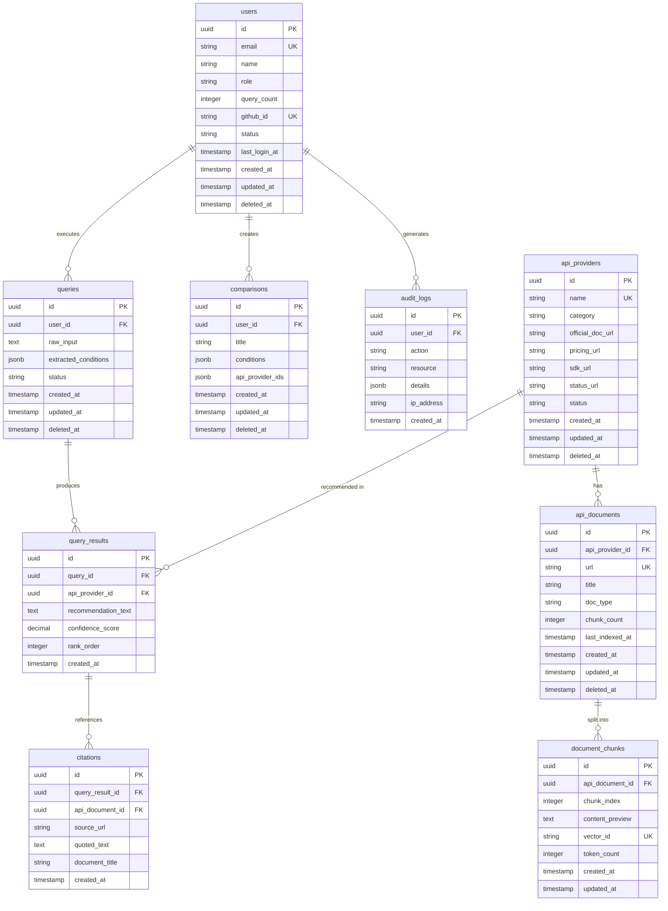
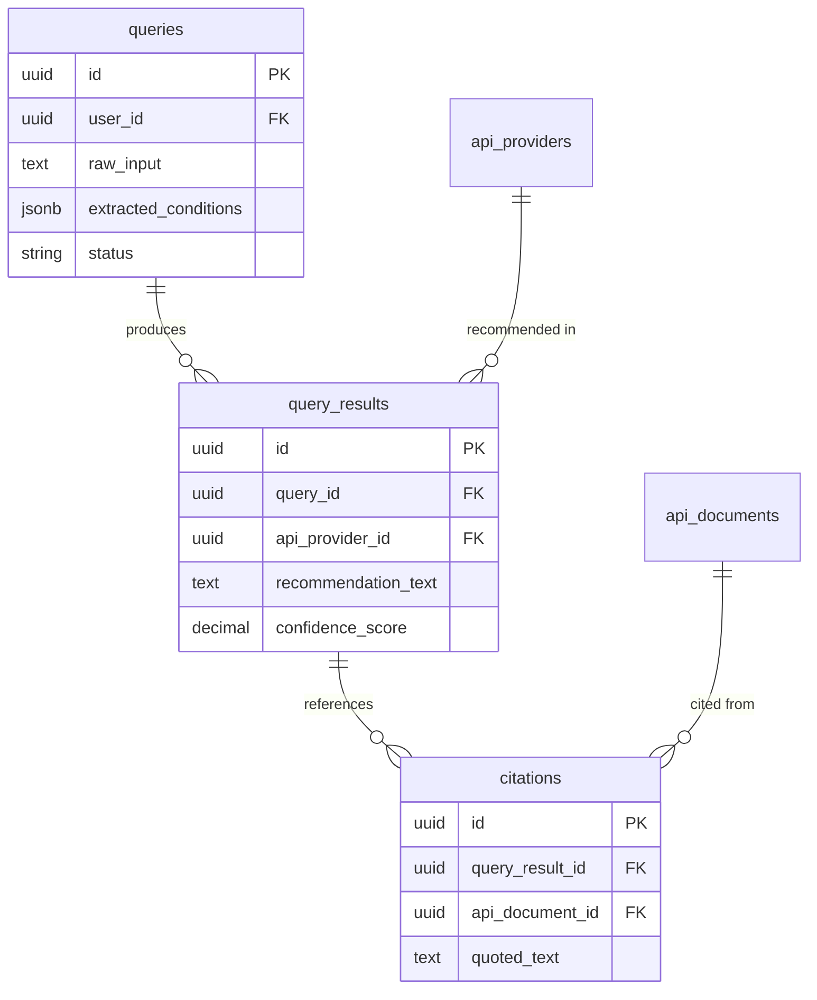
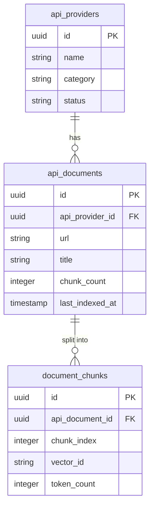

# 데이터베이스 설계서

| 항목 | 내용 |
|------|------|
| **프로젝트명** | API Intelligence Engine |
| **문서 버전** | v1.0 |
| **작성일** | 2026-02-23 |
| **작성자** | 조훈상 / 기획·개발 |
| **승인자** | 조훈상 / 프로젝트 오너 |
| **문서 상태** | 초안 |

---

> **용어 규칙:** 본 문서는 [`용어규칙.md`](../01-요구사항분석/용어규칙.md)의 표기 원칙과 용어 사전을 준수한다. 새로운 용어 사용 시 반드시 해당 문서에 먼저 등록한다.

---

## 1. 개요

### 1.1 목적

본 문서는 API Intelligence Engine의 데이터베이스 논리적/물리적 설계를 정의한다. 엔티티 관계, 테이블 명세, 인덱스, 제약조건, 성능 전략 등을 포함하여 일관된 데이터 모델을 구현할 수 있도록 한다.

### 1.2 DBMS 선정

| 항목 | 내용 |
|------|------|
| DBMS | PostgreSQL |
| 버전 | 15+ (관리형 서비스 제공 버전) |
| 호스팅 | Supabase 또는 Neon (관리형 서비스) |
| 선정 근거 | JSONB 네이티브 지원(조건 JSON, 상세 JSON 저장), UUID 네이티브 생성(`gen_random_uuid()`), 부분 인덱스·GIN 인덱스 등 고급 인덱싱, 관리형 서비스로 운영 부담 최소화 (1인 개발 MVP) |
| 인코딩 | UTF-8 |
| Collation | en_US.UTF-8 |
| 타임존 | UTC |

### 1.3 설계 원칙

| 원칙 | 설명 |
|------|------|
| 정규화 | 기본적으로 3NF(제3정규형)까지 정규화. `extracted_conditions`, `details` 등 구조가 유동적인 데이터는 JSONB로 저장 (의도적 반정규화) |
| 명명 규칙 | snake_case 사용, 복수형 테이블명, 접두사 미사용 |
| 기본키 전략 | UUID v4 (`gen_random_uuid()`) |
| Soft Delete | 사용: `deleted_at` 컬럼 (NULL이면 활성, 값이 있으면 삭제됨) |
| 타임스탬프 | 모든 테이블에 `created_at`, `updated_at` 포함 (`TIMESTAMPTZ`, UTC 기준) |
| 외래키 제약 | 사용 (데이터 무결성 보장. MVP 규모에서 성능 이슈 없음) |
| 감사 로그 | 별도 `audit_logs` 테이블 사용 |
| RBAC | 단순화 — `users.role` 컬럼으로 관리 (guest/free/pro/admin). 별도 roles/permissions 테이블 불필요 |
| 벡터 DB 연동 | 벡터 DB(Pinecone/Qdrant)는 별도 관리. PostgreSQL에는 메타데이터와 `vector_id`(외부 참조)만 저장 |

### 1.4 변경 이력

| 버전 | 날짜 | 작성자 | 변경 내용 |
|------|------|--------|-----------|
| v0.1 | 2026-02-23 | 조훈상 | 초안 작성 |
| v1.0 | 2026-02-23 | 조훈상 | 전체 테이블 명세 및 ER 다이어그램 완료 |

---

## 2. ER 다이어그램

### 2.1 전체 ER 다이어그램



### 2.2 도메인별 ER 다이어그램

#### 쿼리 처리 도메인



#### 문서 인덱싱 도메인



---

## 3. 테이블 명세서

### 3.1 users - 사용자

사용자 계정 정보를 저장하는 테이블. GitHub OAuth 전용 인증을 지원한다. 회원가입은 GitHub OAuth 최초 로그인 시 자동으로 이루어지며, 이메일은 GitHub 프로필에서 자동으로 가져온다. `role` 컬럼으로 RBAC를 단순 관리한다.

#### 컬럼 정의

| 컬럼명 | 타입 | Nullable | 기본값 | 설명 |
|--------|------|----------|--------|------|
| `id` | UUID | NOT NULL | `gen_random_uuid()` | 사용자 고유 식별자 |
| `email` | VARCHAR(255) | NOT NULL | - | 이메일 주소 (GitHub 프로필에서 자동 가져옴) |
| `name` | VARCHAR(100) | NOT NULL | - | 사용자 이름 (GitHub 프로필에서 자동 가져옴, 이후 수정 가능) |
| `role` | VARCHAR(20) | NOT NULL | `'free'` | 사용자 역할 (guest, free, pro, admin) |
| `query_count` | INTEGER | NOT NULL | `0` | 현재 월 쿼리 사용 횟수 |
| `github_id` | VARCHAR(100) | NOT NULL | - | GitHub OAuth 연동 ID (필수) |
| `status` | VARCHAR(20) | NOT NULL | `'active'` | 계정 상태 (active, suspended, withdrawn) |
| `last_login_at` | TIMESTAMPTZ | NULL | NULL | 마지막 로그인 시각 |
| `created_at` | TIMESTAMPTZ | NOT NULL | `CURRENT_TIMESTAMP` | 생성 시각 |
| `updated_at` | TIMESTAMPTZ | NOT NULL | `CURRENT_TIMESTAMP` | 수정 시각 |
| `deleted_at` | TIMESTAMPTZ | NULL | NULL | 삭제(Soft Delete) 시각 |

#### 제약조건

| 제약조건 유형 | 제약조건명 | 대상 컬럼 | 상세 |
|--------------|-----------|-----------|------|
| PK | `pk_users` | `id` | Primary Key |
| UK | `uk_users_email` | `email` | 이메일 고유 제약 |
| UK | `uk_users_github_id` | `github_id` | GitHub ID 고유 제약 |
| CK | `ck_users_role` | `role` | `IN ('guest', 'free', 'pro', 'admin')` |
| CK | `ck_users_status` | `status` | `IN ('active', 'suspended', 'withdrawn')` |
| CK | `ck_users_email_format` | `email` | 이메일 형식 검증 (`email ~* '^[A-Za-z0-9._%+-]+@[A-Za-z0-9.-]+\.[A-Za-z]{2,}$'`) |
| CK | `ck_users_query_count` | `query_count` | `>= 0` |

#### 인덱스

| 인덱스명 | 컬럼 | 타입 | 용도 |
|----------|------|------|------|
| `idx_users_email` | `email` | UNIQUE B-tree | 이메일 고유 제약 및 사용자 조회 |
| `idx_users_github_id` | `github_id` | UNIQUE B-tree | GitHub OAuth 로그인 시 조회 |
| `idx_users_status` | `status` | B-tree | 상태별 필터링 |
| `idx_users_role` | `role` | B-tree | 역할별 필터링 |
| `idx_users_not_deleted` | `deleted_at` | B-tree (Partial: WHERE deleted_at IS NULL) | Soft Delete 필터링 |

---

### 3.2 queries - 쿼리 이력

사용자의 자연어 쿼리 입력과 LLM이 추출한 조건을 저장하는 테이블. 쿼리 이력 관리(UC-005) 및 재검색 기능을 지원한다.

#### 컬럼 정의

| 컬럼명 | 타입 | Nullable | 기본값 | 설명 |
|--------|------|----------|--------|------|
| `id` | UUID | NOT NULL | `gen_random_uuid()` | 쿼리 고유 식별자 |
| `user_id` | UUID | NULL | NULL | 실행 사용자 (FK: users.id). 비회원(Guest)은 NULL |
| `raw_input` | TEXT | NOT NULL | - | 사용자가 입력한 자연어 원문 텍스트 |
| `extracted_conditions` | JSONB | NULL | NULL | LLM이 추출한 조건 JSON (예: `{"category": "messaging", "sdk": "nodejs", "region": "kr", "pricing": "free_tier"}`) |
| `status` | VARCHAR(20) | NOT NULL | `'pending'` | 쿼리 처리 상태 (pending, processing, completed, failed) |
| `session_id` | VARCHAR(100) | NULL | NULL | 비회원 세션 식별자 (로그인 시 이력 연결용) |
| `created_at` | TIMESTAMPTZ | NOT NULL | `CURRENT_TIMESTAMP` | 생성 시각 |
| `updated_at` | TIMESTAMPTZ | NOT NULL | `CURRENT_TIMESTAMP` | 수정 시각 |
| `deleted_at` | TIMESTAMPTZ | NULL | NULL | 삭제(Soft Delete) 시각 |

#### 제약조건

| 제약조건 유형 | 제약조건명 | 대상 컬럼 | 상세 |
|--------------|-----------|-----------|------|
| PK | `pk_queries` | `id` | Primary Key |
| FK | `fk_queries_user` | `user_id` | REFERENCES users(id) ON DELETE SET NULL |
| CK | `ck_queries_status` | `status` | `IN ('pending', 'processing', 'completed', 'failed')` |

#### 인덱스

| 인덱스명 | 컬럼 | 타입 | 용도 |
|----------|------|------|------|
| `idx_queries_user_id` | `user_id` | B-tree | 사용자별 쿼리 이력 조회 |
| `idx_queries_user_created` | `user_id, created_at DESC` | Composite B-tree | 사용자의 최신 쿼리 이력 정렬 조회 |
| `idx_queries_status` | `status` | B-tree | 처리 상태별 필터링 |
| `idx_queries_session_id` | `session_id` | B-tree (Partial: WHERE session_id IS NOT NULL) | 비회원 세션 기반 이력 조회 |
| `idx_queries_not_deleted` | `deleted_at` | B-tree (Partial: WHERE deleted_at IS NULL) | Soft Delete 필터링 |
| `idx_queries_conditions_gin` | `extracted_conditions` | GIN | JSONB 조건 필드 검색 |

---

### 3.3 query_results - 쿼리 결과

쿼리에 대한 API 추천 결과를 저장하는 테이블. 하나의 쿼리에 대해 복수의 API 추천이 생성된다.

#### 컬럼 정의

| 컬럼명 | 타입 | Nullable | 기본값 | 설명 |
|--------|------|----------|--------|------|
| `id` | UUID | NOT NULL | `gen_random_uuid()` | 결과 고유 식별자 |
| `query_id` | UUID | NOT NULL | - | 소속 쿼리 (FK: queries.id) |
| `api_provider_id` | UUID | NOT NULL | - | 추천된 API 제공자 (FK: api_providers.id) |
| `recommendation_text` | TEXT | NOT NULL | - | LLM이 생성한 추천 사유 텍스트 |
| `confidence_score` | NUMERIC(4,3) | NOT NULL | - | 추천 신뢰도 점수 (0.000 ~ 1.000) |
| `rank_order` | INTEGER | NOT NULL | - | 추천 순위 (1부터 시작) |
| `created_at` | TIMESTAMPTZ | NOT NULL | `CURRENT_TIMESTAMP` | 생성 시각 |

#### 제약조건

| 제약조건 유형 | 제약조건명 | 대상 컬럼 | 상세 |
|--------------|-----------|-----------|------|
| PK | `pk_query_results` | `id` | Primary Key |
| FK | `fk_query_results_query` | `query_id` | REFERENCES queries(id) ON DELETE CASCADE |
| FK | `fk_query_results_provider` | `api_provider_id` | REFERENCES api_providers(id) ON DELETE RESTRICT |
| CK | `ck_query_results_confidence` | `confidence_score` | `BETWEEN 0 AND 1` |
| CK | `ck_query_results_rank` | `rank_order` | `>= 1` |
| UK | `uk_query_results_query_rank` | `query_id, rank_order` | 동일 쿼리 내 순위 중복 방지 |

#### 인덱스

| 인덱스명 | 컬럼 | 타입 | 용도 |
|----------|------|------|------|
| `idx_query_results_query_id` | `query_id` | B-tree | 쿼리별 결과 조회 |
| `idx_query_results_query_rank` | `query_id, rank_order` | Composite B-tree (UNIQUE) | 쿼리 결과 순위별 정렬 조회 |
| `idx_query_results_provider_id` | `api_provider_id` | B-tree | API 제공자별 추천 이력 조회 |
| `idx_query_results_confidence` | `confidence_score DESC` | B-tree | 신뢰도순 정렬 |

---

### 3.4 citations - 근거 인용

쿼리 결과의 공식 문서 근거 인용 정보를 저장하는 테이블. 하나의 추천 결과에 복수의 근거 인용이 포함될 수 있다.

#### 컬럼 정의

| 컬럼명 | 타입 | Nullable | 기본값 | 설명 |
|--------|------|----------|--------|------|
| `id` | UUID | NOT NULL | `gen_random_uuid()` | 인용 고유 식별자 |
| `query_result_id` | UUID | NOT NULL | - | 소속 추천 결과 (FK: query_results.id) |
| `api_document_id` | UUID | NULL | NULL | 인용 출처 문서 (FK: api_documents.id). 외부 URL 직접 인용 시 NULL |
| `source_url` | VARCHAR(2048) | NOT NULL | - | 인용 출처 URL (공식 문서 페이지 주소) |
| `quoted_text` | TEXT | NOT NULL | - | 인용된 원문 텍스트 |
| `document_title` | VARCHAR(500) | NOT NULL | - | 인용 문서 제목 |
| `created_at` | TIMESTAMPTZ | NOT NULL | `CURRENT_TIMESTAMP` | 생성 시각 |

#### 제약조건

| 제약조건 유형 | 제약조건명 | 대상 컬럼 | 상세 |
|--------------|-----------|-----------|------|
| PK | `pk_citations` | `id` | Primary Key |
| FK | `fk_citations_result` | `query_result_id` | REFERENCES query_results(id) ON DELETE CASCADE |
| FK | `fk_citations_document` | `api_document_id` | REFERENCES api_documents(id) ON DELETE SET NULL |

#### 인덱스

| 인덱스명 | 컬럼 | 타입 | 용도 |
|----------|------|------|------|
| `idx_citations_result_id` | `query_result_id` | B-tree | 결과별 인용 조회 |
| `idx_citations_document_id` | `api_document_id` | B-tree (Partial: WHERE api_document_id IS NOT NULL) | 문서별 인용 현황 조회 |

---

### 3.5 api_providers - API 제공자 마스터

API Intelligence Engine이 추적하는 API 서비스 제공자의 마스터 데이터를 저장하는 테이블. MVP에서는 5개 카테고리(LLM API, 결제 API, 인증 API, 메시징 API, 벡터 DB)를 대상으로 한다.

#### 컬럼 정의

| 컬럼명 | 타입 | Nullable | 기본값 | 설명 |
|--------|------|----------|--------|------|
| `id` | UUID | NOT NULL | `gen_random_uuid()` | API 제공자 고유 식별자 |
| `name` | VARCHAR(200) | NOT NULL | - | API 서비스명 (예: OpenAI, Stripe, Twilio) |
| `category` | VARCHAR(50) | NOT NULL | - | API 카테고리 (llm, payment, auth, messaging, vector_db) |
| `official_doc_url` | VARCHAR(2048) | NULL | NULL | 공식 문서 메인 URL |
| `pricing_url` | VARCHAR(2048) | NULL | NULL | 가격 정책 페이지 URL |
| `sdk_url` | VARCHAR(2048) | NULL | NULL | SDK/라이브러리 문서 URL |
| `status_url` | VARCHAR(2048) | NULL | NULL | 서비스 상태 페이지 URL |
| `description` | TEXT | NULL | NULL | API 서비스 설명 |
| `status` | VARCHAR(20) | NOT NULL | `'active'` | 데이터 상태 (active, inactive, deprecated) |
| `created_at` | TIMESTAMPTZ | NOT NULL | `CURRENT_TIMESTAMP` | 생성 시각 |
| `updated_at` | TIMESTAMPTZ | NOT NULL | `CURRENT_TIMESTAMP` | 수정 시각 |
| `deleted_at` | TIMESTAMPTZ | NULL | NULL | 삭제(Soft Delete) 시각 |

#### 제약조건

| 제약조건 유형 | 제약조건명 | 대상 컬럼 | 상세 |
|--------------|-----------|-----------|------|
| PK | `pk_api_providers` | `id` | Primary Key |
| UK | `uk_api_providers_name` | `name` | 서비스명 고유 제약 |
| CK | `ck_api_providers_category` | `category` | `IN ('llm', 'payment', 'auth', 'messaging', 'vector_db')` |
| CK | `ck_api_providers_status` | `status` | `IN ('active', 'inactive', 'deprecated')` |

#### 인덱스

| 인덱스명 | 컬럼 | 타입 | 용도 |
|----------|------|------|------|
| `idx_api_providers_name` | `name` | UNIQUE B-tree | 서비스명 조회 |
| `idx_api_providers_category` | `category` | B-tree | 카테고리별 필터링 |
| `idx_api_providers_status` | `status` | B-tree | 상태별 필터링 |
| `idx_api_providers_not_deleted` | `deleted_at` | B-tree (Partial: WHERE deleted_at IS NULL) | Soft Delete 필터링 |

---

### 3.6 api_documents - 인덱싱된 문서 메타

크롤링 및 벡터 인덱싱(Indexing)이 완료된 공식 문서의 메타데이터를 저장하는 테이블. 실제 문서 본문은 벡터 DB에 저장되며, 이 테이블은 관리용 메타 정보만 보유한다.

#### 컬럼 정의

| 컬럼명 | 타입 | Nullable | 기본값 | 설명 |
|--------|------|----------|--------|------|
| `id` | UUID | NOT NULL | `gen_random_uuid()` | 문서 고유 식별자 |
| `api_provider_id` | UUID | NOT NULL | - | 소속 API 제공자 (FK: api_providers.id) |
| `url` | VARCHAR(2048) | NOT NULL | - | 문서 원본 URL |
| `title` | VARCHAR(500) | NOT NULL | - | 문서 제목 |
| `doc_type` | VARCHAR(50) | NOT NULL | `'general'` | 문서 유형 (general, pricing, sdk, changelog, tutorial) |
| `chunk_count` | INTEGER | NOT NULL | `0` | 분할된 청크(Chunk) 수 |
| `last_indexed_at` | TIMESTAMPTZ | NULL | NULL | 마지막 인덱싱(Indexing) 완료 시각 |
| `content_hash` | VARCHAR(64) | NULL | NULL | 문서 콘텐츠 해시 (변경 감지용, SHA-256) |
| `created_at` | TIMESTAMPTZ | NOT NULL | `CURRENT_TIMESTAMP` | 생성 시각 |
| `updated_at` | TIMESTAMPTZ | NOT NULL | `CURRENT_TIMESTAMP` | 수정 시각 |
| `deleted_at` | TIMESTAMPTZ | NULL | NULL | 삭제(Soft Delete) 시각 |

#### 제약조건

| 제약조건 유형 | 제약조건명 | 대상 컬럼 | 상세 |
|--------------|-----------|-----------|------|
| PK | `pk_api_documents` | `id` | Primary Key |
| FK | `fk_api_documents_provider` | `api_provider_id` | REFERENCES api_providers(id) ON DELETE CASCADE |
| UK | `uk_api_documents_url` | `url` | 문서 URL 고유 제약 (동일 문서 중복 인덱싱 방지) |
| CK | `ck_api_documents_doc_type` | `doc_type` | `IN ('general', 'pricing', 'sdk', 'changelog', 'tutorial')` |
| CK | `ck_api_documents_chunk_count` | `chunk_count` | `>= 0` |

#### 인덱스

| 인덱스명 | 컬럼 | 타입 | 용도 |
|----------|------|------|------|
| `idx_api_documents_provider_id` | `api_provider_id` | B-tree | API 제공자별 문서 목록 조회 |
| `idx_api_documents_url` | `url` | UNIQUE B-tree | URL 기반 문서 조회 (중복 검사) |
| `idx_api_documents_last_indexed` | `last_indexed_at` | B-tree | 재인덱싱 대상 문서 조회 (오래된 순) |
| `idx_api_documents_not_deleted` | `deleted_at` | B-tree (Partial: WHERE deleted_at IS NULL) | Soft Delete 필터링 |

---

### 3.7 document_chunks - 문서 청크 메타

문서를 벡터 검색에 적합한 크기로 분할한 청크(Chunk)의 메타데이터를 저장하는 테이블. 실제 벡터 임베딩은 벡터 DB에 저장되며, `vector_id`로 연결한다.

#### 컬럼 정의

| 컬럼명 | 타입 | Nullable | 기본값 | 설명 |
|--------|------|----------|--------|------|
| `id` | UUID | NOT NULL | `gen_random_uuid()` | 청크(Chunk) 고유 식별자 |
| `api_document_id` | UUID | NOT NULL | - | 소속 문서 (FK: api_documents.id) |
| `chunk_index` | INTEGER | NOT NULL | - | 문서 내 청크 순서 (0부터 시작) |
| `content_preview` | VARCHAR(500) | NOT NULL | - | 청크 내용 미리보기 (처음 500자) |
| `vector_id` | VARCHAR(255) | NOT NULL | - | 벡터 DB 내 벡터 ID (외부 참조) |
| `token_count` | INTEGER | NOT NULL | - | 청크의 토큰 수 |
| `created_at` | TIMESTAMPTZ | NOT NULL | `CURRENT_TIMESTAMP` | 생성 시각 |
| `updated_at` | TIMESTAMPTZ | NOT NULL | `CURRENT_TIMESTAMP` | 수정 시각 |

#### 제약조건

| 제약조건 유형 | 제약조건명 | 대상 컬럼 | 상세 |
|--------------|-----------|-----------|------|
| PK | `pk_document_chunks` | `id` | Primary Key |
| FK | `fk_document_chunks_document` | `api_document_id` | REFERENCES api_documents(id) ON DELETE CASCADE |
| UK | `uk_document_chunks_vector_id` | `vector_id` | 벡터 ID 고유 제약 |
| UK | `uk_document_chunks_doc_index` | `api_document_id, chunk_index` | 문서 내 청크 순서 고유 제약 |
| CK | `ck_document_chunks_index` | `chunk_index` | `>= 0` |
| CK | `ck_document_chunks_token_count` | `token_count` | `> 0` |

#### 인덱스

| 인덱스명 | 컬럼 | 타입 | 용도 |
|----------|------|------|------|
| `idx_document_chunks_document_id` | `api_document_id` | B-tree | 문서별 청크 목록 조회 |
| `idx_document_chunks_doc_index` | `api_document_id, chunk_index` | Composite B-tree (UNIQUE) | 문서 내 청크 순서 조회 |
| `idx_document_chunks_vector_id` | `vector_id` | UNIQUE B-tree | 벡터 ID 기반 역조회 (벡터 DB 검색 결과 → PostgreSQL 메타 매핑) |

---

### 3.8 comparisons - 비교표

사용자가 생성한 API 비교표 정보를 저장하는 테이블. 조건 기반 API 비교(UC-004) 기능을 지원한다.

#### 컬럼 정의

| 컬럼명 | 타입 | Nullable | 기본값 | 설명 |
|--------|------|----------|--------|------|
| `id` | UUID | NOT NULL | `gen_random_uuid()` | 비교표 고유 식별자 |
| `user_id` | UUID | NOT NULL | - | 생성한 사용자 (FK: users.id) |
| `title` | VARCHAR(200) | NOT NULL | - | 비교표 제목 (예: "SMS API 3종 비교") |
| `conditions` | JSONB | NOT NULL | - | 비교 조건 JSON (예: `{"category": "messaging", "sdk": "nodejs", "region": "kr"}`) |
| `api_provider_ids` | JSONB | NOT NULL | - | 비교 대상 API 제공자 ID 배열 (예: `["uuid1", "uuid2", "uuid3"]`) |
| `created_at` | TIMESTAMPTZ | NOT NULL | `CURRENT_TIMESTAMP` | 생성 시각 |
| `updated_at` | TIMESTAMPTZ | NOT NULL | `CURRENT_TIMESTAMP` | 수정 시각 |
| `deleted_at` | TIMESTAMPTZ | NULL | NULL | 삭제(Soft Delete) 시각 |

#### 제약조건

| 제약조건 유형 | 제약조건명 | 대상 컬럼 | 상세 |
|--------------|-----------|-----------|------|
| PK | `pk_comparisons` | `id` | Primary Key |
| FK | `fk_comparisons_user` | `user_id` | REFERENCES users(id) ON DELETE CASCADE |

#### 인덱스

| 인덱스명 | 컬럼 | 타입 | 용도 |
|----------|------|------|------|
| `idx_comparisons_user_id` | `user_id` | B-tree | 사용자별 비교표 목록 조회 |
| `idx_comparisons_user_created` | `user_id, created_at DESC` | Composite B-tree | 사용자의 최신 비교표 정렬 조회 |
| `idx_comparisons_not_deleted` | `deleted_at` | B-tree (Partial: WHERE deleted_at IS NULL) | Soft Delete 필터링 |

---

### 3.9 audit_logs - 감사 로그

시스템 전반의 중요 행위를 기록하는 감사 로그 테이블. 보안 이벤트, 데이터 변경, 인증 이벤트 등을 추적한다. Soft Delete를 적용하지 않으며, INSERT 전용 테이블이다.

#### 컬럼 정의

| 컬럼명 | 타입 | Nullable | 기본값 | 설명 |
|--------|------|----------|--------|------|
| `id` | UUID | NOT NULL | `gen_random_uuid()` | 로그 고유 식별자 |
| `user_id` | UUID | NULL | NULL | 행위 주체 사용자 (FK: users.id). 시스템 이벤트는 NULL |
| `action` | VARCHAR(100) | NOT NULL | - | 행위 유형 (예: user.login, user.created, query.execute, user.withdraw) |
| `resource` | VARCHAR(100) | NOT NULL | - | 대상 리소스 (예: users, queries, api_providers) |
| `details` | JSONB | NULL | NULL | 상세 정보 JSON (예: `{"email": "...", "ip": "...", "reason": "..."}`) |
| `ip_address` | VARCHAR(45) | NULL | NULL | 요청 IP 주소 (IPv4/IPv6) |
| `created_at` | TIMESTAMPTZ | NOT NULL | `CURRENT_TIMESTAMP` | 이벤트 발생 시각 |

#### 제약조건

| 제약조건 유형 | 제약조건명 | 대상 컬럼 | 상세 |
|--------------|-----------|-----------|------|
| PK | `pk_audit_logs` | `id` | Primary Key |
| FK | `fk_audit_logs_user` | `user_id` | REFERENCES users(id) ON DELETE SET NULL |

#### 인덱스

| 인덱스명 | 컬럼 | 타입 | 용도 |
|----------|------|------|------|
| `idx_audit_logs_user_id` | `user_id` | B-tree | 사용자별 감사 로그 조회 |
| `idx_audit_logs_action` | `action` | B-tree | 행위 유형별 필터링 |
| `idx_audit_logs_created_at` | `created_at DESC` | B-tree | 시간순 로그 조회 |
| `idx_audit_logs_resource_action` | `resource, action` | Composite B-tree | 리소스+행위 복합 필터링 |

---

## 4. 데이터 사전 (Data Dictionary)

### 4.1 공통 도메인 정의

| 용어 | 정의 | 도메인 (타입) | 허용값 | 비고 |
|------|------|---------------|--------|------|
| 사용자 ID | 사용자 고유 식별자 | UUID | - | Gen4 UUID |
| 이메일 | 사용자 이메일 주소 | VARCHAR(255) | 이메일 형식 | RFC 5322, GitHub 프로필에서 자동 가져옴 |
| 사용자 역할 | 사용자 권한 등급 | VARCHAR(20) | guest, free, pro, admin | RBAC 단순화 |
| 사용자 상태 | 사용자 계정 상태 | VARCHAR(20) | active, suspended, withdrawn | GitHub OAuth 전용 (이메일 인증 불필요) |
| 쿼리 상태 | 쿼리 처리 상태 | VARCHAR(20) | pending, processing, completed, failed | - |
| API 제공자 상태 | API 제공자 데이터 상태 | VARCHAR(20) | active, inactive, deprecated | - |
| API 카테고리 | API 서비스 분류 | VARCHAR(50) | llm, payment, auth, messaging, vector_db | MVP 5개 카테고리 |
| 문서 유형 | 인덱싱 문서 분류 | VARCHAR(50) | general, pricing, sdk, changelog, tutorial | - |
| 신뢰도 점수 | 추천 결과 신뢰도 | NUMERIC(4,3) | 0.000 ~ 1.000 | 0 = 최저, 1 = 최고 |
| 벡터 ID | 벡터 DB 내 벡터 식별자 | VARCHAR(255) | - | 벡터 DB 외부 참조 |
| 타임스탬프 | 시간 기록 | TIMESTAMPTZ | - | UTC 기준, 타임존 포함 |
| 쿼리 횟수 | 월간 쿼리 사용 횟수 | INTEGER | 0 이상 | 매월 초 리셋 |
| 청크 인덱스 | 문서 내 청크 순서 번호 | INTEGER | 0 이상 | 0부터 시작 |
| 토큰 수 | 청크의 토큰 수 | INTEGER | 양의 정수 | LLM 토큰 기준 |
| 추천 순위 | 결과 내 추천 순서 | INTEGER | 1 이상 | 1이 최상위 |
| IP 주소 | 요청 IP 주소 | VARCHAR(45) | IPv4/IPv6 형식 | IPv6 최대 45자 |

### 4.2 열거형 (Enum) 값 정의

#### 사용자 역할 (User Role)

| 값 | 설명 | 쿼리 제한 | 비고 |
|----|------|-----------|------|
| `guest` | 비회원 | 세션당 3회 | 비회원 체험 쿼리 |
| `free` | 무료 회원 | 월 20회 | GitHub OAuth 로그인 |
| `pro` | Pro 구독 사용자 | 무제한 | v2에서 도입 예정 |
| `admin` | 시스템 관리자 | 무제한 | - |

#### 사용자 상태 (User Status)

| 값 | 설명 | 전이 가능 상태 |
|----|------|---------------|
| `active` | 활성 계정 (GitHub OAuth 로그인 시 즉시 활성) | suspended, withdrawn |
| `suspended` | 정지된 계정 (관리자 조치) | active |
| `withdrawn` | 탈퇴한 계정 | - (최종 상태) |

#### 쿼리 상태 (Query Status)

| 값 | 설명 | 전이 가능 상태 |
|----|------|---------------|
| `pending` | 쿼리 접수됨 (처리 대기) | processing, failed |
| `processing` | RAG 파이프라인 처리 중 | completed, failed |
| `completed` | 처리 완료 (결과 생성됨) | - (최종 상태) |
| `failed` | 처리 실패 | pending (재시도 시) |

#### API 제공자 상태 (API Provider Status)

| 값 | 설명 | 전이 가능 상태 |
|----|------|---------------|
| `active` | 활성 (인덱싱 및 추천 대상) | inactive, deprecated |
| `inactive` | 비활성 (일시 중지) | active, deprecated |
| `deprecated` | 지원 종료 | - (최종 상태) |

#### API 카테고리 (API Category)

| 값 | 설명 | 예시 API 제공자 |
|----|------|----------------|
| `llm` | LLM API | OpenAI, Anthropic, Google Gemini |
| `payment` | 결제 API | Stripe, Toss Payments, Paddle |
| `auth` | 인증 API | Auth0, Clerk, Firebase Auth |
| `messaging` | 메시징 API | Twilio, SendGrid, Resend |
| `vector_db` | 벡터 DB | Pinecone, Qdrant, Weaviate |

---

## 5. 마이그레이션 전략

### 5.1 마이그레이션 도구

| 항목 | 내용 |
|------|------|
| 도구 | Prisma Migrate (Node.js 생태계 통합) |
| 버전 관리 방식 | 타임스탬프 기반 (Prisma 기본 방식) |
| 마이그레이션 파일 위치 | `prisma/migrations/` |
| 스키마 정의 파일 | `prisma/schema.prisma` |
| 실행 환경 | 로컬 개발: `prisma migrate dev` / 배포: CI/CD 파이프라인 내 `prisma migrate deploy` |

### 5.2 버전 관리 규칙

| 규칙 | 설명 |
|------|------|
| 파일 명명 | Prisma 자동 생성 (`YYYYMMDDHHMMSS_[설명]/migration.sql`) |
| 한 파일 = 하나의 변경 | 하나의 마이그레이션에 하나의 논리적 변경만 포함 |
| 되돌리기 불가 원칙 | 적용된 마이그레이션 파일은 수정하지 않음. 새 마이그레이션으로 변경 |
| 데이터 마이그레이션 분리 | 스키마 변경과 데이터 변경을 별도 파일로 관리 |
| 코드 리뷰 필수 | 모든 마이그레이션 파일은 커밋 전 검토 |

### 5.3 롤백 계획

| 시나리오 | 롤백 방법 |
|----------|-----------|
| 컬럼 추가 실패 | 역방향 마이그레이션 SQL 수동 작성 및 실행 (DROP COLUMN) |
| 테이블 생성 실패 | 역방향 마이그레이션 SQL 수동 작성 및 실행 (DROP TABLE) |
| 데이터 마이그레이션 실패 | 관리형 서비스의 PITR(시점 복구)로 복원 |
| 인덱스 생성 실패 | DROP INDEX 실행 |
| 운영 환경 롤백 | 관리형 서비스의 스냅샷/PITR 복원 후 마이그레이션 재실행 |

### 5.4 스키마 변경 프로세스

```
1. 개발자: schema.prisma 수정 후 `prisma migrate dev --name [설명]` 실행
2. 개발자: 로컬 환경에서 마이그레이션 적용 및 테스트
3. 개발자: 생성된 migration.sql 파일을 코드와 함께 커밋
4. CI: Preview/Staging 환경에 `prisma migrate deploy` 자동 적용
5. 개발자: Staging 환경에서 동작 검증
6. CI/CD: Production 환경에 `prisma migrate deploy` 적용 (main 브랜치 머지 시)
```

### 5.5 위험 변경 관리

| 변경 유형 | 위험 수준 | 대응 방법 |
|-----------|-----------|-----------|
| 컬럼 추가 (NULL 허용) | 낮음 | 일반 프로세스 |
| 컬럼 추가 (NOT NULL + 기본값) | 낮음 | MVP 규모에서는 즉시 적용 가능 |
| 컬럼 타입 변경 | 높음 | 새 컬럼 추가 → 데이터 복사 → 구 컬럼 삭제 (3단계) |
| 컬럼 삭제 | 중간 | 애플리케이션에서 참조 제거 확인 후 삭제 |
| 인덱스 생성 (대규모 테이블) | 낮음 | MVP 규모에서는 일반 CREATE INDEX로 충분. 데이터 증가 시 `CREATE INDEX CONCURRENTLY` 사용 |

---

## 6. 성능 설계

### 6.1 파티셔닝 전략

> **파티셔닝 미적용:** MVP 단계에서 예상 데이터 규모(사용자 수천 명, 쿼리 수만 건 수준)에서는 파티셔닝을 적용하지 않는다. `audit_logs` 테이블의 데이터 증가 추이를 모니터링하여, 100만 건 이상 누적 시 `created_at` 기준 월별 Range 파티셔닝 도입을 검토한다.

### 6.2 샤딩 전략

> **샤딩 미적용:** MVP 단계에서는 단일 DB 인스턴스로 충분하다. 관리형 서비스(Supabase/Neon)의 수직 확장(Vertical Scaling)으로 초기 성장을 대응하며, MAU 10,000 이상에서 샤딩 필요성을 재평가한다.

### 6.3 읽기 복제본 (Read Replica) 구성

> **Read Replica 미적용:** MVP 단계에서는 동시 사용자 50명(NFR-002) 수준이므로 단일 인스턴스로 충분하다. 관리형 서비스의 연결 풀링(Connection Pooling) 기능을 활용하여 동시 연결을 효율적으로 관리한다. 읽기 트래픽이 단일 인스턴스 한계를 초과하는 시점에 Read Replica 도입을 검토한다.

### 6.4 인덱스 전략

#### 인덱스 설계 원칙

| 원칙 | 설명 |
|------|------|
| 선택도 기반 | Cardinality가 높은 컬럼에 인덱스 적용 (email, url, vector_id 등) |
| 복합 인덱스 순서 | WHERE 절 등호 조건 → 정렬 조건 → 범위 조건 순 |
| 부분 인덱스 | Soft Delete 패턴에서 `WHERE deleted_at IS NULL` 활용으로 인덱스 크기 절감 |
| GIN 인덱스 | JSONB 컬럼(`extracted_conditions`)에 GIN 인덱스 적용 |
| 과잉 인덱스 방지 | MVP 규모에서 불필요한 인덱스를 최소화. 실제 쿼리 패턴 기반으로 추가 |

#### 주요 쿼리별 인덱스 매핑

| 쿼리 용도 | 대상 테이블 | 사용 인덱스 | 예상 쿼리 패턴 |
|-----------|-------------|-------------|---------------|
| 사용자 이메일 조회 | users | `idx_users_email` | `WHERE email = $1 AND deleted_at IS NULL` |
| 로그인 (GitHub) | users | `idx_users_github_id` | `WHERE github_id = $1 AND deleted_at IS NULL` |
| 사용자 쿼리 이력 | queries | `idx_queries_user_created` | `WHERE user_id = $1 AND deleted_at IS NULL ORDER BY created_at DESC` |
| 쿼리별 결과 조회 | query_results | `idx_query_results_query_rank` | `WHERE query_id = $1 ORDER BY rank_order` |
| 결과별 인용 조회 | citations | `idx_citations_result_id` | `WHERE query_result_id = $1` |
| 벡터 ID 역조회 | document_chunks | `idx_document_chunks_vector_id` | `WHERE vector_id = $1` |
| 카테고리별 API 목록 | api_providers | `idx_api_providers_category` | `WHERE category = $1 AND status = 'active' AND deleted_at IS NULL` |
| 재인덱싱 대상 문서 | api_documents | `idx_api_documents_last_indexed` | `WHERE last_indexed_at < $1 AND deleted_at IS NULL ORDER BY last_indexed_at ASC` |
| 사용자별 비교표 목록 | comparisons | `idx_comparisons_user_created` | `WHERE user_id = $1 AND deleted_at IS NULL ORDER BY created_at DESC` |
| 감사 로그 조회 | audit_logs | `idx_audit_logs_created_at` | `WHERE created_at BETWEEN $1 AND $2 ORDER BY created_at DESC` |

### 6.5 쿼리 최적화 가이드라인

| 항목 | 가이드라인 |
|------|-----------|
| SELECT 절 | `SELECT *` 지양, 필요한 컬럼만 명시 |
| N+1 방지 | Prisma의 `include` / `select`를 활용한 Eager Loading 적용 |
| 대량 조회 | Cursor 기반 페이지네이션 적용 (`WHERE id > $cursor ORDER BY id LIMIT $size`) |
| JSONB 조회 | `@>`, `?`, `->>`  연산자 활용. GIN 인덱스와 함께 사용 |
| 연결 풀링 | 관리형 서비스의 PgBouncer/연결 풀링 기능 활용 (서버리스 환경 대응) |
| Slow Query | 500ms 이상 쿼리 모니터링 (관리형 서비스의 쿼리 인사이트 대시보드 활용) |

---

## 7. 백업/복구 정책

> **관리형 서비스 기반:** Supabase 또는 Neon의 관리형 백업/복구 기능을 기본 활용한다. 별도의 백업 인프라를 구축하지 않으며, 서비스 제공 기능으로 충분한 수준의 데이터 보호를 확보한다.

### 7.1 백업 스케줄

| 백업 유형 | 주기 | 보존 기간 | 제공 주체 | 비고 |
|-----------|------|-----------|-----------|------|
| 자동 스냅샷 | 일 1회 | 7일 (Free 플랜) ~ 30일 (Pro 플랜) | Supabase/Neon 관리형 서비스 | 서비스 기본 제공 |
| PITR (Point-in-Time Recovery) | 연속 (WAL 기반) | 7일 | Supabase Pro / Neon (기본 제공) | 특정 시점 복구 가능 |
| 수동 백업 | 필요 시 | 별도 보관 | 개발자 (`pg_dump`) | 주요 마이그레이션 전 수동 실행 |

### 7.2 복구 절차

| 복구 시나리오 | 절차 | 예상 소요 시간 |
|--------------|------|---------------|
| 전체 복구 (스냅샷 기반) | 관리형 서비스 대시보드에서 스냅샷 선택 → 복원 실행 | 수 분 ~ 30분 |
| 특정 시점 복구 (PITR) | 관리형 서비스 대시보드에서 복구 시점 지정 → 복원 실행 | 수 분 ~ 1시간 |
| 테이블 단위 복구 | `pg_dump`로 해당 테이블 추출 → 임시 DB 복원 → 데이터 이관 | 1~2시간 |
| 마이그레이션 롤백 | PITR로 마이그레이션 실행 직전 시점 복원 | 수 분 ~ 30분 |

### 7.3 재해 복구 (DR)

| 항목 | 내용 |
|------|------|
| RPO | 24시간 (Free 플랜) / 수 분 (PITR 사용 시) |
| RTO | 30분 ~ 1시간 |
| DR 전략 | 관리형 서비스의 자동 장애 조치(Failover) 의존. MVP 단계에서 별도 DR 사이트 미구축 |
| 데이터 보호 수준 | MVP 단계에서는 PITR 7일 + 일일 스냅샷으로 충분. 사용자 규모 확대 시 Cross-Region 복제 검토 |

---

## 부록

### A. DDL 스크립트 위치

```
api-intel/
├── prisma/
│   ├── schema.prisma           # Prisma 스키마 정의
│   └── migrations/             # 마이그레이션 파일 (자동 생성)
│       ├── 20260223000000_init/
│       │   └── migration.sql   # 초기 스키마 생성
│       └── ...
├── scripts/
│   └── db/
│       ├── seed.ts             # 초기 데이터 (seed)
│       └── reset.ts            # 개발 환경 DB 리셋
```

### B. 초기 시드 데이터

#### API 제공자 마스터 (MVP 5개 카테고리)

| 카테고리 | 초기 등록 API 제공자 (예정) |
|----------|---------------------------|
| llm | OpenAI, Anthropic, Google Gemini, Cohere, Mistral |
| payment | Stripe, Toss Payments, Paddle, LemonSqueezy |
| auth | Auth0, Clerk, Firebase Auth, Supabase Auth |
| messaging | Twilio, SendGrid, Resend, Mailgun |
| vector_db | Pinecone, Qdrant, Weaviate, Chroma |

#### 관리자 계정

| 항목 | 값 |
|------|-----|
| email | (환경 변수로 설정) |
| role | admin |
| status | active |

### C. 참조 문서

| 문서 | 경로 |
|------|------|
| 서비스 기획서 | `docs/00-기획/서비스기획안.md` |
| 유스케이스 명세서 | `docs/01-요구사항분석/유스케이스명세서.md` |
| 요구사항 추적 매트릭스 (RTM) | `docs/01-요구사항분석/요구사항추적매트릭스-RTM.md` |
| 용어 규칙 | `docs/01-요구사항분석/용어규칙.md` |
| 시스템 아키텍처 설계서 | `docs/02-시스템설계/시스템아키텍처설계서.md` (작성 예정) |
| API 설계서 | `docs/02-시스템설계/API설계서.md` (작성 예정) |
