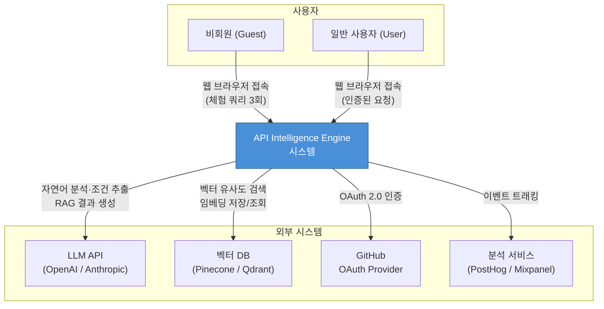
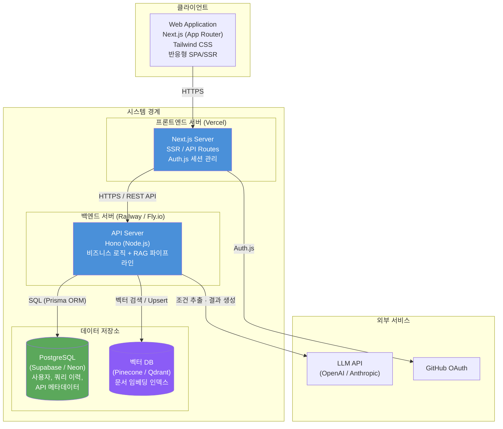
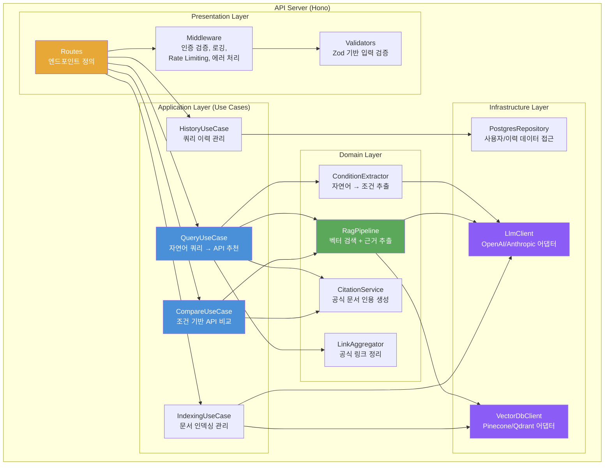
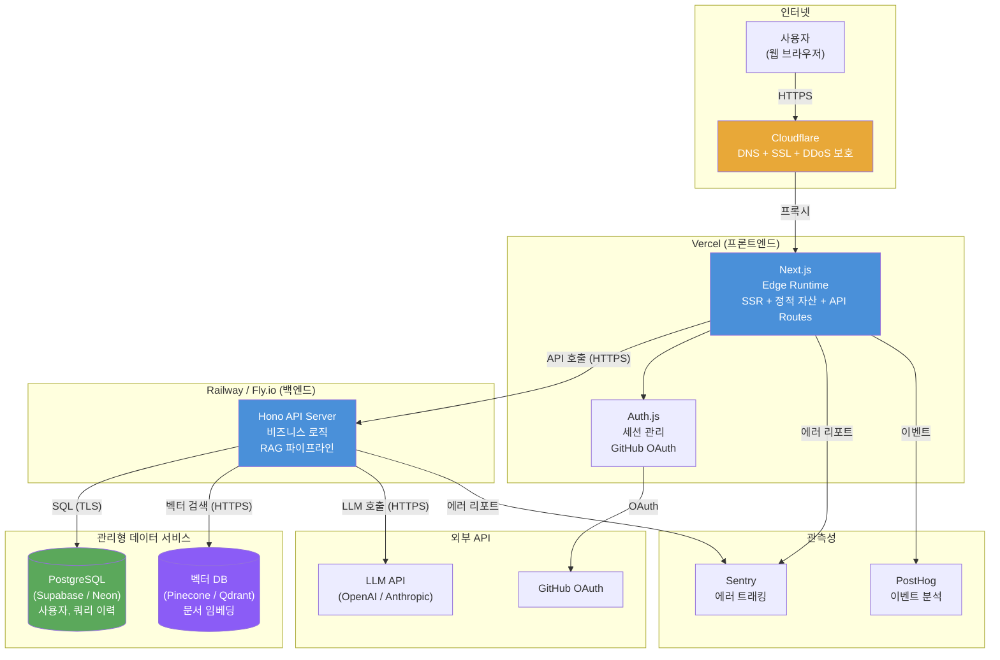
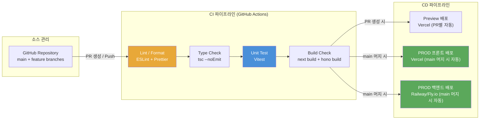
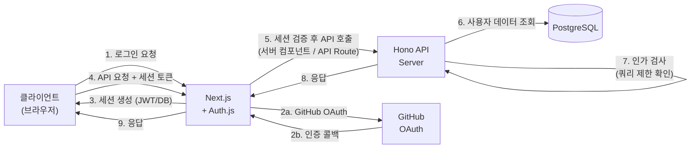
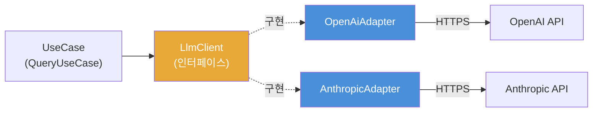
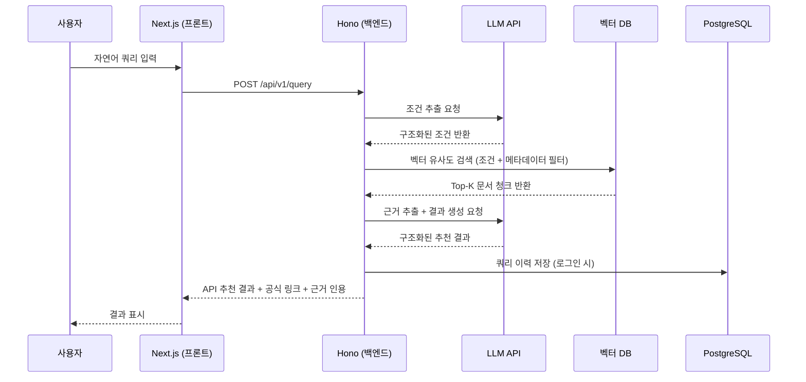

# 시스템 아키텍처 설계서 (SAD - System Architecture Document)

| 항목 | 내용 |
|------|------|
| **프로젝트명** | API Intelligence Engine |
| **문서 버전** | v1.0 |
| **작성일** | 2026-02-23 |
| **작성자** | 조훈상 / 기획·개발 |
| **승인자** | 조훈상 / 프로젝트 오너 |
| **문서 상태** | 초안 |

---

> **용어 규칙:** 본 문서는 [용어규칙.md](../01-요구사항분석/용어규칙.md)의 표기 원칙과 용어 사전을 준수한다.

---

## 1. 문서 개요

### 1.1 목적

본 문서는 API Intelligence Engine의 시스템 아키텍처를 정의하고, 주요 기술적 결정 사항과 설계 원칙을 기술한다. 1인 개발자(조훈상)가 시스템의 전체 구조를 일관된 방향으로 설계·구현할 수 있도록 하며, 향후 협업자나 기여자가 시스템을 빠르게 이해할 수 있는 기준 문서 역할을 한다.

### 1.2 범위

- 시스템 전체 아키텍처 구조 및 구성 요소
- 기술 스택 선정 및 근거
- 배포 아키텍처 및 인프라 구성
- 비기능 요구사항에 대한 아키텍처 대응 전략
- 외부 시스템 통합 패턴

### 1.3 참조 문서

| 문서명 | 버전 | 비고 |
|--------|------|------|
| 서비스 기획서 | v1.0 | 서비스 개요, MVP 스코프, 기술 스택 방향 |
| 유스케이스 명세서 (UCS-001) | v1.0 | 6개 유스케이스 상세 명세 |
| 요구사항 추적 매트릭스 (RTM-001) | v0.1 | FR 12건, NFR 7건 추적 |
| 용어규칙 | v1.0 | 프로젝트 용어 표기 원칙 |

### 1.4 변경 이력

| 버전 | 날짜 | 작성자 | 변경 내용 |
|------|------|--------|-----------|
| v0.1 | 2026-02-23 | 조훈상 | 초안 작성 |
| v1.0 | 2026-02-23 | 조훈상 | 전체 아키텍처 설계 완료, ADR 5건 포함 |

### 1.5 용어 정의

> 전체 용어 사전은 [용어규칙.md](../01-요구사항분석/용어규칙.md)를 참조한다. 본 문서에서 추가로 사용하는 아키텍처 관련 용어는 다음과 같다.

| 용어 | 정의 |
|------|------|
| Layered Architecture | 시스템을 역할별 계층(Presentation, Application, Domain, Infrastructure)으로 분리하는 아키텍처 스타일 |
| Modular Monolith | 단일 배포 단위이면서도 모듈 경계가 명확한 아키텍처 패턴. 1인 개발에서 운영 복잡도를 최소화하면서 관심사 분리를 달성 |
| RAG Pipeline | 사용자 쿼리를 벡터 검색과 LLM 생성으로 처리하는 파이프라인. 조건 추출 → 벡터 검색 → 근거 추출 → 결과 생성의 4단계로 구성 |
| 임베딩 (Embedding) | 텍스트를 고차원 벡터 공간의 수치 벡터로 변환하는 과정 또는 그 결과물 |

---

## 2. 아키텍처 개요

### 2.1 아키텍처 스타일 선택

#### 선택된 아키텍처 스타일

**Layered Architecture + Modular Monolith**

#### 후보 아키텍처 스타일 비교

| 평가 항목 | Layered + Modular Monolith | Microservices | Event-Driven | Hexagonal |
|-----------|---------------------------|---------------|--------------|-----------|
| 구현 복잡도 | 낮음 | 높음 | 중간 | 중간 |
| 확장성 | 중간 | 높음 | 높음 | 중간 |
| 유지보수성 | 중간 | 높음 | 중간 | 높음 |
| 1인 개발 적합성 | **매우 높음** | 매우 낮음 | 낮음 | 중간 |
| 배포 유연성 | 중간 | 높음 | 높음 | 중간 |
| 운영 복잡도 | **낮음** | 매우 높음 | 높음 | 낮음 |
| **종합 점수** | **4.5 / 5** | 2.0 / 5 | 2.5 / 5 | 3.5 / 5 |

#### 선택 근거

- **1인 개발 환경 최적화**: Microservices나 Event-Driven은 서비스 간 통신, 분산 트레이싱, 독립 배포 파이프라인 등 운영 부담이 1인 개발에 비현실적이다
- **빠른 MVP 개발**: 8주 MVP 일정 내에 핵심 기능을 구현하려면 인프라 복잡도를 최소화해야 한다
- **명확한 모듈 경계**: Modular Monolith로 도메인별 모듈 경계를 유지하면, 향후 필요 시 특정 모듈을 독립 서비스로 분리할 수 있다
- **비용 효율**: 단일 서버 배포로 월 $100 예산 제한을 충족할 수 있다

### 2.2 아키텍처 원칙

| 원칙 | 설명 | 적용 방법 |
|------|------|-----------|
| 관심사 분리 (Separation of Concerns) | 각 계층/모듈은 단일 책임을 가짐 | 프론트엔드(UI), 백엔드(비즈니스 로직), 데이터(저장소)를 명확히 분리. 백엔드 내부도 도메인 모듈별로 디렉토리 분리 |
| 느슨한 결합 (Loose Coupling) | 모듈 간 의존성 최소화 | 모듈 간 통신은 인터페이스/타입을 통해 수행. 외부 서비스(LLM API, 벡터 DB)는 어댑터 패턴으로 격리 |
| 높은 응집도 (High Cohesion) | 관련 기능을 하나의 모듈로 그룹화 | query, rag, auth, history, comparison 등 도메인별 모듈로 그룹화 |
| DRY (Don't Repeat Yourself) | 코드 및 로직 중복 방지 | 공통 유틸리티, 타입 정의, 에러 처리를 shared 모듈로 추출 |
| 외부 서비스 격리 | 외부 API 의존성을 어댑터로 감싸기 | LLM API, 벡터 DB 등 외부 서비스는 인터페이스 뒤에 구현을 숨겨 교체 용이성 확보 |
| MVP 우선 설계 | 과도한 추상화보다 동작하는 코드 우선 | 초기에는 실용적 설계를 우선하되, 모듈 경계만 명확히 유지 |

### 2.3 시스템 컨텍스트 다이어그램

시스템과 외부 시스템/액터 간의 관계를 나타낸다.



### 2.4 컨테이너 다이어그램

시스템 내부의 주요 컨테이너(애플리케이션, 데이터 저장소 등)를 나타낸다.



### 2.5 컴포넌트 다이어그램

백엔드 API Server 내부의 주요 모듈/컴포넌트 구성을 나타낸다.



---

## 3. 기술 스택 선정

### 3.1 선정 기준 매트릭스

1인 개발 + 월 $100 비용 제한 + 8주 MVP 환경을 반영하여, 일반적인 가중치를 조정한다.

| 평가 항목 | 가중치 | 설명 |
|-----------|--------|------|
| 학습 곡선 / 개발 속도 | 30% | 1인 개발에서 가장 중요. 이미 익숙하거나 빠르게 습득 가능한 기술 |
| 생태계 (Ecosystem) | 20% | LLM/RAG 관련 라이브러리, 프레임워크 풍부도 |
| 비용 (Cost) | 20% | 무료 티어 또는 월 $100 이내 운영 가능 여부 |
| 커뮤니티 (Community) | 15% | 문제 해결 시 참고 자료 접근성 |
| 성능 (Performance) | 10% | MVP 단계 트래픽 수준에서의 적정 성능 |
| 안정성 (Stability) | 5% | 프로덕션 검증 수준 |

### 3.2 프론트엔드 기술 선정

#### 선정 결과

| 영역 | 선정 기술 | 버전 | 선정 근거 |
|------|-----------|------|-----------|
| Framework | Next.js (App Router) | 14+ | SSR/SSG 지원, SEO 유리, API Routes로 BFF 구현 가능, Vercel 무료 배포 |
| 스타일링 | Tailwind CSS | 3.x | 유틸리티 기반으로 빠른 UI 개발, 다크 테마 구현 용이 |
| 상태 관리 | Zustand | 4.x | 경량, 보일러플레이트 최소, React 친화적 |
| HTTP 클라이언트 | fetch (내장) | - | Next.js의 확장된 fetch로 캐싱/재검증 기본 지원, 추가 의존성 불필요 |
| 폼 검증 | Zod + React Hook Form | - | 프론트·백엔드 스키마 공유 가능 |
| 테스트 | Vitest + Testing Library | - | Vite 기반 빠른 테스트 실행 |

#### 평가 상세

| 평가 항목 | Next.js | Remix | SvelteKit |
|-----------|---------|-------|-----------|
| 학습 곡선 / 개발 속도 | 5 | 4 | 3 |
| 생태계 | 5 | 3 | 3 |
| 비용 (Vercel 무료 배포) | 5 | 3 | 4 |
| 커뮤니티 | 5 | 3 | 3 |
| 성능 | 4 | 5 | 5 |
| 안정성 | 5 | 4 | 4 |
| **가중 합계** | **4.85** | **3.55** | **3.40** |

### 3.3 백엔드 기술 선정

#### 선정 결과

| 영역 | 선정 기술 | 버전 | 선정 근거 |
|------|-----------|------|-----------|
| Language | TypeScript | 5.x | 프론트엔드와 동일 언어로 개발 효율 극대화, 타입 안전성 |
| Framework | Hono | 4.x | 경량, Edge 런타임 호환, Express 대비 현대적 API, 빠른 라우팅 |
| ORM | Prisma | 5.x | 타입 안전 쿼리, 마이그레이션 관리, PostgreSQL 최적화 |
| 인증 | Auth.js (NextAuth.js) | 5.x | GitHub OAuth 전용 인증, Next.js 공식 지원 |
| 입력 검증 | Zod | 3.x | TypeScript 네이티브 스키마 검증, 프론트엔드와 공유 가능 |
| 테스트 | Vitest | 1.x | TypeScript 네이티브, 빠른 실행 속도 |
| API 문서화 | Scalar (OpenAPI) | - | Hono의 OpenAPI 미들웨어와 통합, 자동 문서 생성 |
| 로깅 | Pino | 8.x | 경량 고성능 JSON 로거, 구조화된 로깅 |

#### 평가 상세

| 평가 항목 | Hono (Node.js) | Express (Node.js) | Fastify (Node.js) |
|-----------|----------------|--------------------|--------------------|
| 학습 곡선 / 개발 속도 | 5 | 5 | 4 |
| 생태계 | 4 | 5 | 4 |
| 비용 | 5 | 5 | 5 |
| 커뮤니티 | 3 | 5 | 4 |
| 성능 | 5 | 3 | 5 |
| 안정성 | 4 | 5 | 5 |
| **가중 합계** | **4.45** | **4.50** | **4.30** |

> Hono와 Express의 점수 차이는 미미하다. Hono를 선택한 상세 근거는 [ADR-001](#adr-001-백엔드-프레임워크로-hono-선정)에 기술한다.

### 3.4 데이터베이스 기술 선정

| 영역 | 선정 기술 | 버전 | 선정 근거 |
|------|-----------|------|-----------|
| Primary DB | PostgreSQL (Supabase 또는 Neon) | 16+ | 관리형 서비스 무료 티어, Prisma 호환, 사용자/쿼리 이력/API 메타데이터 저장 |
| 벡터 DB | Pinecone 또는 Qdrant Cloud | - | 관리형 서비스 무료 티어, 벡터 유사도 검색에 특화, 메타데이터 필터링 지원 |
| Cache | MVP 단계에서는 미적용 | - | 초기 트래픽에서는 DB 직접 조회로 충분. 필요 시 Upstash Redis 도입 |
| Message Queue | MVP 단계에서는 미적용 | - | 동기 처리로 시작. 인덱싱 배치 작업은 cron job으로 대체 |
| Object Storage | MVP 단계에서는 미적용 | - | 파일 업로드 기능 없음. 정적 자산은 Vercel에서 서빙 |

### 3.5 인프라 기술 선정

| 영역 | 선정 기술 | 선정 근거 |
|------|-----------|-----------|
| 프론트엔드 호스팅 | Vercel | Next.js 공식 호스팅, 무료 티어 (월 100GB 대역폭), 자동 CI/CD |
| 백엔드 호스팅 | Railway 또는 Fly.io | 저비용 컨테이너 호스팅, 무료~$5/월, 자동 배포 지원 |
| DB 호스팅 | Supabase 또는 Neon | PostgreSQL 관리형, 무료 티어 (500MB~1GB) |
| 벡터 DB 호스팅 | Pinecone (Starter) 또는 Qdrant Cloud (Free) | 무료 티어로 MVP 운영 가능 |
| CI/CD | GitHub Actions | GitHub 리포지토리 연동, 무료 (월 2,000분) |
| 도메인 / DNS | Cloudflare | 무료 DNS, DDoS 보호, SSL 자동 발급 |
| 모니터링 | Vercel Analytics + Sentry (무료 티어) | 프론트엔드 성능 모니터링 + 에러 트래킹 |
| 분석 | PostHog Cloud (무료 티어) | 월 100만 이벤트 무료, 이벤트 트래킹, 퍼널 분석 |

#### MVP 인프라 월 비용 추정

| 서비스 | 플랜 | 월 비용 |
|--------|------|---------|
| Vercel | Hobby (무료) | $0 |
| Railway / Fly.io | Starter | $5~10 |
| Supabase / Neon | Free | $0 |
| Pinecone / Qdrant | Free Tier | $0 |
| LLM API (OpenAI) | 종량제 | $30~50 (추정) |
| Cloudflare | Free | $0 |
| PostHog | Free | $0 |
| Sentry | Free | $0 |
| 도메인 | 연간 ~$12 | ~$1 |
| **합계** | | **$36~61 / 월** |

> 월 $100 예산 내에서 충분히 운영 가능하며, LLM API 비용이 가장 큰 변수이다.

### 3.6 대안 기술 및 불채택 사유

| 영역 | 불채택 기술 | 불채택 사유 |
|------|-------------|-------------|
| 프론트엔드 | Remix | Vercel 무료 배포 이점 약함, 커뮤니티 규모 작음 |
| 프론트엔드 | SvelteKit | 학습 곡선 존재, LLM 관련 생태계가 React 대비 부족 |
| 백엔드 | NestJS | MVP에서 과도한 보일러플레이트, 1인 개발에 구조적 오버헤드 |
| 백엔드 | Python (FastAPI) | 프론트엔드와 언어 불일치로 컨텍스트 스위칭 비용 발생 |
| DB | MongoDB | 관계형 데이터(사용자, 쿼리 이력) 처리에 PostgreSQL이 더 적합 |
| DB | Supabase 내장 pgvector | 전용 벡터 DB 대비 성능/기능 제한, 메타데이터 필터링 약함 |
| 인프라 | AWS / GCP | 초기 설정 복잡도 높음, 1인 개발에서 관리 부담. MVP 이후 전환 가능 |
| 인프라 | Docker / Kubernetes | MVP에서 컨테이너 오케스트레이션은 과도. PaaS(Railway/Fly.io)로 충분 |

---

## 4. 배포 아키텍처

### 4.1 배포 다이어그램



### 4.2 환경 구성

| 환경 | 용도 | URL 패턴 | 인프라 규모 | 데이터 |
|------|------|----------|-------------|--------|
| **Development (DEV)** | 로컬 개발/디버깅 | `localhost:3000` / `localhost:8787` | 로컬 머신 | 테스트 데이터 (시드) |
| **Preview (PRV)** | PR별 미리보기, 기능 검증 | `pr-{번호}.vercel.app` | Vercel Preview 자동 생성 | 테스트 데이터 |
| **Production (PROD)** | 실서비스 운영 | `api-intel.com` (가칭) | Vercel + Railway/Fly.io | 실 데이터 |

> MVP 단계에서는 별도의 Staging 환경을 구성하지 않는다. Vercel의 Preview 배포가 PR별 검증 환경 역할을 대체한다.

#### 환경별 상세 구성

| 구성 요소 | DEV | Preview | PROD |
|-----------|-----|---------|------|
| 프론트엔드 | Next.js dev server | Vercel Preview | Vercel Production |
| 백엔드 | Hono dev server (로컬) | Railway/Fly.io (공유) | Railway/Fly.io (프로덕션) |
| DB | 로컬 PostgreSQL 또는 Neon dev branch | Neon dev branch | Supabase/Neon 프로덕션 |
| 벡터 DB | 별도 네임스페이스 (dev) | 별도 네임스페이스 (preview) | 프로덕션 네임스페이스 |
| LLM API | 동일 (종량제) | 동일 (종량제) | 동일 (종량제) |
| 모니터링 | 콘솔 로깅 | Sentry (dev 환경) | Sentry + PostHog |
| SSL/TLS | 미사용 (localhost) | Vercel 자동 발급 | Cloudflare + Vercel |

### 4.3 CI/CD 파이프라인



#### CI 단계 상세

| 단계 | 도구 | 트리거 조건 | 실패 시 동작 |
|------|------|-------------|--------------|
| 코드 품질 검사 | ESLint + Prettier | PR 생성, Push | PR 머지 차단 |
| 타입 체크 | TypeScript (tsc) | PR 생성, Push | PR 머지 차단 |
| 단위 테스트 | Vitest | PR 생성, Push | PR 머지 차단 |
| 빌드 검증 | Next.js build, Hono build | PR 생성, Push | PR 머지 차단 |

#### CD 단계 상세

| 환경 | 배포 전략 | 트리거 | 롤백 방법 |
|------|-----------|--------|-----------|
| Preview | Vercel 자동 생성 | PR 생성/업데이트 시 | PR 닫기 시 자동 삭제 |
| PROD (프론트) | Vercel Instant Rollback | main 머지 시 자동 | Vercel 대시보드에서 이전 배포로 즉시 롤백 |
| PROD (백엔드) | Rolling Update | main 머지 시 자동 | 이전 이미지 재배포 (Railway/Fly.io CLI) |

### 4.4 인프라 코드(IaC) 전략

> MVP 단계에서는 별도의 IaC 도구(Terraform 등)를 사용하지 않는다. Vercel, Railway, Supabase 등 관리형 서비스의 대시보드 + CLI로 인프라를 관리하며, 환경 변수는 각 서비스의 시크릿 관리 기능을 활용한다.

| 항목 | 내용 |
|------|------|
| IaC 도구 | MVP 단계에서는 미적용. 서비스별 CLI/대시보드 활용 |
| 환경 변수 관리 | 각 PaaS의 Environment Variables 기능. 로컬은 `.env.local` |
| 시크릿 관리 | Vercel Env Vars (encrypted), Railway Env Vars |
| 데이터베이스 마이그레이션 | Prisma Migrate (코드 기반, Git 추적) |
| 향후 계획 | 인프라 복잡도 증가 시 Terraform 또는 Pulumi 도입 검토 |

#### 프로젝트 디렉토리 구조 (예상)

```
api-intel/
├── apps/
│   ├── web/                    # Next.js 프론트엔드
│   │   ├── app/                # App Router 페이지
│   │   ├── components/         # UI 컴포넌트
│   │   ├── lib/                # 유틸리티, API 클라이언트
│   │   └── next.config.js
│   └── api/                    # Hono 백엔드 API
│       ├── src/
│       │   ├── routes/         # API 라우트 정의
│       │   ├── modules/        # 도메인 모듈
│       │   │   ├── query/      # 쿼리 처리 모듈
│       │   │   ├── rag/        # RAG 파이프라인 모듈
│       │   │   ├── comparison/ # 비교 모듈
│       │   │   ├── history/    # 이력 관리 모듈
│       │   │   ├── auth/       # 인증 모듈
│       │   │   ├── indexing/   # 문서 인덱싱 모듈
│       │   │   └── analytics/  # 분석 이벤트 모듈
│       │   ├── shared/         # 공통 유틸, 타입, 에러 처리
│       │   └── infra/          # 외부 서비스 어댑터
│       │       ├── llm/        # LLM API 클라이언트
│       │       ├── vector-db/  # 벡터 DB 클라이언트
│       │       └── db/         # Prisma 설정
│       └── prisma/
│           └── schema.prisma   # DB 스키마
├── packages/
│   └── shared/                 # 프론트/백엔드 공유 타입, Zod 스키마
├── docs/                       # 프로젝트 문서
└── .github/
    └── workflows/              # GitHub Actions CI/CD
```

---

## 5. 아키텍처 결정 기록 (ADR)

### 5.1 ADR 목록

| ADR ID | 제목 | 상태 | 날짜 |
|--------|------|------|------|
| ADR-001 | 백엔드 프레임워크로 Hono 선정 | 승인 | 2026-02-23 |
| ADR-002 | 인증 방식으로 Auth.js (세션 기반) 선정 | 승인 | 2026-02-23 |
| ADR-003 | 벡터 DB로 Pinecone 선정 | 승인 | 2026-02-23 |
| ADR-004 | Monorepo 구조 채택 | 승인 | 2026-02-23 |
| ADR-005 | LLM API 어댑터 패턴 적용 | 승인 | 2026-02-23 |

---

### <a id="adr-001-백엔드-프레임워크로-hono-선정"></a>ADR-001: 백엔드 프레임워크로 Hono 선정

| 항목 | 내용 |
|------|------|
| **ADR ID** | ADR-001 |
| **상태** | 승인 (Accepted) |
| **날짜** | 2026-02-23 |
| **의사결정자** | 조훈상 / 기획·개발 |

**컨텍스트**

API Intelligence Engine의 백엔드 API 서버를 구현할 프레임워크를 선정해야 한다. 1인 개발자로 TypeScript에 높은 숙련도를 갖고 있으며, 프론트엔드(Next.js)와 동일 언어를 사용하여 개발 효율을 극대화하려 한다. 백엔드는 주로 REST API + RAG 파이프라인 오케스트레이션 역할을 하며, 복잡한 ORM 통합이나 대규모 엔터프라이즈 패턴보다는 가볍고 빠른 개발이 중요하다.

**결정**

백엔드 프레임워크로 **Hono**를 선정한다.

**근거**

- 선택지 1: **Hono** -- Web Standards API 기반, Edge Runtime 호환, 경량(무의존성), TypeScript 네이티브, 미들웨어 생태계 확보. 단, Express 대비 커뮤니티 규모 작음.
- 선택지 2: **Express** -- 가장 큰 커뮤니티, 풍부한 미들웨어 생태계. 단, 레거시 설계(콜백 기반), TypeScript 지원이 네이티브가 아님, 성능이 상대적으로 낮음.
- 선택지 3: **Fastify** -- 고성능, 스키마 기반 검증 내장. 단, 학습 곡선이 Hono보다 높고, Edge 런타임 미지원.

Hono를 선정한 주요 이유:
1. Web Standards API 기반으로 Vercel Edge, Cloudflare Workers 등 다양한 런타임에 배포 가능
2. TypeScript 우선 설계로 타입 안전성이 높고, Express보다 현대적인 API 제공
3. OpenAPI 통합 미들웨어(`@hono/zod-openapi`)로 API 문서화 자동화 가능
4. 향후 BFF(Backend For Frontend) 패턴으로 Next.js API Routes에서도 동일 코드 재사용 가능

**결과**

- 긍정적: TypeScript 네이티브 개발 경험, Edge 런타임 호환성, OpenAPI 자동 문서화
- 부정적: Express 대비 커뮤니티 규모가 작아 특수 미들웨어 직접 구현 필요 가능성
- 중립적: Railway/Fly.io 배포 시 Node.js 런타임 사용, Edge 런타임은 향후 옵션

---

### ADR-002: 인증 방식으로 Auth.js (세션 기반) 선정

| 항목 | 내용 |
|------|------|
| **ADR ID** | ADR-002 |
| **상태** | 승인 (Accepted) |
| **날짜** | 2026-02-23 |
| **의사결정자** | 조훈상 / 기획·개발 |

**컨텍스트**

사용자 인증 및 인가 방식을 결정해야 한다. 시스템은 웹 브라우저만 지원하며(모바일 네이티브 앱 없음), GitHub OAuth 전용 로그인을 제공한다. 비회원 체험 쿼리(3회)와 로그인 사용자 쿼리(월 20회) 간의 구분이 필요하다.

**결정**

**Auth.js (NextAuth.js v5)** 기반 세션 인증 방식을 채택한다. 서버 사이드 세션(JWT 또는 DB 세션)을 사용하며, Next.js와 통합하여 운영한다.

**근거**

- 선택지 1: **Auth.js (세션 기반)** -- Next.js 공식 인증 솔루션, GitHub OAuth 프로바이더 내장, 세션 관리 자동화. 단, 별도 백엔드(Hono)에서의 세션 검증을 위해 추가 구현 필요.
- 선택지 2: **자체 JWT 구현** -- Stateless, 프론트/백 독립적 검증 가능. 단, 1인 개발에서 토큰 관리(발급, 갱신, 블랙리스트), 보안 취약점 대응을 직접 구현해야 하는 부담.
- 선택지 3: **Supabase Auth** -- Supabase 통합, 이메일/OAuth 지원. 단, Supabase에 강한 종속성 발생, 벡터 DB가 별도 서비스인 상황에서 이점 제한적.

Auth.js를 선정한 주요 이유:
1. Next.js와의 깊은 통합으로 프론트엔드에서의 인증 처리가 간편
2. GitHub OAuth 프로바이더가 내장되어 별도 구현 불필요
3. 세션 관리, CSRF 보호, 보안 모범 사례가 기본 적용
4. 백엔드(Hono)로의 인증 전달은 세션 토큰 검증 미들웨어로 해결
5. 이메일 서비스 불필요 -- 비밀번호 없이 GitHub OAuth만 사용하므로 인프라 단순화

**결과**

- 긍정적: 인증 구현 공수 대폭 절감 (3일 이내), 보안 모범 사례 자동 적용
- 부정적: Auth.js 프레임워크에 대한 종속성, 향후 모바일 앱 추가 시 별도 인증 흐름 필요 가능
- 중립적: 백엔드 API 호출 시 세션 토큰을 Authorization 헤더로 전달하는 BFF 패턴 적용 필요

---

### ADR-003: 벡터 DB로 Pinecone 선정

| 항목 | 내용 |
|------|------|
| **ADR ID** | ADR-003 |
| **상태** | 승인 (Accepted) |
| **날짜** | 2026-02-23 |
| **의사결정자** | 조훈상 / 기획·개발 |

**컨텍스트**

RAG 파이프라인의 핵심인 벡터 유사도 검색을 위해 벡터 DB를 선정해야 한다. 공식 문서 청크의 임베딩을 저장하고, 사용자 쿼리 임베딩과의 유사도 검색을 수행해야 한다. 메타데이터 기반 필터링(카테고리, API 이름, 문서 유형 등)도 필수이다. 월 $100 예산 제한에서 무료 또는 저비용으로 운영 가능해야 한다.

**결정**

벡터 DB로 **Pinecone (Starter Plan)**을 1순위로 선정한다. Pinecone 무료 티어의 제한이 MVP 요구를 충족하지 못할 경우 **Qdrant Cloud (Free Tier)**를 대안으로 사용한다.

**근거**

- 선택지 1: **Pinecone (Starter)** -- 완전 관리형, 무료 티어(1개 인덱스, 100K 벡터), 메타데이터 필터링 우수, SDK 성숙. 단, 무료 티어 제한(1개 인덱스, 저성능 Pod).
- 선택지 2: **Qdrant Cloud (Free)** -- 오픈소스 기반, 무료 티어(1GB 스토리지), 필터링 강력, 셀프호스팅 옵션. 단, Pinecone 대비 관리형 서비스 성숙도가 낮음.
- 선택지 3: **pgvector (Supabase 내장)** -- PostgreSQL 확장, 추가 서비스 불필요, 무료. 단, 대규모 벡터 검색 성능 제한, 메타데이터 필터링 + 벡터 검색 조합 최적화 부족.
- 선택지 4: **Chroma** -- 로컬 개발 친화적, Python 생태계. 단, 관리형 서비스 미성숙, Node.js SDK 미지원.

Pinecone을 선정한 주요 이유:
1. 완전 관리형으로 운영 부담 제로 -- 1인 개발에서 인프라 관리 최소화가 핵심
2. 무료 티어의 100K 벡터는 5개 카테고리 MVP 문서 인덱싱에 충분
3. Node.js SDK가 성숙하여 Hono 백엔드와의 통합이 용이
4. 메타데이터 필터링으로 카테고리별, API별 검색 범위 지정 가능

**결과**

- 긍정적: 운영 부담 최소, SDK 통합 용이, 메타데이터 필터링으로 정확한 검색
- 부정적: 벤더 종속성, 무료 티어 초과 시 유료 전환 비용 발생 ($70/월~)
- 중립적: 어댑터 패턴으로 벡터 DB 클라이언트를 추상화하여 향후 Qdrant 등으로 교체 가능하도록 설계

---

### ADR-004: Monorepo 구조 채택

| 항목 | 내용 |
|------|------|
| **ADR ID** | ADR-004 |
| **상태** | 승인 (Accepted) |
| **날짜** | 2026-02-23 |
| **의사결정자** | 조훈상 / 기획·개발 |

**컨텍스트**

프론트엔드(Next.js)와 백엔드(Hono)를 하나의 리포지토리에서 관리할지, 별도 리포지토리로 분리할지 결정해야 한다. 프론트엔드와 백엔드가 TypeScript를 공유하며, Zod 스키마와 타입 정의를 양쪽에서 사용해야 한다.

**결정**

**Monorepo (Turborepo 기반)** 구조를 채택한다. `apps/web`, `apps/api`, `packages/shared`로 워크스페이스를 구성한다.

**근거**

- 선택지 1: **Monorepo (Turborepo)** -- 공유 코드 관리 용이, 단일 PR로 전체 변경 추적, 1인 개발에 효율적. 단, 초기 설정 복잡도.
- 선택지 2: **멀티 리포지토리** -- 독립 배포, 명확한 경계. 단, 1인 개발에서 공유 타입 동기화 오버헤드, PR/이슈 분산.

Monorepo를 선정한 주요 이유: 1인 개발에서 프론트/백엔드 간 타입 공유와 일관된 코드 관리가 개발 효율에 직접적 영향

**결과**

- 긍정적: 타입/스키마 공유, 단일 리포지토리에서 전체 변경 추적, CI/CD 단순화
- 부정적: Turborepo 초기 설정 학습 필요 (약 0.5일)
- 중립적: Vercel은 Monorepo 자동 감지 지원, Railway도 Dockerfile 기반 배포 가능

---

### ADR-005: LLM API 어댑터 패턴 적용

| 항목 | 내용 |
|------|------|
| **ADR ID** | ADR-005 |
| **상태** | 승인 (Accepted) |
| **날짜** | 2026-02-23 |
| **의사결정자** | 조훈상 / 기획·개발 |

**컨텍스트**

RAG 파이프라인에서 LLM API를 사용하여 자연어 조건 추출과 결과 생성을 수행해야 한다. 서비스 기획서에서 OpenAI GPT-4o-mini 또는 Claude Haiku를 후보로 지정하였으며, 비용, 성능, 가용성에 따라 모델 교체가 필요할 수 있다.

**결정**

LLM API 호출부에 **어댑터 패턴**을 적용한다. `LlmClient` 인터페이스를 정의하고, `OpenAiAdapter`와 `AnthropicAdapter`를 구현하여 환경 변수로 전환 가능하도록 한다.

**근거**

- 선택지 1: **어댑터 패턴** -- 인터페이스 기반 추상화로 벤더 교체 용이. 단, 약간의 추상화 오버헤드.
- 선택지 2: **Vercel AI SDK** -- 멀티 프로바이더 지원 내장, 스트리밍 지원. 단, Vercel 종속성 증가.
- 선택지 3: **직접 SDK 호출** -- 구현 단순. 단, 프로바이더 교체 시 전체 코드 수정 필요.

어댑터 패턴을 선정한 주요 이유: LLM 시장의 빠른 변화(가격 인하, 신규 모델 출시)에 유연하게 대응하기 위해 벤더 교체 비용을 최소화

**결과**

- 긍정적: LLM 프로바이더 교체 시 어댑터만 추가/변경, A/B 테스트 용이
- 부정적: 초기 인터페이스 설계에 약간의 시간 투자 (0.5일)
- 중립적: Vercel AI SDK를 어댑터 내부 구현체로 활용하는 하이브리드 접근도 가능

---

## 6. 비기능 요구사항 대응 설계

### 6.1 성능 (Performance)

#### 성능 목표

> RTM NFR-001, NFR-002 참조

| 지표 | 목표 값 | 측정 방법 |
|------|---------|-----------|
| 일반 API 응답 시간 (P95) | < 500ms | Sentry Performance |
| RAG 파이프라인 응답 시간 (P95) | < 3,000ms | 자체 로깅 (Pino) |
| 동시 접속자 수 | 50명 | MVP 기준, 부하 테스트 (k6) |
| 페이지 초기 로딩 시간 (LCP) | < 2초 | Vercel Analytics / Lighthouse |
| 첫 쿼리 결과 표시까지 | < 5초 | 이벤트 트래킹 |

#### 캐싱 전략

| 캐시 대상 | 캐시 저장소 | TTL | 무효화 전략 |
|-----------|-------------|-----|-------------|
| 정적 자산 (JS/CSS/이미지/폰트) | Vercel CDN (Edge) | 1년 | 빌드 시 파일 해시 기반 버스팅 |
| 자주 조회되는 API 메타데이터 | 인메모리 (Node.js) | 10분 | 인덱싱 작업 시 갱신 |
| 동일 쿼리 결과 (선택적) | PostgreSQL (결과 테이블) | 24시간 | 인덱싱 재실행 시 무효화 |
| 사용자 세션 | Auth.js 기본 (JWT 또는 DB) | 30일 | 로그아웃 시 삭제 |

> MVP 단계에서는 Redis 등 별도 캐시 서비스를 사용하지 않는다. Node.js 인메모리 캐시와 DB 기반 캐싱으로 시작한다.

#### 데이터베이스 최적화

| 최적화 항목 | 적용 전략 | 상세 |
|-------------|-----------|------|
| 쿼리 최적화 | Prisma 인덱스 정의 | 자주 조회되는 컬럼(user_id, created_at, category)에 인덱스 |
| 커넥션 풀링 | Prisma 기본 풀 또는 Neon Serverless Driver | MVP에서는 기본 설정 사용 (max 10 connections) |
| N+1 문제 방지 | Prisma `include`/`select` 활용 | 관계 데이터 조회 시 명시적 포함 지정 |
| 읽기/쓰기 분리 | MVP 단계에서는 미적용 | 단일 DB 인스턴스 사용 |

### 6.2 보안 (Security)

#### 인증/인가 아키텍처

> RTM NFR-003 참조



#### 보안 계층별 대응

| 계층 | 위협 | 대응 방안 |
|------|------|-----------|
| 네트워크 | DDoS, 중간자 공격 | Cloudflare DDoS 보호, TLS 1.3 (Vercel/Cloudflare 자동) |
| 인증 | 무차별 대입, 세션 탈취 | Auth.js 기본 보안 (CSRF, HttpOnly 쿠키), Rate Limiting |
| 인가 | 권한 상승, 쿼리 제한 우회 | 서버 사이드 쿼리 카운트 검증, 사용자별 제한 DB 관리 |
| 입력 | SQL Injection, XSS | Prisma 파라미터 바인딩, Zod 입력 검증, Next.js 기본 XSS 방지, CSP 헤더 |
| 데이터 | API 키 유출 | 환경 변수로 관리 (서버 사이드에서만 접근), Git에 노출 방지 (.gitignore + .env.example) |
| 의존성 | 취약한 라이브러리 | GitHub Dependabot 자동 알림, `npm audit` CI 단계 포함 |
| LLM | 프롬프트 인젝션 | 사용자 입력과 시스템 프롬프트 분리, 출력 검증 |

#### 데이터 암호화

| 대상 | 암호화 방식 | 상세 |
|------|-------------|------|
| 전송 중 데이터 | TLS 1.3 | Vercel, Cloudflare, Supabase/Neon 모두 자동 TLS |
| 저장 데이터 (DB) | Supabase/Neon 기본 암호화 (AES-256) | 관리형 서비스의 at-rest encryption 활용 |
| 비밀번호 | 해당 없음 (GitHub OAuth 전용) | 비밀번호 저장 불필요 |
| API 키 (환경 변수) | PaaS 시크릿 관리 | Vercel Encrypted Env, Railway Secrets |

### 6.3 확장성 (Scalability)

#### MVP 확장 전략

> MVP 단계에서는 수평 확장(Scale-Out)보다는 수직 확장(Scale-Up)과 서비스 플랜 업그레이드를 우선한다.

| 컴포넌트 | 현재 구성 | 확장 트리거 | 확장 방법 |
|----------|-----------|-------------|-----------|
| 프론트엔드 (Vercel) | Hobby (자동 스케일링) | 대역폭 100GB 초과 | Pro 플랜 업그레이드 ($20/월) |
| 백엔드 (Railway/Fly.io) | 단일 인스턴스 | 응답 시간 저하, CPU 80%+ | 인스턴스 스펙 업그레이드 → 이후 다중 인스턴스 |
| PostgreSQL | Free Tier | 저장소 500MB 초과 | 유료 플랜 업그레이드 |
| 벡터 DB | Free Tier (100K 벡터) | 벡터 수 100K 초과 | Pinecone Standard ($70/월) 또는 Qdrant 전환 |
| LLM API | 종량제 | 비용 $50/월 초과 | 저비용 모델로 전환 또는 캐싱 강화 |

#### 오토스케일링 정책

> MVP 단계에서는 자체 오토스케일링 정책을 구성하지 않는다. Vercel(프론트엔드)은 자동 스케일링을 제공하며, 백엔드는 PaaS의 기본 스케일링 기능을 활용한다.

### 6.4 가용성 (Availability)

#### 가용성 목표

> RTM NFR-005 참조

| 항목 | 목표 | 허용 다운타임 (연간) |
|------|------|---------------------|
| 전체 시스템 | 99.9% | 8.76시간 |
| 프론트엔드 (Vercel) | 99.99% (Vercel SLA) | 52.6분 |
| 백엔드 API | 99.9% | 8.76시간 |
| 데이터베이스 | 99.95% (Supabase/Neon SLA) | 4.38시간 |

#### 이중화 구성

> MVP 단계에서는 관리형 서비스의 내장 이중화에 의존한다. 별도의 멀티 인스턴스 이중화는 구성하지 않는다.

| 컴포넌트 | 이중화 방식 | 비고 |
|----------|-------------|------|
| 프론트엔드 (Vercel) | Vercel Edge Network (글로벌 CDN) | 자동 |
| 백엔드 (Railway/Fly.io) | 단일 인스턴스 (MVP) | 장애 시 자동 재시작 |
| PostgreSQL (Supabase/Neon) | 관리형 서비스 기본 백업 | 자동 일일 백업 |
| 벡터 DB (Pinecone) | Pinecone 관리형 이중화 | 자동 |

#### 장애 복구 (DR - Disaster Recovery)

| 항목 | 내용 |
|------|------|
| RPO (Recovery Point Objective) | 24시간 -- 최대 1일분 데이터 손실 허용 (일일 자동 백업 기준) |
| RTO (Recovery Time Objective) | 2시간 -- 최대 2시간 내 서비스 복구 |
| DR 전략 | 관리형 서비스의 자동 백업/복구에 의존. 코드는 GitHub에 보관 |
| 멀티리전 DR | MVP 단계에서는 미적용 |
| DR 훈련 | MVP 단계에서는 미적용 |

#### 헬스체크 구성

| 대상 | 엔드포인트 / 방법 | 주기 | 실패 시 동작 |
|------|-------------------|------|-------------|
| 백엔드 API | `GET /health` | 30초 (Railway/Fly.io 기본) | 자동 재시작 |
| PostgreSQL | Prisma 커넥션 풀 체크 | 백엔드 헬스체크에 포함 | 에러 로그 + Sentry 알림 |
| 벡터 DB | Pinecone describe_index API | 백엔드 헬스체크에 포함 | 에러 로그 + Sentry 알림 |
| 외부 LLM API | 응답 시간/에러율 모니터링 | 쿼리 처리 시 | 폴백 모델 전환 (ADR-005) |

---

## 7. 통합 패턴

### 7.1 API 설계 패턴

> MVP 단계에서는 별도의 API Gateway를 사용하지 않는다. Next.js API Routes가 BFF(Backend For Frontend) 역할을 수행하며, 인증 검증과 백엔드 API 호출을 중개한다.

| 항목 | 내용 |
|------|------|
| API 스타일 | RESTful API (JSON) |
| 버전 관리 | URL 경로 기반 (`/api/v1/...`) |
| 인증 | Auth.js 세션 토큰 (Next.js → Hono 전달) |
| Rate Limiting | 쿼리 제한 — 비회원 3회, 무료 회원 월 20회 (DB 기반 카운트) |
| CORS | Next.js → Hono 간 서버 사이드 통신으로 CORS 불필요. 직접 API 호출 시 허용 Origin 제한 |
| 에러 응답 | RFC 7807 Problem Details 형식 |

#### API 엔드포인트 설계 (예상)

| 경로 패턴 | 메서드 | 대상 모듈 | 인증 | 설명 |
|-----------|--------|-----------|------|------|
| `/api/v1/query` | POST | query | 선택적 (비회원 허용) | 자연어 쿼리 실행 및 API 추천 결과 반환 |
| `/api/v1/query/:id` | GET | query | 필수 | 특정 쿼리 결과 상세 조회 |
| `/api/v1/compare` | POST | comparison | 필수 | 조건 기반 API 비교표 생성 |
| `/api/v1/history` | GET | history | 필수 | 쿼리 이력 목록 조회 |
| `/api/v1/history/:id` | DELETE | history | 필수 | 특정 쿼리 이력 삭제 |
| `/api/v1/user/profile` | GET/PATCH | auth | 필수 | 프로필 조회/수정 |
| `/api/v1/health` | GET | infra | 불필요 | 헬스체크 |

### 7.2 외부 서비스 통합 패턴

#### LLM API 통합



| 항목 | 내용 |
|------|------|
| 통합 방식 | 어댑터 패턴 (ADR-005) |
| 재시도 정책 | 최대 3회, 지수 백오프 (1초, 2초, 4초) |
| 타임아웃 | 30초 (RAG 생성 포함) |
| 폴백 | OpenAI 실패 시 Anthropic으로 자동 전환 (환경 변수 설정) |
| 비용 제어 | 요청별 토큰 수 로깅, 일일 비용 임계값 알림 |

#### 벡터 DB 통합

| 항목 | 내용 |
|------|------|
| 통합 방식 | 어댑터 패턴 (VectorDbClient 인터페이스) |
| 검색 방식 | 코사인 유사도, Top-K (기본 10개 청크) |
| 메타데이터 필터 | category, api_name, doc_type, language |
| 임베딩 모델 | OpenAI text-embedding-3-small (비용 효율) |
| 배치 인덱싱 | Cron Job 기반 (주 1회 정기, 관리자 수동 트리거 가능) |

### 7.3 이벤트 기반 패턴

> MVP 단계에서는 메시지 큐나 이벤트 버스를 사용하지 않는다. 비동기 처리가 필요한 작업(문서 인덱싱)은 배경 작업(Background Job)으로 처리한다.

| 항목 | 내용 |
|------|------|
| 메시지 큐 | MVP 단계에서는 미적용 |
| 이벤트 버스 | MVP 단계에서는 미적용 |
| 비동기 처리 방식 | 문서 인덱싱: 관리자 API 호출 → 서버 사이드 배경 작업으로 실행 |
| 향후 계획 | 인덱싱 작업 규모 증가 시 BullMQ (Redis 기반) 또는 Inngest 도입 검토 |

#### 핵심 데이터 흐름



---

## 부록

### A. 다이어그램 목록

| 다이어그램 | 섹션 | 용도 |
|-----------|------|------|
| 시스템 컨텍스트 다이어그램 | 2.3 | 외부 시스템 연동 전체 뷰 |
| 컨테이너 다이어그램 | 2.4 | 시스템 내부 구성 요소 |
| 컴포넌트 다이어그램 | 2.5 | 백엔드 API Server 내부 모듈 |
| 배포 다이어그램 | 4.1 | 인프라 배포 구조 |
| CI/CD 파이프라인 | 4.3 | 빌드/배포 프로세스 |
| 인증 플로우 | 6.2 | 인증/인가 흐름 |
| LLM 통합 패턴 | 7.2 | LLM API 어댑터 패턴 |
| 핵심 데이터 흐름 | 7.3 | RAG 쿼리 실행 시퀀스 |

### B. 기술 스택 요약

| 계층 | 기술 |
|------|------|
| 프론트엔드 | Next.js 14+ (App Router), Tailwind CSS, Zustand, Zod, Vitest |
| 백엔드 | Hono (Node.js), TypeScript, Prisma, Zod, Pino, Vitest |
| 데이터베이스 | PostgreSQL (Supabase/Neon), Pinecone/Qdrant (벡터 DB) |
| 인증 | Auth.js (NextAuth.js v5) -- GitHub OAuth 전용 |
| 인프라 | Vercel, Railway/Fly.io, Cloudflare |
| CI/CD | GitHub Actions |
| 모니터링 | Sentry, Vercel Analytics, PostHog |
| LLM | OpenAI GPT-4o-mini / Anthropic Claude Haiku (어댑터 패턴으로 교체 가능) |

### C. 요구사항 매핑

본 아키텍처 설계가 대응하는 RTM 요구사항 매핑은 다음과 같다.

| 요구사항 ID | 요구사항명 | SAD 대응 섹션 |
|------------|-----------|---------------|
| FR-001 ~ FR-006 | 쿼리 입력 ~ 링크 정리 (핵심 RAG 기능) | 2.5 컴포넌트 다이어그램, 7.2 외부 서비스 통합, 7.3 핵심 데이터 흐름 |
| FR-007 | 사용자 인증 | ADR-002, 6.2 보안 |
| FR-008 | 쿼리 이력 저장 | 2.5 컴포넌트 다이어그램 (HistoryUseCase) |
| FR-009 | 조건 기반 비교표 | 2.5 컴포넌트 다이어그램 (CompareUseCase) |
| FR-010 | 분석 이벤트 수집 | 4.1 배포 다이어그램 (PostHog) |
| FR-012 | 쿼리 제한 로직 | 7.1 API 설계 패턴 (Rate Limiting) |
| NFR-001 | API 응답 시간 | 6.1 성능 |
| NFR-002 | 동시 사용자 | 6.1 성능, 6.3 확장성 |
| NFR-003 | 인증/인가 | 6.2 보안 |
| NFR-004 | 데이터 암호화 | 6.2 보안 |
| NFR-005 | 업타임 목표 | 6.4 가용성 |
| NFR-006 | 브라우저 호환 | 3.2 프론트엔드 기술 선정 |
| NFR-007 | 코드 품질 | 4.3 CI/CD 파이프라인 |

### D. 관련 문서 링크

| 문서 | 경로 |
|------|------|
| 서비스 기획서 | `../00-기획/서비스기획안.md` |
| 유스케이스 명세서 | `../01-요구사항분석/유스케이스명세서.md` |
| 요구사항 추적 매트릭스 | `../01-요구사항분석/요구사항추적매트릭스-RTM.md` |
| 용어규칙 | `../01-요구사항분석/용어규칙.md` |
| 데이터베이스 설계서 | `./데이터베이스설계서.md` (예정) |
| API 설계서 | `./API설계서.md` (예정) |
| 화면 설계서 | `./화면설계서.md` (예정) |
