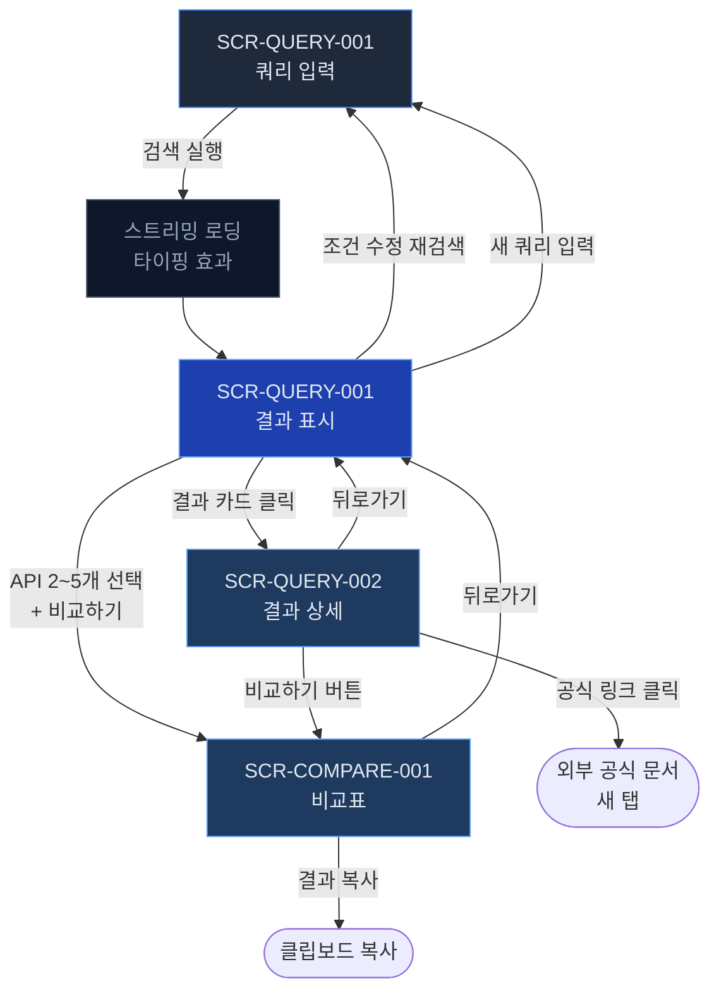
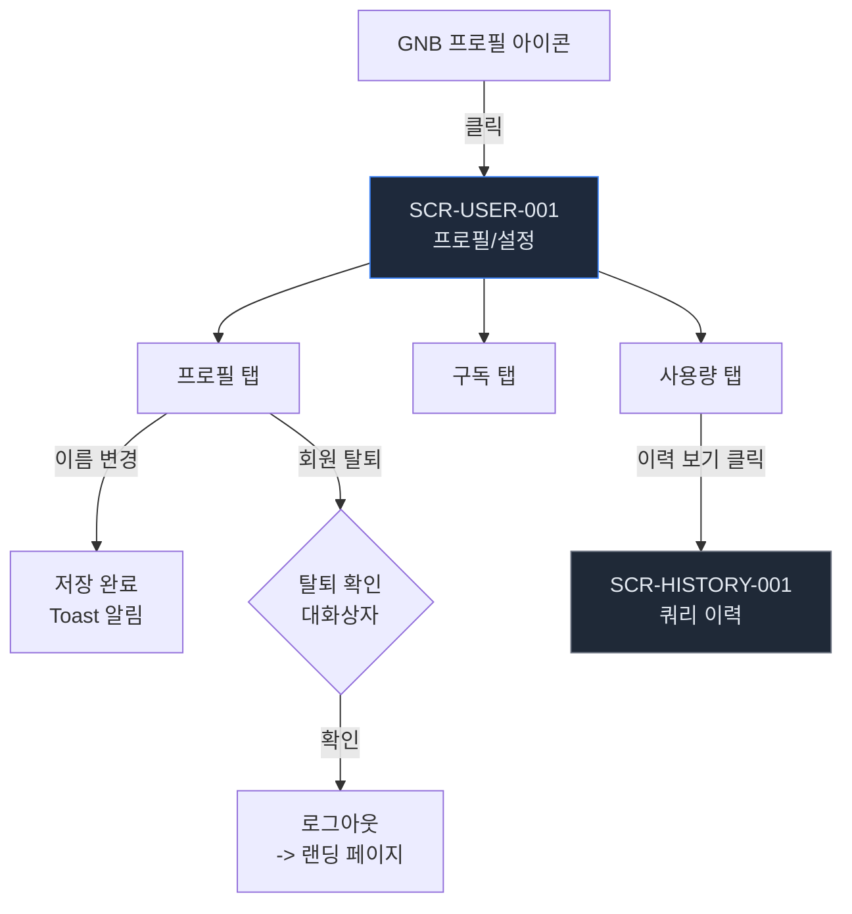

# 화면(UI/UX) 설계서

| 항목 | 내용 |
|------|------|
| **프로젝트명** | API Intelligence Engine |
| **문서 버전** | v1.0 |
| **작성일** | 2026-02-23 |
| **작성자** | 조훈상 / 기획·개발 |
| **승인자** | 조훈상 / 프로젝트 오너 |
| **문서 상태** | 초안 |

---

> **용어 규칙:** 본 문서는 [`용어규칙.md`](../01-요구사항분석/용어규칙.md)의 표기 원칙과 용어 사전을 준수한다. 새로운 용어 사용 시 반드시 해당 문서에 먼저 등록한다.

---

## 1. 설계 원칙

### 1.1 사용성 (Usability)

| 원칙 | 설명 | 적용 방법 |
|------|------|-----------|
| 직관성 | 개발자가 학습 없이 즉시 쿼리를 입력하고 결과를 확인할 수 있다 | 랜딩 페이지 진입 즉시 입력창 노출, 예시 쿼리 제공 |
| 일관성 | 전체 화면에서 동일한 다크 테마 패턴과 컴포넌트 규칙을 적용한다 | shadcn/ui 기반 디자인 시스템, Tailwind CSS 유틸리티 |
| 피드백 | 사용자 행동에 대한 즉각적 반응을 제공한다 | 스트리밍 응답(타이핑 효과), 로딩 스켈레톤, Toast 알림 |
| 효율성 | 핵심 기능(쿼리 입력)에 최소 단계로 접근할 수 있다 | 랜딩 페이지에서 1클릭(예시 쿼리) 또는 직접 입력으로 결과 도달 |
| 오류 방지 | 실수 가능성을 사전에 차단한다 | 입력 길이 제한 실시간 검증, 되돌릴 수 없는 작업에 확인 대화상자 |

### 1.2 접근성 (Accessibility)

| 기준 | 수준 | 적용 항목 |
|------|------|-----------|
| WCAG | 2.1 AA | 전체 화면 적용 |
| 키보드 접근성 | 필수 | 모든 인터랙티브 요소 Tab 이동 가능 |
| 스크린리더 | 필수 | ARIA 속성, 시멘틱 HTML |
| 색상 대비 | 최소 4.5:1 (일반 텍스트), 7:1 (코드 블록) | 다크 테마 기준 전체 텍스트 및 아이콘 |
| 폰트 크기 | 최소 14px (본문) | 확대 200%까지 레이아웃 유지 |
| 대체 텍스트 | 필수 | 모든 이미지, 아이콘에 alt / aria-label |
| 포커스 표시 | 필수 | 포커스 상태 시각적 표시 (ring-2 ring-offset-2) |

### 1.3 반응형 디자인 (Responsive)

| 브레이크포인트 | 범위 | 대상 기기 | 레이아웃 |
|--------------|------|-----------|----------|
| Mobile (sm) | < 640px | 스마트폰 | 단일 컬럼, 햄버거 메뉴 |
| Tablet (md) | 640px ~ 1023px | 태블릿 | 2 컬럼, 축소 사이드바 |
| Desktop (lg) | 1024px ~ 1279px | 노트북 | GNB + 메인 콘텐츠 |
| Wide (xl) | >= 1280px | 데스크톱 | 풀 레이아웃, 최대 너비 1280px |

### 1.4 변경 이력

| 버전 | 날짜 | 작성자 | 변경 내용 |
|------|------|--------|-----------|
| v0.1 | 2026-02-23 | 조훈상 | 초안 작성 |
| v1.0 | 2026-02-23 | 조훈상 | 전체 화면 상세 명세 완료 |

---

## 2. 화면 목록

### 2.1 전체 화면 목록

| 화면 ID | 화면명 | URL | 접근 권한 | 상태 | 비고 |
|---------|--------|-----|-----------|------|------|
| SCR-LAND-001 | 랜딩 페이지 | `/` | 전체 | 설계완료 | 서비스 소개, 예시 쿼리, 체험 CTA |
| SCR-AUTH-001 | 로그인 | `/login` | 비인증 | 설계완료 | GitHub OAuth 전용 |
| SCR-QUERY-001 | 쿼리 입력/결과 | `/query` | 전체 | 설계완료 | 핵심 화면, 스트리밍 응답 |
| SCR-QUERY-002 | 쿼리 결과 상세 | `/query/{id}` | 전체 | 설계완료 | 근거 인용 카드, 공식 링크 |
| SCR-COMPARE-001 | 비교표 | `/compare` | 인증 | 설계완료 | 2~5개 API 조건별 비교 |
| SCR-HISTORY-001 | 쿼리 이력 | `/history` | 인증 | 설계완료 | 이전 검색 목록 |
| SCR-USER-001 | 프로필/설정 | `/settings` | 인증 | 설계완료 | 내 정보, 구독, 사용량 |
| SCR-ERR-001 | 404 에러 페이지 | `/404` | 전체 | 설계완료 | - |
| SCR-ERR-002 | 500 에러 페이지 | `/500` | 전체 | 설계완료 | - |

---

## 3. 화면 흐름도

### 3.1 전체 서비스 플로우

```mermaid
flowchart TD
    START([서비스 접속]) --> LANDING[SCR-LAND-001<br/>랜딩 페이지]

    LANDING -->|예시 쿼리 클릭<br/>또는 직접 입력| QUERY[SCR-QUERY-001<br/>쿼리 입력/결과]
    LANDING -->|로그인 클릭| LOGIN[SCR-AUTH-001<br/>로그인]

    LOGIN -->|GitHub OAuth 성공<br/>(기존 사용자 또는 자동 가입)| QUERY

    QUERY -->|결과 카드 클릭| DETAIL[SCR-QUERY-002<br/>결과 상세]
    QUERY -->|비교하기 버튼| COMPARE[SCR-COMPARE-001<br/>비교표]
    DETAIL -->|비교하기 버튼| COMPARE
    DETAIL -->|뒤로가기| QUERY

    QUERY -->|이력 메뉴 클릭| HISTORY[SCR-HISTORY-001<br/>쿼리 이력]
    HISTORY -->|이력 항목 클릭| DETAIL

    QUERY -->|프로필 클릭| SETTINGS[SCR-USER-001<br/>프로필/설정]

    style LANDING fill:#1E293B,color:#E2E8F0,stroke:#3B82F6
    style QUERY fill:#1E40AF,color:#E2E8F0,stroke:#60A5FA
    style DETAIL fill:#1E3A5F,color:#E2E8F0,stroke:#60A5FA
    style COMPARE fill:#1E3A5F,color:#E2E8F0,stroke:#60A5FA
    style LOGIN fill:#374151,color:#E2E8F0,stroke:#6B7280
    style HISTORY fill:#1F2937,color:#E2E8F0,stroke:#6B7280
    style SETTINGS fill:#1F2937,color:#E2E8F0,stroke:#6B7280
```

### 3.2 인증 플로우

```mermaid
flowchart TD
    START([앱 진입]) --> CHECK{인증 상태<br/>확인}
    CHECK -->|미인증| LANDING[SCR-LAND-001<br/>랜딩 페이지]
    CHECK -->|인증됨| QUERY[SCR-QUERY-001<br/>쿼리 입력/결과]

    LANDING -->|로그인 클릭| LOGIN[SCR-AUTH-001<br/>로그인]
    LANDING -->|체험 쿼리| QUERY_GUEST[SCR-QUERY-001<br/>체험 쿼리 3회]

    LOGIN -->|GitHub OAuth 성공<br/>(기존 사용자 로그인<br/>또는 최초 로그인 시 자동 가입)| QUERY

    QUERY_GUEST -->|횟수 소진 시<br/>로그인 유도| LOGIN

    style LOGIN fill:#1E293B,color:#E2E8F0,stroke:#3B82F6
    style QUERY fill:#1E40AF,color:#E2E8F0,stroke:#60A5FA
```

### 3.3 쿼리 실행 플로우



### 3.4 사용자 설정 플로우



---

## 4. 공통 레이아웃

### 4.1 GNB (Global Navigation Bar)

전체 페이지에 공통으로 적용되는 상단 내비게이션 바이다. 랜딩 페이지(`/`)에서는 투명 배경, 그 외 페이지에서는 다크 배경(`bg-slate-900`)을 적용한다.

```
+------------------------------------------------------------------------+
|  [Logo] API Intelligence Engine    /query  /history   [Avatar] [Login] |
+------------------------------------------------------------------------+
```

| 요소 ID | 유형 | 설명 | 동작 | 조건부 표시 |
|---------|------|------|------|------------|
| GNB-001 | Image + Text | 서비스 로고 | 클릭 시 `/`로 이동 | 항상 |
| GNB-002 | Link | 쿼리 (`/query`) | 클릭 시 쿼리 입력 화면 이동 | 항상 |
| GNB-003 | Link | 이력 (`/history`) | 클릭 시 쿼리 이력 화면 이동 | 인증 시 |
| GNB-004 | Avatar + Dropdown | 사용자 프로필 | 클릭 시 드롭다운 (설정, 로그아웃) | 인증 시 |
| GNB-005 | Button (primary) | 로그인 버튼 | 클릭 시 `/login`으로 이동 (GitHub OAuth) | 비인증 시 |
| GNB-007 | Text | 잔여 쿼리 횟수 | 현재 잔여 쿼리 횟수 표시 (예: `17/20`) | 인증 시 |

모바일(< 640px)에서는 GNB-002 ~ GNB-003이 햄버거 메뉴로 접힌다.

### 4.2 Footer

```
+------------------------------------------------------------------------+
|  (c) 2026 API Intelligence Engine   |  이용약관  |  개인정보처리방침   |
+------------------------------------------------------------------------+
```

---

## 5. 화면 상세 명세

---

### 5.1 SCR-LAND-001: 랜딩 페이지

#### 기본 정보

| 항목 | 내용 |
|------|------|
| **화면 ID** | SCR-LAND-001 |
| **화면명** | 랜딩 페이지 |
| **URL** | `/` |
| **접근 권한** | 전체 (비인증 포함) |
| **관련 API** | N/A |
| **관련 유스케이스** | UC-003 (예시 쿼리 진입점) |

#### 레이아웃 설명

```
+------------------------------------------------------------------------+
|  [Logo]  API Intelligence Engine          /query            [Login]     |
+------------------------------------------------------------------------+
|                                                                        |
|            API 선택, 더 이상 감으로 하지 마세요.                        |
|            공식 문서 기반 근거와 함께 최적의 API를 추천합니다.          |
|                                                                        |
|     +------------------------------------------------------+           |
|     |  "한국 리전 지원, Node.js SDK, 무료 플랜 SMS API"     |  [검색]  |
|     +------------------------------------------------------+           |
|                                                                        |
|     예시 쿼리:                                                         |
|     [Node.js SDK 이메일 API]  [무료 벡터 DB 비교]  [LLM API 가격 비교] |
|                                                                        |
+------------------------------------------------------------------------+
|                                                                        |
|     +------------------+  +------------------+  +------------------+   |
|     | 공식 문서 근거    |  | 조건별 비교       |  | 구조화된 링크    |   |
|     | 환각 없는 신뢰    |  | 가격/SDK/리전     |  | 문서/가격/SDK    |   |
|     | 할 수 있는 추천   |  | 한눈에 비교       |  | 자동 정리        |   |
|     +------------------+  +------------------+  +------------------+   |
|                                                                        |
+------------------------------------------------------------------------+
|  Footer                                                                |
+------------------------------------------------------------------------+
```

#### 구성 요소

| 요소 ID | 유형 | 설명 | 동작 | 검증 규칙 |
|---------|------|------|------|-----------|
| EL-001 | Text (h1) | 메인 헤드라인 | - | N/A |
| EL-002 | Text (p) | 서브 헤드라인 (서비스 한 줄 설명) | - | N/A |
| EL-003 | Input (text) | 쿼리 입력창 (placeholder 포함) | Enter 또는 검색 버튼 클릭 시 `/query?q={input}`으로 이동 | 1~500자 |
| EL-004 | Button (primary) | 검색 버튼 | EL-003과 동일 동작 | 입력값 존재 시 활성화 |
| EL-005 | Chip (반복) | 예시 쿼리 목록 (3~5개) | 클릭 시 해당 텍스트로 `/query?q={example}`으로 이동 | N/A |
| EL-006 | Card (반복, 3개) | 핵심 가치 소개 카드 | - | N/A |

#### 이벤트

| 이벤트 | 트리거 | 동작 | API 연동 |
|--------|--------|------|----------|
| 쿼리 실행 | 검색 버튼 클릭 또는 Enter | `/query?q={input}`으로 라우팅 | N/A (쿼리 페이지에서 API 호출) |
| 예시 쿼리 클릭 | 예시 칩 클릭 | 해당 쿼리로 `/query?q={example}` 이동 | N/A |

#### 상태별 화면

| 상태 | 조건 | 화면 구성 |
|------|------|-----------|
| 기본 | 화면 진입 | 입력창(비어 있음) + 예시 쿼리 + 가치 소개 카드 |
| 인증 사용자 진입 | 로그인 상태로 접근 | GNB에 프로필 아바타 표시, 로그인/가입 버튼 미노출 |

---

### 5.2 SCR-AUTH-001: 로그인

#### 기본 정보

| 항목 | 내용 |
|------|------|
| **화면 ID** | SCR-AUTH-001 |
| **화면명** | 로그인 |
| **URL** | `/login` |
| **접근 권한** | 비인증 (인증 사용자 접근 시 `/query`로 리다이렉트) |
| **관련 API** | `GET /api/v1/auth/github` |
| **관련 유스케이스** | UC-001, UC-002 |

#### 레이아웃 설명

```
+------------------------------------------+
|            [Logo] 로고                    |
+------------------------------------------+
|                                          |
|        API Intelligence Engine           |
|                                          |
|        GitHub 계정으로 시작하세요         |
|                                          |
|        +----------------------+          |
|        | [GitHub] GitHub으로   |          |
|        |        로그인        |          |
|        +----------------------+          |
|                                          |
|        GitHub 최초 로그인 시             |
|        자동으로 계정이 생성됩니다.       |
|                                          |
+------------------------------------------+
```

#### 구성 요소

| 요소 ID | 유형 | 설명 | 동작 | 검증 규칙 |
|---------|------|------|------|-----------|
| EL-001 | Image | 서비스 로고 | 클릭 시 `/`로 이동 | N/A |
| EL-002 | Text (h2) | 서비스명 | - | N/A |
| EL-003 | Text (p) | 안내 문구 ("GitHub 계정으로 시작하세요") | - | N/A |
| EL-004 | Button (primary, large) | GitHub 로그인 버튼 | GitHub OAuth 플로우 시작 | N/A |
| EL-005 | Text (caption) | 자동 가입 안내 ("GitHub 최초 로그인 시 자동으로 계정이 생성됩니다.") | - | N/A |

#### 이벤트

| 이벤트 | 트리거 | 동작 | API 연동 |
|--------|--------|------|----------|
| GitHub OAuth | GitHub 로그인 버튼 클릭 | GitHub OAuth Provider로 리다이렉트 | `GET /api/v1/auth/github` |
| 로그인 성공 (기존 사용자) | OAuth 콜백 200 응답 | Token 저장, `/query`로 리다이렉트 | N/A |
| 로그인 성공 (신규 사용자) | OAuth 콜백 201 응답 | Token 저장, `/query`로 리다이렉트 (자동 회원가입 완료) | N/A |
| OAuth 실패 | OAuth 콜백 에러 | "GitHub 로그인에 실패했습니다. 다시 시도해주세요" 에러 표시 | N/A |

#### 상태별 화면

| 상태 | 조건 | 화면 구성 |
|------|------|-----------|
| 초기 | 화면 진입 | GitHub 로그인 버튼 + 안내 문구 |
| 로딩 | GitHub OAuth 처리 중 | 버튼에 Spinner 표시 |
| 에러 | OAuth 실패 | 에러 배너 (destructive 스타일) + 재시도 안내 |
| 성공 | 로그인/가입 완료 | `/query`로 리다이렉트 |

---

### 5.3 SCR-QUERY-001: 쿼리 입력/결과 (핵심 화면)

> 본 서비스의 Core Loop 중심 화면이다. 사용자의 자연어 입력을 받아 RAG(Retrieval-Augmented Generation) 파이프라인으로 공식 문서 기반 API 추천 결과를 스트리밍 형태로 제공한다.

#### 기본 정보

| 항목 | 내용 |
|------|------|
| **화면 ID** | SCR-QUERY-001 |
| **화면명** | 쿼리 입력/결과 |
| **URL** | `/query` (쿼리스트링: `?q={query}`) |
| **접근 권한** | 전체 (비회원: 체험 3회, 무료 회원: 월 20회) |
| **관련 API** | `POST /api/v1/query` (스트리밍), `GET /api/v1/query/examples` |
| **관련 유스케이스** | UC-003 |

#### 레이아웃 설명 -- 초기 상태 (입력 대기)

```
+------------------------------------------------------------------------+
|  [Logo]  API Intelligence Engine    /query  /history   [17/20] [Avatar] |
+------------------------------------------------------------------------+
|                                                                        |
|                                                                        |
|                                                                        |
|            API에 대해 무엇이든 물어보세요                               |
|                                                                        |
|     +------------------------------------------------------+           |
|     |  예: "한국 리전 지원, Node.js SDK, 무료 SMS API"      |  [검색]  |
|     +------------------------------------------------------+           |
|       0/500                                                            |
|                                                                        |
|     예시 쿼리:                                                         |
|     +---------------------------+  +---------------------------+       |
|     | Node.js SDK 이메일 API    |  | 무료 플랜 벡터 DB 비교    |       |
|     +---------------------------+  +---------------------------+       |
|     +---------------------------+  +---------------------------+       |
|     | LLM API 가격 비교          |  | 한국 리전 결제 API        |       |
|     +---------------------------+  +---------------------------+       |
|                                                                        |
|                                                                        |
+------------------------------------------------------------------------+
|  Footer                                                                |
+------------------------------------------------------------------------+
```

#### 레이아웃 설명 -- 스트리밍 응답 (결과 수신 중)

```
+------------------------------------------------------------------------+
|  [Logo]  API Intelligence Engine    /query  /history   [16/20] [Avatar] |
+------------------------------------------------------------------------+
|                                                                        |
|  +------------------------------------------------------------------+  |
|  |  "한국 리전 지원, Node.js SDK, 무료 플랜 SMS API"        [수정]  |  |
|  +------------------------------------------------------------------+  |
|                                                                        |
|  추출된 조건:                                                          |
|  [리전: 한국]  [SDK: Node.js]  [가격: 무료 플랜]  [카테고리: SMS]      |
|                                                                        |
|  +------------------------------------------------------------------+  |
|  |  공식 문서에서 검색 중...                                         |  |
|  |                                                                    |  |
|  |  +------------------------------------------------------------+  |  |
|  |  |  Twilio SMS API                             매칭 92%       |  |  |
|  |  |  Twilio Inc.                                               |  |  |
|  |  |                                                            |  |  |
|  |  |  리전: 한국 지원 [v]  SDK: Node.js [v]  무료: $15 크레딧 [v]|  |  |
|  |  |                                                            |  |  |
|  |  |  근거: "Twilio provides phone numbers in 100+..."          |  |  |
|  |  |  [공식 문서]  [가격 페이지]  [SDK(npm)]  [상태 페이지]      |  |  |
|  |  +------------------------------------------------------------+  |  |
|  |                                                                    |  |
|  |  +------------------------------------------------------------+  |  |
|  |  |  [Skeleton UI -- 다음 결과 로딩 중...]                     |  |  |
|  |  |  ||||||||||||||||||||||||||||||| (타이핑 커서 깜빡임)       |  |  |
|  |  +------------------------------------------------------------+  |  |
|  |                                                                    |  |
|  +------------------------------------------------------------------+  |
|                                                                        |
+------------------------------------------------------------------------+
```

#### 레이아웃 설명 -- 결과 완료 상태

```
+------------------------------------------------------------------------+
|  [Logo]  API Intelligence Engine    /query  /history   [16/20] [Avatar] |
+------------------------------------------------------------------------+
|                                                                        |
|  +------------------------------------------------------------------+  |
|  |  "한국 리전 지원, Node.js SDK, 무료 플랜 SMS API"        [수정]  |  |
|  +------------------------------------------------------------------+  |
|                                                                        |
|  추출된 조건:  (클릭하여 수정 가능)                                     |
|  [리전: 한국 x]  [SDK: Node.js x]  [가격: 무료 플랜 x]  [+ 조건 추가] |
|                                                                        |
|  3개의 API를 찾았습니다.          [재검색]  [ ] 비교할 API 선택         |
|                                                                        |
|  +------------------------------------------------------------------+  |
|  |  [ ] Twilio SMS API                             매칭 92%        |  |
|  |  Twilio Inc.                                                     |  |
|  |                                                                  |  |
|  |  리전: 한국 [v]  |  SDK: Node.js [v]  |  무료: $15 크레딧 [v]   |  |
|  |                                                                  |  |
|  |  > 근거 인용 (공식 문서 원문):                                    |  |
|  |  | "Twilio provides programmable phone numbers in               |  |
|  |  |  100+ countries including South Korea..."                     |  |
|  |  | -- docs.twilio.com/sms/coverage                              |  |
|  |                                                                  |  |
|  |  [공식 문서]  [가격 페이지]  [SDK (npm)]  [상태 페이지]          |  |
|  +------------------------------------------------------------------+  |
|                                                                        |
|  +------------------------------------------------------------------+  |
|  |  [ ] NHN Cloud SMS API                          매칭 85%        |  |
|  |  NHN Cloud                                                       |  |
|  |  ...                                                             |  |
|  +------------------------------------------------------------------+  |
|                                                                        |
|  +------------------------------------------------------------------+  |
|  |  [ ] AWS SNS (SMS)                              매칭 78%        |  |
|  |  Amazon Web Services                                             |  |
|  |  ...                                                             |  |
|  +------------------------------------------------------------------+  |
|                                                                        |
|  선택된 API: 0개                                                       |
|  [비교하기 (2개 이상 선택)]          [결과 복사]  [새 쿼리]            |
|                                                                        |
+------------------------------------------------------------------------+
|  Footer                                                                |
+------------------------------------------------------------------------+
```

#### 구성 요소

**입력 영역:**

| 요소 ID | 유형 | 설명 | 동작 | 검증 규칙 |
|---------|------|------|------|-----------|
| EL-Q001 | Textarea | 쿼리 입력창 (자동 높이 조절) | Enter로 검색, Shift+Enter로 줄바꿈 | 1~500자, 필수 |
| EL-Q002 | Text (caption) | 글자 수 카운터 | 입력 시 실시간 업데이트 (`{현재}/500`) | 500자 초과 시 빨간색 |
| EL-Q003 | Button (primary) | 검색 버튼 | 쿼리 실행 API 호출 (스트리밍) | 입력값 존재 시 활성화 |
| EL-Q004 | Chip (반복) | 예시 쿼리 목록 | 클릭 시 입력창에 텍스트 채움 후 자동 검색 | 초기 상태에서만 표시 |

**조건 태그 영역 (결과 수신 후 표시):**

| 요소 ID | 유형 | 설명 | 동작 | 검증 규칙 |
|---------|------|------|------|-----------|
| EL-Q010 | Tag (removable, 반복) | 추출된 조건 태그 | 클릭 시 편집, x 버튼으로 삭제 | N/A |
| EL-Q011 | Button (ghost) | 조건 추가 버튼 (`+`) | 클릭 시 조건 입력 팝오버 | N/A |
| EL-Q012 | Button (outline) | 재검색 버튼 | 수정된 조건으로 재검색 (횟수 미차감) | N/A |

**결과 카드 영역:**

| 요소 ID | 유형 | 설명 | 동작 | 검증 규칙 |
|---------|------|------|------|-----------|
| EL-Q020 | Text | 결과 요약 ("N개의 API를 찾았습니다") | - | N/A |
| EL-Q021 | Card (반복) | API 추천 결과 카드 | 카드 클릭 시 `/query/{id}`로 이동 | 매칭 점수 0.7 이상만 표시 |
| EL-Q022 | Checkbox | 비교 선택 체크박스 (카드 내) | 체크 시 비교 대상에 추가 | 최대 5개 |
| EL-Q023 | Text (monospace) | API명 | `font-mono` 스타일 적용 | N/A |
| EL-Q024 | Badge | 매칭 점수 | 90%+: green, 70~89%: yellow, <70%: 미표시 | N/A |
| EL-Q025 | Badge (반복) | 조건 충족 상태 | 충족: green `[v]`, 미충족: red `[x]`, 확인 불가: gray `[?]` | N/A |
| EL-Q026 | Blockquote (monospace) | 공식 문서 근거 인용 | 모노스페이스 폰트, 왼쪽 보더 강조 | N/A |
| EL-Q027 | Text (caption) | 인용 소스 (문서 URL) | 클릭 시 외부 링크 새 탭 오픈 | N/A |
| EL-Q028 | Button (link, 반복) | 공식 링크 버튼 목록 | 클릭 시 외부 링크 새 탭, 클릭 이벤트 기록 | N/A |

**하단 액션 영역:**

| 요소 ID | 유형 | 설명 | 동작 | 검증 규칙 |
|---------|------|------|------|-----------|
| EL-Q030 | Text | 선택된 API 수 | 체크박스 선택 시 실시간 업데이트 | N/A |
| EL-Q031 | Button (primary) | 비교하기 버튼 | `/compare`로 이동 (선택된 API ID 전달) | 2개 이상 선택 시 활성화, 최대 5개 |
| EL-Q032 | Button (outline) | 결과 복사 버튼 | 결과를 마크다운 형식으로 클립보드 복사 | N/A |
| EL-Q033 | Button (ghost) | 새 쿼리 버튼 | 입력창 초기화, 초기 상태로 복귀 | N/A |

**비회원 전용 요소:**

| 요소 ID | 유형 | 설명 | 동작 | 검증 규칙 |
|---------|------|------|------|-----------|
| EL-Q040 | Banner | 체험 쿼리 안내 | "체험 쿼리 N/3회 사용" 표시 | 비회원에게만 표시 |
| EL-Q041 | Banner (CTA) | 로그인 유도 배너 | 결과 하단에 "GitHub 로그인 시 월 20회 무료" 안내 | 비회원에게만 표시 |

#### 이벤트

| 이벤트 | 트리거 | 동작 | API 연동 |
|--------|--------|------|----------|
| 쿼리 실행 | 검색 버튼 클릭 또는 Enter | 쿼리 잔여 횟수 확인 -> 스트리밍 API 호출 -> 점진적 결과 렌더링 | `POST /api/v1/query` (SSE 스트리밍) |
| 스트리밍 수신 | 서버 스트리밍 이벤트 | 조건 추출 완료 -> 조건 태그 표시 -> 결과 카드 순차 렌더링 (타이핑 효과) | SSE 이벤트 수신 |
| 조건 수정 | 조건 태그 편집/삭제/추가 | 수정된 조건을 반영 | N/A |
| 조건 수정 재검색 | 재검색 버튼 클릭 | 수정된 조건으로 재검색 (쿼리 횟수 미차감) | `POST /api/v1/query/refine` |
| 결과 카드 클릭 | 카드 본문 영역 클릭 | `/query/{id}`로 이동 | N/A |
| 비교 선택 | 체크박스 토글 | 선택된 API 수 업데이트, 2개 이상 시 비교 버튼 활성화 | N/A |
| 비교하기 | 비교 버튼 클릭 | `/compare?ids={id1},{id2},...`로 이동 | N/A |
| 결과 복사 | 복사 버튼 클릭 | 마크다운 형식 클립보드 복사 + "복사되었습니다" Toast | N/A |
| 공식 링크 클릭 | 링크 버튼 클릭 | 외부 링크 새 탭 오픈, 클릭 이벤트 기록 | `POST /api/v1/analytics/link-click` |
| 쿼리 횟수 초과 | 잔여 횟수 0에서 검색 시도 | 횟수 초과 안내 모달 표시 (비회원: 로그인 유도, 회원: 다음 달 초기화 안내) | N/A |
| 예시 쿼리 클릭 | 예시 칩 클릭 | 입력창에 텍스트 채움 후 자동 검색 실행 | `POST /api/v1/query` |

#### 스트리밍 응답 UX 상세

결과 표시는 SSE(Server-Sent Events) 기반 스트리밍으로 점진적으로 렌더링된다.

| 스트리밍 단계 | 시각적 표현 | 지속 시간 |
|--------------|------------|-----------|
| 1. 쿼리 전송 | 입력창 위로 이동, 검색 버튼 -> Spinner | 즉시 |
| 2. 조건 추출 중 | "조건을 분석하고 있습니다..." 텍스트 + 펄스 애니메이션 | 1~3초 |
| 3. 조건 추출 완료 | 조건 태그가 하나씩 나타나는 애니메이션 (fade-in) | 즉시 |
| 4. 문서 검색 중 | "공식 문서에서 검색 중..." + 스켈레톤 카드(펄스) | 2~5초 |
| 5. 첫 번째 결과 도착 | 스켈레톤 -> 실제 카드로 전환 (fade-in), 텍스트 타이핑 효과 | 즉시 |
| 6. 추가 결과 도착 | 다음 스켈레톤 -> 실제 카드로 순차 전환 | 각 1~2초 |
| 7. 스트리밍 완료 | "N개의 API를 찾았습니다" 요약 표시, 액션 버튼 활성화 | 즉시 |

**타이핑 효과 구현 방침:**
- 근거 인용 텍스트는 토큰 단위로 순차 표시된다 (커서 깜빡임 애니메이션 포함)
- 조건 매칭 상태(충족/미충족)는 즉시 표시된다
- 공식 링크는 카드 렌더링과 동시에 즉시 표시된다
- 사용자가 스크롤하면 자동 스크롤이 중단된다 (사용자 제어 우선)

#### 상태별 화면

| 상태 | 조건 | 화면 구성 |
|------|------|-----------|
| 초기 (입력 대기) | 화면 진입, 쿼리 없음 | 입력창 중앙 배치, 예시 쿼리 표시 |
| URL 쿼리 자동 실행 | `?q=` 파라미터 존재 | 입력창에 쿼리 채움 후 자동 실행 |
| 스트리밍 로딩 | API 호출 중 | 조건 추출 -> 스켈레톤 카드 -> 점진적 결과 렌더링 |
| 결과 완료 | 스트리밍 종료 | 결과 카드 목록 + 비교/복사 액션 버튼 |
| 결과 없음 | 매칭 점수 0.7 이상 결과 없음 | "조건에 맞는 API를 찾지 못했습니다" + 조건 완화 제안 + 예시 쿼리 |
| 쿼리 횟수 초과 | 잔여 횟수 0 | 횟수 초과 모달 (비회원: 로그인 유도, 회원: 다음 달 안내) |
| LLM/벡터 DB 에러 | API 장애 | "서비스에 일시적인 장애가 발생했습니다" + 재시도 버튼, 쿼리 횟수 복원 |
| 조건 추출 실패 | 무관한 입력 | "API 검색 조건을 파악하지 못했습니다" + 예시 제안, 쿼리 횟수 복원 |

---

### 5.4 SCR-QUERY-002: 쿼리 결과 상세

#### 기본 정보

| 항목 | 내용 |
|------|------|
| **화면 ID** | SCR-QUERY-002 |
| **화면명** | 쿼리 결과 상세 |
| **URL** | `/query/{id}` |
| **접근 권한** | 전체 (비회원 체험 결과 포함) |
| **관련 API** | `GET /api/v1/query/{id}` |
| **관련 유스케이스** | UC-003 |

#### 레이아웃 설명

```
+------------------------------------------------------------------------+
|  GNB                                                                   |
+------------------------------------------------------------------------+
|                                                                        |
|  [< 결과 목록으로]                                                     |
|                                                                        |
|  +------------------------------------------------------------------+  |
|  |  Twilio SMS API                                   매칭 92%       |  |
|  |  Twilio Inc.                                                     |  |
|  |  카테고리: 메시징/SMS                                             |  |
|  +------------------------------------------------------------------+  |
|                                                                        |
|  -- 조건 매칭 상태 -------------------------------------------         |
|  |  조건           |  상태    |  상세                          |        |
|  |  리전: 한국     |  충족 [v]|  100+ 국가 지원               |        |
|  |  SDK: Node.js   |  충족 [v]|  twilio (npm) v4.x            |        |
|  |  무료 플랜      |  충족 [v]|  $15.50 무료 크레딧           |        |
|  +-------------------------------------------------------------+       |
|                                                                        |
|  -- 근거 인용 카드 -------------------------------------------         |
|  +-------------------------------------------------------------+       |
|  |  "Twilio provides programmable phone numbers in              |       |
|  |   100+ countries including South Korea. Developers           |       |
|  |   can send and receive SMS..."                               |       |
|  |  -- docs.twilio.com/sms/coverage                             |       |
|  +-------------------------------------------------------------+       |
|  +-------------------------------------------------------------+       |
|  |  "Get started with a free trial that includes a              |       |
|  |   $15.50 credit..."                                         |       |
|  |  -- twilio.com/try-twilio                                    |       |
|  +-------------------------------------------------------------+       |
|                                                                        |
|  -- 공식 링크 -------------------------------------------------         |
|  [공식 문서]  [가격 페이지]  [SDK (npm)]  [상태 페이지]  [GitHub]       |
|                                                                        |
|  [비교하기]  [결과 복사]  [뒤로가기]                                   |
|                                                                        |
+------------------------------------------------------------------------+
|  Footer                                                                |
+------------------------------------------------------------------------+
```

#### 구성 요소

| 요소 ID | 유형 | 설명 | 동작 | 검증 규칙 |
|---------|------|------|------|-----------|
| EL-D001 | Link | 결과 목록으로 돌아가기 | `/query` (이전 검색 결과 유지) | N/A |
| EL-D002 | Text (h1, monospace) | API명 | `font-mono` 스타일 | N/A |
| EL-D003 | Text (caption) | 제공 업체명 | - | N/A |
| EL-D004 | Badge | 매칭 점수 | 색상 단계별 표시 | N/A |
| EL-D005 | Text | 카테고리 표시 | - | N/A |
| EL-D006 | Table | 조건 매칭 상태 테이블 | 행: 각 조건, 열: 상태/상세 | N/A |
| EL-D007 | Badge (반복) | 충족 상태 아이콘 | 충족: green, 미충족: red, 확인 불가: gray | N/A |
| EL-D008 | Card (blockquote, 반복) | 근거 인용 카드 | 모노스페이스 폰트, 좌측 보더, 소스 URL | N/A |
| EL-D009 | Text (link, caption) | 인용 소스 URL | 클릭 시 외부 링크 새 탭 | N/A |
| EL-D010 | ButtonGroup (반복) | 공식 링크 버튼 목록 | 클릭 시 외부 링크 새 탭, 이벤트 기록 | N/A |
| EL-D011 | Button (primary) | 비교하기 버튼 | `/compare?ids={id}` 이동 (추가 API 선택 안내) | 인증 사용자만 |
| EL-D012 | Button (outline) | 결과 복사 | 마크다운 형식 클립보드 복사 | N/A |
| EL-D013 | Button (ghost) | 뒤로가기 | 이전 화면 복귀 | N/A |

#### 이벤트

| 이벤트 | 트리거 | 동작 | API 연동 |
|--------|--------|------|----------|
| 상세 로드 | 화면 진입 | 결과 상세 데이터 조회 | `GET /api/v1/query/{id}` |
| 공식 링크 클릭 | 링크 버튼 클릭 | 외부 링크 새 탭 + 클릭 이벤트 기록 | `POST /api/v1/analytics/link-click` |
| 결과 복사 | 복사 버튼 클릭 | 마크다운 형식 클립보드 복사 + Toast | N/A |

#### 상태별 화면

| 상태 | 조건 | 화면 구성 |
|------|------|-----------|
| 로딩 | API 호출 중 | 상단 API명 스켈레톤, 조건 테이블 스켈레톤, 인용 카드 스켈레톤 |
| 정상 | 데이터 존재 | 전체 상세 정보 표시 |
| 결과 없음 | 404 응답 | "해당 결과를 찾을 수 없습니다" + 검색 화면 이동 버튼 |
| 에러 | API 실패 | 에러 메시지 + 새로고침 버튼 |

---

### 5.5 SCR-COMPARE-001: 비교표

#### 기본 정보

| 항목 | 내용 |
|------|------|
| **화면 ID** | SCR-COMPARE-001 |
| **화면명** | 비교표 |
| **URL** | `/compare` (쿼리스트링: `?ids={id1},{id2},...`) |
| **접근 권한** | 인증 필수 (비인증 시 로그인 유도) |
| **관련 API** | `POST /api/v1/compare` |
| **관련 유스케이스** | UC-004 |

#### 레이아웃 설명

```
+------------------------------------------------------------------------+
|  GNB                                                                   |
+------------------------------------------------------------------------+
|                                                                        |
|  [< 검색 결과로]                                                       |
|                                                                        |
|  API 비교 -- 3개 API 비교 중                        [결과 복사]        |
|                                                                        |
|  +------------------------------------------------------------------+  |
|  |              | Twilio SMS  | NHN Cloud SMS | AWS SNS (SMS)      |  |
|  |--------------|-------------|---------------|-------------------- |  |
|  | 제공 업체    | Twilio Inc. | NHN Cloud     | AWS                |  |
|  |--------------|-------------|---------------|-------------------- |  |
|  | 가격         | $15 크레딧  | 건당 9.9원    | $1.00/100건        |  |
|  |  (근거)      | [인용]      | [인용]        | [인용]             |  |
|  |--------------|-------------|---------------|-------------------- |  |
|  | SDK (Node.js)| v4.x [v]    | v2.x [v]      | v3.x [v]          |  |
|  |  (근거)      | [인용]      | [인용]        | [인용]             |  |
|  |--------------|-------------|---------------|-------------------- |  |
|  | 리전 (한국)  | 지원 [v]    | 지원 [v]      | 서울 리전 [v]     |  |
|  |  (근거)      | [인용]      | [인용]        | [인용]             |  |
|  |--------------|-------------|---------------|-------------------- |  |
|  | 인증 방식    | API Key     | App Key       | IAM               |  |
|  |  (근거)      | [인용]      | [인용]        | [인용]             |  |
|  |--------------|-------------|---------------|-------------------- |  |
|  | 호출 제한    | 없음        | 초당 50건     | 초당 10건         |  |
|  |  (근거)      | [인용]      | [인용]        | [인용]             |  |
|  |--------------|-------------|---------------|-------------------- |  |
|  | 공식 문서    | [링크]      | [링크]        | [링크]            |  |
|  | 가격 페이지  | [링크]      | [링크]        | [링크]            |  |
|  | 상태 페이지  | [링크]      | [링크]        | [링크]            |  |
|  +------------------------------------------------------------------+  |
|                                                                        |
|  * "공식 문서에서 확인 불가" 항목은 회색으로 표시                       |
|                                                                        |
|  [결과 복사]  [새 비교]  [검색 결과로]                                 |
|                                                                        |
+------------------------------------------------------------------------+
|  Footer                                                                |
+------------------------------------------------------------------------+
```

#### 구성 요소

| 요소 ID | 유형 | 설명 | 동작 | 검증 규칙 |
|---------|------|------|------|-----------|
| EL-C001 | Link | 검색 결과로 돌아가기 | 이전 검색 결과 화면 복귀 | N/A |
| EL-C002 | Text (h1) | 페이지 제목 + 비교 API 수 | - | N/A |
| EL-C003 | Table | 비교표 | 행: 비교 기준, 열: API별 정보 | 최소 2개, 최대 5개 API |
| EL-C004 | Text (monospace, 반복) | API 이름 (열 헤더) | `font-mono` 스타일 | N/A |
| EL-C005 | Badge (반복) | 충족 상태 | 충족/미충족/확인 불가 | N/A |
| EL-C006 | Tooltip (반복) | 근거 인용 팝업 | 셀 호버 또는 [인용] 클릭 시 근거 원문 표시 | N/A |
| EL-C007 | Link (반복) | 공식 링크 | 클릭 시 외부 링크 새 탭 | N/A |
| EL-C008 | Button (outline) | 결과 복사 | 비교표를 마크다운 형식으로 클립보드 복사 | N/A |
| EL-C009 | Button (ghost) | 새 비교 | `/query`로 이동 | N/A |

#### 이벤트

| 이벤트 | 트리거 | 동작 | API 연동 |
|--------|--------|------|----------|
| 비교표 생성 | 화면 진입 | 선택된 API ID로 비교 데이터 조회 + 비교표 생성 | `POST /api/v1/compare` |
| 인용 확인 | 셀 호버 또는 [인용] 클릭 | 해당 항목의 공식 문서 근거 원문 Tooltip 표시 | N/A |
| 결과 복사 | 복사 버튼 클릭 | 마크다운 테이블 형식 클립보드 복사 + Toast | N/A |
| 공식 링크 클릭 | 링크 클릭 | 외부 링크 새 탭 + 이벤트 기록 | `POST /api/v1/analytics/link-click` |

#### 상태별 화면

| 상태 | 조건 | 화면 구성 |
|------|------|-----------|
| 로딩 | API 호출 중 | 비교표 전체 스켈레톤 UI (테이블 골격 유지) |
| 정상 | 비교 데이터 존재 | 비교표 표시 |
| 부분 데이터 | 일부 항목 확인 불가 | 해당 셀 "공식 문서에서 확인 불가" (회색) |
| 에러 | API 실패 | "비교 데이터 생성 중 오류" + 재시도 버튼 |

---

### 5.6 SCR-HISTORY-001: 쿼리 이력

#### 기본 정보

| 항목 | 내용 |
|------|------|
| **화면 ID** | SCR-HISTORY-001 |
| **화면명** | 쿼리 이력 |
| **URL** | `/history` |
| **접근 권한** | 인증 필수 |
| **관련 API** | `GET /api/v1/queries`, `DELETE /api/v1/queries/{id}` |
| **관련 유스케이스** | UC-005 |

#### 레이아웃 설명

```
+------------------------------------------------------------------------+
|  GNB                                                                   |
+------------------------------------------------------------------------+
|                                                                        |
|  쿼리 이력                                                             |
|                                                                        |
|  +----------------------------------------------+  정렬: [최신순 v]   |
|  |  검색: 이전 쿼리 검색...                      |                     |
|  +----------------------------------------------+                     |
|                                                                        |
|  +------------------------------------------------------------------+  |
|  | 2026-02-23  14:30                                                |  |
|  | "한국 리전 지원, Node.js SDK, 무료 SMS API"                      |  |
|  | 결과: Twilio SMS, NHN Cloud SMS, AWS SNS  |  3개 API  |  [삭제] |  |
|  +------------------------------------------------------------------+  |
|  +------------------------------------------------------------------+  |
|  | 2026-02-22  09:15                                                |  |
|  | "무료 플랜 벡터 DB 비교"                                         |  |
|  | 결과: Pinecone, Qdrant, Weaviate          |  3개 API  |  [삭제] |  |
|  +------------------------------------------------------------------+  |
|  | ...                                                               |  |
|                                                                        |
|  << 1 2 3 ... >>  (페이지네이션)                                      |
|                                                                        |
+------------------------------------------------------------------------+
|  Footer                                                                |
+------------------------------------------------------------------------+
```

#### 구성 요소

| 요소 ID | 유형 | 설명 | 동작 | 검증 규칙 |
|---------|------|------|------|-----------|
| EL-H001 | Input (search) | 이력 검색 입력 | 쿼리 텍스트 기준 필터링 | 최소 2자 |
| EL-H002 | Select | 정렬 옵션 | 최신순/오래된순 정렬 | 기본: 최신순 |
| EL-H003 | Card (반복) | 쿼리 이력 카드 | 클릭 시 `/query/{id}`로 이동 | N/A |
| EL-H004 | Text (caption) | 실행 날짜/시간 | - | N/A |
| EL-H005 | Text (monospace) | 쿼리 텍스트 | `font-mono` 스타일 | N/A |
| EL-H006 | Text (caption) | 결과 API 이름 요약 | 결과 API명 나열 | N/A |
| EL-H007 | Badge | 결과 API 수 | - | N/A |
| EL-H008 | Button (ghost, danger) | 삭제 버튼 | 삭제 확인 대화상자 표시 | N/A |
| EL-H009 | Pagination | 페이지네이션 | 페이지 이동 | 페이지당 10건 |

#### 이벤트

| 이벤트 | 트리거 | 동작 | API 연동 |
|--------|--------|------|----------|
| 이력 로드 | 화면 진입 | 이력 목록 조회 (최신순) | `GET /api/v1/queries?page=1&sort=desc` |
| 이력 검색 | 검색 입력 후 Enter 또는 300ms 디바운스 | 쿼리 텍스트 기준 필터링 | `GET /api/v1/queries?q={search}` |
| 이력 클릭 | 카드 클릭 | `/query/{id}`로 이동 | N/A |
| 이력 삭제 | 삭제 버튼 -> 확인 대화상자 승인 | 이력 삭제 후 목록 갱신 | `DELETE /api/v1/queries/{id}` |
| 페이지 이동 | 페이지 번호 클릭 | 해당 페이지 조회 | `GET /api/v1/queries?page={n}` |

#### 상태별 화면

| 상태 | 조건 | 화면 구성 |
|------|------|-----------|
| 로딩 | API 호출 중 | 카드 스켈레톤 UI (5개) |
| 정상 | 이력 존재 | 카드 목록 + 페이지네이션 |
| 빈 상태 | 이력 0건 | "아직 실행한 쿼리가 없습니다. 첫 쿼리를 실행해보세요!" + `/query` CTA |
| 검색 결과 없음 | 검색 결과 0건 | "일치하는 이력이 없습니다." |
| 에러 | API 실패 | 에러 메시지 + 재시도 버튼 |

---

### 5.7 SCR-USER-001: 프로필/설정

#### 기본 정보

| 항목 | 내용 |
|------|------|
| **화면 ID** | SCR-USER-001 |
| **화면명** | 프로필/설정 |
| **URL** | `/settings` |
| **접근 권한** | 인증 필수 |
| **관련 API** | `GET /api/v1/users/me`, `PATCH /api/v1/users/me`, `GET /api/v1/users/me/usage` |
| **관련 유스케이스** | UC-006 |

#### 레이아웃 설명

```
+------------------------------------------------------------------------+
|  GNB                                                                   |
+------------------------------------------------------------------------+
|                                                                        |
|  설정                                                                  |
|                                                                        |
|  [프로필]  [구독]  [사용량]                        (탭 메뉴)           |
|  ================================================================      |
|                                                                        |
|  -- 프로필 탭 --                                                       |
|  +------------------------------------------------------------------+  |
|  |  아바타 이미지       이름: 조훈상            [수정]               |  |
|  |                     이메일: user@example.com (GitHub 연동)       |  |
|  |                     가입일: 2026-02-01                            |  |
|  |                     로그인 방식: GitHub                           |  |
|  +------------------------------------------------------------------+  |
|                                                                        |
|  [회원 탈퇴]                                                           |
|                                                                        |
|  -- 구독 탭 --                                                         |
|  +------------------------------------------------------------------+  |
|  |  현재 플랜: Free                                                 |  |
|  |  월간 쿼리: 20회                                                 |  |
|  |  비교 기능: 최대 3개 API                                         |  |
|  |  [Pro 업그레이드 (준비 중)]                                      |  |
|  +------------------------------------------------------------------+  |
|                                                                        |
|  -- 사용량 탭 --                                                       |
|  +------------------------------------------------------------------+  |
|  |  이번 달 쿼리 사용량: 17 / 20회                                  |  |
|  |  [=================---]  85%                                     |  |
|  |  초기화 예정일: 2026-03-01                                       |  |
|  |                                                                  |  |
|  |  총 실행한 쿼리: 42건                                            |  |
|  |  총 비교 실행: 8건                                               |  |
|  |  가장 많이 검색한 카테고리: LLM API                              |  |
|  |                                                                  |  |
|  |  [이력 보기]                                                     |  |
|  +------------------------------------------------------------------+  |
|                                                                        |
+------------------------------------------------------------------------+
|  Footer                                                                |
+------------------------------------------------------------------------+
```

#### 구성 요소

**프로필 탭:**

| 요소 ID | 유형 | 설명 | 동작 | 검증 규칙 |
|---------|------|------|------|-----------|
| EL-U001 | Avatar | 사용자 아바타 | - | N/A |
| EL-U002 | Text + Input | 이름 (편집 가능) | [수정] 클릭 시 인라인 편집 모드 전환 | 2~100자 |
| EL-U003 | Text | 이메일 (읽기 전용) | - | N/A |
| EL-U004 | Text | 가입일 | - | N/A |
| EL-U005 | Text | 로그인 방식 (GitHub) | - | N/A |
| EL-U006 | Button (ghost, danger) | 회원 탈퇴 | 탈퇴 확인 대화상자 표시 | N/A |

**구독 탭:**

| 요소 ID | 유형 | 설명 | 동작 | 검증 규칙 |
|---------|------|------|------|-----------|
| EL-U010 | Card | 현재 플랜 정보 | - | N/A |
| EL-U011 | Button (primary, disabled) | Pro 업그레이드 | 비활성화 (v2 예정) | N/A |

**사용량 탭:**

| 요소 ID | 유형 | 설명 | 동작 | 검증 규칙 |
|---------|------|------|------|-----------|
| EL-U020 | ProgressBar | 월간 쿼리 사용량 | 비율에 따라 색상 변화 (80%+: amber, 100%: red) | N/A |
| EL-U021 | Text | 초기화 예정일 | - | N/A |
| EL-U022 | Text | 총 쿼리/비교 통계 | - | N/A |
| EL-U023 | Text | 주요 카테고리 | 가장 많이 검색한 카테고리 표시 | N/A |
| EL-U024 | Button (link) | 이력 보기 | `/history`로 이동 | N/A |

#### 이벤트

| 이벤트 | 트리거 | 동작 | API 연동 |
|--------|--------|------|----------|
| 프로필 로드 | 화면 진입 | 사용자 정보 + 사용량 조회 | `GET /api/v1/users/me`, `GET /api/v1/users/me/usage` |
| 이름 수정 | 수정 버튼 -> 인라인 편집 -> 저장 | 이름 업데이트 + Toast | `PATCH /api/v1/users/me` |
| 회원 탈퇴 | 탈퇴 버튼 -> 확인 대화상자 -> "탈퇴" 입력 -> 확인 | 계정 삭제, 로그아웃, 랜딩 페이지로 이동 | `DELETE /api/v1/users/me` |

#### 상태별 화면

| 상태 | 조건 | 화면 구성 |
|------|------|-----------|
| 로딩 | API 호출 중 | 프로필 정보 스켈레톤 |
| 정상 | 데이터 존재 | 프로필 + 구독 + 사용량 정보 표시 |
| 에러 | API 실패 | 에러 메시지 + 새로고침 버튼 |

---

### 5.8 SCR-ERR-001: 404 에러 페이지

#### 기본 정보

| 항목 | 내용 |
|------|------|
| **화면 ID** | SCR-ERR-001 |
| **화면명** | 404 에러 페이지 |
| **URL** | `/404` (모든 미매칭 경로에서 표시) |
| **접근 권한** | 전체 |

#### 레이아웃 설명

```
+------------------------------------------+
|  GNB                                     |
+------------------------------------------+
|                                          |
|                                          |
|              404                         |
|                                          |
|    요청하신 페이지를 찾을 수 없습니다.   |
|                                          |
|    [홈으로 이동]  [쿼리 검색하기]        |
|                                          |
|                                          |
+------------------------------------------+
```

#### 구성 요소

| 요소 ID | 유형 | 설명 | 동작 | 검증 규칙 |
|---------|------|------|------|-----------|
| EL-001 | Text (h1, monospace) | "404" 에러 코드 | `font-mono` 대형 텍스트 | N/A |
| EL-002 | Text (p) | 에러 안내 메시지 | - | N/A |
| EL-003 | Button (primary) | 홈으로 이동 | `/`로 이동 | N/A |
| EL-004 | Button (outline) | 쿼리 검색하기 | `/query`로 이동 | N/A |

---

### 5.9 SCR-ERR-002: 500 에러 페이지

#### 기본 정보

| 항목 | 내용 |
|------|------|
| **화면 ID** | SCR-ERR-002 |
| **화면명** | 500 에러 페이지 |
| **URL** | `/500` (서버 에러 발생 시 표시) |
| **접근 권한** | 전체 |

#### 레이아웃 설명

```
+------------------------------------------+
|  GNB                                     |
+------------------------------------------+
|                                          |
|                                          |
|              500                         |
|                                          |
|    서비스에 일시적인 문제가 발생했습니다. |
|    잠시 후 다시 시도해주세요.             |
|                                          |
|    [새로고침]  [홈으로 이동]             |
|                                          |
|                                          |
+------------------------------------------+
```

#### 구성 요소

| 요소 ID | 유형 | 설명 | 동작 | 검증 규칙 |
|---------|------|------|------|-----------|
| EL-001 | Text (h1, monospace) | "500" 에러 코드 | `font-mono` 대형 텍스트 | N/A |
| EL-002 | Text (p) | 에러 안내 메시지 | - | N/A |
| EL-003 | Button (primary) | 새로고침 | 현재 페이지 새로고침 | N/A |
| EL-004 | Button (outline) | 홈으로 이동 | `/`로 이동 | N/A |

---

## 6. UX 검토 체크리스트

### 6.1 사용성 (Usability)

| 검토 항목 | 확인 내용 | 결과 |
|-----------|-----------|------|
| 직관성 | 랜딩 페이지에서 쿼리 입력까지 1클릭 이내인가? | [ ] 통과 / [ ] 미통과 |
| 직관성 | 검색 버튼, 비교 버튼 등 레이블이 동작을 명확히 설명하는가? | [ ] 통과 / [ ] 미통과 |
| 직관성 | 예시 쿼리가 서비스의 핵심 가치를 즉시 전달하는가? | [ ] 통과 / [ ] 미통과 |
| 학습 용이성 | 처음 사용하는 개발자가 도움 없이 쿼리 실행 -> 결과 확인 -> 비교를 완료할 수 있는가? | [ ] 통과 / [ ] 미통과 |
| 학습 용이성 | 일관된 내비게이션 패턴이 적용되어 있는가? (GNB 고정) | [ ] 통과 / [ ] 미통과 |
| 효율성 | 쿼리 결과에서 공식 링크까지 2클릭 이내인가? | [ ] 통과 / [ ] 미통과 |
| 효율성 | 조건 수정 재검색이 불필요한 화면 전환 없이 가능한가? | [ ] 통과 / [ ] 미통과 |
| 피드백 | 스트리밍 응답 중 진행 상태가 명확히 표시되는가? (단계별 로딩) | [ ] 통과 / [ ] 미통과 |
| 피드백 | 쿼리 잔여 횟수가 실시간으로 표시되는가? | [ ] 통과 / [ ] 미통과 |
| 오류 방지 | 쿼리 횟수 소진 전 잔여 횟수 경고가 있는가? | [ ] 통과 / [ ] 미통과 |
| 오류 방지 | 이력 삭제 시 확인 대화상자가 표시되는가? | [ ] 통과 / [ ] 미통과 |
| 오류 방지 | 입력 글자 수 제한(500자) 실시간 카운터가 동작하는가? | [ ] 통과 / [ ] 미통과 |

### 6.2 접근성 (Accessibility)

| 검토 항목 | 확인 내용 | 결과 |
|-----------|-----------|------|
| WCAG 2.1 AA | 다크 테마에서 색상 대비 비율 4.5:1 이상인가? | [ ] 통과 / [ ] 미통과 |
| WCAG 2.1 AA | 색상만으로 정보를 전달하지 않는가? (충족/미충족에 아이콘 병행) | [ ] 통과 / [ ] 미통과 |
| 키보드 | 모든 인터랙티브 요소에 Tab으로 접근 가능한가? | [ ] 통과 / [ ] 미통과 |
| 키보드 | 쿼리 입력 -> 검색 -> 결과 탐색이 키보드만으로 가능한가? | [ ] 통과 / [ ] 미통과 |
| 키보드 | 포커스 상태가 시각적으로 명확한가? (ring 스타일) | [ ] 통과 / [ ] 미통과 |
| 스크린리더 | 스트리밍 결과 업데이트가 aria-live로 알려지는가? | [ ] 통과 / [ ] 미통과 |
| 스크린리더 | 폼 요소에 적절한 label이 연결되어 있는가? | [ ] 통과 / [ ] 미통과 |
| 스크린리더 | ARIA 속성이 올바르게 사용되었는가? | [ ] 통과 / [ ] 미통과 |
| 마크업 | 시멘틱 HTML 요소를 사용하는가? (header, nav, main, footer) | [ ] 통과 / [ ] 미통과 |
| 마크업 | 제목 계층이 올바른가? (h1 > h2 > h3) | [ ] 통과 / [ ] 미통과 |

### 6.3 반응형 (Responsive)

| 검토 항목 | 확인 내용 | 결과 |
|-----------|-----------|------|
| 모바일 (< 640px) | 쿼리 입력과 결과가 단일 컬럼으로 표시되는가? | [ ] 통과 / [ ] 미통과 |
| 모바일 | 비교표가 가로 스크롤 가능한 형태로 전환되는가? | [ ] 통과 / [ ] 미통과 |
| 모바일 | 터치 타겟 크기가 44x44px 이상인가? | [ ] 통과 / [ ] 미통과 |
| 모바일 | GNB가 햄버거 메뉴로 전환되는가? | [ ] 통과 / [ ] 미통과 |
| 태블릿 (640~1023px) | 결과 카드 레이아웃이 적절히 조정되는가? | [ ] 통과 / [ ] 미통과 |
| 데스크톱 (>= 1024px) | 풀 레이아웃이 정상 표시되는가? | [ ] 통과 / [ ] 미통과 |
| 데스크톱 | 최대 너비 1280px 제한이 적용되어 있는가? | [ ] 통과 / [ ] 미통과 |
| 폰트 | 텍스트가 200% 확대 시 읽을 수 있는가? | [ ] 통과 / [ ] 미통과 |

### 6.4 성능 (Performance)

| 검토 항목 | 확인 내용 | 결과 |
|-----------|-----------|------|
| 초기 로딩 | FCP (First Contentful Paint) < 1.5초 | [ ] 통과 / [ ] 미통과 |
| 초기 로딩 | LCP (Largest Contentful Paint) < 2.5초 | [ ] 통과 / [ ] 미통과 |
| 인터랙션 | FID (First Input Delay) < 100ms | [ ] 통과 / [ ] 미통과 |
| 인터랙션 | CLS (Cumulative Layout Shift) < 0.1 | [ ] 통과 / [ ] 미통과 |
| 스트리밍 | 첫 번째 결과 카드가 5초 이내에 표시되는가? | [ ] 통과 / [ ] 미통과 |
| 스트리밍 | 스트리밍 중 UI가 버벅이지 않는가? | [ ] 통과 / [ ] 미통과 |
| 코드 | 코드 분할 (Code Splitting)이 적용되어 있는가? | [ ] 통과 / [ ] 미통과 |

### 6.5 에러 처리 (Error Handling)

| 검토 항목 | 확인 내용 | 결과 |
|-----------|-----------|------|
| 메시지 | 에러 메시지가 개발자 친화적이되 기술 용어 남용 없이 명확한가? | [ ] 통과 / [ ] 미통과 |
| 메시지 | 에러 메시지가 다음 행동을 안내하는가? (재시도, 조건 수정 등) | [ ] 통과 / [ ] 미통과 |
| 복구 | LLM/벡터 DB 장애 시 쿼리 횟수가 자동 복원되는가? | [ ] 통과 / [ ] 미통과 |
| 복구 | 에러 발생 시 재시도 버튼이 제공되는가? | [ ] 통과 / [ ] 미통과 |
| 복구 | 입력 에러 시 이전 입력값이 유지되는가? | [ ] 통과 / [ ] 미통과 |
| 네트워크 | 오프라인 상태 감지 및 알림이 있는가? | [ ] 통과 / [ ] 미통과 |
| 404/500 | 에러 페이지에 홈/쿼리 화면 이동이 제공되는가? | [ ] 통과 / [ ] 미통과 |

---

## 7. 디자인 시스템 참조

### 7.1 컬러 팔레트

다크 테마를 기본(default)으로 사용한다. 라이트 모드는 향후 지원 시 전환 가능하도록 CSS 변수 체계를 유지한다.

| 용도 | 토큰명 | 다크 모드 (기본) | 라이트 모드 | 사용 위치 |
|------|--------|-----------------|-------------|-----------|
| Primary | `--color-primary` | `#3B82F6` (blue-500) | `#2563EB` (blue-600) | CTA 버튼, 강조 링크, 검색 버튼 |
| Primary Hover | `--color-primary-hover` | `#60A5FA` (blue-400) | `#1D4ED8` (blue-700) | 버튼 호버 상태 |
| Secondary | `--color-secondary` | `#64748B` (slate-500) | `#475569` (slate-600) | 보조 버튼, 부가 정보 |
| Success | `--color-success` | `#22C55E` (green-500) | `#16A34A` (green-600) | 조건 충족, 성공 메시지 |
| Warning | `--color-warning` | `#F59E0B` (amber-500) | `#D97706` (amber-600) | 잔여 횟수 경고, 부분 매칭 |
| Danger | `--color-danger` | `#EF4444` (red-500) | `#DC2626` (red-600) | 조건 미충족, 에러, 삭제 |
| Background | `--color-bg` | `#0F172A` (slate-900) | `#FFFFFF` | 페이지 배경 |
| Surface | `--color-surface` | `#1E293B` (slate-800) | `#F8FAFC` (slate-50) | 카드, 패널, 입력 필드 배경 |
| Surface Hover | `--color-surface-hover` | `#334155` (slate-700) | `#F1F5F9` (slate-100) | 카드 호버, 목록 항목 호버 |
| Text Primary | `--color-text` | `#F1F5F9` (slate-100) | `#0F172A` (slate-900) | 본문 텍스트 |
| Text Secondary | `--color-text-secondary` | `#94A3B8` (slate-400) | `#64748B` (slate-500) | 부가 텍스트, 캡션 |
| Text Muted | `--color-text-muted` | `#475569` (slate-600) | `#CBD5E1` (slate-300) | 비활성 텍스트, placeholder |
| Border | `--color-border` | `#334155` (slate-700) | `#E2E8F0` (slate-200) | 구분선, 테두리, 카드 보더 |
| Code Background | `--color-code-bg` | `#1E293B` (slate-800) | `#F1F5F9` (slate-100) | 인라인 코드, 근거 인용 배경 |
| Accent | `--color-accent` | `#8B5CF6` (violet-500) | `#7C3AED` (violet-600) | 매칭 점수 강조, 특수 배지 |

### 7.2 타이포그래피

| 용도 | 토큰명 | 폰트 | 크기 | 두께 | 행간 |
|------|--------|------|------|------|------|
| Heading 1 | `--text-h1` | Pretendard | 32px / 2rem | Bold (700) | 1.3 |
| Heading 2 | `--text-h2` | Pretendard | 24px / 1.5rem | Bold (700) | 1.3 |
| Heading 3 | `--text-h3` | Pretendard | 20px / 1.25rem | SemiBold (600) | 1.4 |
| Heading 4 | `--text-h4` | Pretendard | 18px / 1.125rem | SemiBold (600) | 1.4 |
| Body (본문) | `--text-body` | Pretendard | 16px / 1rem | Regular (400) | 1.6 |
| Body Small | `--text-body-sm` | Pretendard | 14px / 0.875rem | Regular (400) | 1.5 |
| Caption | `--text-caption` | Pretendard | 12px / 0.75rem | Regular (400) | 1.4 |
| Button | `--text-button` | Pretendard | 14px / 0.875rem | Medium (500) | 1.0 |
| Code | `--text-code` | JetBrains Mono | 14px / 0.875rem | Regular (400) | 1.5 |
| Code Small | `--text-code-sm` | JetBrains Mono | 12px / 0.75rem | Regular (400) | 1.4 |
| API Name | `--text-api-name` | JetBrains Mono | 18px / 1.125rem | SemiBold (600) | 1.3 |

**모노스페이스 적용 규칙:**
- API 이름: `font-mono` (JetBrains Mono)
- 근거 인용 텍스트: `font-mono` (JetBrains Mono)
- 쿼리 입력 텍스트: `font-mono` (JetBrains Mono)
- 매칭 점수/기술 수치: `font-mono` (JetBrains Mono)
- 에러 코드 (404, 500): `font-mono` (JetBrains Mono)
- 그 외 UI 텍스트: Pretendard

### 7.3 주요 컴포넌트

shadcn/ui 기반으로 구성한다. 아래는 본 프로젝트에서 사용하는 컴포넌트 목록이다.

| 컴포넌트 | 변형 (Variants) | 크기 (Sizes) | 사용 위치 |
|----------|-----------------|--------------|-----------|
| Button | Primary, Secondary, Outline, Danger, Ghost, Link | sm, md, lg | 전역 |
| Input | Text, Email, Search | sm, md, lg | 검색, 프로필 편집 |
| Textarea | Default (자동 높이 조절) | md, lg | 쿼리 입력 |
| Select | Single | sm, md | 정렬 옵션 |
| Checkbox | Default | sm, md | 비교 선택 |
| Badge | Default, Outline, Success, Warning, Danger | sm, md | 매칭 점수, 조건 상태 |
| Tag | Default, Removable | sm, md | 조건 태그 |
| Card | Default, Clickable, Elevated | - | 결과 카드, 이력 카드 |
| Modal | Default, Confirm | sm, md, lg | 삭제 확인, 탈퇴 확인 |
| Toast | Success, Error, Warning, Info | - | 복사 완료, 에러 알림 |
| Tooltip | Default | - | 인용 근거 팝업, 도움말 |
| Skeleton | Text, Card, Table | - | 스트리밍 로딩 |
| Avatar | Image, Initial | sm, md, lg | GNB 사용자 프로필 |
| Pagination | Default | - | 이력 목록 |
| Tabs | Underline | - | 설정 페이지 탭 |
| Dropdown | Default | - | GNB 프로필 메뉴 |
| ProgressBar | Default | - | 사용량 표시 |
| Separator | Default | - | 로그인 화면 "또는" 구분선 |
| Blockquote | Default (monospace) | - | 근거 인용 |
| Banner | Info, Warning, CTA | - | 비회원 로그인 유도, 횟수 경고 |

### 7.4 스페이싱 (Spacing)

Tailwind CSS 기본 스케일을 사용한다.

| 토큰 | 값 | 용도 |
|------|-----|------|
| `--space-1` | 4px (p-1) | 인접 요소 간 최소 간격 |
| `--space-2` | 8px (p-2) | 관련 요소 간 간격, 배지 내 패딩 |
| `--space-3` | 12px (p-3) | 폼 요소 간 간격 |
| `--space-4` | 16px (p-4) | 섹션 내 요소 간 간격 |
| `--space-6` | 24px (p-6) | 카드 내부 패딩, 컨테이너 내부 간격 |
| `--space-8` | 32px (p-8) | 섹션 간 간격 |
| `--space-12` | 48px (py-12) | 페이지 섹션 간 간격 |
| `--space-16` | 64px (py-16) | 대형 섹션 간 간격 (랜딩 히어로 등) |

### 7.5 그림자 (Elevation)

다크 테마에서는 그림자 대신 보더와 배경색 차이로 깊이를 표현한다.

| 토큰 | 다크 모드 값 | 라이트 모드 값 | 용도 |
|------|-------------|---------------|------|
| `--shadow-sm` | `border border-slate-700` | `0 1px 2px rgba(0,0,0,0.05)` | 입력 필드 |
| `--shadow-md` | `border border-slate-700 bg-slate-800` | `0 4px 6px rgba(0,0,0,0.1)` | 카드, 드롭다운 |
| `--shadow-lg` | `border border-slate-600 bg-slate-800` | `0 10px 15px rgba(0,0,0,0.1)` | 모달, 팝오버 |
| `--shadow-xl` | `border border-slate-600 bg-slate-900` | `0 20px 25px rgba(0,0,0,0.15)` | 대화상자, 오버레이 |

### 7.6 라운드 (Border Radius)

| 토큰 | 값 | 용도 |
|------|-----|------|
| `--radius-sm` | 6px (rounded-md) | 입력 필드, 버튼 |
| `--radius-md` | 8px (rounded-lg) | 카드, 결과 카드 |
| `--radius-lg` | 12px (rounded-xl) | 모달, 대형 카드 |
| `--radius-full` | 9999px (rounded-full) | 아바타, 배지, 태그 |

### 7.7 애니메이션

| 토큰 | 설명 | 적용 위치 |
|------|------|-----------|
| `fade-in` | opacity 0 -> 1, 200ms ease | 결과 카드 등장, 조건 태그 표시 |
| `slide-up` | translateY(8px) -> 0, 200ms ease | 카드 순차 등장 |
| `pulse` | opacity 0.5 <-> 1, 1.5s infinite | 스켈레톤 로딩 |
| `typing-cursor` | border-right 깜빡임, 0.7s step-end infinite | 스트리밍 타이핑 커서 |
| `spin` | rotate 360deg, 1s linear infinite | 버튼 Spinner |

---

## 부록

### A. 참조 문서

| 문서 | 경로 |
|------|------|
| 서비스 기획서 | `docs/00-기획/서비스기획안.md` |
| 유스케이스 명세서 | `docs/01-요구사항분석/유스케이스명세서.md` |
| 용어 규칙 | `docs/01-요구사항분석/용어규칙.md` |
| API 설계서 | `docs/02-시스템설계/API설계서.md` (예정) |

### B. 화면 ID - 유스케이스 매핑

| 화면 ID | 화면명 | 관련 유스케이스 |
|---------|--------|----------------|
| SCR-LAND-001 | 랜딩 페이지 | UC-003 (진입점) |
| SCR-AUTH-001 | 로그인 (GitHub OAuth) | UC-001, UC-002 |
| SCR-QUERY-001 | 쿼리 입력/결과 | UC-003 |
| SCR-QUERY-002 | 쿼리 결과 상세 | UC-003 |
| SCR-COMPARE-001 | 비교표 | UC-004 |
| SCR-HISTORY-001 | 쿼리 이력 | UC-005 |
| SCR-USER-001 | 프로필/설정 | UC-006 |
| SCR-ERR-001 | 404 에러 페이지 | - |
| SCR-ERR-002 | 500 에러 페이지 | - |

### C. 사용자 유형별 접근 권한 매트릭스

| 화면 | 비회원 (GUEST) | 무료 회원 (FREE) | 유료 회원 (PRO) | 관리자 (ADMIN) |
|------|---------------|-----------------|----------------|---------------|
| SCR-LAND-001 | O | O | O | O |
| SCR-AUTH-001 | O | 리다이렉트 | 리다이렉트 | 리다이렉트 |
| SCR-QUERY-001 | O (3회) | O (월 20회) | O (무제한, v2) | O |
| SCR-QUERY-002 | O | O | O | O |
| SCR-COMPARE-001 | X (로그인 유도) | O (최대 3개) | O (최대 5개, v2) | O |
| SCR-HISTORY-001 | X (로그인 유도) | O | O | O |
| SCR-USER-001 | X (로그인 유도) | O | O | O |
| SCR-ERR-001 | O | O | O | O |
| SCR-ERR-002 | O | O | O | O |
