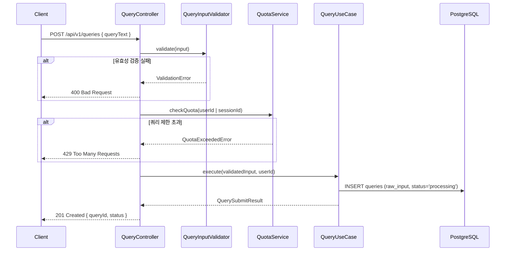
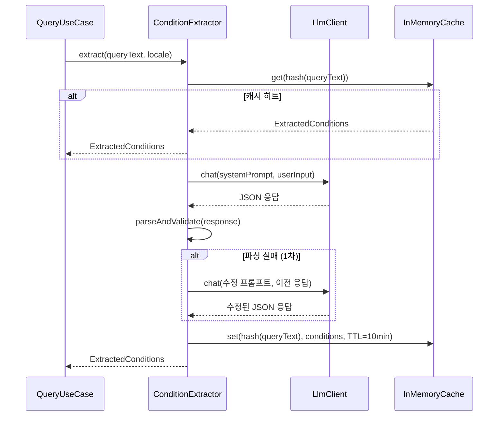
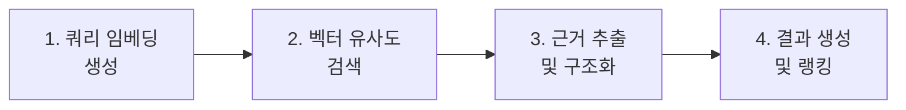
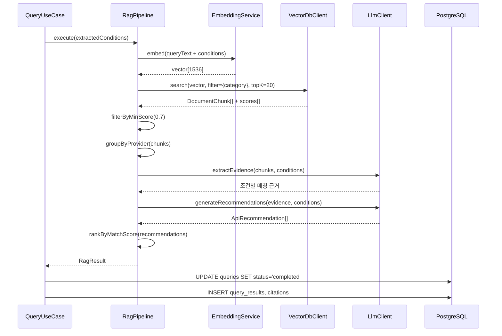
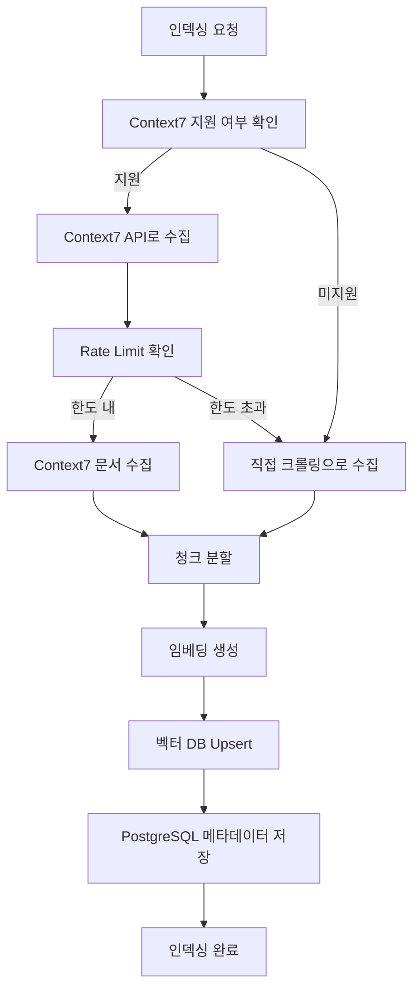
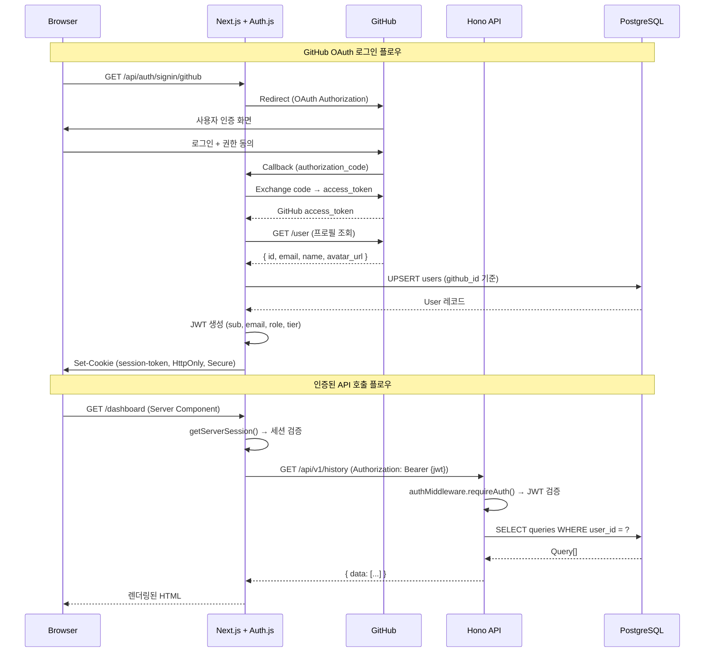
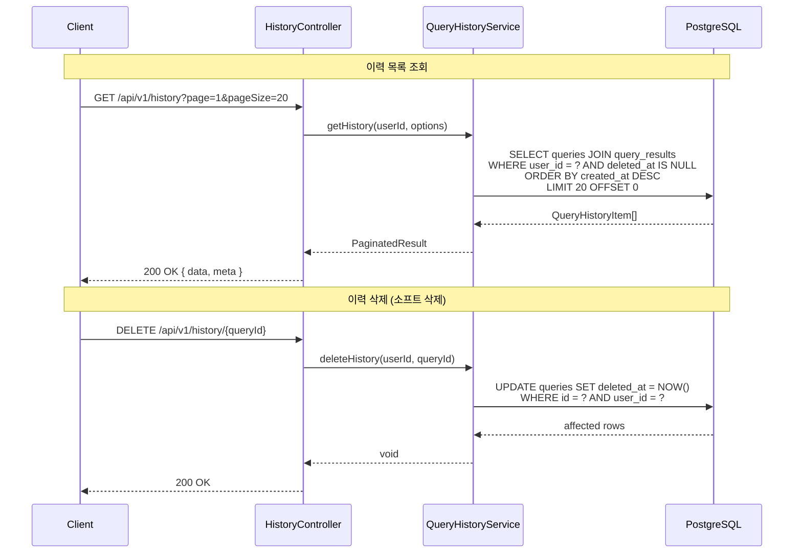
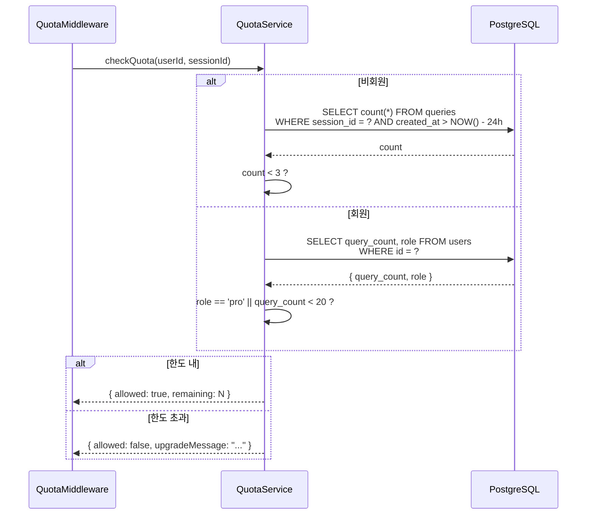
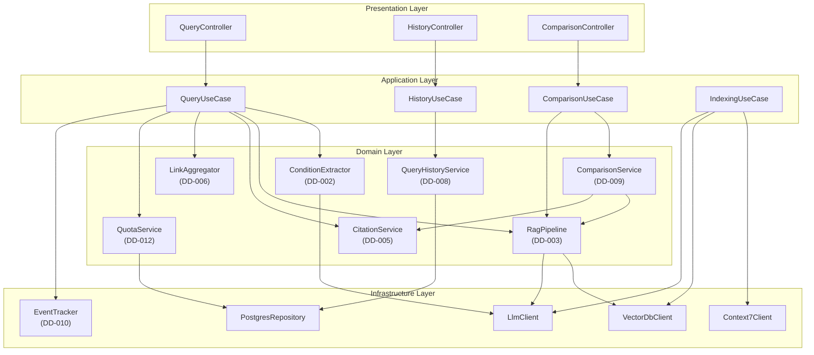

# 모듈 상세설계서

| 항목 | 내용 |
|------|------|
| **프로젝트명** | API Intelligence Engine |
| **문서 버전** | v1.0 |
| **작성일** | 2026-02-25 |
| **작성자** | 조훈상 / 기획·개발 |
| **승인자** | 조훈상 / 프로젝트 오너 |
| **문서 상태** | 초안 |

---

> **용어 규칙:** 본 문서는 [`용어규칙.md`](../01-요구사항분석/용어규칙.md)의 표기 원칙과 용어 사전을 준수한다.

---

## 변경 이력

| 버전 | 날짜 | 작성자 | 변경 내용 |
|------|------|--------|-----------|
| v0.1 | 2026-02-25 | 조훈상 | 초안 작성 — DD-001~DD-012 전체 모듈 상세설계 |
| v1.0 | 2026-02-25 | 조훈상 | 전체 모듈 상세설계 완료 |

---

## 목차

1. [문서 개요](#1-문서-개요)
2. [DD-001: 자연어 쿼리 입력](#2-dd-001-자연어-쿼리-입력)
3. [DD-002: 자연어 조건 추출](#3-dd-002-자연어-조건-추출)
4. [DD-003: RAG 검색 파이프라인](#4-dd-003-rag-검색-파이프라인)
5. [DD-004: 공식 문서 인덱싱](#5-dd-004-공식-문서-인덱싱)
6. [DD-005: 근거 인용 결과 표시](#6-dd-005-근거-인용-결과-표시)
7. [DD-006: 공식 링크 자동 정리](#7-dd-006-공식-링크-자동-정리)
8. [DD-007: 사용자 인증](#8-dd-007-사용자-인증)
9. [DD-008: 쿼리 이력 저장](#9-dd-008-쿼리-이력-저장)
10. [DD-009: 조건 기반 비교표](#10-dd-009-조건-기반-비교표)
11. [DD-010: 기본 분석 이벤트 수집](#11-dd-010-기본-분석-이벤트-수집)
12. [DD-011: 랜딩 페이지](#12-dd-011-랜딩-페이지)
13. [DD-012: 쿼리 제한 로직](#13-dd-012-쿼리-제한-로직)

---

## 1. 문서 개요

### 1.1 목적

본 문서는 API Intelligence Engine의 기능 요구사항(FR-001~FR-012)에 대응하는 모듈별 상세설계를 정의한다. 시스템 아키텍처 설계서(SAD)에서 정의한 계층 구조와 모듈 경계를 기반으로, 각 모듈의 인터페이스, 클래스 구조, 시퀀스, 알고리즘을 구체화한다.

### 1.2 범위

- DD-001 ~ DD-012: 12개 기능 요구사항에 대응하는 모듈 상세설계
- 각 모듈의 TypeScript 인터페이스/타입 정의
- 모듈 간 의존관계 및 시퀀스 다이어그램
- 입출력 명세 및 에러 처리 전략

### 1.3 참조 문서

| 문서명 | 버전 | 비고 |
|--------|------|------|
| 서비스 기획서 | v1.0 | MVP 스코프, 핵심 기능 정의 |
| 시스템 아키텍처 설계서 (SAD) | v1.0 | 계층 구조, 컴포넌트 다이어그램, ADR |
| API 설계서 | v1.0 | API 엔드포인트, 요청/응답 스키마 |
| 데이터베이스 설계서 | v1.0 | 테이블 명세, ER 다이어그램 |
| 유스케이스 명세서 (UCS-001) | v1.3 | 7개 유스케이스 상세 명세 |
| 요구사항 추적 매트릭스 (RTM-001) | v0.2 | FR 12건, NFR 7건 추적 |

### 1.4 공통 설계 규칙

| 규칙 | 설명 |
|------|------|
| 언어 | TypeScript 5.x (strict 모드) |
| 네이밍 | 클래스/인터페이스: PascalCase, 함수/변수: camelCase, 파일: kebab-case |
| 에러 처리 | 도메인별 커스텀 에러 클래스 상속 (`AppError` → `QueryError`, `RagError` 등) |
| 의존성 주입 | 생성자 주입(Constructor Injection) 방식. 인터페이스 기반 |
| 검증 | 입력 검증은 Zod 스키마, 도메인 검증은 서비스 레이어에서 수행 |
| 로깅 | Pino 기반 구조화된 JSON 로깅. 요청 ID(`X-Request-Id`) 포함 |

---

## 2. DD-001: 자연어 쿼리 입력

| 항목 | 내용 |
|------|------|
| **DD-ID** | DD-001 |
| **대응 요구사항** | FR-001 |
| **대응 유스케이스** | UC-003 |
| **모듈 위치** | `apps/api/src/modules/query/` |
| **우선순위** | P1 |

### 2.1 모듈 개요

사용자의 자연어 텍스트 입력을 수신하고, 입력 유효성을 검증한 뒤 쿼리 처리 파이프라인으로 전달하는 진입점 모듈이다.

### 2.2 인터페이스 정의

```typescript
// 쿼리 입력 요청 스키마
interface QueryInput {
  queryText: string;         // 사용자 자연어 입력 (1~2000자)
  categoryHint?: ApiCategory; // 선택적 카테고리 힌트
  locale?: 'ko' | 'en';     // 언어 (기본: 'ko')
}

// 쿼리 입력 결과
interface QuerySubmitResult {
  queryId: string;           // 생성된 쿼리 UUID
  status: 'processing' | 'completed' | 'failed';
  estimatedTime?: number;    // 예상 처리 시간 (ms)
}

// API 카테고리 열거형
type ApiCategory = 'llm' | 'payment' | 'auth' | 'messaging' | 'vector-db';
```

### 2.3 클래스 구조

```
QueryController
├── validateInput()          ← Zod 스키마 검증
├── checkQuota()             ← QuotaService 호출
└── submitQuery()            ← QueryUseCase 호출

QueryInputValidator (Zod 스키마)
├── queryTextSchema          ← 1~2000자, 공백만 입력 방지
├── categoryHintSchema       ← 유효 카테고리 검증
└── localeSchema             ← ko | en
```

### 2.4 처리 흐름



### 2.5 입력 검증 규칙

| 필드 | 규칙 | 에러 코드 |
|------|------|-----------|
| queryText | 1~2000자, 공백만 불가, XSS 필터링 | `INVALID_QUERY_TEXT` |
| categoryHint | `llm`, `payment`, `auth`, `messaging`, `vector-db` 중 하나 | `INVALID_CATEGORY` |
| locale | `ko`, `en` 중 하나 (기본: `ko`) | `INVALID_LOCALE` |

### 2.6 에러 처리

| 에러 상황 | 에러 클래스 | HTTP 상태 | 사용자 메시지 |
|-----------|------------|-----------|-------------|
| 빈 쿼리 입력 | `QueryValidationError` | 400 | "검색할 내용을 입력해 주세요" |
| 쿼리 길이 초과 | `QueryValidationError` | 400 | "쿼리는 2000자 이내로 입력해 주세요" |
| 쿼리 제한 초과 | `QuotaExceededError` | 429 | "쿼리 한도에 도달했습니다" |
| 내부 처리 실패 | `QueryProcessingError` | 500 | "쿼리 처리 중 오류가 발생했습니다" |

---

## 3. DD-002: 자연어 조건 추출

| 항목 | 내용 |
|------|------|
| **DD-ID** | DD-002 |
| **대응 요구사항** | FR-002 |
| **대응 유스케이스** | UC-003 |
| **모듈 위치** | `apps/api/src/modules/query/` |
| **우선순위** | P1 |

### 3.1 모듈 개요

사용자의 자연어 입력에서 API 카테고리, 기술 조건(SDK 언어, 리전, 가격, 인증 방식 등), 우선순위를 LLM을 통해 구조화된 형태로 추출하는 모듈이다.

### 3.2 인터페이스 정의

```typescript
// 추출된 조건 구조
interface ExtractedConditions {
  category: ApiCategory;
  subCategory?: string;            // 세부 카테고리 (예: 'sms', 'email')
  technicalConditions: TechnicalCondition[];
  priority: ConditionPriority[];   // 사용자가 강조한 조건 우선순위
  rawIntent: string;               // 원본 의도 요약
}

interface TechnicalCondition {
  type: ConditionType;
  value: string;
  isRequired: boolean;             // 필수 조건 여부
}

type ConditionType =
  | 'sdk_language'    // SDK 지원 언어 (예: 'node.js', 'python')
  | 'region'          // 지원 리전 (예: 'korea', 'us-east-1')
  | 'pricing'         // 가격 조건 (예: 'free-tier', 'under-50-usd')
  | 'auth_method'     // 인증 방식 (예: 'api-key', 'oauth2')
  | 'protocol'        // 프로토콜 (예: 'rest', 'grpc', 'websocket')
  | 'feature'         // 특정 기능 (예: 'streaming', 'batch')
  | 'compliance'      // 규정 준수 (예: 'gdpr', 'hipaa')
  | 'other';

type ConditionPriority = {
  conditionType: ConditionType;
  rank: number;  // 1이 가장 높은 우선순위
};

// ConditionExtractor 인터페이스
interface IConditionExtractor {
  extract(queryText: string, locale: string): Promise<ExtractedConditions>;
}
```

### 3.3 LLM 프롬프트 설계

```
[System Prompt]
당신은 API 검색 시스템의 조건 추출기입니다.
사용자의 자연어 입력에서 다음 정보를 추출하세요:

1. category: API 카테고리 (llm, payment, auth, messaging, vector-db 중 하나)
2. technicalConditions: 기술 조건 목록
3. priority: 사용자가 강조한 조건의 우선순위
4. rawIntent: 원본 의도 1줄 요약

반드시 JSON 형식으로 응답하세요.
입력에서 명시되지 않은 조건은 포함하지 마세요.

[User Input]
{queryText}
```

### 3.4 처리 흐름



### 3.5 알고리즘 상세

**조건 추출 파이프라인:**

1. 입력 전처리: 공백 정리, 특수문자 이스케이프
2. 캐시 조회: 동일 쿼리 텍스트의 해시값으로 캐시 확인 (TTL 10분)
3. LLM 호출: 시스템 프롬프트 + 사용자 입력으로 구조화된 JSON 추출
4. 응답 파싱: JSON 파싱 및 Zod 스키마 검증
5. 실패 시 재시도: 파싱 실패 시 수정 프롬프트로 1회 재시도
6. 결과 캐싱: 성공한 결과를 인메모리 캐시에 저장
7. DB 저장: `queries.extracted_conditions` JSONB 컬럼에 저장

**LLM 호출 설정:**

| 항목 | 값 |
|------|-----|
| 모델 | GPT-4o-mini 또는 Claude Haiku |
| Temperature | 0.0 (결정적 응답) |
| Max Tokens | 1024 |
| 타임아웃 | 10초 |
| 재시도 | 최대 1회 (파싱 실패 시) |

### 3.6 에러 처리

| 에러 상황 | 에러 클래스 | 처리 |
|-----------|------------|------|
| LLM API 타임아웃 | `LlmTimeoutError` | 폴백 모델로 전환 후 재시도 |
| LLM 응답 파싱 실패 (2회) | `ConditionExtractionError` | 기본 카테고리 추론 + 조건 없이 검색 진행 |
| LLM API 장애 | `LlmServiceError` | 에러 로깅 + 사용자에게 일시 장애 안내 |

---

## 4. DD-003: RAG 검색 파이프라인

| 항목 | 내용 |
|------|------|
| **DD-ID** | DD-003 |
| **대응 요구사항** | FR-003 |
| **대응 유스케이스** | UC-003 |
| **모듈 위치** | `apps/api/src/modules/rag/` |
| **우선순위** | P1 |

### 4.1 모듈 개요

추출된 조건을 기반으로 벡터 DB에서 관련 문서 청크를 검색하고, LLM을 통해 근거 기반의 구조화된 API 추천 결과를 생성하는 핵심 파이프라인 모듈이다.

### 4.2 인터페이스 정의

```typescript
// RAG 파이프라인 인터페이스
interface IRagPipeline {
  execute(conditions: ExtractedConditions): Promise<RagResult>;
}

// 벡터 검색 결과
interface VectorSearchResult {
  chunks: DocumentChunk[];
  scores: number[];
  metadata: ChunkMetadata[];
}

interface DocumentChunk {
  id: string;
  content: string;
  vectorId: string;
}

interface ChunkMetadata {
  apiProvider: string;
  category: ApiCategory;
  docType: 'pricing' | 'sdk' | 'overview' | 'authentication' | 'region' | 'api-reference';
  sourceUrl: string;
  lastUpdated: string;
}

// RAG 최종 결과
interface RagResult {
  recommendations: ApiRecommendation[];
  searchMetadata: {
    totalChunksSearched: number;
    topKUsed: number;
    processingTimeMs: number;
  };
}

interface ApiRecommendation {
  apiProvider: string;
  apiName: string;
  matchScore: number;           // 0~1 매칭 점수
  summary: string;              // 공식 문서 기반 요약
  citations: Citation[];        // 근거 인용 목록
  officialLinks: OfficialLink[];// 공식 링크 목록
  conditionMatches: ConditionMatch[]; // 조건별 매칭 상태
}

interface Citation {
  text: string;                 // 인용 원문
  sourceUrl: string;            // 출처 URL
  docType: string;              // 문서 유형
  chunkId: string;              // 원본 청크 ID
}

interface ConditionMatch {
  conditionType: ConditionType;
  value: string;
  matched: boolean;
  evidence: string;             // 매칭 근거 (공식 문서 인용)
}
```

### 4.3 파이프라인 4단계 설계



**단계 1: 쿼리 임베딩 생성**

| 항목 | 값 |
|------|-----|
| 임베딩 모델 | OpenAI `text-embedding-3-small` |
| 차원 | 1536 |
| 입력 | `extractedConditions.rawIntent` + 주요 조건 텍스트 |

**단계 2: 벡터 유사도 검색**

| 항목 | 값 |
|------|-----|
| 벡터 DB | Pinecone |
| 유사도 측정 | Cosine Similarity |
| Top-K | 20 (초기 검색) → 재랭킹 후 상위 10개 사용 |
| 메타데이터 필터 | `category == extractedConditions.category` |
| 최소 유사도 | 0.7 (이하 결과 제외) |

**단계 3: 근거 추출 및 구조화**

- 검색된 청크에서 조건별 매칭 근거 문장을 추출
- LLM을 사용하여 각 청크의 관련성을 재평가 (Re-ranking)
- API Provider별로 청크를 그룹화

**단계 4: 결과 생성 및 랭킹**

- LLM을 사용하여 API Provider별 구조화된 추천 결과 생성
- 조건 매칭률 기반 최종 랭킹 수행

### 4.4 처리 흐름



### 4.5 성능 최적화

| 최적화 항목 | 전략 |
|------------|------|
| 임베딩 캐시 | 동일 조건 조합의 임베딩 벡터를 인메모리 캐시 (TTL 1시간) |
| 병렬 LLM 호출 | 근거 추출과 결과 생성을 Provider별로 병렬 실행 (`Promise.all`) |
| 스트리밍 | LLM 결과 생성 시 SSE(Server-Sent Events)로 스트리밍 응답 |
| 배치 임베딩 | 인덱싱 시 임베딩을 배치 처리 (100개 청크/요청) |

---

## 5. DD-004: 공식 문서 인덱싱

| 항목 | 내용 |
|------|------|
| **DD-ID** | DD-004 |
| **대응 요구사항** | FR-004 |
| **대응 유스케이스** | UC-003, UC-007 |
| **모듈 위치** | `apps/api/src/modules/indexing/` |
| **우선순위** | P1 |

### 5.1 모듈 개요

5개 카테고리(LLM API, 결제 API, 인증 API, 메시징 API, 벡터 DB)의 공식 문서를 Context7 API(주력) 및 직접 크롤링(보조)으로 수집하고, 청크 분할 → 임베딩 생성 → 벡터 DB 저장까지의 인덱싱 파이프라인을 관리하는 모듈이다.

### 5.2 인터페이스 정의

```typescript
// 문서 수집 인터페이스 (어댑터 패턴)
interface IDocumentCollector {
  collect(provider: ApiProviderConfig): Promise<RawDocument[]>;
  isSupported(providerName: string): Promise<boolean>;
}

// 수집된 원시 문서
interface RawDocument {
  title: string;
  content: string;
  sourceUrl: string;
  docType: string;
  language: string;
  collectedAt: string;
  collectorType: 'context7' | 'crawler';
}

// API 프로바이더 설정
interface ApiProviderConfig {
  name: string;                  // 예: 'openai', 'stripe'
  category: ApiCategory;
  context7LibraryId?: string;    // Context7 라이브러리 ID
  crawlUrls?: string[];          // 직접 크롤링 대상 URL
  docTypes: string[];            // 수집할 문서 유형
}

// 인덱싱 작업 상태
interface IndexingJob {
  jobId: string;
  status: 'pending' | 'collecting' | 'chunking' | 'embedding' | 'indexing' | 'completed' | 'failed';
  provider: string;
  totalDocuments: number;
  processedDocuments: number;
  totalChunks: number;
  processedChunks: number;
  startedAt: string;
  completedAt?: string;
  errorMessage?: string;
}

// 청크 분할 설정
interface ChunkingConfig {
  maxChunkSize: number;     // 기본 1000 토큰
  chunkOverlap: number;     // 기본 200 토큰
  separator: string[];      // ['\n\n', '\n', '. ']
}
```

### 5.3 수집 전략



### 5.4 MVP 대상 API 프로바이더 목록

| 카테고리 | API 프로바이더 | Context7 지원 | 수집 채널 |
|----------|--------------|-------------|-----------|
| LLM API | OpenAI | Y | Context7 |
| LLM API | Anthropic | Y | Context7 |
| LLM API | Google Gemini | Y | Context7 |
| 결제 API | Stripe | Y | Context7 |
| 결제 API | 토스페이먼츠 | N | 직접 크롤링 |
| 인증 API | Auth0 | Y | Context7 |
| 인증 API | Firebase Auth | Y | Context7 |
| 메시징 API | Twilio | Y | Context7 |
| 메시징 API | SendGrid | Y | Context7 |
| 메시징 API | 알리고 | N | 직접 크롤링 |
| 벡터 DB | Pinecone | Y | Context7 |
| 벡터 DB | Qdrant | Y | Context7 |
| 벡터 DB | Weaviate | Y | Context7 |

### 5.5 청크 분할 알고리즘

1. 원시 문서를 마크다운 섹션(`## 제목`) 단위로 1차 분할
2. 각 섹션을 최대 1000 토큰 기준으로 2차 분할 (200 토큰 오버랩)
3. 코드 블록은 분할하지 않고 단일 청크로 유지
4. 테이블은 헤더와 함께 단일 청크로 유지
5. 각 청크에 메타데이터 태깅: `{ apiProvider, category, docType, sourceUrl, section }`

### 5.6 에러 처리

| 에러 상황 | 처리 전략 |
|-----------|----------|
| Context7 API 장애 | 직접 크롤링으로 자동 전환 |
| Context7 Rate Limit | 시간당/월간 카운터 관리, 한도 도달 시 크롤링 전환 |
| 크롤링 대상 페이지 차단 | 에러 로깅 + 관리자 알림 + 해당 프로바이더 건너뛰기 |
| 임베딩 API 실패 | 최대 3회 지수 백오프 재시도 |
| 벡터 DB Upsert 실패 | 실패 청크 목록 기록 + 부분 재시도 |

---

## 6. DD-005: 근거 인용 결과 표시

| 항목 | 내용 |
|------|------|
| **DD-ID** | DD-005 |
| **대응 요구사항** | FR-005 |
| **대응 유스케이스** | UC-003 |
| **모듈 위치** | `apps/api/src/modules/result/`, `apps/web/components/result/` |
| **우선순위** | P1 |

### 6.1 모듈 개요

RAG 파이프라인이 생성한 추천 결과를 API별 공식 문서 원문 인용과 소스 링크를 포함한 구조화된 형태로 표시하는 모듈이다. 백엔드의 `CitationService`와 프론트엔드의 `ResultCard` 컴포넌트로 구성된다.

### 6.2 인터페이스 정의

```typescript
// 인용 서비스 인터페이스
interface ICitationService {
  formatCitations(rawCitations: Citation[]): FormattedCitation[];
  validateSourceUrls(citations: Citation[]): Promise<UrlValidationResult[]>;
}

// 포맷팅된 인용
interface FormattedCitation {
  id: string;
  quotedText: string;           // 인용 원문 (최대 500자)
  sourceUrl: string;            // 검증된 소스 URL
  sourceLabel: string;          // 표시 레이블 (예: "OpenAI 공식 문서 - Pricing")
  docType: string;
  isUrlValid: boolean;          // URL 유효성 검증 결과
}

// 결과 표시용 DTO (프론트엔드)
interface QueryResultView {
  queryId: string;
  queryText: string;
  recommendations: RecommendationCardData[];
  totalResults: number;
  processingTimeMs: number;
}

interface RecommendationCardData {
  rank: number;
  apiProvider: string;
  apiName: string;
  matchScore: number;
  summary: string;
  citations: FormattedCitation[];
  officialLinks: OfficialLinkGroup[];
  conditionMatches: ConditionMatchView[];
}
```

### 6.3 프론트엔드 컴포넌트 구조

```
ResultPage
├── QuerySummaryBar          // 입력 쿼리 요약 + 추출 조건 태그
├── ResultCardList           // 추천 결과 카드 목록
│   └── ResultCard           // 개별 API 추천 카드
│       ├── MatchScoreBadge  // 매칭 점수 배지
│       ├── ApiSummary       // API 요약 설명
│       ├── CitationList     // 공식 문서 인용 목록
│       │   └── CitationItem // 개별 인용 (원문 + 출처 링크)
│       ├── OfficialLinkBar  // 공식 링크 바 (문서/가격/SDK/상태)
│       └── ConditionTable   // 조건 매칭 상태 테이블
└── ResultActions            // 결과 공유, 이력 저장 액션 버튼
```

### 6.4 인용 표시 규칙

| 규칙 | 설명 |
|------|------|
| 인용 원문 길이 | 최대 500자, 초과 시 `...` 처리 |
| 인용 개수 | API당 최대 5개 인용 |
| URL 검증 | 표시 전 URL 유효성을 비동기 확인, 유효하지 않은 URL은 회색 처리 + 경고 표시 |
| 인용 출처 레이블 | `{API명} 공식 문서 - {문서유형}` 형식 |
| 인용 없는 결과 | 표시하지 않음 (근거 없는 추천 방지) |

---

## 7. DD-006: 공식 링크 자동 정리

| 항목 | 내용 |
|------|------|
| **DD-ID** | DD-006 |
| **대응 요구사항** | FR-006 |
| **대응 유스케이스** | UC-003 |
| **모듈 위치** | `apps/api/src/modules/result/` |
| **우선순위** | P1 |

### 7.1 모듈 개요

각 추천 API의 공식 링크(문서, 가격, SDK, 상태 페이지)를 유형별로 자동 정리하여 제공하는 모듈이다.

### 7.2 인터페이스 정의

```typescript
// 공식 링크 타입
type OfficialLinkType = 'docs' | 'pricing' | 'sdk' | 'status' | 'changelog' | 'quickstart';

interface OfficialLink {
  type: OfficialLinkType;
  url: string;
  label: string;
  isVerified: boolean;  // URL 검증 완료 여부
}

interface OfficialLinkGroup {
  apiProvider: string;
  links: OfficialLink[];
}

// 링크 수집기 인터페이스
interface ILinkAggregator {
  aggregate(apiProvider: string): Promise<OfficialLinkGroup>;
  validateLinks(links: OfficialLink[]): Promise<OfficialLink[]>;
}
```

### 7.3 링크 수집 전략

| 우선순위 | 수집 소스 | 설명 |
|----------|----------|------|
| 1순위 | PostgreSQL `api_providers` 테이블 | 사전 등록된 공식 링크 |
| 2순위 | 인덱싱된 문서 청크 메타데이터 | 문서 수집 시 추출된 URL |
| 3순위 | LLM 기반 URL 추출 | RAG 결과 생성 시 LLM이 문서에서 추출한 URL |

### 7.4 링크 검증 로직

1. HTTP HEAD 요청으로 URL 접근 가능 여부 확인 (타임아웃 5초)
2. HTTP 상태 코드 200~399이면 유효
3. 검증 결과를 캐시 (TTL 24시간)
4. 검증 실패 링크는 `isVerified: false`로 표시하되 제거하지 않음

### 7.5 에러 처리

| 에러 상황 | 처리 |
|-----------|------|
| 등록된 링크 없음 | LLM 추출 링크만 표시 + "사전 등록 링크 없음" 표시 |
| 모든 링크 검증 실패 | 링크를 미검증 상태로 표시 + 경고 문구 |
| 링크 검증 타임아웃 | 미검증 상태로 반환, 백그라운드에서 재검증 |

---

## 8. DD-007: 사용자 인증

| 항목 | 내용 |
|------|------|
| **DD-ID** | DD-007 |
| **대응 요구사항** | FR-007 |
| **대응 유스케이스** | UC-001, UC-002, UC-006 |
| **모듈 위치** | `apps/web/app/api/auth/`, `apps/api/src/modules/auth/` |
| **우선순위** | P1 |

### 8.1 모듈 개요

GitHub OAuth 전용 인증을 Auth.js(NextAuth.js v5) 기반으로 구현하는 모듈이다. 프론트엔드(Next.js)에서 세션 관리를 수행하고, 백엔드(Hono) API 호출 시 세션 토큰을 검증하는 BFF 패턴을 적용한다.

### 8.2 인터페이스 정의

```typescript
// Auth.js 세션 확장
interface ExtendedSession {
  user: {
    id: string;
    email: string;
    name: string;
    image: string;
    role: UserRole;
    tier: UserTier;
  };
  accessToken: string;       // 백엔드 API 호출용 JWT
  expiresAt: number;
}

type UserRole = 'guest' | 'free' | 'pro' | 'admin';
type UserTier = 'guest' | 'free' | 'pro';

// 백엔드 인증 미들웨어용 타입
interface AuthContext {
  userId: string;
  email: string;
  role: UserRole;
  tier: UserTier;
  isAuthenticated: boolean;
}

// Hono 미들웨어 - 세션 검증
interface IAuthMiddleware {
  requireAuth(): MiddlewareHandler;
  optionalAuth(): MiddlewareHandler;
  requireRole(roles: UserRole[]): MiddlewareHandler;
}
```

### 8.3 인증 플로우 상세



### 8.4 비회원 체험 세션

| 항목 | 설명 |
|------|------|
| 세션 식별 | 브라우저 쿠키 기반 세션 ID (`__aie_session`) |
| 쿼리 제한 | 3회 (쿠키 기반 카운트) |
| 결과 저장 | 서버 측 임시 저장 (24시간 TTL) |
| 가입 유도 | 3회 소진 시 가입 유도 모달 표시 |
| 전환 | 가입 시 임시 세션 쿼리 이력을 사용자 계정에 마이그레이션 |

### 8.5 Hono 인증 미들웨어 설계

```typescript
// 인증 미들웨어 구현 개요
// 1. Authorization 헤더에서 Bearer 토큰 추출
// 2. JWT 검증 (RS256, 만료 시간 확인)
// 3. AuthContext 생성하여 c.set('auth', authContext)
// 4. requireAuth(): 미인증 시 401
// 5. optionalAuth(): 미인증 시 guest 컨텍스트 설정
// 6. requireRole(): 역할 불일치 시 403
```

---

## 9. DD-008: 쿼리 이력 저장

| 항목 | 내용 |
|------|------|
| **DD-ID** | DD-008 |
| **대응 요구사항** | FR-008 |
| **대응 유스케이스** | UC-005 |
| **모듈 위치** | `apps/api/src/modules/history/` |
| **우선순위** | P1 |

### 9.1 모듈 개요

로그인 사용자의 쿼리 실행 이력과 결과를 저장·조회·삭제하는 모듈이다.

### 9.2 인터페이스 정의

```typescript
// 이력 서비스 인터페이스
interface IQueryHistoryService {
  getHistory(userId: string, options: HistoryQueryOptions): Promise<PaginatedResult<QueryHistoryItem>>;
  getHistoryDetail(userId: string, queryId: string): Promise<QueryHistoryDetail>;
  deleteHistory(userId: string, queryId: string): Promise<void>;
  deleteAllHistory(userId: string): Promise<void>;
}

interface HistoryQueryOptions {
  page: number;               // 기본 1
  pageSize: number;           // 기본 20, 최대 50
  category?: ApiCategory;     // 카테고리 필터
  sortBy: 'createdAt' | 'matchScore';
  sortOrder: 'asc' | 'desc';
  searchText?: string;        // 쿼리 텍스트 검색
}

interface QueryHistoryItem {
  queryId: string;
  queryText: string;
  category: ApiCategory;
  topResult: string;          // 최상위 추천 API 이름
  resultCount: number;
  createdAt: string;
}

interface QueryHistoryDetail extends QueryHistoryItem {
  extractedConditions: ExtractedConditions;
  recommendations: ApiRecommendation[];
}

interface PaginatedResult<T> {
  data: T[];
  meta: {
    page: number;
    pageSize: number;
    total: number;
    totalPages: number;
  };
}
```

### 9.3 처리 흐름



### 9.4 데이터 보존 정책

| 정책 | 값 |
|------|-----|
| 기본 보존 기간 | 무제한 (사용자 삭제 전까지) |
| 소프트 삭제 유예 | 30일 후 물리 삭제 (배치 작업) |
| 비회원 임시 이력 | 24시간 후 자동 삭제 |
| 최대 이력 수 | 무료 사용자: 100건, Pro 사용자: 무제한 |

---

## 10. DD-009: 조건 기반 비교표

| 항목 | 내용 |
|------|------|
| **DD-ID** | DD-009 |
| **대응 요구사항** | FR-009 |
| **대응 유스케이스** | UC-004 |
| **모듈 위치** | `apps/api/src/modules/comparison/`, `apps/web/components/comparison/` |
| **우선순위** | P1 |

### 10.1 모듈 개요

사용자가 선택한 2~5개 API를 조건별(가격, SDK, 리전, 인증 방식 등)로 나란히 비교하는 테이블을 생성하는 모듈이다.

### 10.2 인터페이스 정의

```typescript
// 비교 요청
interface ComparisonRequest {
  apiProviders: string[];      // 2~5개 API 프로바이더명
  conditions: ConditionType[]; // 비교할 조건 유형
  locale?: 'ko' | 'en';
}

// 비교 결과
interface ComparisonResult {
  comparisonId: string;
  apiProviders: string[];
  comparisonTable: ComparisonRow[];
  generatedAt: string;
}

interface ComparisonRow {
  conditionType: ConditionType;
  conditionLabel: string;       // 표시 레이블
  values: ComparisonCell[];     // API 수만큼의 셀
}

interface ComparisonCell {
  apiProvider: string;
  value: string;                // 비교 값 텍스트
  citation?: FormattedCitation; // 근거 인용
  status: 'available' | 'unavailable' | 'unknown';
}

// 비교 서비스 인터페이스
interface IComparisonService {
  compare(request: ComparisonRequest, userId?: string): Promise<ComparisonResult>;
  getComparison(comparisonId: string): Promise<ComparisonResult>;
}
```

### 10.3 비교표 생성 알고리즘

1. 요청된 API 프로바이더별로 벡터 DB에서 관련 문서 청크 검색
2. 요청된 조건 유형별로 각 API의 정보를 LLM으로 추출
3. 조건별 비교 행(ComparisonRow) 생성
4. 각 셀에 공식 문서 근거 인용 첨부
5. 비교 결과를 PostgreSQL `comparisons` 테이블에 저장

### 10.4 프론트엔드 비교표 컴포넌트

```
ComparisonPage
├── ApiSelector             // API 프로바이더 선택 (2~5개)
├── ConditionSelector       // 비교 조건 유형 선택
├── ComparisonTable         // 비교표 테이블
│   ├── ComparisonHeader    // API 프로바이더명 열 헤더
│   └── ComparisonRow       // 조건별 비교 행
│       └── ComparisonCell  // 개별 셀 (값 + 인용 팝오버)
└── ComparisonActions       // 결과 저장, URL 공유 버튼
```

### 10.5 비교표 기본 조건 매핑

| 조건 유형 | 표시 레이블 | 비교 내용 |
|-----------|-----------|-----------|
| `pricing` | 가격 | 무료 플랜 조건, 유료 시작 가격, 종량제 단가 |
| `sdk_language` | SDK 지원 | 지원 언어 목록, 공식/커뮤니티 구분 |
| `region` | 리전 지원 | 지원 리전 목록, 한국 리전 여부 |
| `auth_method` | 인증 방식 | API Key, OAuth, JWT 등 |
| `protocol` | 프로토콜 | REST, gRPC, WebSocket 등 |
| `feature` | 주요 기능 | 스트리밍, 배치, 웹훅 등 |

---

## 11. DD-010: 기본 분석 이벤트 수집

| 항목 | 내용 |
|------|------|
| **DD-ID** | DD-010 |
| **대응 요구사항** | FR-010 |
| **모듈 위치** | `apps/api/src/modules/analytics/`, `apps/web/lib/analytics/` |
| **우선순위** | P1 |

### 11.1 모듈 개요

사용자 행동 데이터(쿼리 실행, 링크 클릭, 세션 등)를 수집하여 PostHog에 전송하는 분석 이벤트 모듈이다.

### 11.2 이벤트 정의

| 이벤트명 | 트리거 | 속성 | 수집 위치 |
|----------|--------|------|-----------|
| `query_submitted` | 쿼리 제출 시 | queryId, category, queryLength, isAuthenticated | 백엔드 |
| `query_completed` | 쿼리 결과 반환 시 | queryId, resultCount, processingTimeMs | 백엔드 |
| `citation_link_clicked` | 인용 링크 클릭 시 | queryId, apiProvider, linkType, linkUrl | 프론트엔드 |
| `official_link_clicked` | 공식 링크 클릭 시 | queryId, apiProvider, linkType | 프론트엔드 |
| `comparison_created` | 비교표 생성 시 | comparisonId, apiProviders, conditionCount | 백엔드 |
| `result_shared` | 결과 공유 시 | queryId, shareMethod (url_copy, etc.) | 프론트엔드 |
| `signup_completed` | 회원가입 완료 시 | userId, source | 백엔드 |
| `page_viewed` | 페이지 진입 시 | pagePath, referrer | 프론트엔드 |

### 11.3 인터페이스 정의

```typescript
// 이벤트 트래커 인터페이스
interface IEventTracker {
  track(eventName: string, properties: Record<string, unknown>): void;
  identify(userId: string, traits: Record<string, unknown>): void;
  page(pageName: string, properties?: Record<string, unknown>): void;
}

// 백엔드 이벤트 수집기
interface IServerAnalytics {
  trackEvent(event: AnalyticsEvent): Promise<void>;
  flush(): Promise<void>;
}

interface AnalyticsEvent {
  eventName: string;
  userId?: string;
  sessionId: string;
  properties: Record<string, unknown>;
  timestamp: string;
}
```

### 11.4 수집 설정

| 항목 | 값 |
|------|-----|
| 분석 서비스 | PostHog Cloud (무료 티어) |
| 프론트엔드 SDK | `posthog-js` |
| 백엔드 SDK | `posthog-node` |
| 배치 전송 | 프론트엔드: 자동 배치, 백엔드: 10초 또는 100이벤트 |
| 개인정보 | 이메일/이름 미수집, userId(UUID)만 사용 |

---

## 12. DD-011: 랜딩 페이지

| 항목 | 내용 |
|------|------|
| **DD-ID** | DD-011 |
| **대응 요구사항** | FR-011 |
| **모듈 위치** | `apps/web/app/(landing)/` |
| **우선순위** | P2 |

### 12.1 모듈 개요

서비스의 핵심 가치 제안, 예시 쿼리 체험, 회원가입 CTA를 포함한 랜딩 페이지이다.

### 12.2 페이지 구조

```
LandingPage (SSG - Static Generation)
├── HeroSection              // 핵심 가치 제안 + 쿼리 입력창
│   ├── Headline             // "API 선택, 공식 문서 근거와 함께"
│   ├── SubHeadline          // 서비스 한 줄 설명
│   └── QueryInput (체험용)  // 비회원 체험 쿼리 입력
├── ExampleSection           // 예시 쿼리 3개 (클릭 시 즉시 실행)
│   └── ExampleCard ×3       // LLM API / 결제 API / 메시징 API 예시
├── HowItWorksSection        // 3단계 동작 설명
│   └── StepCard ×3          // 1.입력 → 2.검색 → 3.결과
├── ValuePropositionSection  // 차별점 3가지
│   └── ValueCard ×3         // 근거 인용 / 구조화 정리 / 공식 링크
├── CtaSection               // 회원가입 CTA
│   └── SignUpButton         // GitHub OAuth 로그인 버튼
└── Footer                   // 링크, 저작권
```

### 12.3 예시 쿼리 목록

| 카테고리 | 예시 쿼리 텍스트 |
|----------|----------------|
| LLM API | "한국어 지원, 스트리밍 가능, 월 $50 이내인 LLM API" |
| 결제 API | "한국 원화 결제, 정기결제 지원, Node.js SDK가 있는 결제 API" |
| 메시징 API | "SMS 인증 발송, 한국 번호 지원, 무료 플랜 있는 메시징 API" |

### 12.4 SEO 설정

| 항목 | 값 |
|------|-----|
| 렌더링 | Static Generation (SSG) |
| Title | "API Intelligence Engine - 공식 문서 기반 API 추천" |
| Description | "자연어로 요구사항을 입력하면 공식 문서 근거와 함께 최적의 API를 추천합니다" |
| OG Image | 서비스 스크린샷 이미지 |

---

## 13. DD-012: 쿼리 제한 로직

| 항목 | 내용 |
|------|------|
| **DD-ID** | DD-012 |
| **대응 요구사항** | FR-012 |
| **모듈 위치** | `apps/api/src/modules/quota/` |
| **우선순위** | P2 |

### 13.1 모듈 개요

사용자 등급별 쿼리 실행 횟수를 제한하고, 한도 도달 시 적절한 안내를 제공하는 모듈이다.

### 13.2 인터페이스 정의

```typescript
// 쿼터 서비스 인터페이스
interface IQuotaService {
  checkQuota(userId: string | null, sessionId: string): Promise<QuotaCheckResult>;
  incrementUsage(userId: string | null, sessionId: string): Promise<void>;
  getUsage(userId: string): Promise<QuotaUsage>;
  resetMonthlyUsage(): Promise<void>;  // 월초 배치 작업
}

interface QuotaCheckResult {
  allowed: boolean;
  remaining: number;
  limit: number;
  resetAt: string;              // 다음 리셋 시점
  upgradeMessage?: string;      // 한도 도달 시 업그레이드 안내
}

interface QuotaUsage {
  userId: string;
  tier: UserTier;
  monthlyUsed: number;
  monthlyLimit: number;
  lastQueryAt: string;
}
```

### 13.3 등급별 제한 정책

| 등급 | 월간 쿼리 한도 | 식별 방식 | 리셋 주기 |
|------|--------------|-----------|-----------|
| 비회원 (Guest) | 3회 | 세션 쿠키 | 쿠키 만료 시 (24시간) |
| 무료 회원 (Free) | 20회/월 | userId (DB) | 매월 1일 00:00 UTC |
| Pro 회원 (Pro) | 무제한 | userId (DB) | N/A |
| 관리자 (Admin) | 무제한 | userId (DB) | N/A |

### 13.4 처리 흐름



### 13.5 카운트 관리

| 항목 | 설명 |
|------|------|
| 카운트 시점 | 쿼리 결과가 성공적으로 반환된 시점 (`query_completed` 이벤트) |
| 실패한 쿼리 | 카운트에 포함하지 않음 |
| 카운트 저장 | `users.query_count` 컬럼 (회원), `queries` 테이블 COUNT (비회원) |
| 월간 리셋 | Cron Job으로 매월 1일 00:00 UTC에 `users.query_count = 0` 업데이트 |

---

## 부록

### A. 모듈 의존관계 다이어그램



### B. DD-ID 매핑 요약

| DD-ID | 모듈명 | 대응 FR | 대응 UC | 핵심 클래스 |
|-------|--------|---------|---------|------------|
| DD-001 | 자연어 쿼리 입력 | FR-001 | UC-003 | QueryController, QueryInputValidator |
| DD-002 | 자연어 조건 추출 | FR-002 | UC-003 | ConditionExtractor, LlmParserService |
| DD-003 | RAG 검색 파이프라인 | FR-003 | UC-003 | RagPipeline, VectorSearchService, GenerationService |
| DD-004 | 공식 문서 인덱싱 | FR-004 | UC-003, UC-007 | Context7Client, CrawlerService, ChunkSplitter, EmbeddingService |
| DD-005 | 근거 인용 결과 표시 | FR-005 | UC-003 | CitationService, ResultRenderer |
| DD-006 | 공식 링크 자동 정리 | FR-006 | UC-003 | LinkAggregator, LinkValidator |
| DD-007 | 사용자 인증 | FR-007 | UC-001, UC-002, UC-006 | AuthService, GithubOAuthProvider, AuthMiddleware |
| DD-008 | 쿼리 이력 저장 | FR-008 | UC-005 | QueryHistoryService, HistoryController |
| DD-009 | 조건 기반 비교표 | FR-009 | UC-004 | ComparisonService, TableRenderer |
| DD-010 | 분석 이벤트 수집 | FR-010 | - | EventTracker, AnalyticsService |
| DD-011 | 랜딩 페이지 | FR-011 | - | LandingPage, ExampleQuerySection |
| DD-012 | 쿼리 제한 로직 | FR-012 | - | QuotaService, RateLimiter |

### C. 관련 문서 링크

| 문서 | 경로 |
|------|------|
| 시스템 아키텍처 설계서 | `../02-시스템설계/시스템아키텍처설계서-SAD.md` |
| API 설계서 | `../02-시스템설계/API설계서.md` |
| 데이터베이스 설계서 | `../02-시스템설계/데이터베이스설계서.md` |
| 화면 설계서 | `../02-시스템설계/화면설계서.md` |
| 유스케이스 명세서 | `../01-요구사항분석/유스케이스명세서.md` |
| 요구사항 추적 매트릭스 | `../01-요구사항분석/요구사항추적매트릭스-RTM.md` |
| 비기능 상세설계서 | `./비기능상세설계서.md` |
