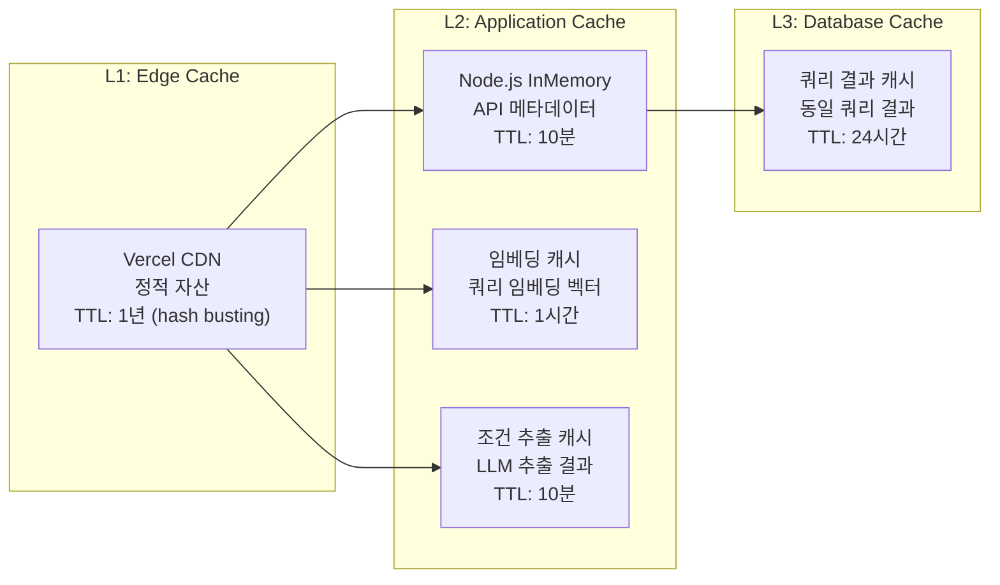
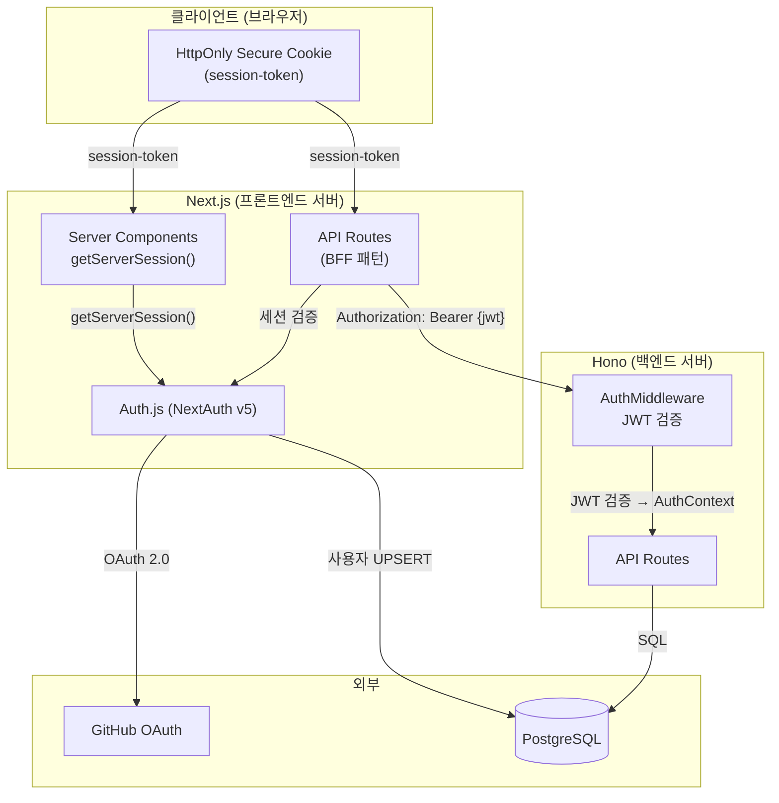
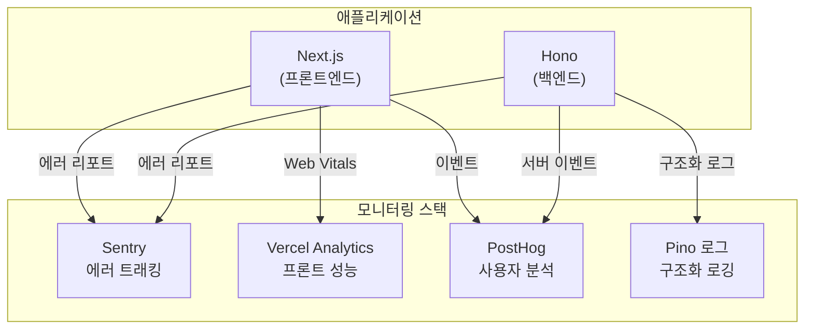
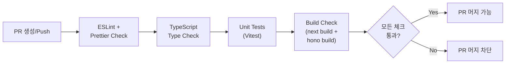

# 비기능 상세설계서

| 항목 | 내용 |
|------|------|
| **프로젝트명** | API Intelligence Engine |
| **문서 버전** | v1.0 |
| **작성일** | 2026-02-25 |
| **작성자** | 조훈상 / 기획·개발 |
| **승인자** | 조훈상 / 프로젝트 오너 |
| **문서 상태** | 초안 |

---

> **용어 규칙:** 본 문서는 [`용어규칙.md`](../01-요구사항분석/용어규칙.md)의 표기 원칙과 용어 사전을 준수한다.

---

## 변경 이력

| 버전 | 날짜 | 작성자 | 변경 내용 |
|------|------|--------|-----------|
| v0.1 | 2026-02-25 | 조훈상 | 초안 작성 — DD-PERF, DD-SEC, DD-INFRA, DD-UI, DD-DEV 전체 |
| v1.0 | 2026-02-25 | 조훈상 | 전체 비기능 상세설계 완료 |

---

## 목차

1. [문서 개요](#1-문서-개요)
2. [DD-PERF-001: 성능 설계](#2-dd-perf-001-성능-설계)
3. [DD-SEC-001: 인증/인가 보안 설계](#3-dd-sec-001-인증인가-보안-설계)
4. [DD-SEC-002: 데이터 암호화 설계](#4-dd-sec-002-데이터-암호화-설계)
5. [DD-INFRA-001: 인프라/가용성 설계](#5-dd-infra-001-인프라가용성-설계)
6. [DD-UI-001: UI/호환성 설계](#6-dd-ui-001-ui호환성-설계)
7. [DD-DEV-001: 코드 품질/개발 표준 설계](#7-dd-dev-001-코드-품질개발-표준-설계)

---

## 1. 문서 개요

### 1.1 목적

본 문서는 API Intelligence Engine의 비기능 요구사항(NFR-001~NFR-007)에 대응하는 상세설계를 정의한다. 시스템 아키텍처 설계서(SAD)에서 정의한 비기능 대응 전략을 구체적인 설정, 코드 구조, 도구 선택 수준으로 상세화한다.

### 1.2 참조 문서

| 문서명 | 버전 | 비고 |
|--------|------|------|
| 시스템 아키텍처 설계서 (SAD) | v1.0 | 비기능 요구사항 대응 설계 (6장) |
| 요구사항 추적 매트릭스 (RTM) | v0.2 | NFR 7건 추적 |
| API 설계서 | v1.0 | API 보안, Rate Limiting 정책 |
| 데이터베이스 설계서 | v1.0 | 인덱스, 커넥션 풀 설정 |

---

## 2. DD-PERF-001: 성능 설계

| 항목 | 내용 |
|------|------|
| **DD-ID** | DD-PERF-001 |
| **대응 요구사항** | NFR-001 (API 응답시간), NFR-002 (동시 사용자) |
| **모듈 위치** | `apps/api/src/infra/`, `apps/web/` |

### 2.1 성능 목표

| 지표 | 목표 값 | 측정 방법 |
|------|---------|-----------|
| 일반 API 응답 시간 (P95) | < 500ms | Sentry Performance |
| RAG 파이프라인 응답 시간 (P95) | < 3,000ms | Pino 구조화 로그 |
| 페이지 초기 로딩 (LCP) | < 2초 | Vercel Analytics |
| 첫 쿼리 결과 표시까지 | < 5초 | 이벤트 트래킹 |
| 동시 접속자 수 | 50명 | 부하 테스트 (k6) |

### 2.2 캐싱 전략 상세

#### 2.2.1 캐시 계층 구조



#### 2.2.2 인메모리 캐시 구현

```typescript
// 인메모리 캐시 설정
interface CacheConfig {
  maxEntries: number;       // 최대 항목 수
  defaultTtlMs: number;     // 기본 TTL (밀리초)
  cleanupIntervalMs: number; // 만료 항목 정리 주기
}

// 캐시 종류별 설정
const CACHE_CONFIGS = {
  apiMetadata: { maxEntries: 100, defaultTtlMs: 600_000, cleanupIntervalMs: 60_000 },
  embedding: { maxEntries: 500, defaultTtlMs: 3_600_000, cleanupIntervalMs: 300_000 },
  condition: { maxEntries: 200, defaultTtlMs: 600_000, cleanupIntervalMs: 60_000 },
  linkValidation: { maxEntries: 1000, defaultTtlMs: 86_400_000, cleanupIntervalMs: 3_600_000 },
} as const;
```

#### 2.2.3 Next.js 데이터 캐시

| 캐시 대상 | 캐시 전략 | 재검증 주기 |
|-----------|----------|------------|
| 랜딩 페이지 | SSG (Static Generation) | 빌드 시 |
| 대시보드 | ISR (Incremental Static Regeneration) 미적용 — SSR | 요청 시 |
| 쿼리 결과 페이지 | SSR + 클라이언트 캐시 | 요청 시 (SWR 패턴) |
| API 메타 정보 | `fetch` `revalidate: 3600` | 1시간 |

### 2.3 데이터베이스 성능 최적화

#### 2.3.1 인덱스 전략

| 테이블 | 인덱스 | 타입 | 용도 |
|--------|--------|------|------|
| `users` | `idx_users_github_id` | UNIQUE B-tree | OAuth 로그인 시 사용자 조회 |
| `users` | `idx_users_email` | UNIQUE B-tree | 이메일 기반 조회 |
| `queries` | `idx_queries_user_id_created_at` | Composite B-tree | 사용자별 이력 조회 (최신순) |
| `queries` | `idx_queries_session_id` | B-tree | 비회원 세션별 쿼리 카운트 |
| `queries` | `idx_queries_status` | B-tree | 상태별 쿼리 필터링 |
| `query_results` | `idx_query_results_query_id` | B-tree | 쿼리별 결과 조회 |
| `api_providers` | `idx_api_providers_category` | B-tree | 카테고리별 프로바이더 조회 |
| `document_chunks` | `idx_document_chunks_provider_category` | Composite B-tree | 프로바이더+카테고리별 청크 조회 |
| `audit_logs` | `idx_audit_logs_user_id_created_at` | Composite B-tree | 사용자별 감사 로그 조회 |

#### 2.3.2 커넥션 풀 설정

| 항목 | 값 | 근거 |
|------|-----|------|
| 최대 커넥션 수 | 10 | 관리형 DB 무료 티어 제한 고려 |
| 최소 유휴 커넥션 | 2 | 콜드 스타트 방지 |
| 커넥션 타임아웃 | 10초 | |
| 유휴 타임아웃 | 30초 | 리소스 해제 |

#### 2.3.3 쿼리 최적화 규칙

| 규칙 | 설명 |
|------|------|
| `select` 명시 | Prisma에서 필요한 필드만 `select` 지정 (불필요한 컬럼 조회 방지) |
| `include` 제한 | 관계 데이터는 필요한 경우에만 `include` 사용, depth 2 이하 |
| 페이지네이션 | 커서 기반(cursor) 페이지네이션 우선, 오프셋 기반은 50페이지 이하 |
| N+1 방지 | 목록 조회 시 `include` 또는 별도 배치 쿼리로 관계 데이터 조회 |

### 2.4 RAG 파이프라인 성능 최적화

| 단계 | 최적화 항목 | 전략 | 예상 소요 시간 |
|------|------------|------|-------------|
| 조건 추출 | LLM 호출 | 캐시 히트 시 스킵, Temperature 0.0 | 500ms~1.5s |
| 쿼리 임베딩 | 임베딩 API 호출 | 캐시 히트 시 스킵 | 100ms~300ms |
| 벡터 검색 | Pinecone 검색 | Top-K=20, 메타데이터 필터 적용 | 100ms~500ms |
| 근거 추출 | LLM 호출 | Provider별 병렬 처리 | 500ms~1.5s |
| 결과 생성 | LLM 호출 | 스트리밍 응답 | 500ms~1.5s |
| **전체** | | | **1.7s~5.3s (P95 < 3s 목표)** |

### 2.5 부하 테스트 계획

| 항목 | 내용 |
|------|------|
| 도구 | k6 (Grafana) |
| 시나리오 1 | 정상 부하 — 50 VU, 10분간 지속 |
| 시나리오 2 | 스파이크 — 10 VU → 100 VU (1분 내 증가) → 10 VU |
| 측정 지표 | P50/P95/P99 응답 시간, 에러율, 처리량 |
| 실행 시점 | MVP 개발 완료 후, 출시 전 |
| 합격 기준 | P95 < 3s, 에러율 < 1%, 50 VU 기준 |

---

## 3. DD-SEC-001: 인증/인가 보안 설계

| 항목 | 내용 |
|------|------|
| **DD-ID** | DD-SEC-001 |
| **대응 요구사항** | NFR-003 (인증/인가) |
| **모듈 위치** | `apps/web/app/api/auth/`, `apps/api/src/modules/auth/` |

### 3.1 인증 아키텍처



### 3.2 JWT 토큰 설계

#### 3.2.1 Access Token Payload

```typescript
interface JwtPayload {
  sub: string;       // userId (UUID)
  email: string;
  role: UserRole;    // 'guest' | 'free' | 'pro' | 'admin'
  tier: UserTier;    // 'guest' | 'free' | 'pro'
  iat: number;       // 발급 시간 (Unix timestamp)
  exp: number;       // 만료 시간 (발급 후 1시간)
  jti: string;       // JWT ID (고유 식별자, 블랙리스트용)
}
```

#### 3.2.2 토큰 수명 주기

| 토큰 | 유효기간 | 저장 위치 | 갱신 방법 |
|------|---------|-----------|-----------|
| Access Token (JWT) | 1시간 | Auth.js 세션 (서버 사이드) | Refresh Token으로 갱신 |
| Refresh Token | 14일 | HttpOnly Secure Cookie | Rotation (사용 시 새 토큰 발급) |
| Session Cookie | 14일 | HttpOnly, Secure, SameSite=Lax | Auth.js 자동 관리 |

### 3.3 인가 체계 (RBAC)

#### 3.3.1 역할별 API 접근 권한

| API 엔드포인트 | Guest | Free | Pro | Admin |
|---------------|-------|------|-----|-------|
| `POST /queries` | O (3회) | O (20회/월) | O (무제한) | O (무제한) |
| `GET /queries/:id` | O (본인) | O (본인) | O (본인) | O (전체) |
| `POST /comparisons` | X | O | O | O |
| `GET /history` | X | O | O | O |
| `DELETE /history/:id` | X | O (본인) | O (본인) | O (전체) |
| `GET /users/me` | X | O | O | O |
| `PATCH /users/me` | X | O | O | O |
| `POST /admin/indexing` | X | X | X | O |
| `GET /health` | O | O | O | O |

#### 3.3.2 Hono 인증 미들웨어 구현

```typescript
// 미들웨어 적용 패턴
// requireAuth()    → 인증 필수 (401 if 미인증)
// optionalAuth()   → 인증 선택 (미인증 시 guest 컨텍스트)
// requireRole([])  → 역할 필수 (403 if 역할 불일치)

// 라우트별 적용 예시
// app.post('/api/v1/queries', optionalAuth(), queryController.submit)
// app.get('/api/v1/history', requireAuth(), historyController.list)
// app.post('/api/v1/admin/indexing', requireAuth(), requireRole(['admin']), indexingController.trigger)
```

### 3.4 보안 헤더 설정

| 헤더 | 값 | 용도 |
|------|-----|------|
| `Content-Security-Policy` | `default-src 'self'; script-src 'self' 'unsafe-inline'; style-src 'self' 'unsafe-inline'` | XSS 방지 |
| `X-Content-Type-Options` | `nosniff` | MIME 타입 스니핑 방지 |
| `X-Frame-Options` | `DENY` | 클릭재킹 방지 |
| `Strict-Transport-Security` | `max-age=31536000; includeSubDomains` | HTTPS 강제 |
| `Referrer-Policy` | `strict-origin-when-cross-origin` | Referrer 정보 제한 |
| `X-Request-Id` | UUID v4 | 요청 추적용 (Hono 미들웨어에서 생성) |

### 3.5 입력 보안

| 위협 | 대응 |
|------|------|
| SQL Injection | Prisma 파라미터 바인딩 (ORM 수준 방지) |
| XSS | Zod 입력 검증 + Next.js 기본 이스케이프 + CSP 헤더 |
| CSRF | Auth.js 내장 CSRF 토큰 + SameSite 쿠키 |
| 프롬프트 인젝션 | 사용자 입력과 시스템 프롬프트 분리, 출력 검증 |
| Rate Limiting | 쿼리 제한(DD-012) + IP 기반 요청 제한 (향후) |

### 3.6 감사 로깅

```typescript
// 감사 로그 이벤트
interface AuditLogEntry {
  id: string;
  userId: string | null;
  action: AuditAction;
  resourceType: string;
  resourceId: string | null;
  changes: Record<string, unknown> | null;
  ipAddress: string;
  userAgent: string;
  requestId: string;
  createdAt: string;
}

type AuditAction =
  | 'auth.login'
  | 'auth.logout'
  | 'auth.signup'
  | 'query.submit'
  | 'query.complete'
  | 'history.delete'
  | 'comparison.create'
  | 'profile.update'
  | 'admin.indexing.trigger'
  | 'admin.user.update';
```

| 이벤트 | 기록 항목 | 보관 기간 |
|--------|---------|-----------|
| 인증 이벤트 | IP, User-Agent, 성공/실패, 시간 | 1년 |
| 쿼리 실행 | queryId, userId, 시간 | 1년 |
| 관리자 활동 | 모든 관리자 작업 상세 | 2년 |
| 보안 이벤트 | Rate Limit 도달, 비정상 접근 | 2년 |

---

## 4. DD-SEC-002: 데이터 암호화 설계

| 항목 | 내용 |
|------|------|
| **DD-ID** | DD-SEC-002 |
| **대응 요구사항** | NFR-004 (데이터 암호화) |

### 4.1 전송 중 암호화 (In Transit)

| 구간 | 프로토콜 | 설정 |
|------|---------|------|
| 사용자 → Cloudflare | TLS 1.3 | Cloudflare 자동 인증서 |
| Cloudflare → Vercel | TLS 1.3 | Vercel 자동 인증서 |
| Vercel → Railway/Fly.io (Hono) | TLS 1.2+ | PaaS 자동 TLS |
| Hono → Supabase/Neon (DB) | TLS 1.2+ | 관리형 서비스 자동 TLS |
| Hono → Pinecone (벡터 DB) | TLS 1.2+ | Pinecone SDK 자동 TLS |
| Hono → LLM API | TLS 1.2+ | OpenAI/Anthropic SDK 자동 TLS |

### 4.2 저장 중 암호화 (At Rest)

| 대상 | 암호화 방식 | 관리 주체 |
|------|------------|-----------|
| PostgreSQL 데이터 | AES-256 (관리형 서비스 기본) | Supabase/Neon |
| 벡터 DB 데이터 | Pinecone 기본 암호화 | Pinecone |
| 환경 변수/시크릿 | PaaS 시크릿 관리 (암호화 저장) | Vercel, Railway |
| 세션 토큰 | JWT RS256 서명 | Auth.js |

### 4.3 민감 데이터 분류

| 데이터 | 민감도 | 저장 위치 | 보호 방법 |
|--------|--------|-----------|-----------|
| GitHub OAuth Token | 높음 | Auth.js 내부 (메모리) | 클라이언트에 노출 안 됨 |
| JWT Access Token | 중간 | 서버 사이드 세션 | HttpOnly 쿠키, RS256 서명 |
| 사용자 이메일 | 중간 | PostgreSQL | DB 수준 암호화 |
| API 키 (LLM, 벡터 DB 등) | 높음 | 환경 변수 | PaaS 시크릿 관리, .gitignore |
| 쿼리 텍스트 | 낮음 | PostgreSQL | DB 수준 암호화 |
| 쿼리 결과 | 낮음 | PostgreSQL | DB 수준 암호화 |

### 4.4 시크릿 관리 정책

| 규칙 | 설명 |
|------|------|
| 저장소 배제 | `.env.local`, `.env.production` 파일은 `.gitignore`에 포함 |
| 환경 변수 템플릿 | `.env.example` 파일에 키 이름만 기록 (값 미포함) |
| 로테이션 | API 키는 90일마다 로테이션 (수동) |
| 접근 제한 | 프로덕션 시크릿은 Vercel/Railway 대시보드에서만 관리 |
| 로깅 금지 | API 키, 토큰 등 민감 데이터는 로그에 절대 출력하지 않음 |

---

## 5. DD-INFRA-001: 인프라/가용성 설계

| 항목 | 내용 |
|------|------|
| **DD-ID** | DD-INFRA-001 |
| **대응 요구사항** | NFR-005 (업타임 목표) |

### 5.1 가용성 목표

| 컴포넌트 | 목표 | 허용 다운타임 (연간) |
|----------|------|---------------------|
| 전체 시스템 | 99.9% | 8.76시간 |
| 프론트엔드 (Vercel) | 99.99% | 52.6분 |
| 백엔드 API (Railway/Fly.io) | 99.9% | 8.76시간 |
| 데이터베이스 (Supabase/Neon) | 99.95% | 4.38시간 |

### 5.2 헬스체크 설계

```typescript
// 헬스체크 응답 구조
interface HealthCheckResponse {
  status: 'healthy' | 'degraded' | 'unhealthy';
  version: string;
  timestamp: string;
  checks: {
    database: ComponentHealth;
    vectorDb: ComponentHealth;
    llmApi: ComponentHealth;
  };
}

interface ComponentHealth {
  status: 'up' | 'down' | 'degraded';
  responseTimeMs: number;
  lastCheckedAt: string;
  message?: string;
}
```

#### 헬스체크 엔드포인트

| 경로 | 용도 | 주기 | 검사 항목 |
|------|------|------|-----------|
| `GET /health` | 기본 헬스체크 (라이브니스) | 30초 | 서버 응답 가능 여부 |
| `GET /health/ready` | 상세 헬스체크 (레디니스) | 60초 | DB 커넥션 + 벡터 DB + LLM API |

### 5.3 모니터링 설계



### 5.4 알림 설정

| 조건 | 심각도 | 알림 채널 | 대응 |
|------|--------|----------|------|
| 헬스체크 실패 (2회 연속) | Critical | Sentry 알림 | 즉시 확인, 자동 재시작 대기 |
| 에러율 > 5% (5분간) | Critical | Sentry 알림 | 즉시 조사 |
| API 응답 시간 P95 > 5s (5분간) | Warning | Sentry 알림 | 원인 조사 |
| LLM API 비용 일일 $10 초과 | Warning | 이메일 알림 | 비용 검토 |
| DB 커넥션 풀 80% 사용 | Warning | Pino 로그 | 커넥션 수 검토 |

### 5.5 장애 복구 (DR)

| 항목 | 값 |
|------|-----|
| RPO | 24시간 (일일 자동 백업 기준) |
| RTO | 2시간 |
| 코드 백업 | GitHub (원격 리포지토리) |
| DB 백업 | Supabase/Neon 자동 일일 백업 |
| 프론트엔드 롤백 | Vercel Instant Rollback (이전 배포) |
| 백엔드 롤백 | Railway/Fly.io CLI 이전 이미지 재배포 |

### 5.6 로깅 설계

#### Pino 로거 설정

```typescript
// 로그 레벨 정책
interface LogConfig {
  level: 'debug' | 'info' | 'warn' | 'error' | 'fatal';
  environment: {
    development: 'debug';
    preview: 'info';
    production: 'info';
  };
}

// 구조화 로그 필드
interface LogContext {
  requestId: string;        // X-Request-Id 헤더
  userId?: string;          // 인증된 사용자 ID
  method: string;           // HTTP 메서드
  path: string;             // 요청 경로
  statusCode: number;       // 응답 상태 코드
  responseTimeMs: number;   // 응답 시간 (ms)
  error?: {
    name: string;
    message: string;
    stack?: string;         // production에서는 미포함
  };
}
```

#### 로그 출력 규칙

| 레벨 | 대상 | 예시 |
|------|------|------|
| `debug` | 개발 시 디버깅 정보 | LLM 프롬프트/응답 전문, SQL 쿼리 |
| `info` | 정상 운영 이벤트 | 요청/응답 로그, 쿼리 실행, 인덱싱 시작/완료 |
| `warn` | 예상된 비정상 상황 | Rate Limit 도달, 캐시 미스, LLM 재시도 |
| `error` | 처리 불가 에러 | DB 커넥션 실패, LLM API 장애, 벡터 DB 장애 |
| `fatal` | 시스템 중단 에러 | 서버 시작 실패, 필수 환경 변수 누락 |

---

## 6. DD-UI-001: UI/호환성 설계

| 항목 | 내용 |
|------|------|
| **DD-ID** | DD-UI-001 |
| **대응 요구사항** | NFR-006 (브라우저 호환) |
| **모듈 위치** | `apps/web/` |

### 6.1 브라우저 지원 범위

| 브라우저 | 최소 버전 | 지원 수준 |
|----------|-----------|-----------|
| Chrome | 최신 2버전 | 완전 지원 |
| Firefox | 최신 2버전 | 완전 지원 |
| Safari | 최신 2버전 | 완전 지원 |
| Edge | 최신 2버전 | 완전 지원 |
| IE | 미지원 | - |

### 6.2 반응형 디자인 Breakpoint

| 구분 | 범위 | 레이아웃 |
|------|------|---------|
| Mobile | 320px ~ 767px | 단일 컬럼, 카드 UI 풀 너비 |
| Tablet | 768px ~ 1023px | 2컬럼, 사이드바 축소 |
| Desktop | 1024px ~ | 3컬럼 가능, 풀 레이아웃 |

### 6.3 디자인 시스템

| 항목 | 선택 |
|------|------|
| CSS 프레임워크 | Tailwind CSS 3.x |
| UI 컴포넌트 | shadcn/ui (Radix UI 기반) |
| 테마 | 다크 테마 기본, 라이트 테마 지원 |
| 타이포그래피 | 모노스페이스: JetBrains Mono, 본문: Inter |
| 색상 체계 | Tailwind CSS 기본 팔레트 + 커스텀 브랜드 색상 |
| 아이콘 | Lucide Icons |

### 6.4 접근성 (Accessibility)

| 항목 | 목표 |
|------|------|
| WCAG 수준 | Level AA (최소 기준) |
| 키보드 네비게이션 | 모든 인터랙티브 요소 탭 키 접근 가능 |
| 스크린 리더 | 시맨틱 HTML + ARIA 속성 적용 |
| 색상 대비 | 텍스트/배경 대비율 4.5:1 이상 |
| 포커스 표시 | 포커스 링(ring) 시각적 표시 |

### 6.5 로딩/에러 상태 UI 패턴

| 상태 | UI 패턴 |
|------|---------|
| 로딩 중 | 스켈레톤 UI (Skeleton) — 레이아웃 형태 유지 |
| RAG 처리 중 | 프로그레스 인디케이터 + 단계 표시 ("조건 분석 중..." → "문서 검색 중..." → "결과 생성 중...") |
| 빈 상태 | 빈 상태 일러스트 + CTA ("첫 번째 쿼리를 실행해 보세요") |
| 에러 | 에러 카드 + 재시도 버튼 + 에러 코드 (개발자 친화적) |
| 네트워크 오류 | "네트워크 연결을 확인해 주세요" + 자동 재시도 (3회) |

### 6.6 프론트엔드 프로젝트 구조

```
apps/web/
├── app/                        # Next.js App Router
│   ├── (landing)/              # 랜딩 페이지 라우트 그룹
│   │   └── page.tsx
│   ├── (auth)/                 # 인증 관련 라우트 그룹
│   │   ├── login/page.tsx
│   │   └── callback/page.tsx
│   ├── (app)/                  # 인증 후 앱 라우트 그룹
│   │   ├── dashboard/page.tsx
│   │   ├── query/[id]/page.tsx
│   │   ├── compare/page.tsx
│   │   ├── history/page.tsx
│   │   └── settings/page.tsx
│   ├── api/auth/[...nextauth]/ # Auth.js API Route
│   ├── layout.tsx              # 루트 레이아웃
│   └── globals.css             # 글로벌 스타일
├── components/
│   ├── ui/                     # shadcn/ui 기본 컴포넌트
│   ├── query/                  # 쿼리 관련 컴포넌트
│   ├── result/                 # 결과 표시 컴포넌트
│   ├── comparison/             # 비교표 컴포넌트
│   ├── layout/                 # 레이아웃 컴포넌트
│   └── common/                 # 공통 컴포넌트
├── lib/
│   ├── api-client.ts           # 백엔드 API 클라이언트
│   ├── analytics/              # PostHog 이벤트 트래커
│   └── utils.ts                # 유틸리티 함수
├── hooks/                      # 커스텀 React Hooks
└── stores/                     # Zustand 상태 관리
```

---

## 7. DD-DEV-001: 코드 품질/개발 표준 설계

| 항목 | 내용 |
|------|------|
| **DD-ID** | DD-DEV-001 |
| **대응 요구사항** | NFR-007 (코드 품질) |

### 7.1 코드 품질 목표

| 지표 | 목표 | 도구 |
|------|------|------|
| 테스트 커버리지 (Line) | >= 80% | Vitest + istanbul |
| 정적 분석 위반 | Error 0건 | ESLint (strict) |
| 타입 안전성 | strict 모드 | TypeScript (tsc --noEmit) |
| 코드 포맷팅 | 100% 자동 적용 | Prettier |

### 7.2 ESLint 설정

```typescript
// eslint.config.js 핵심 규칙
// - @typescript-eslint/strict
// - @typescript-eslint/no-explicit-any: error
// - @typescript-eslint/no-unused-vars: error
// - no-console: warn (production에서는 Pino 사용)
// - import/order: 자동 정렬
// - react-hooks/rules-of-hooks: error
// - react-hooks/exhaustive-deps: warn
```

### 7.3 테스트 전략

| 테스트 유형 | 대상 | 도구 | 커버리지 목표 |
|------------|------|------|-------------|
| 단위 테스트 | 서비스/유틸리티 함수 | Vitest | 80% |
| 통합 테스트 | API 엔드포인트 | Vitest + supertest | 핵심 경로 |
| E2E 테스트 | 주요 사용자 플로우 | MVP에서는 미적용 | - |
| 컴포넌트 테스트 | React 컴포넌트 | Vitest + Testing Library | 주요 컴포넌트 |

#### 단위 테스트 파일 규칙

| 규칙 | 설명 |
|------|------|
| 파일 위치 | 테스트 대상 파일 옆에 `*.test.ts` |
| 네이밍 | `describe('{클래스명}')` → `it('should {동작}')` |
| Mock | 외부 의존성(LLM API, 벡터 DB, DB)은 모두 Mock 처리 |
| 격리 | 각 테스트는 독립적으로 실행 가능 (상태 공유 금지) |

### 7.4 Git 브랜치 전략

```mermaid
gitgraph
    commit id: "init"
    branch develop
    checkout develop
    commit id: "feat: query input"
    branch feature/query-input
    checkout feature/query-input
    commit id: "implement"
    commit id: "test"
    checkout develop
    merge feature/query-input
    branch feature/rag-pipeline
    checkout feature/rag-pipeline
    commit id: "implement rag"
    checkout develop
    merge feature/rag-pipeline
    checkout main
    merge develop tag: "v1.0.0"
```

| 브랜치 | 용도 | 보호 규칙 |
|--------|------|-----------|
| `main` | 프로덕션 배포 | PR 필수, CI 통과 필수 |
| `develop` | 개발 통합 | PR 권장 |
| `feature/*` | 기능 개발 | 자유 커밋 |
| `fix/*` | 버그 수정 | 자유 커밋 |
| `hotfix/*` | 긴급 수정 | main에서 분기, 직접 머지 가능 |

### 7.5 커밋 메시지 규칙

| 타입 | 설명 | 예시 |
|------|------|------|
| `feat` | 새 기능 | `feat(query): add natural language input validation` |
| `fix` | 버그 수정 | `fix(rag): handle empty search results` |
| `refactor` | 리팩토링 | `refactor(auth): simplify jwt validation` |
| `test` | 테스트 | `test(quota): add quota service unit tests` |
| `docs` | 문서 | `docs: update API endpoint documentation` |
| `chore` | 빌드/설정 | `chore: update eslint config` |
| `perf` | 성능 개선 | `perf(rag): add embedding cache` |

### 7.6 CI 파이프라인 상세



| CI 단계 | 명령어 | 실패 시 |
|---------|--------|--------|
| Lint | `pnpm lint` | PR 차단 |
| Format | `pnpm format:check` | PR 차단 |
| Type Check | `pnpm typecheck` | PR 차단 |
| Unit Test | `pnpm test` | PR 차단 |
| Build | `pnpm build` | PR 차단 |

### 7.7 의존성 관리

| 항목 | 정책 |
|------|------|
| 패키지 매니저 | pnpm (워크스페이스 지원) |
| 의존성 잠금 | `pnpm-lock.yaml` Git 추적 |
| 자동 업데이트 | GitHub Dependabot (주간) |
| 보안 감사 | `pnpm audit` CI 포함 |
| 주요 의존성 | 메이저 업데이트는 수동 검토 후 적용 |

---

## 부록

### A. DD-ID 매핑 요약

| DD-ID | 설계 항목 | 대응 NFR | 핵심 내용 |
|-------|----------|---------|-----------|
| DD-PERF-001 | 성능 설계 | NFR-001, NFR-002 | 캐싱 전략, DB 최적화, 부하 테스트 |
| DD-SEC-001 | 인증/인가 보안 | NFR-003 | JWT, RBAC, 보안 헤더, 감사 로깅 |
| DD-SEC-002 | 데이터 암호화 | NFR-004 | TLS, At-Rest 암호화, 시크릿 관리 |
| DD-INFRA-001 | 인프라/가용성 | NFR-005 | 헬스체크, 모니터링, DR, 로깅 |
| DD-UI-001 | UI/호환성 | NFR-006 | 브라우저 호환, 반응형, 디자인 시스템 |
| DD-DEV-001 | 코드 품질/개발 표준 | NFR-007 | ESLint, 테스트, Git 전략, CI |

### B. 관련 문서 링크

| 문서 | 경로 |
|------|------|
| 시스템 아키텍처 설계서 | `../02-시스템설계/시스템아키텍처설계서-SAD.md` |
| API 설계서 | `../02-시스템설계/API설계서.md` |
| 데이터베이스 설계서 | `../02-시스템설계/데이터베이스설계서.md` |
| 모듈 상세설계서 | `./모듈상세설계서.md` |
| 요구사항 추적 매트릭스 | `../01-요구사항분석/요구사항추적매트릭스-RTM.md` |
